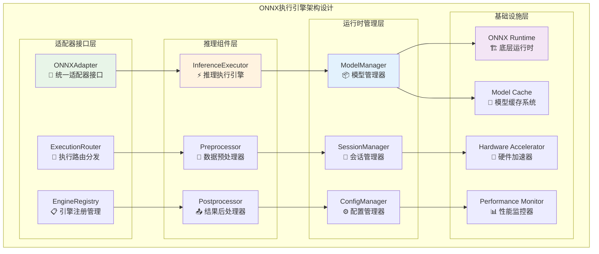
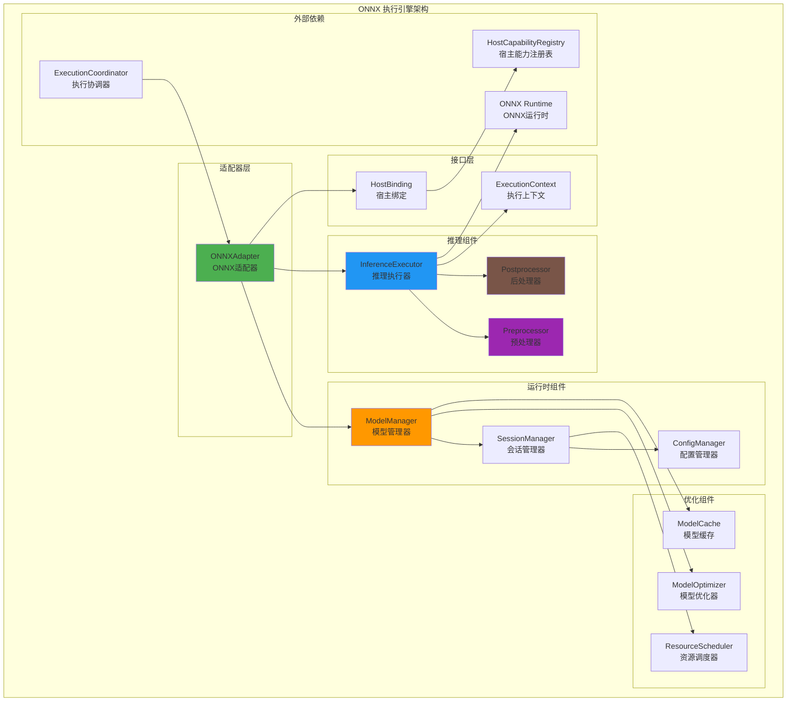
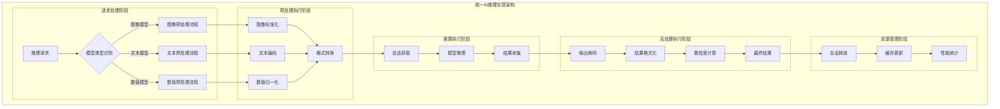
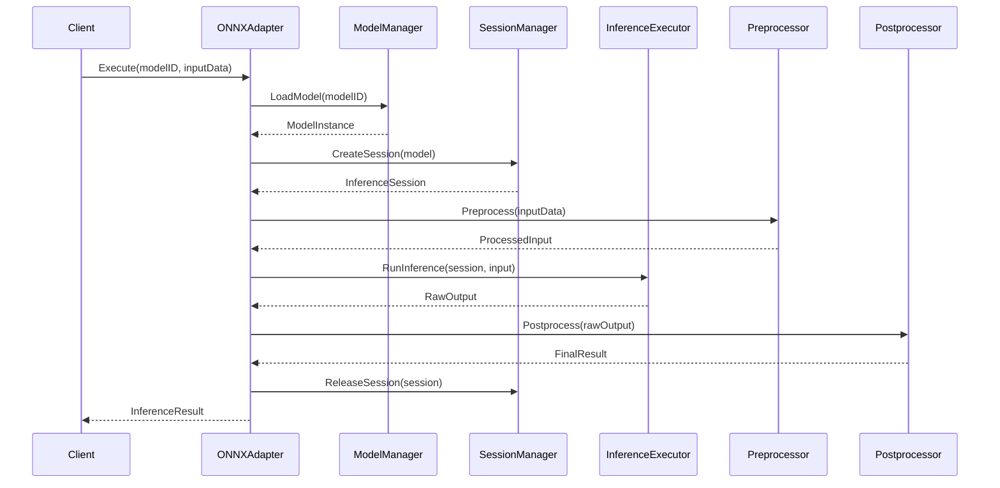
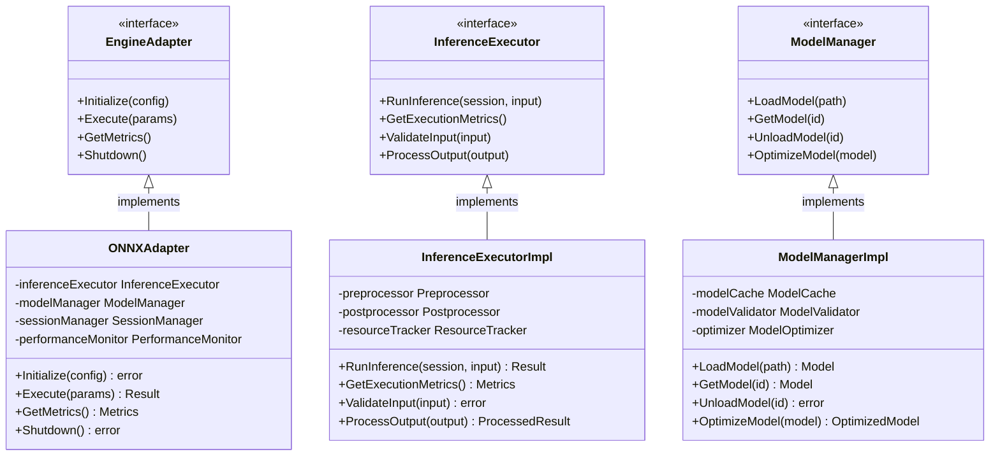

# ONNX 执行引擎（internal/core/engines/onnx）

【模块定位】
　　本模块实现基于 ONNX（Open Neural Network Exchange）的机器学习推理引擎，为区块链提供高性能的 AI 模型执行能力。作为执行层的专业引擎之一，通过标准化的接口与执行协调层交互，提供完整的模型加载、推理执行和资源管理功能。

【设计原则】
- 标准接口实现：严格实现 `pkg/interfaces/execution.EngineAdapter` 接口
- 高性能推理：优化的模型加载和推理执行流水线
- 资源高效：智能的模型缓存和会话管理机制
- 安全隔离：严格的输入验证和推理过程隔离
- 可扩展性：支持多种 ONNX 运行时后端和加速器

【核心职责】
1. **模型管理**：ONNX 模型的加载、验证、优化和缓存
2. **推理执行**：高效的神经网络推理和结果处理
3. **会话管理**：推理会话的创建、管理和资源复用
4. **数据处理**：输入预处理和输出后处理流水线
5. **资源优化**：内存管理、计算资源调度和性能优化
6. **安全控制**：模型验证、输入检查和推理安全

【实现架构】

　　采用**分层推理引擎**的4层实现架构，确保高性能推理和模块化扩展。



**架构层次说明：**

1. **适配器接口层**：提供统一的执行引擎接口，负责请求路由和引擎注册管理
   - 标准化的EngineAdapter接口实现
   - 智能的执行请求路由和分发
   - 动态的引擎发现和注册机制

2. **推理组件层**：实现AI推理的核心功能，包括数据处理和推理执行
   - 高效的神经网络推理执行器
   - 智能的数据预处理和后处理流水线
   - 多格式数据的转换和优化支持

3. **运行时管理层**：管理模型生命周期、会话资源和运行时配置
   - 全生命周期的模型管理和优化
   - 高效的推理会话池化和复用
   - 动态的配置管理和参数调优

4. **基础设施层**：提供底层运行时支持、硬件加速和性能监控
   - 跨平台的ONNX Runtime底层支持
   - CPU/GPU/TPU等硬件加速能力
   - 全方位的性能监控和分析工具

【架构组件】



【与执行层的交互】
- **注册发现**：通过 `fx` 依赖注入自动注册到 `EngineManager`
- **推理调度**：接收来自 `ExecutionCoordinator` 的推理请求
- **宿主能力**：通过 `HostBinding` 安全访问区块链数据和服务
- **结果返回**：标准化的推理结果和计算资源消耗报告

【支持的AI能力】
- **图像识别**：图像分类、目标检测、图像分割
- **自然语言处理**：文本分类、情感分析、命名实体识别
- **数据分析**：回归分析、聚类分析、异常检测
- **推荐系统**：协同过滤、内容推荐、用户画像
- **时间序列**：趋势预测、异常检测、模式识别

---

## 📁 **模块组织结构**

【内部模块架构】

```
internal/core/engines/onnx/
├── 🔗 adapter.go               # ONNX适配器 - 统一接口实现
├── ⚙️ module.go                # fx依赖注入和组件装配
├── 🧠 inference/               # AI推理组件 - 推理执行、数据处理
│   ├── executor.go            # 推理执行器 - 核心推理逻辑
│   ├── preprocessor.go        # 数据预处理器 - 输入标准化
│   ├── postprocessor.go       # 结果后处理器 - 输出格式化
│   └── README.md              # 推理组件文档
├── 🏗️ runtime/                 # 运行时系统 - 模型管理、会话控制
│   ├── model.go               # 模型管理器 - 生命周期管理
│   ├── session.go             # 会话管理器 - 会话池化
│   ├── config.go              # 配置管理器 - 参数调优
│   └── README.md              # 运行时文档
└── 📖 README.md               # 本文档
```

### **🎯 子模块职责分工**

| **子模块** | **核心职责** | **对外接口** | **内部组件** | **复杂度** |
|-----------|-------------|-------------|-------------|-----------|
| `adapter.go` | 统一适配器接口实现 | EngineAdapter接口 | 适配器、路由器 | ⭐⭐⭐ |
| `inference/` | AI推理执行和数据处理 | 推理服务接口 | 执行器、预处理器、后处理器 | ⭐⭐⭐⭐⭐ |
| `runtime/` | 运行时管理和资源调度 | 运行时服务接口 | 模型管理、会话管理、配置管理 | ⭐⭐⭐⭐ |

---

## 🔄 **统一AI推理实现**

【实现策略】

　　所有推理组件均严格遵循**预处理→推理→后处理**流水线架构模式，确保高效的AI模型推理和结果处理。



**关键实现要点：**

1. **智能预处理适配**：
   - 自动检测输入数据类型并选择最优预处理策略
   - 支持批处理优化和并行数据转换机制
   - 提供可扩展的自定义预处理器注册机制

2. **高效推理执行**：
   - 基于会话池化的高并发推理支持
   - 支持多后端（CPU/GPU/TPU）的智能调度
   - 实现推理过程的精确性能监控和优化

3. **智能后处理优化**：
   - 多格式输出结果的统一处理和转换
   - 置信度阈值过滤和Top-K结果选择
   - 结果聚合和格式标准化的自动处理

【推理流水线】



【性能优化策略】

1. **模型优化**：
   - 模型量化和剪枝
   - 图优化和算子融合
   - 内存布局优化

2. **推理优化**：
   - 批处理推理
   - 并行推理执行
   - 硬件加速利用

3. **缓存策略**：
   - 模型缓存和预加载
   - 会话池化管理
   - 中间结果缓存

4. **资源管理**：
   - 动态资源分配
   - 内存池化管理
   - GPU 资源调度

【安全机制】
- **模型验证**：模型格式和完整性验证
- **输入检查**：输入数据的类型和范围验证
- **资源限制**：内存、计算时间的严格限制
- **推理隔离**：推理过程的安全隔离和监控

---

## 🏗️ **依赖注入架构**

【fx框架集成】

　　ONNX引擎通过fx依赖注入框架实现模块化组装和生命周期管理，确保组件间的松耦合和可测试性。

**依赖注入设计**：
- **适配器注册**：通过fx标签以组的形式注册到执行引擎管理器
- **组件装配**：自动装配推理组件、运行时组件和配置管理器
- **接口导向**：基于EngineAdapter接口的统一依赖管理
- **生命周期管理**：自动管理引擎的初始化、启动和优雅停止

**核心组件依赖关系**：
- ONNXAdapter依赖InferenceExecutor、ModelManager、SessionManager
- InferenceExecutor依赖Preprocessor、Postprocessor、PerformanceMonitor
- ModelManager依赖ModelCache、ModelValidator、ConfigManager
- SessionManager依赖SessionPool、ResourceScheduler、HardwareManager

---

## 📊 **性能与监控**

【性能指标】

| **操作类型** | **目标延迟** | **吞吐量目标** | **资源利用率** | **监控方式** |
|-------------|-------------|---------------|--------------|------------|
| 模型加载 | < 500ms | > 100 LPS | < 60% Memory | 异步监控 |
| 图像推理 | < 100ms | > 500 IPS | < 90% GPU | 实时监控 |
| 文本推理 | < 50ms | > 1000 TPS | < 80% CPU | 批量统计 |
| 会话创建 | < 50ms | > 200 CPS | < 70% Memory | 关键路径监控 |
| 预处理 | < 20ms | > 2000 OPS | < 60% CPU | 实时监控 |

**性能优化策略：**
- **模型优化**：模型量化、图优化、算子融合、内存布局优化
- **推理优化**：批处理推理、并行执行、硬件加速、缓存策略
- **资源调度**：动态资源分配、负载均衡、弹性伸缩、优先级调度
- **监控诊断**：性能指标收集、瓶颈分析、异常检测、自动调优

---

## 🔗 **与公共接口的映射关系**

【接口实现映射】



**实现要点：**
- **接口契约**：严格遵循pkg/interfaces/execution接口定义和语义
- **错误处理**：统一的错误类型定义和标准化错误处理机制
- **日志记录**：结构化日志记录和操作审计跟踪机制
- **测试覆盖**：完整的单元测试、集成测试和性能基准测试

---

## 🚀 **后续扩展规划**

【模块演进方向】

1. **推理能力扩展**
   - 支持更多ONNX算子和模型格式
   - 集成最新的AI模型优化技术
   - 扩展多模态推理能力支持
   - 添加边缘计算和移动端优化

2. **性能优化提升**
   - 引入更先进的硬件加速技术
   - 优化内存使用和计算效率
   - 实现更智能的自动调优机制
   - 加强并发处理和流式推理能力

3. **运维增强**
   - 完善监控和诊断工具
   - 增强故障检测和自动恢复
   - 提供更丰富的性能分析功能
   - 支持动态配置和热更新

4. **生态集成**
   - 与更多AI框架和工具链集成
   - 支持模型版本管理和A/B测试
   - 增强与区块链业务的深度集成
   - 提供更完善的开发者工具支持

---

## 📋 **开发指南**

【引擎开发规范】

1. **模型集成步骤**：
   - 验证ONNX模型格式和兼容性
   - 配置推理参数和硬件加速选项
   - 实现自定义预处理和后处理逻辑
   - 完成功能测试和性能基准测试

2. **代码质量要求**：
   - 遵循Go语言最佳实践和项目编码规范
   - 实现完整的错误处理和资源管理机制
   - 提供详细的代码注释和技术文档
   - 保证100%的核心功能测试覆盖率

3. **性能要求**：
   - 关键路径延迟指标必须达到设计目标
   - 内存使用效率和并发安全的数据访问
   - 实现合理的资源清理和生命周期管理
   - 支持性能监控和可观测性要求

【参考文档】
- [ONNX引擎推理组件](inference/README.md)
- [ONNX引擎运行时](runtime/README.md)
- [执行接口规范](../../../pkg/interfaces/execution/)
- [WES架构设计文档](../../../../docs/architecture/)

【错误处理】

| 错误类型 | 处理策略 | 恢复机制 |
|---------|---------|---------|
| 模型加载错误 | 立即返回错误 | 重试备用模型 |
| 输入格式错误 | 验证并返回 | 输入格式转换 |
| 推理超时 | 中止推理 | 会话重置 |
| 内存不足 | 释放缓存 | 降级推理 |
| 硬件错误 | 切换后端 | CPU 后备执行 |

【监控指标】

- **推理性能**：
  - 推理延迟和吞吐量
  - 模型加载时间
  - 预处理和后处理时间
  - 端到端执行时间

- **资源使用**：
  - CPU 和 GPU 使用率
  - 内存使用峰值
  - 网络I/O统计
  - 存储访问量

- **模型统计**：
  - 模型调用频率
  - 缓存命中率
  - 推理成功率
  - 错误类型分布

【使用示例】

```go
// 创建 ONNX 适配器
adapter := NewONNXAdapter(config)

// 加载模型
err := adapter.LoadModel("image_classifier", modelPath)
if err != nil {
    return fmt.Errorf("failed to load model: %w", err)
}

// 执行推理
result, err := adapter.Execute(ctx, types.ExecutionParams{
    ResourceID:   modelID,
    ResourceType: types.EngineTypeONNX,
    Input:        imageData,
    执行费用Limit:     执行费用Limit,
})

if err != nil {
    return fmt.Errorf("inference failed: %w", err)
}

// 处理推理结果
predictions := parseInferenceResult(result)
```

【扩展指南】

1. **自定义预处理器**：
```go
// 实现自定义预处理器
type CustomPreprocessor struct{}

func (p *CustomPreprocessor) Preprocess(input []byte) ([]float32, error) {
    // 自定义预处理逻辑
    return processedData, nil
}
```

2. **自定义后端提供者**：
```go
// 实现自定义后端
type CustomProvider struct{}

func (p *CustomProvider) CreateSession(model *onnx.Model) (*onnx.Session, error) {
    // 自定义会话创建
    return session, nil
}
```

【故障排查】

常见问题及解决方案：

1. **模型加载失败**：
   - 检查模型文件格式
   - 验证模型兼容性
   - 查看 ONNX Runtime 版本

2. **推理性能差**：
   - 启用硬件加速
   - 调整批处理大小
   - 优化模型结构

3. **内存不足**：
   - 调整缓存大小
   - 减少并发数量
   - 使用模型量化

4. **精度问题**：
   - 检查数据预处理
   - 验证模型输出
   - 调整后处理逻辑

【性能基准】

- **推理延迟**：图像分类 < 10ms，文本分析 < 5ms
- **吞吐量**：单核 CPU > 100 QPS，GPU > 1000 QPS  
- **内存效率**：内存使用 < 2x 模型大小
- **缓存命中率**：模型缓存 > 90%，会话缓存 > 80%

---

> 📝 **模板说明**：本README模板基于WES v0.0.1统一文档规范设计，使用时请根据具体模块需求替换相应的占位符内容，并确保所有章节都有实质性的技术内容。

> 🔄 **维护指南**：本文档应随着模块功能的演进及时更新，确保文档与代码实现的一致性。建议在每次重大功能变更后更新相应章节。

---

【依赖关系】

本模块依赖以下组件：
- `pkg/interfaces/execution`: 执行接口定义
- `pkg/types`: 通用类型定义
- ONNX Runtime：底层推理运行时
- 机器学习库：数据处理和优化算法
- 硬件加速库：GPU、NPU 等加速支持
