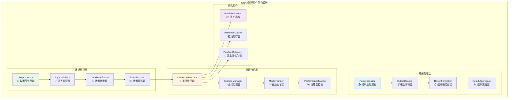
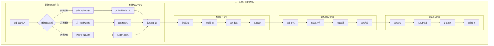
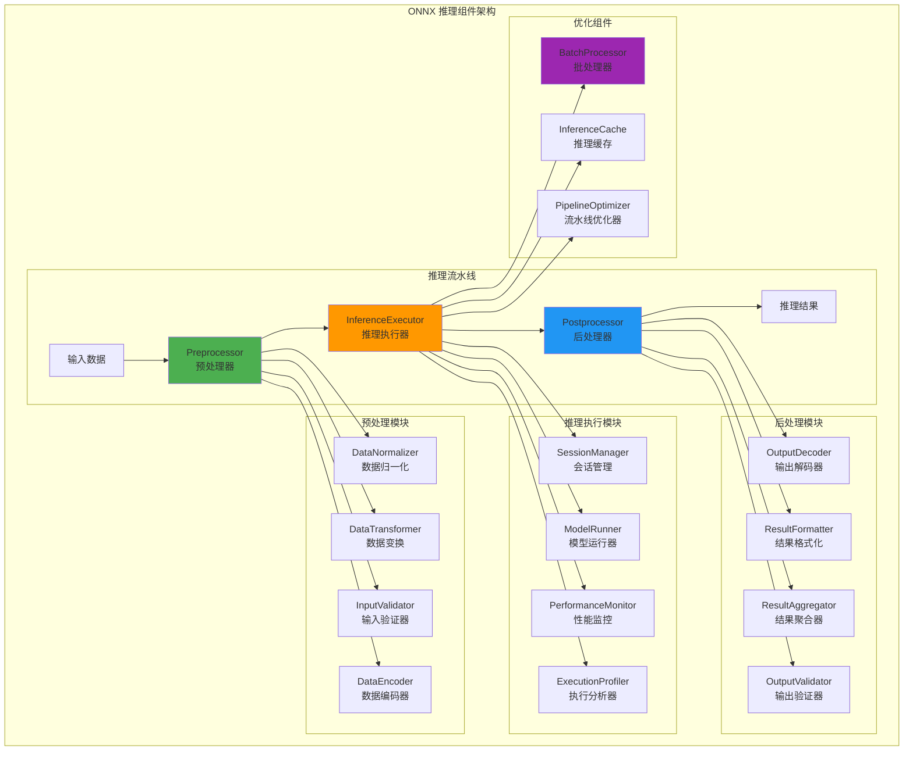
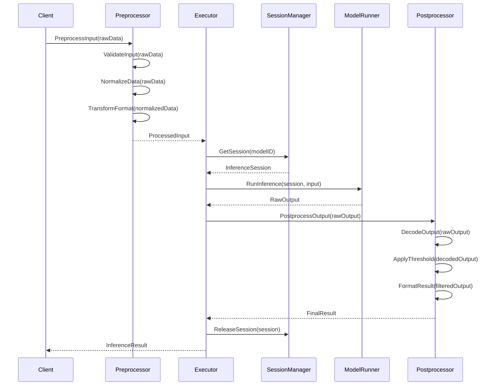
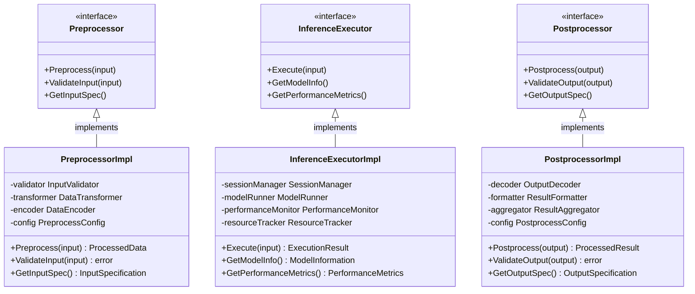

# ONNX 推理组件（internal/core/engines/onnx/inference）

【模块目的】
　　本目录实现 ONNX 模型推理的核心组件，包括数据预处理、推理执行和结果后处理的完整流水线。通过标准化的推理流程和优化的数据处理算法，为AI模型提供高效、准确、可靠的推理执行服务。

【设计原则】
- 流水线化处理：标准化的预处理→推理→后处理流水线
- 高性能优化：向量化计算、批处理和并行优化
- 数据类型支持：支持多种输入输出数据格式
- 可扩展性：支持自定义处理器和算法扩展
- 错误恢复：健壮的错误处理和数据验证

【核心职责】
1. **数据预处理**：输入数据的标准化、归一化和格式转换
2. **推理执行**：高效的神经网络模型推理和计算
3. **结果后处理**：推理输出的解析、转换和格式化
4. **流程协调**：推理流水线的调度和资源管理
5. **性能优化**：推理过程的性能监控和优化
6. **质量保证**：数据验证、精度检查和结果验证

【实现架构】

　　采用**流水线推理**的3层实现架构，确保高效的数据处理和推理执行。



**架构层次说明：**

1. **数据处理层**：负责输入数据的验证、转换、编码和标准化处理
   - 多格式输入数据的验证和清洗
   - 智能的数据类型检测和转换
   - 高效的数据编码和格式标准化

2. **推理执行层**：实现AI模型的推理执行、会话管理和性能监控
   - 高性能的神经网络推理执行
   - 智能的会话池化和资源管理
   - 实时的性能监控和分析

3. **结果处理层**：处理推理输出的解码、格式化、聚合和验证
   - 多类型推理结果的解码和解析
   - 标准化的结果格式和数据结构
   - 智能的结果聚合和置信度计算

---

## 📁 **模块组织结构**

【内部模块架构】

```
internal/core/engines/onnx/inference/
├── 🔄 preprocessor.go          # 数据预处理器 - 输入标准化和格式转换
├── ⚡ executor.go              # 推理执行器 - 核心推理逻辑和流程控制
├── 📤 postprocessor.go         # 结果后处理器 - 输出解析和格式化
└── 📖 README.md                # 本文档
```

### **🎯 子模块职责分工**

| **子模块** | **核心职责** | **对外接口** | **内部组件** | **复杂度** |
|-----------|-------------|-------------|-------------|-----------|
| `preprocessor.go` | 数据预处理和验证 | 预处理服务接口 | 验证器、转换器、编码器 | ⭐⭐⭐⭐ |
| `executor.go` | 推理执行和会话管理 | 执行服务接口 | 会话管理、运行器、监控器 | ⭐⭐⭐⭐⭐ |
| `postprocessor.go` | 结果处理和格式化 | 后处理服务接口 | 解码器、格式化器、聚合器 | ⭐⭐⭐⭐ |

---

## 🔄 **统一推理组件实现**

【实现策略】

　　所有推理组件均严格遵循**预处理→推理→后处理**流水线架构模式，确保数据处理的标准化和推理执行的高效性。



**关键实现要点：**

1. **智能预处理适配**：
   - 自动识别输入数据格式并选择合适的预处理策略
   - 支持多种数据类型的批处理优化和并行转换
   - 实现可配置的预处理参数和自定义处理逻辑

2. **高效推理执行**：
   - 基于会话池的高并发推理支持和资源复用
   - 智能的后端选择和硬件加速利用策略
   - 实时的推理性能监控和异常检测机制

3. **智能后处理优化**：
   - 多格式输出的统一解码和标准化处理
   - 动态的置信度计算和阈值过滤机制
   - 结果聚合、排序和格式化的自动处理

【组件架构】



【文件说明】

## preprocessor.go
**功能**：数据预处理器的实现
**职责**：
- 输入数据的格式验证和转换
- 数据标准化和归一化处理
- 图像、文本、数值数据的预处理
- 批处理数据的组织和管理

**预处理类型**：
```go
type PreprocessorType int

const (
    ImagePreprocessor    PreprocessorType = iota  // 图像预处理
    TextPreprocessor                              // 文本预处理
    NumericalPreprocessor                         // 数值预处理
    AudioPreprocessor                             // 音频预处理
    VideoPreprocessor                             // 视频预处理
)
```

**图像预处理流水线**：
1. **格式转换**：PNG/JPEG → RGB/BGR 数组
2. **尺寸调整**：缩放到模型输入尺寸
3. **数据归一化**：像素值归一化到 [0,1] 或 [-1,1]
4. **通道调整**：HWC → CHW 格式转换
5. **批处理组织**：多图像批处理组织

**文本预处理流水线**：
1. **分词处理**：文本分词和清理
2. **词汇映射**：词汇到ID的映射
3. **序列填充**：长度标准化和填充
4. **编码转换**：Token编码和位置编码
5. **注意力掩码**：生成注意力掩码

## executor.go
**功能**：推理执行器的核心实现
**职责**：
- 推理会话的创建和管理
- 模型推理的执行和控制
- 推理性能的监控和优化
- 错误处理和异常恢复

**推理执行架构**：
```go
type InferenceExecutor struct {
    sessionManager  SessionManager
    modelCache      ModelCache
    performanceMonitor PerformanceMonitor
    resourceTracker ResourceTracker
    errorHandler    ErrorHandler
    config         ExecutorConfig
}
```

**执行模式**：
- **同步推理**：阻塞式推理执行
- **异步推理**：非阻塞式推理执行
- **批处理推理**：批量数据推理
- **流式推理**：连续数据流推理
- **并行推理**：多模型并行推理

**会话管理策略**：
```go
type SessionStrategy int

const (
    SingleSession    SessionStrategy = iota  // 单会话模式
    PooledSessions                          // 会话池模式
    PerRequestSession                       // 每请求一会话
    SharedSessions                          // 共享会话模式
)
```

## postprocessor.go
**功能**：结果后处理器的实现
**职责**：
- 推理输出的解码和解析
- 结果格式化和标准化
- 置信度计算和阈值过滤
- 多输出结果的聚合和排序

**后处理类型**：
```go
type PostprocessorType int

const (
    ClassificationPost PostprocessorType = iota  // 分类后处理
    DetectionPost                               // 检测后处理
    SegmentationPost                           // 分割后处理
    RegressionPost                             // 回归后处理
    GenerationPost                             // 生成后处理
)
```

**分类后处理流水线**：
1. **Logits解析**：原始输出解析
2. **Softmax应用**：概率分布计算
3. **Top-K选择**：选择前K个结果
4. **阈值过滤**：置信度阈值过滤
5. **标签映射**：ID到标签的映射

**检测后处理流水线**：
1. **边界框解码**：坐标解码和转换
2. **NMS处理**：非极大值抑制
3. **置信度过滤**：置信度阈值过滤
4. **坐标归一化**：坐标标准化
5. **结果排序**：按置信度排序

【推理流程】



【数据流转换】

```go
// 数据预处理接口
type Preprocessor interface {
    Preprocess(input []byte, config PreprocessConfig) (*PreprocessedData, error)
    ValidateInput(input []byte) error
    GetInputSpec() InputSpecification
}

// 推理执行接口
type InferenceExecutor interface {
    Execute(input *PreprocessedData, config ExecuteConfig) (*RawOutput, error)
    GetModelInfo() ModelInformation
    GetPerformanceMetrics() PerformanceMetrics
}

// 后处理接口
type Postprocessor interface {
    Postprocess(output *RawOutput, config PostprocessConfig) (*InferenceResult, error)
    ValidateOutput(output *RawOutput) error
    GetOutputSpec() OutputSpecification
}
```

【性能优化策略】

1. **批处理优化**：
   - 动态批处理大小调整
   - 批处理数据对齐和填充
   - 异构批处理支持

2. **内存优化**：
   - 零拷贝数据传输
   - 内存池化管理
   - 预分配缓冲区

3. **计算优化**：
   - 向量化计算
   - SIMD指令优化
   - 多线程并行处理

4. **缓存优化**：
   - 预处理结果缓存
   - 中间计算缓存
   - 会话状态缓存

---

## 🏗️ **依赖注入架构**

【fx框架集成】

　　ONNX推理组件通过fx依赖注入框架实现组件装配和生命周期管理，确保推理流水线的模块化和可测试性。

**依赖注入设计**：
- **组件装配**：自动装配预处理器、执行器、后处理器和性能监控器
- **配置管理**：通过依赖注入提供推理配置和参数管理
- **接口导向**：基于内部接口的松耦合组件依赖管理
- **生命周期管理**：自动管理推理组件的初始化和资源清理

**核心组件依赖关系**：
- InferenceExecutor依赖Preprocessor、Postprocessor、PerformanceMonitor
- Preprocessor依赖InputValidator、DataTransformer、DataEncoder
- Postprocessor依赖OutputDecoder、ResultFormatter、ResultAggregator
- 所有组件共享InferenceConfig配置和ResourceManager资源管理器

---

## 📊 **性能与监控**

【性能指标】

| **操作类型** | **目标延迟** | **吞吐量目标** | **准确性指标** | **监控方式** |
|-------------|-------------|---------------|--------------|------------|
| 图像预处理 | < 20ms | > 2000 OPS | 99.9% 准确性 | 实时监控 |
| 文本预处理 | < 10ms | > 5000 OPS | 99.8% 准确性 | 批量统计 |
| 推理执行 | < 100ms | > 500 IPS | > 95% 模型精度 | 关键路径监控 |
| 结果后处理 | < 15ms | > 3000 OPS | 100% 格式正确 | 异步监控 |
| 批处理推理 | < 200ms | > 50 BPS | > 95% 批次成功率 | 实时监控 |

**性能优化策略：**
- **预处理优化**：向量化计算、SIMD指令优化、批处理并行、内存池化
- **推理优化**：会话复用、硬件加速、模型优化、动态批处理
- **后处理优化**：结果缓存、并行解码、智能阈值、格式复用
- **流水线优化**：异步处理、流水线并行、资源预分配、性能调优

---

## 🔗 **与公共接口的映射关系**

【接口实现映射】



**实现要点：**
- **接口契约**：严格遵循推理组件接口定义和数据流规范
- **错误处理**：分层的错误处理和异常传播机制
- **日志记录**：详细的推理过程日志和性能指标记录
- **测试覆盖**：完整的组件测试、流水线测试和性能测试

---

## 🚀 **后续扩展规划**

【模块演进方向】

1. **预处理能力扩展**
   - 支持更多数据格式和预处理算法
   - 增强自适应预处理和智能参数调优
   - 扩展多模态数据预处理能力
   - 添加数据增强和噪声处理功能

2. **推理性能提升**
   - 引入更先进的批处理和并行策略
   - 优化会话管理和资源调度算法
   - 实现更智能的硬件选择和利用
   - 加强推理缓存和结果复用机制

3. **后处理优化**
   - 完善多类型结果的统一处理框架
   - 增强置信度计算和不确定性量化
   - 提供更丰富的结果分析和可视化
   - 支持结果解释和可解释性分析

4. **系统集成**
   - 与更多AI框架和模型格式集成
   - 支持推理流水线的动态配置
   - 增强与区块链执行层的深度集成
   - 提供更完善的开发调试工具

---

## 📋 **开发指南**

【组件开发规范】

1. **新组件接入步骤**：
   - 定义组件接口和数据结构规范
   - 实现核心处理逻辑和配置管理
   - 添加性能监控和错误处理机制
   - 完成单元测试和集成测试验证

2. **代码质量要求**：
   - 遵循Go语言最佳实践和项目编码规范
   - 实现完整的错误处理和资源管理机制
   - 提供详细的代码注释和技术文档
   - 保证100%的核心功能测试覆盖率

3. **性能要求**：
   - 关键路径延迟指标必须达到设计目标
   - 内存使用效率和并发安全的数据访问
   - 实现合理的资源清理和生命周期管理
   - 支持性能监控和可观测性要求

【参考文档】
- [ONNX执行引擎](../README.md)
- [ONNX运行时系统](../runtime/README.md)
- [执行接口规范](../../../../pkg/interfaces/execution/)
- [WES架构设计文档](../../../../../docs/architecture/)

【错误处理策略】

| 错误类型 | 处理策略 | 恢复机制 |
|---------|---------|---------|
| 输入格式错误 | 验证并返回详细错误 | 格式转换重试 |
| 数据范围错误 | 标准化处理 | 数据裁剪或缩放 |
| 推理超时 | 中止推理 | 降级到CPU执行 |
| 内存不足 | 减少批处理大小 | 单样本推理 |
| 输出解析错误 | 原始输出返回 | 简化后处理 |

【监控指标】

```go
type InferenceMetrics struct {
    // 预处理指标
    PreprocessTime    time.Duration
    DataValidationTime time.Duration
    FormatConversionTime time.Duration
    
    // 推理指标
    InferenceTime     time.Duration
    ModelLoadTime     time.Duration
    SessionCreateTime time.Duration
    
    // 后处理指标
    PostprocessTime   time.Duration
    ResultFormatTime  time.Duration
    ValidationTime    time.Duration
    
    // 资源指标
    MemoryUsage       uint64
    GPUUtilization    float32
    CPUUtilization    float32
    
    // 质量指标
    Accuracy          float32
    Precision         float32
    Recall            float32
}
```

【使用示例】

```go
// 创建推理流水线
pipeline := NewInferencePipeline(config)

// 注册预处理器
pipeline.RegisterPreprocessor("image", NewImagePreprocessor())
pipeline.RegisterPreprocessor("text", NewTextPreprocessor())

// 注册后处理器
pipeline.RegisterPostprocessor("classification", NewClassificationPostprocessor())
pipeline.RegisterPostprocessor("detection", NewDetectionPostprocessor())

// 执行推理
result, err := pipeline.Execute(InferenceRequest{
    ModelID:     "image_classifier",
    InputData:   imageBytes,
    InputType:   "image",
    OutputType:  "classification",
    Config: InferenceConfig{
        PreprocessConfig: PreprocessConfig{
            InputSize:     []int{224, 224, 3},
            Normalization: ZeroMeanUnitVariance,
            ChannelOrder:  "RGB",
        },
        PostprocessConfig: PostprocessConfig{
            ConfidenceThreshold: 0.5,
            TopK:               5,
        },
    },
})

if err != nil {
    log.Errorf("Inference failed: %v", err)
    return
}

// 处理结果
for _, prediction := range result.Predictions {
    log.Infof("Class: %s, Confidence: %.3f", 
        prediction.Label, prediction.Confidence)
}
```

【扩展指南】

1. **自定义预处理器**：
```go
// 实现自定义预处理器
type CustomPreprocessor struct{}

func (p *CustomPreprocessor) Preprocess(input []byte, config PreprocessConfig) (*PreprocessedData, error) {
    // 自定义预处理逻辑
    return processedData, nil
}

func (p *CustomPreprocessor) ValidateInput(input []byte) error {
    // 输入验证逻辑
    return nil
}

// 注册预处理器
executor.RegisterPreprocessor("custom", &CustomPreprocessor{})
```

2. **自定义后处理器**：
```go
// 实现自定义后处理器
type CustomPostprocessor struct{}

func (p *CustomPostprocessor) Postprocess(output *RawOutput, config PostprocessConfig) (*InferenceResult, error) {
    // 自定义后处理逻辑
    return result, nil
}
```

【故障排查】

常见问题及解决方案：

1. **预处理失败**：
   - 检查输入数据格式
   - 验证预处理配置
   - 查看数据范围和类型

2. **推理精度低**：
   - 检查预处理归一化
   - 验证模型输入格式
   - 调整后处理阈值

3. **性能问题**：
   - 启用批处理
   - 使用GPU加速
   - 优化数据流水线

4. **内存泄漏**：
   - 检查会话释放
   - 监控缓存大小
   - 优化数据复制

---

> 📝 **模板说明**：本README模板基于WES v0.0.1统一文档规范设计，使用时请根据具体模块需求替换相应的占位符内容，并确保所有章节都有实质性的技术内容。

> 🔄 **维护指南**：本文档应随着模块功能的演进及时更新，确保文档与代码实现的一致性。建议在每次重大功能变更后更新相应章节。

---

【依赖关系】

本模块依赖以下组件：
- ONNX Runtime：底层推理引擎
- 图像处理库：OpenCV、PIL等
- 数值计算库：NumPy、BLAS等
- 并行计算库：OpenMP、CUDA等
- 数据格式库：JSON、Protocol Buffers等
