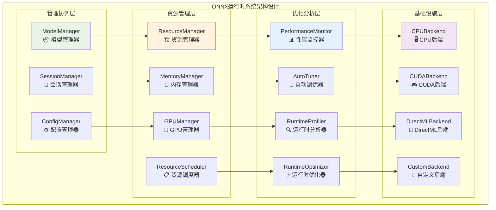
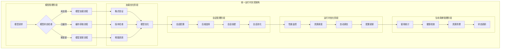
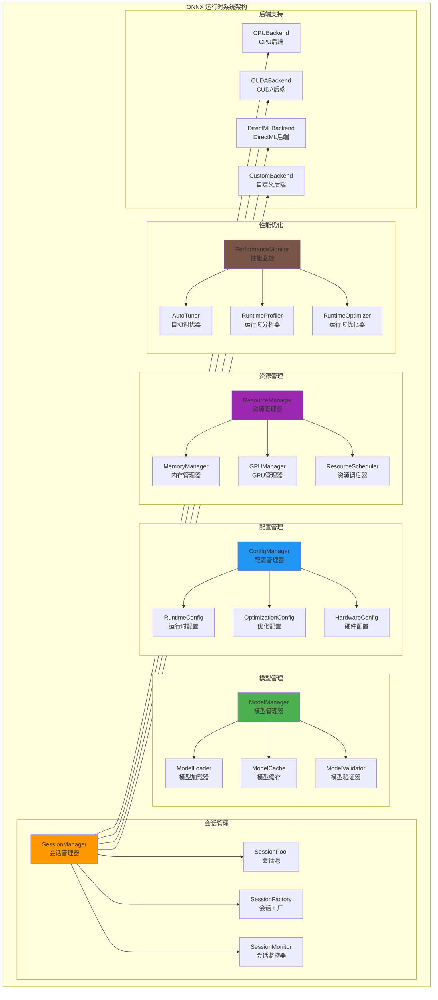
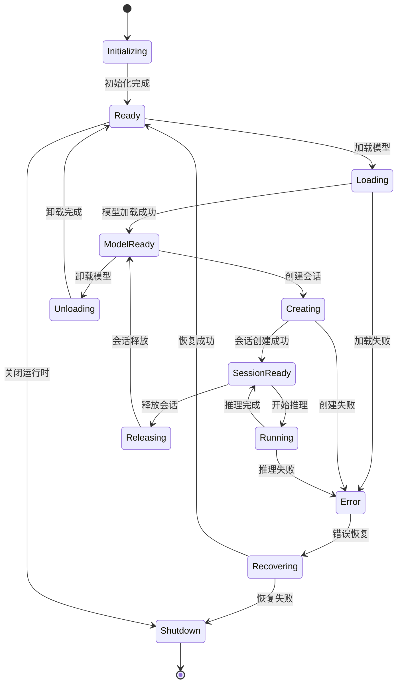
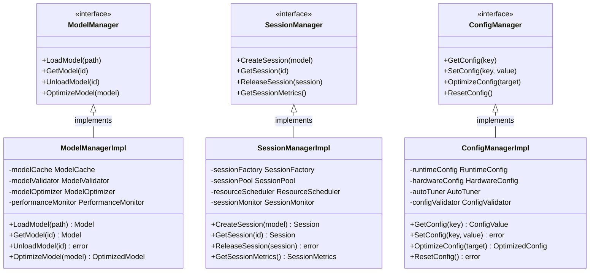

# ONNX 运行时系统（internal/core/engines/onnx/runtime）

【模块目的】
　　本目录实现 ONNX 运行时的管理和配置系统，负责模型生命周期管理、推理会话控制、运行时配置优化等核心功能。通过高效的运行时管理机制，为 ONNX 推理提供稳定、可靠、高性能的执行环境支持。

【设计原则】
- 生命周期管理：完整的模型和会话生命周期控制
- 资源优化：智能的资源分配和调度策略
- 配置驱动：灵活的运行时参数配置和调优
- 高可用性：故障检测、自动恢复和降级机制
- 可扩展性：支持多种后端和硬件加速器

【核心职责】
1. **模型生命周期管理**：模型的加载、验证、优化和卸载
2. **会话管理**：推理会话的创建、配置、池化和销毁
3. **运行时配置**：性能参数、硬件配置和优化选项管理
4. **资源调度**：计算资源、内存资源的分配和调度
5. **性能优化**：运行时性能监控、分析和自动调优
6. **错误恢复**：运行时错误检测、诊断和恢复机制

【实现架构】

　　采用**分层运行时管理**的4层实现架构，确保模型和会话的高效管理和资源优化。



**架构层次说明：**

1. **管理协调层**：提供模型、会话和配置的统一管理和协调控制
   - 完整的模型生命周期管理和版本控制
   - 高效的会话池化和资源复用机制
   - 灵活的配置管理和参数动态调优

2. **资源管理层**：实现计算资源、内存资源的统一分配和智能调度
   - 跨后端的统一资源管理和分配策略
   - 智能的内存池化和GPU资源调度
   - 动态的负载均衡和弹性伸缩机制

3. **优化分析层**：提供性能监控、自动调优和运行时优化能力
   - 实时的性能监控和瓶颈分析
   - 基于历史数据的智能参数调优
   - 动态的运行时优化和性能提升

4. **基础设施层**：支持多种硬件后端和执行环境
   - 跨平台的CPU、GPU、专用硬件支持
   - 统一的后端接口和驱动适配
   - 可扩展的自定义后端集成框架

---

## 📁 **模块组织结构**

【内部模块架构】

```
internal/core/engines/onnx/runtime/
├── 📦 model.go                 # 模型管理器 - 生命周期管理和优化
├── 🔧 session.go               # 会话管理器 - 会话创建和池化管理
├── ⚙️ config.go                # 配置管理器 - 参数管理和动态调优
└── 📖 README.md                # 本文档
```

### **🎯 子模块职责分工**

| **子模块** | **核心职责** | **对外接口** | **内部组件** | **复杂度** |
|-----------|-------------|-------------|-------------|-----------|
| `model.go` | 模型管理和生命周期控制 | 模型服务接口 | 加载器、缓存、验证器、优化器 | ⭐⭐⭐⭐⭐ |
| `session.go` | 会话管理和资源池化 | 会话服务接口 | 工厂、池、监控器、调度器 | ⭐⭐⭐⭐ |
| `config.go` | 配置管理和参数调优 | 配置服务接口 | 配置器、调优器、检测器 | ⭐⭐⭐ |

---

## 🔄 **统一运行时实现**

【实现策略】

　　所有运行时组件均严格遵循**加载→配置→执行→优化**管理架构模式，确保模型和会话的高效管理和持续优化。



**关键实现要点：**

1. **智能模型管理**：
   - 自动的模型版本检测和增量更新机制
   - 支持多级缓存策略和LRU淘汰算法
   - 实现模型预加载和热启动优化策略

2. **高效会话管理**：
   - 基于负载的动态会话池大小调整
   - 支持多后端的智能选择和故障转移
   - 实现会话复用和资源隔离机制

3. **自适应运行时优化**：
   - 基于历史数据的性能预测和调优
   - 动态的硬件资源分配和调度策略
   - 实时的性能监控和瓶颈检测机制

【组件架构】



【文件说明】

## model.go
**功能**：ONNX 模型的生命周期管理
**职责**：
- 模型文件的加载和验证
- 模型元数据的解析和管理
- 模型缓存和版本控制
- 模型优化和预处理

**模型管理架构**：
```go
type ModelManager struct {
    cache       ModelCache
    loader      ModelLoader
    validator   ModelValidator
    optimizer   ModelOptimizer
    registry    ModelRegistry
    config      ModelConfig
}

type Model struct {
    ID          string
    Path        string
    Version     string
    Metadata    ModelMetadata
    Graph       *onnx.GraphProto
    Weights     []byte
    LoadTime    time.Time
    AccessCount int64
    LastAccess  time.Time
    Status      ModelStatus
}
```

**模型状态管理**：
```go
type ModelStatus int

const (
    ModelLoading    ModelStatus = iota  // 加载中
    ModelReady                         // 就绪
    ModelOptimizing                    // 优化中
    ModelOptimized                     // 已优化
    ModelError                         // 错误
    ModelUnloading                     // 卸载中
    ModelUnloaded                      // 已卸载
)
```

**模型缓存策略**：
- **LRU缓存**：最近最少使用淘汰
- **引用计数**：基于引用计数的生命周期管理
- **预加载**：热门模型的预加载和预热
- **分级存储**：内存+磁盘的分级缓存

## session.go
**功能**：推理会话的管理和控制
**职责**：
- 推理会话的创建和配置
- 会话池的管理和优化
- 会话资源的分配和回收
- 会话性能的监控和调优

**会话管理架构**：
```go
type SessionManager struct {
    factory     SessionFactory
    pool        SessionPool
    monitor     SessionMonitor
    scheduler   SessionScheduler
    config      SessionConfig
}

type Session struct {
    ID              string
    ModelID         string
    OrtSession      *ort.Session
    Config          SessionConfig
    CreatedAt       time.Time
    LastUsed        time.Time
    UseCount        int64
    Status          SessionStatus
    ResourceUsage   ResourceUsage
}
```

**会话池策略**：
```go
type SessionPoolStrategy int

const (
    FixedPool     SessionPoolStrategy = iota  // 固定大小池
    DynamicPool                              // 动态扩展池
    PerModelPool                             // 每模型一池
    SharedPool                               // 共享池
)

type SessionPool struct {
    strategy      SessionPoolStrategy
    maxSize       int
    minSize       int
    idleTimeout   time.Duration
    sessions      map[string]*Session
    available     chan *Session
    mutex         sync.RWMutex
}
```

**会话配置优化**：
- **硬件优化**：自动选择最优硬件后端
- **线程配置**：动态调整线程数量
- **内存优化**：内存使用模式优化
- **图优化**：计算图优化选项

## config.go
**功能**：运行时配置的管理和优化
**职责**：
- 运行时参数的配置和管理
- 硬件配置的检测和优化
- 性能参数的自动调优
- 配置热更新和版本管理

**配置架构**：
```go
type ConfigManager struct {
    runtimeConfig    RuntimeConfig
    hardwareConfig   HardwareConfig
    optimizationConfig OptimizationConfig
    userConfig       UserConfig
    autoTuner        AutoTuner
}

type RuntimeConfig struct {
    // 执行提供者配置
    Providers       []ProviderConfig
    
    // 线程配置
    IntraOpNumThreads int
    InterOpNumThreads int
    
    // 内存配置
    MemoryOptimization bool
    MemoryPattern      MemoryPattern
    
    // 图优化配置
    GraphOptimization GraphOptLevel
    
    // 调试配置
    EnableProfiling   bool
    LogLevel         LogLevel
}
```

**硬件配置检测**：
```go
type HardwareConfig struct {
    // CPU 配置
    CPUInfo         CPUInformation
    CPUCores        int
    CPUFeatures     []string
    
    // GPU 配置
    GPUDevices      []GPUDevice
    CUDAVersion     string
    CUDNNVersion    string
    
    // 内存配置
    TotalMemory     uint64
    AvailableMemory uint64
    
    // 其他硬件
    TPUDevices      []TPUDevice
    NPUDevices      []NPUDevice
}
```

【运行时生命周期】



【性能优化策略】

1. **模型优化**：
   - 图优化和算子融合
   - 权重量化和剪枝
   - 常量折叠和死代码消除

2. **会话优化**：
   - 会话池化和复用
   - 预热和预分配
   - 动态批处理

3. **硬件优化**：
   - 自动硬件检测
   - 最优后端选择
   - 硬件特定优化

4. **内存优化**：
   - 内存池化管理
   - 零拷贝数据传输
   - 内存使用分析

【配置参数详解】

```go
type RuntimeConfig struct {
    // 基础配置
    LogLevel            LogLevel          // 日志级别
    EnableProfiling     bool              // 启用性能分析
    MaxConcurrentSessions int             // 最大并发会话数
    SessionTimeout      time.Duration     // 会话超时时间
    
    // 执行提供者配置
    ExecutionProviders  []ExecutionProvider // 执行提供者优先级
    
    // CPU 配置
    CPUConfig struct {
        IntraOpNumThreads int             // CPU内部并行线程数
        InterOpNumThreads int             // CPU间并行线程数
        EnableCPUMKLDNN   bool            // 启用MKL-DNN
    }
    
    // GPU 配置
    GPUConfig struct {
        DeviceID          int              // GPU设备ID
        MemoryLimitMB     int              // GPU内存限制
        EnableCUDAGraphs  bool             // 启用CUDA图优化
    }
    
    // 图优化配置
    GraphOptimizationLevel GraphOptLevel  // 图优化级别
    
    // 内存配置
    MemoryConfig struct {
        EnableMemoryPattern bool           // 启用内存模式
        MemoryLimitMB      int            // 内存限制
        EnableArenaExtend  bool            // 启用Arena扩展
    }
}
```

【监控指标】

```go
type RuntimeMetrics struct {
    // 模型指标
    ModelsLoaded      int               // 已加载模型数
    ModelCacheHitRate float32           // 模型缓存命中率
    ModelLoadTime     time.Duration     // 平均模型加载时间
    
    // 会话指标
    ActiveSessions    int               // 活跃会话数
    SessionCreateTime time.Duration     // 平均会话创建时间
    SessionPoolUtilization float32      // 会话池利用率
    
    // 推理指标
    InferenceCount    uint64            // 推理次数
    AverageLatency    time.Duration     // 平均推理延迟
    Throughput        float32           // 吞吐量 (QPS)
    
    // 资源指标
    MemoryUsage       uint64            // 内存使用量
    GPUUtilization    float32           // GPU利用率
    CPUUtilization    float32           // CPU利用率
    
    // 错误指标
    ErrorRate         float32           // 错误率
    TimeoutRate       float32           // 超时率
}
```

---

## 🏗️ **依赖注入架构**

【fx框架集成】

　　ONNX运行时系统通过fx依赖注入框架实现组件装配和生命周期管理，确保运行时组件的模块化和可扩展性。

**依赖注入设计**：
- **管理器装配**：自动装配模型管理器、会话管理器和配置管理器
- **资源协调**：通过依赖注入提供统一的资源管理和调度服务
- **后端集成**：支持多种硬件后端的动态注册和选择机制
- **生命周期管理**：自动管理运行时组件的初始化和清理过程

**核心组件依赖关系**：
- ModelManager依赖ModelLoader、ModelCache、ModelValidator、ModelOptimizer
- SessionManager依赖SessionFactory、SessionPool、SessionMonitor、ResourceScheduler  
- ConfigManager依赖RuntimeConfig、HardwareConfig、OptimizationConfig、AutoTuner
- 所有管理器共享PerformanceMonitor和ErrorHandler等公共服务

---

## 📊 **性能与监控**

【性能指标】

| **操作类型** | **目标延迟** | **吞吐量目标** | **资源利用率** | **监控方式** |
|-------------|-------------|---------------|--------------|------------|
| 模型加载 | < 500ms | > 100 LPS | < 60% Memory | 异步监控 |
| 会话创建 | < 50ms | > 200 CPS | < 70% CPU | 实时监控 |
| 配置更新 | < 10ms | > 1000 UPS | < 30% CPU | 批量统计 |
| 资源调度 | < 5ms | > 5000 OPS | < 50% CPU | 关键路径监控 |
| 自动调优 | < 100ms | > 10 TPS | < 80% CPU | 定期监控 |

**性能优化策略：**
- **模型优化**：图优化、权重量化、常量折叠、算子融合技术
- **会话优化**：会话池化、预热机制、动态批处理、资源复用
- **硬件优化**：自动后端选择、硬件特化、并行计算、加速器利用
- **监控调优**：实时性能分析、瓶颈检测、自动参数调整、智能预测

---

## 🔗 **与公共接口的映射关系**

【接口实现映射】



**实现要点：**
- **接口契约**：严格遵循运行时管理接口定义和资源管理规范
- **错误处理**：分层的错误处理和异常恢复机制
- **日志记录**：详细的运行时操作日志和性能指标记录
- **测试覆盖**：全面的管理器测试、资源测试和性能基准测试

---

## 🚀 **后续扩展规划**

【模块演进方向】

1. **管理能力扩展**
   - 支持更多模型格式和版本管理
   - 增强分布式模型管理和同步
   - 扩展动态模型更新和热加载
   - 添加模型安全验证和权限控制

2. **资源调度优化**
   - 引入更先进的资源调度算法
   - 优化跨节点资源协调和负载均衡
   - 实现更智能的资源预测和规划
   - 加强故障检测和自动恢复机制

3. **配置智能化**
   - 完善基于机器学习的自动调优
   - 增强配置模板和最佳实践推荐
   - 提供更细粒度的配置控制选项
   - 支持配置版本管理和回滚机制

4. **系统集成**
   - 与更多硬件平台和加速器集成
   - 支持云原生和容器化部署
   - 增强与监控和运维系统的集成
   - 提供更完善的管理API和工具

---

## 📋 **开发指南**

【运行时开发规范】

1. **新组件接入步骤**：
   - 定义运行时组件接口和管理契约
   - 实现核心管理逻辑和资源调度机制
   - 添加性能监控和自动调优功能
   - 完成管理器测试和资源压力测试

2. **代码质量要求**：
   - 遵循Go语言最佳实践和项目编码规范
   - 实现完整的错误处理和资源管理机制
   - 提供详细的代码注释和技术文档
   - 保证100%的核心功能测试覆盖率

3. **性能要求**：
   - 关键路径延迟指标必须达到设计目标
   - 内存使用效率和并发安全的数据访问
   - 实现合理的资源清理和生命周期管理
   - 支持性能监控和可观测性要求

【参考文档】
- [ONNX执行引擎](../README.md)
- [ONNX推理组件](../inference/README.md)
- [执行接口规范](../../../../pkg/interfaces/execution/)
- [WES架构设计文档](../../../../../docs/architecture/)

【使用示例】

```go
// 创建运行时管理器
runtime := NewONNXRuntime(RuntimeConfig{
    LogLevel:           INFO,
    EnableProfiling:    true,
    MaxConcurrentSessions: 10,
    ExecutionProviders: []ExecutionProvider{CUDA, CPU},
    CPUConfig: CPUConfig{
        IntraOpNumThreads: 4,
        InterOpNumThreads: 2,
    },
    GPUConfig: GPUConfig{
        DeviceID:      0,
        MemoryLimitMB: 2048,
    },
})

// 加载模型
model, err := runtime.LoadModel(ModelConfig{
    Path:    "model.onnx",
    ID:      "image_classifier",
    Version: "v1.0",
})
if err != nil {
    return fmt.Errorf("failed to load model: %w", err)
}

// 创建会话
session, err := runtime.CreateSession(SessionConfig{
    ModelID:     "image_classifier",
    BatchSize:   4,
    OptLevel:    ORT_ENABLE_ALL,
})
if err != nil {
    return fmt.Errorf("failed to create session: %w", err)
}

// 执行推理
result, err := session.Run(inputData)
if err != nil {
    return fmt.Errorf("inference failed: %w", err)
}

// 释放资源
runtime.ReleaseSession(session)
runtime.UnloadModel("image_classifier")
```

【扩展指南】

1. **自定义执行提供者**：
```go
// 实现自定义执行提供者
type CustomExecutionProvider struct{}

func (p *CustomExecutionProvider) CreateSession(model *Model, config SessionConfig) (*Session, error) {
    // 自定义会话创建逻辑
    return session, nil
}

// 注册提供者
runtime.RegisterExecutionProvider("custom", &CustomExecutionProvider{})
```

2. **自定义优化器**：
```go
// 实现自定义优化器
type CustomOptimizer struct{}

func (o *CustomOptimizer) OptimizeModel(model *Model) (*Model, error) {
    // 自定义模型优化逻辑
    return optimizedModel, nil
}
```

3. **自定义监控器**：
```go
// 实现自定义监控器
type CustomMonitor struct{}

func (m *CustomMonitor) CollectMetrics() RuntimeMetrics {
    // 自定义指标收集逻辑
    return metrics
}
```

【故障排查】

常见问题及解决方案：

1. **模型加载失败**：
   - 检查模型文件路径和格式
   - 验证模型版本兼容性
   - 查看ONNX Runtime版本支持

2. **会话创建失败**：
   - 检查硬件配置和驱动
   - 验证执行提供者可用性
   - 查看内存和GPU资源

3. **性能问题**：
   - 启用性能分析
   - 调整线程数配置
   - 优化批处理大小

4. **内存泄漏**：
   - 检查会话释放
   - 监控模型缓存
   - 分析内存使用模式

---

> 📝 **模板说明**：本README模板基于WES v0.0.1统一文档规范设计，使用时请根据具体模块需求替换相应的占位符内容，并确保所有章节都有实质性的技术内容。

> 🔄 **维护指南**：本文档应随着模块功能的演进及时更新，确保文档与代码实现的一致性。建议在每次重大功能变更后更新相应章节。

---

【依赖关系】

本模块依赖以下组件：
- ONNX Runtime：底层推理运行时
- 硬件驱动：CUDA、DirectML等硬件支持
- 系统库：线程管理、内存管理等
- 监控工具：性能分析和监控组件
- 配置管理：参数配置和存储组件
