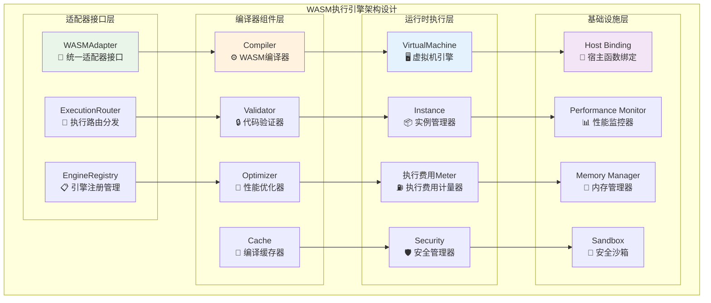
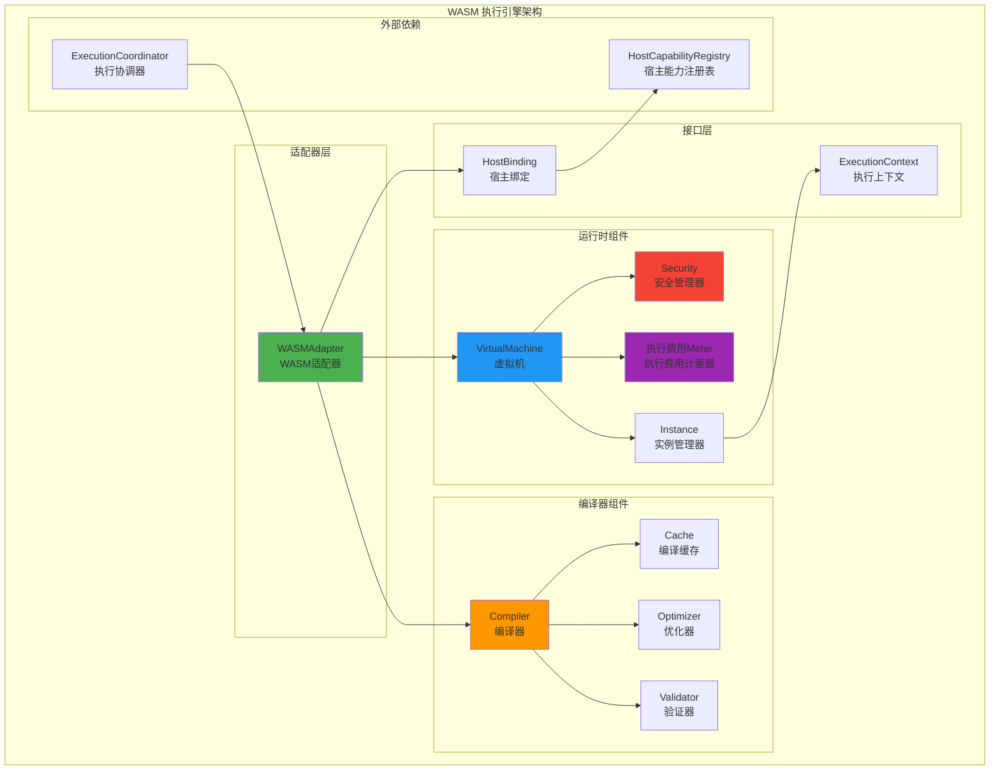
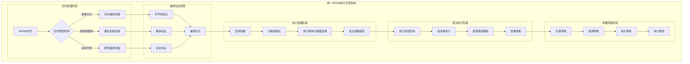
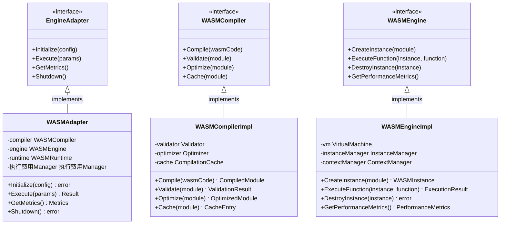

# WASM 执行引擎（internal/core/engines/wasm）

【模块定位】
　　本模块实现基于 WebAssembly 的执行引擎，为区块链提供高性能、安全隔离的智能合约执行能力。作为执行层的核心引擎之一，通过标准化的接口与执行协调层交互，提供完整的 WASM 编译、运行时管理和安全沙箱功能。

【设计原则】
- 标准接口实现：严格实现 `pkg/interfaces/execution.EngineAdapter` 接口
- 安全沙箱隔离：提供完整的 WASM 沙箱环境和安全控制
- 高性能优化：编译优化、运行时优化和资源管理优化
- 可观测性：完整的执行监控、执行费用计量和性能分析
- 模块化设计：编译器、运行时、适配器分离，便于维护和扩展

【核心职责】
1. **WASM 编译管理**：WASM 模块的编译、验证、优化和缓存
2. **运行时环境**：WASM 实例的创建、管理和生命周期控制
3. **安全沙箱**：内存隔离、资源限制和安全策略执行
4. **执行费用 计量系统**：精确的 执行费用 消耗计算和预测
5. **宿主函数绑定**：与区块链环境的安全交互接口
6. **性能监控**：执行性能的监控、分析和优化建议

【实现架构】

　　采用**安全沙箱执行**的4层实现架构，确保智能合约的安全隔离和高性能执行。



**架构层次说明：**

1. **适配器接口层**：提供标准的执行引擎接口，负责WASM执行请求的接收和分发
   - 统一的EngineAdapter接口实现
   - 智能的执行请求路由和调度
   - 动态的引擎注册和生命周期管理

2. **编译器组件层**：实现WASM字节码的编译、验证、优化和缓存管理
   - 高效的WASM模块编译和验证
   - 多级优化策略和性能调优
   - 智能的编译结果缓存和复用

3. **运行时执行层**：提供WASM代码的安全执行环境和资源控制
   - 高性能的虚拟机执行引擎
   - 精确的执行费用计量和资源管理
   - 完善的安全沙箱和隔离机制

4. **基础设施层**：提供底层支持服务，包括宿主绑定、性能监控和内存管理
   - 安全的宿主函数调用接口
   - 全方位的性能监控和分析
   - 高效的内存管理和沙箱隔离

【架构组件】



【与执行层的交互】
- **注册发现**：通过 `fx` 依赖注入自动注册到 `EngineManager`
- **执行调度**：接收来自 `ExecutionCoordinator` 的执行请求
- **宿主能力**：通过 `HostBinding` 安全访问区块链能力
- **结果返回**：标准化的执行结果和副作用返回

【安全机制】
- **内存隔离**：严格的 WASM 内存边界控制
- **资源限制**：CPU、内存、执行时间的精确限制
- **API控制**：宿主函数访问的权限控制
- **沙箱执行**：完全隔离的执行环境

---

## 📁 **模块组织结构**

【内部模块架构】

```
internal/core/engines/wasm/
├── 🔗 adapter.go               # WASM适配器 - 统一接口实现
├── ⚙️ module.go                # fx依赖注入和组件装配
├── 🛠️ compiler/                # 编译器组件 - 编译、验证、优化
│   ├── cache.go               # 编译缓存管理 - 提升重复编译性能
│   ├── optimizer.go           # 代码优化器 - 指令级性能优化
│   ├── validator.go           # 模块验证器 - 安全性和正确性检查
│   └── README.md              # 编译器组件文档
├── 🖥️ engine/                  # 核心引擎 - 虚拟机、上下文管理
│   ├── vm.go                  # 虚拟机引擎 - 字节码执行核心
│   ├── context.go             # 执行上下文 - 状态和环境维护
│   ├── config.go              # 引擎配置 - 性能参数和安全设置
│   ├── lifecycle.go           # 生命周期管理 - 实例创建到销毁
│   └── README.md              # 引擎组件文档
├── ⚡ runtime/                 # 运行时系统 - 执行费用计量、安全管理
│   ├── 执行费用.go                 # 执行费用计量系统 - 资源消耗追踪
│   ├── 执行费用_meters.go          # 执行费用计量器 - 多类型计量实现
│   ├── 执行费用_pricing.go         # 执行费用定价策略 - 成本计算和优化
│   ├── instance.go            # 实例管理器 - 创建、销毁、资源管理
│   ├── security.go            # 安全管理器 - 内存保护和权限控制
│   ├── metrics.go             # 性能监控 - 指标收集和分析
│   ├── errors.go              # 错误处理 - 异常管理和诊断
│   ├── encoder.go             # 数据编解码 - 格式转换支持
│   ├── result_handler.go      # 结果处理器 - 执行结果转换
│   ├── predictor.go           # 性能预测器 - 资源估算
│   └── README.md              # 运行时文档
└── 📖 README.md               # 本文档
```

### **🎯 子模块职责分工**

| **子模块** | **核心职责** | **对外接口** | **内部组件** | **复杂度** |
|-----------|-------------|-------------|-------------|-----------|
| `adapter.go` | 统一适配器接口实现 | EngineAdapter接口 | 适配器、路由器 | ⭐⭐⭐ |
| `compiler/` | WASM编译、验证、优化 | 编译服务接口 | 缓存、优化器、验证器 | ⭐⭐⭐⭐ |
| `engine/` | 虚拟机核心和上下文管理 | 引擎服务接口 | VM、上下文、配置、生命周期 | ⭐⭐⭐⭐⭐ |
| `runtime/` | 运行时支持和资源管理 | 运行时服务接口 | 执行费用、实例、安全、监控 | ⭐⭐⭐⭐ |

---

## 🔄 **统一WASM执行实现**

【实现策略】

　　所有WASM组件均严格遵循**编译→验证→执行→监控**安全执行架构模式，确保智能合约的安全隔离和高效执行。



**关键实现要点：**

1. **安全编译验证**：
   - 多层次的字节码格式验证和安全检查机制
   - 支持预编译缓存和即时编译的混合策略
   - 实现指令级和模块级的安全策略验证

2. **沙箱隔离执行**：
   - 完全隔离的执行环境和内存边界保护
   - 精确的执行费用计量和资源消耗控制机制
   - 安全的宿主函数调用和权限管理系统

3. **高性能优化**：
   - 编译时和运行时的多级优化策略
   - 实例池化管理和热点代码优化机制
   - 实时性能监控和自动调优能力

【执行费用 计量系统】

```go
// 执行费用 计量接口
type 执行费用Meter interface {
    Consume执行费用(amount uint64, descriptor string) error
    Refund执行费用(amount uint64, descriptor string)
    执行费用Consumed() uint64
    执行费用Remaining() uint64
    Limit() uint64
}

// 执行费用 计量策略
type 执行费用PricingPolicy struct {
    InstructionCosts map[string]uint64  // 指令成本
    MemoryPageCost   uint64            // 内存页成本
    HostCallCost     uint64            // 宿主调用成本
    TableOperationCost uint64          // 表操作成本
}
```

【性能优化策略】

1. **编译时优化**：
   - 指令级优化和冗余消除
   - 控制流优化和内联展开
   - 常量折叠和死代码消除

2. **运行时优化**：
   - JIT 编译和热点优化
   - 内存池化和对象重用
   - 并发执行和流水线处理

3. **缓存策略**：
   - 编译结果缓存
   - 实例池化管理
   - 热点代码预加载

---

## 📊 **性能与监控**

【性能指标】

| **操作类型** | **目标延迟** | **吞吐量目标** | **资源利用率** | **监控方式** |
|-------------|-------------|---------------|--------------|------------|
| WASM编译 | < 50ms | > 200 CPS | < 80% CPU | 实时监控 |
| 合约执行 | < 10ms | > 1000 TPS | < 70% Memory | 批量统计 |
| 执行费用计量 | < 1μs | > 1M OPS | < 20% CPU | 关键路径监控 |
| 实例创建 | < 5ms | > 500 IPS | < 60% Memory | 异步监控 |
| 沙箱隔离 | < 2ms | > 2000 SPS | < 30% CPU | 实时监控 |

**性能优化策略：**
- **编译优化**：预编译缓存、增量编译、并行编译、JIT编译技术
- **运行时优化**：实例池管理、内存优化、指令缓存、热点优化
- **执行费用优化**：批量执行费用扣除、预计算成本、智能定价、缓存策略
- **监控诊断**：实时指标收集、性能瓶颈分析、自动调优建议

---

## 🔗 **与公共接口的映射关系**

【接口实现映射】



**实现要点：**
- **接口契约**：严格遵循pkg/interfaces/execution接口定义和语义规范
- **错误处理**：统一的错误类型定义和标准化异常处理机制
- **日志记录**：结构化日志记录和完整的操作审计跟踪
- **测试覆盖**：全面的单元测试、集成测试和性能基准测试

---

## 🚀 **后续扩展规划**

【模块演进方向】

1. **执行能力扩展**
   - 支持更多WASM提案和新指令集
   - 增强多线程和并行执行能力
   - 扩展WASI系统接口支持
   - 添加WASM组件模型支持

2. **性能优化提升**
   - 引入更先进的JIT编译技术
   - 优化执行费用计量的精确度和性能
   - 实现更智能的实例池化策略
   - 加强编译缓存和预热机制

3. **安全增强**
   - 完善沙箱隔离和权限控制
   - 增强内存保护和溢出检测
   - 提供更细粒度的资源限制
   - 支持形式化验证和安全分析

4. **开发者体验**
   - 提供更完善的调试工具支持
   - 增强性能分析和诊断能力
   - 支持更多编程语言编译到WASM
   - 提供更友好的错误信息和文档

---

## 📋 **开发指南**

【引擎开发规范】

1. **合约集成步骤**：
   - 编写或编译生成符合规范的WASM字节码
   - 配置执行参数和执行费用限制策略
   - 实现必要的宿主函数绑定逻辑
   - 完成功能测试和安全审计验证

2. **代码质量要求**：
   - 遵循Go语言最佳实践和项目编码规范
   - 实现完整的错误处理和资源管理机制
   - 提供详细的代码注释和技术文档
   - 保证100%的核心功能测试覆盖率

3. **性能要求**：
   - 关键路径延迟指标必须达到设计目标
   - 内存使用效率和并发安全的数据访问
   - 实现合理的资源清理和生命周期管理
   - 支持性能监控和可观测性要求

【参考文档】
- [WASM编译器组件](compiler/README.md)
- [WASM虚拟机引擎](engine/README.md)
- [WASM运行时系统](runtime/README.md)
- [执行接口规范](../../../pkg/interfaces/execution/)
- [WES架构设计文档](../../../../docs/architecture/)

【错误处理】

| 错误类型 | 处理策略 | 恢复机制 |
|---------|---------|---------|
| 编译错误 | 立即返回错误 | 无需恢复 |
| 运行时错误 | 捕获并包装 | 实例重置 |
| 执行费用 耗尽 | 中止执行 | 状态回滚 |
| 内存溢出 | 抛出异常 | 内存回收 |
| 安全违规 | 立即终止 | 安全审计 |

【依赖注入】

```go
// WASM 引擎模块
func Module() fx.Option {
    return fx.Options(
        // 核心适配器
        fx.Provide(
            fx.Annotate(
                NewAdapterForDI,
                fx.As(new(execution.EngineAdapter)),
                fx.ResultTags(`group:"exec_engines"`),
            ),
        ),
        
        // 编译器组件
        fx.Provide(NewCompiler),
        fx.Provide(NewValidator),
        fx.Provide(NewOptimizer),
        fx.Provide(NewCache),
        
        // 运行时组件
        fx.Provide(NewVM),
        fx.Provide(NewInstanceManager),
        fx.Provide(New执行费用Meter),
        fx.Provide(NewSecurityManager),
    )
}
```

【使用示例】

```go
// 创建 WASM 适配器
adapter := NewWASMAdapter(config)

// 编译 WASM 模块
compiledModule, err := adapter.CompileModule(wasmBytes)
if err != nil {
    return fmt.Errorf("compilation failed: %w", err)
}

// 执行合约
result, err := adapter.Execute(ctx, types.ExecutionParams{
    ResourceID:   contractID,
    ResourceType: types.EngineTypeWASM,
    Input:        inputData,
    执行费用Limit:     执行费用Limit,
})

if err != nil {
    return fmt.Errorf("execution failed: %w", err)
}

// 处理执行结果
processExecutionResult(result)
```

【扩展指南】

1. **自定义 执行费用 计量**：
```go
// 实现自定义 执行费用 计量器
type Custom执行费用Meter struct {
    // 自定义字段
}

func (g *Custom执行费用Meter) Consume执行费用(amount uint64, descriptor string) error {
    // 自定义 执行费用 消耗逻辑
    return nil
}
```

2. **自定义优化器**：
```go
// 实现自定义优化器
type CustomOptimizer struct{}

func (o *CustomOptimizer) Optimize(module *wasm.Module) (*wasm.Module, error) {
    // 自定义优化逻辑
    return optimizedModule, nil
}
```

【故障排查】

常见问题及解决方案：

1. **编译失败**：
   - 检查 WASM 字节码格式
   - 验证指令集兼容性
   - 查看编译器错误日志

2. **执行超时**：
   - 调整执行超时设置
   - 检查无限循环问题
   - 优化合约代码逻辑

3. **执行费用 耗尽**：
   - 增加 执行费用 限制
   - 优化合约算法
   - 检查 执行费用 计量准确性

4. **内存问题**：
   - 调整内存限制
   - 检查内存泄漏
   - 优化内存使用模式

【性能基准】

- **编译性能**：1MB WASM 模块编译时间 < 100ms
- **执行性能**：简单计算指令 < 1μs
- **内存效率**：内存开销 < 10% 额外消耗
- **执行费用 精度**：执行费用 计量误差 < 1%

---

> 📝 **模板说明**：本README模板基于WES v0.0.1统一文档规范设计，使用时请根据具体模块需求替换相应的占位符内容，并确保所有章节都有实质性的技术内容。

> 🔄 **维护指南**：本文档应随着模块功能的演进及时更新，确保文档与代码实现的一致性。建议在每次重大功能变更后更新相应章节。

---

【依赖关系】

本模块依赖以下组件：
- `pkg/interfaces/execution`: 执行接口定义
- `pkg/types`: 通用类型定义
- WASM 运行时库：底层 WASM 执行支持
- 编译工具链：WASM 编译和优化工具
- 性能监控：执行性能的监控和分析
