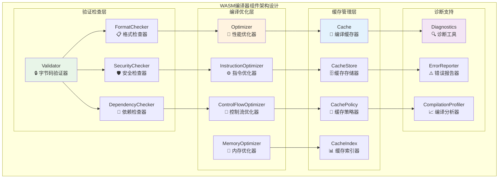
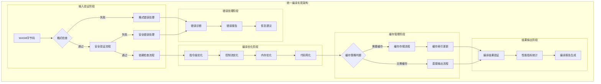
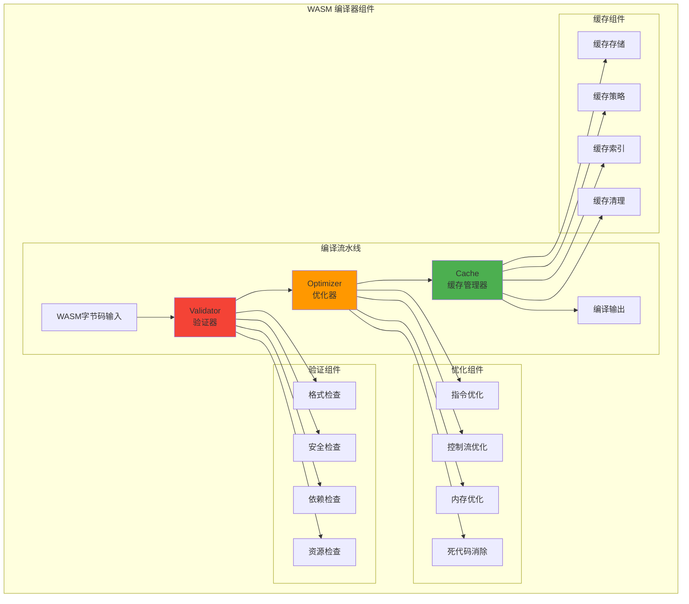
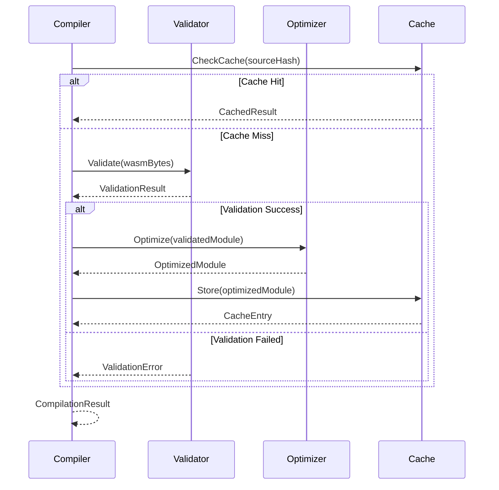
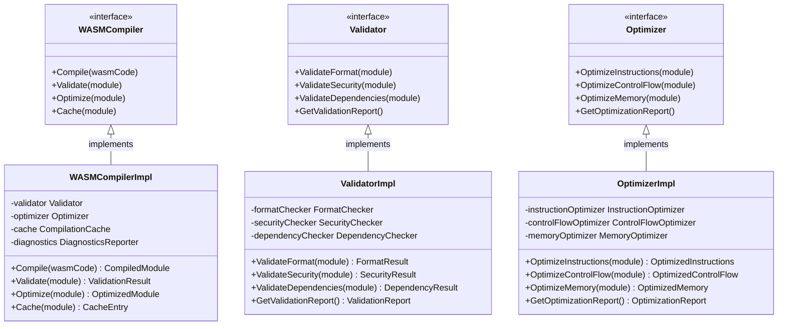

# WASM 编译器组件（internal/core/engines/wasm/compiler）

【模块目的】
　　本目录实现 WASM 模块的编译、验证、优化和缓存管理功能。通过高效的编译流水线和智能缓存机制，为 WASM 执行引擎提供快速、安全、优化的字节码编译服务。

【设计原则】
- 安全第一：严格的字节码验证和安全检查
- 性能优化：多层次的编译优化和缓存策略
- 可扩展性：支持新的优化算法和验证规则
- 可观测性：详细的编译性能监控和分析
- 错误处理：友好的错误信息和故障恢复

【核心职责】
1. **字节码验证**：WASM 模块的格式验证和安全检查
2. **编译优化**：指令级和模块级的性能优化
3. **编译缓存**：编译结果的缓存和管理
4. **错误诊断**：编译过程中的错误检测和报告

【实现架构】

　　采用**流水线编译**的3层实现架构，确保WASM字节码的安全验证和高效编译。



**架构层次说明：**

1. **验证检查层**：对WASM字节码进行全面的格式验证和安全检查
   - 严格的字节码格式和规范验证
   - 多层次的安全策略检查和威胁检测
   - 完整的模块依赖关系验证

2. **编译优化层**：实现多级编译优化和性能提升策略
   - 指令级优化和代数简化算法
   - 控制流分析和分支优化策略
   - 内存访问优化和缓存友好布局

3. **缓存管理层**：提供高效的编译结果缓存和管理机制
   - 智能的缓存存储和索引管理
   - 多种缓存策略和淘汰算法支持
   - 分布式缓存和版本控制机制

---

## 📁 **模块组织结构**

【内部模块架构】

```
internal/core/engines/wasm/compiler/
├── 🔒 validator.go             # 字节码验证器 - 格式和安全检查
├── 🚀 optimizer.go             # 性能优化器 - 指令和控制流优化
├── 💾 cache.go                 # 编译缓存器 - 缓存管理和策略
└── 📖 README.md                # 本文档
```

### **🎯 子模块职责分工**

| **子模块** | **核心职责** | **对外接口** | **内部组件** | **复杂度** |
|-----------|-------------|-------------|-------------|-----------|
| `validator.go` | 字节码验证和安全检查 | 验证服务接口 | 格式检查器、安全检查器、依赖检查器 | ⭐⭐⭐⭐⭐ |
| `optimizer.go` | 编译优化和性能提升 | 优化服务接口 | 指令优化器、控制流优化器、内存优化器 | ⭐⭐⭐⭐ |
| `cache.go` | 编译缓存和结果管理 | 缓存服务接口 | 存储器、策略器、索引器 | ⭐⭐⭐ |

---

## 🔄 **统一编译实现**

【实现策略】

　　所有编译组件均严格遵循**验证→优化→缓存→输出**编译流水线架构模式，确保WASM字节码的安全性和执行效率。



**关键实现要点：**

1. **多层验证策略**：
   - 递进式的格式验证、安全验证和依赖验证
   - 支持可配置的验证级别和自定义验证规则
   - 实现高效的验证缓存和结果复用机制

2. **多级优化策略**：
   - 从指令级到模块级的多层次优化算法
   - 支持激进优化和保守优化的动态选择
   - 实现编译时间和优化效果的平衡策略

3. **智能缓存策略**：
   - 基于源码哈希和配置的智能缓存键生成
   - 支持LRU、LFU、TTL等多种缓存淘汰策略
   - 实现分布式缓存和缓存同步机制

【组件架构】



【文件说明】

## validator.go
**功能**：WASM 模块验证器
**职责**：
- WASM 格式验证和规范检查
- 安全策略验证和威胁检测
- 资源限制验证和约束检查
- 依赖关系验证和兼容性检查

**验证层次**：
```go
type ValidationLevel int

const (
    BasicValidation    ValidationLevel = iota  // 基础格式验证
    SecurityValidation                         // 安全策略验证
    ResourceValidation                        // 资源约束验证
    FullValidation                           // 完整验证
)
```

**验证规则**：
- **格式验证**：魔数、版本、段结构检查
- **指令验证**：指令合法性、操作数检查
- **类型验证**：函数签名、全局变量类型检查
- **内存验证**：内存布局、访问权限检查
- **导入导出验证**：接口兼容性、安全性检查

## optimizer.go
**功能**：WASM 代码优化器
**职责**：
- 指令级优化和性能提升
- 控制流优化和分支预测
- 内存访问优化和缓存友好
- 死代码消除和代码简化

**优化策略**：
```go
type OptimizationLevel int

const (
    NoOptimization     OptimizationLevel = iota  // 无优化
    BasicOptimization                           // 基础优化
    AdvancedOptimization                       // 高级优化
    AggressiveOptimization                     // 激进优化
)
```

**优化类型**：
1. **指令优化**：
   - 常量折叠和传播
   - 强度削减和代数简化
   - 指令调度和流水线优化

2. **控制流优化**：
   - 分支预测和条件优化
   - 循环展开和向量化
   - 尾调用优化

3. **内存优化**：
   - 内存访问合并
   - 缓存局部性优化
   - 内存布局优化

4. **代码简化**：
   - 死代码消除
   - 无用分支删除
   - 冗余计算消除

## cache.go
**功能**：编译缓存管理器
**职责**：
- 编译结果的缓存存储和管理
- 缓存策略的执行和优化
- 缓存索引的维护和查询
- 缓存清理和空间管理

**缓存策略**：
```go
type CachePolicy struct {
    MaxSize           int64         // 最大缓存大小
    TTL              time.Duration // 缓存生存时间
    EvictionPolicy   EvictionType  // 淘汰策略
    CompressionLevel int           // 压缩级别
    EncryptionEnabled bool         // 是否加密
}

type EvictionType int

const (
    LRU  EvictionType = iota  // 最近最少使用
    LFU                      // 最少使用频率
    FIFO                     // 先进先出
    TTL                      // 基于时间
)
```

**缓存结构**：
```go
type CacheEntry struct {
    Key           string      // 缓存键（基于源码哈希）
    CompiledCode  []byte      // 编译后的代码
    Metadata      CacheMetadata // 缓存元数据
    CreatedAt     time.Time   // 创建时间
    AccessedAt    time.Time   // 最后访问时间
    AccessCount   int64       // 访问次数
    Size          int64       // 条目大小
}

type CacheMetadata struct {
    SourceHash      string    // 源码哈希
    CompilerVersion string    // 编译器版本
    OptimizationLevel int     // 优化级别
    Checksums       []string  // 校验和
}
```

【编译流程】



【性能指标】

| 指标类型 | 目标值 | 监控方法 |
|---------|--------|---------|
| 编译速度 | < 100ms/MB | 时间测量 |
| 缓存命中率 | > 80% | 命中统计 |
| 优化效果 | 10-30% 性能提升 | 基准测试 |
| 内存使用 | < 2x 源码大小 | 内存监控 |
| 验证准确性 | 100% 安全检测 | 安全测试 |

---

## 🏗️ **依赖注入架构**

【fx框架集成】

　　WASM编译器通过fx依赖注入框架实现组件装配和生命周期管理，确保编译流水线的模块化和可扩展性。

**依赖注入设计**：
- **编译器装配**：自动装配验证器、优化器、缓存器和诊断工具
- **策略注入**：通过依赖注入提供验证策略、优化策略和缓存策略
- **配置管理**：基于配置驱动的编译参数和策略选择机制
- **生命周期管理**：自动管理编译器组件的初始化和资源清理

**核心组件依赖关系**：
- WASMCompiler依赖Validator、Optimizer、Cache、DiagnosticsReporter
- Validator依赖FormatChecker、SecurityChecker、DependencyChecker
- Optimizer依赖InstructionOptimizer、ControlFlowOptimizer、MemoryOptimizer
- Cache依赖CacheStore、CachePolicy、CacheIndex、CompressionManager

---

## 📊 **性能与监控**

【性能指标】

| **操作类型** | **目标延迟** | **吞吐量目标** | **缓存命中率** | **监控方式** |
|-------------|-------------|---------------|--------------|------------|
| 格式验证 | < 10ms | > 5000 VPS | N/A | 实时监控 |
| 安全验证 | < 20ms | > 2000 VPS | > 80% | 批量统计 |
| 指令优化 | < 50ms | > 1000 OPS | N/A | 关键路径监控 |
| 缓存查询 | < 5ms | > 10000 QPS | > 85% | 实时监控 |
| 完整编译 | < 100ms | > 500 CPS | > 70% | 异步监控 |

**性能优化策略：**
- **验证优化**：并行验证、验证缓存、增量验证、快速路径优化
- **编译优化**：多级优化、激进优化、编译缓存、热点识别
- **缓存优化**：预取缓存、压缩存储、分布式缓存、智能淘汰
- **监控调优**：实时指标、瓶颈分析、自动调参、性能预测

---

## 🔗 **与公共接口的映射关系**

【接口实现映射】



**实现要点：**
- **接口契约**：严格遵循编译器接口定义和编译流程规范
- **错误处理**：分层的错误处理和编译异常恢复机制
- **日志记录**：详细的编译过程日志和性能指标记录
- **测试覆盖**：完整的编译器测试、验证测试和优化基准测试

---

## 🚀 **后续扩展规划**

【模块演进方向】

1. **验证能力扩展**
   - 支持更多WASM提案和新指令验证
   - 增强形式化验证和安全分析能力
   - 扩展自定义验证规则和策略配置
   - 添加静态分析和代码质量检测

2. **优化技术提升**
   - 引入更先进的编译优化算法
   - 优化跨函数和全局的优化策略
   - 实现基于Profile的优化和反馈优化
   - 加强并行编译和增量编译能力

3. **缓存系统增强**
   - 完善分布式缓存和多级缓存
   - 增强缓存一致性和版本管理
   - 提供更智能的缓存预测和预取
   - 支持缓存压缩和加密存储

4. **工具链集成**
   - 与更多开发工具和IDE集成
   - 支持编译器插件和扩展机制
   - 增强调试信息生成和源码映射
   - 提供更完善的编译报告和分析

---

## 📋 **开发指南**

【编译器开发规范】

1. **新组件接入步骤**：
   - 定义编译器组件接口和处理契约
   - 实现核心编译逻辑和优化算法
   - 添加性能监控和错误处理机制
   - 完成组件测试和编译基准测试

2. **代码质量要求**：
   - 遵循Go语言最佳实践和项目编码规范
   - 实现完整的错误处理和资源管理机制
   - 提供详细的代码注释和技术文档
   - 保证100%的核心功能测试覆盖率

3. **性能要求**：
   - 关键路径延迟指标必须达到设计目标
   - 内存使用效率和并发安全的数据访问
   - 实现合理的资源清理和生命周期管理
   - 支持性能监控和可观测性要求

【参考文档】
- [WASM执行引擎](../README.md)
- [WASM虚拟机引擎](../engine/README.md)
- [WASM运行时系统](../runtime/README.md)
- [执行接口规范](../../../../pkg/interfaces/execution/)
- [WES架构设计文档](../../../../../docs/architecture/)

【错误处理】

```go
// 编译错误类型
type CompilationError struct {
    Type        ErrorType
    Message     string
    Location    *SourceLocation
    Suggestions []string
    Severity    ErrorSeverity
}

type ErrorType int

const (
    ValidationError   ErrorType = iota
    OptimizationError
    CacheError
    ResourceError
    InternalError
)
```

【使用示例】

```go
// 创建编译器
compiler := NewCompiler(config)

// 编译 WASM 模块
result, err := compiler.Compile(ctx, CompileRequest{
    Source:            wasmBytes,
    OptimizationLevel: AdvancedOptimization,
    CacheEnabled:      true,
    ValidationLevel:   FullValidation,
})

if err != nil {
    log.Errorf("Compilation failed: %v", err)
    return
}

// 使用编译结果
module := result.CompiledModule
metrics := result.CompilationMetrics
```

【扩展指南】

1. **自定义验证规则**：
```go
// 实现自定义验证器
type CustomValidator struct{}

func (v *CustomValidator) Validate(module *wasm.Module) ValidationResult {
    // 自定义验证逻辑
    return result
}

// 注册验证器
compiler.RegisterValidator("custom", &CustomValidator{})
```

2. **自定义优化算法**：
```go
// 实现自定义优化器
type CustomOptimizer struct{}

func (o *CustomOptimizer) Optimize(module *wasm.Module) (*wasm.Module, error) {
    // 自定义优化逻辑
    return optimizedModule, nil
}
```

3. **自定义缓存策略**：
```go
// 实现自定义缓存策略
type CustomCachePolicy struct{}

func (p *CustomCachePolicy) ShouldCache(entry CacheEntry) bool {
    // 自定义缓存决策
    return true
}

func (p *CustomCachePolicy) ShouldEvict(entry CacheEntry) bool {
    // 自定义淘汰决策
    return false
}
```

【故障排查】

常见问题及解决方案：

1. **验证失败**：
   - 检查 WASM 模块格式
   - 验证安全策略配置
   - 查看详细错误信息

2. **编译性能差**：
   - 调整优化级别
   - 启用编译缓存
   - 增加并发数量

3. **缓存问题**：
   - 检查缓存配置
   - 清理损坏的缓存
   - 监控缓存命中率

4. **内存不足**：
   - 调整内存限制
   - 减少并发编译
   - 优化缓存大小

---

> 📝 **模板说明**：本README模板基于WES v0.0.1统一文档规范设计，使用时请根据具体模块需求替换相应的占位符内容，并确保所有章节都有实质性的技术内容。

> 🔄 **维护指南**：本文档应随着模块功能的演进及时更新，确保文档与代码实现的一致性。建议在每次重大功能变更后更新相应章节。

---

【依赖关系】

本模块依赖以下组件：
- WASM 解析库：用于字节码解析
- 优化算法库：用于代码优化
- 缓存存储：用于编译结果缓存
- 安全检查库：用于安全验证
- 性能监控：用于编译性能分析
