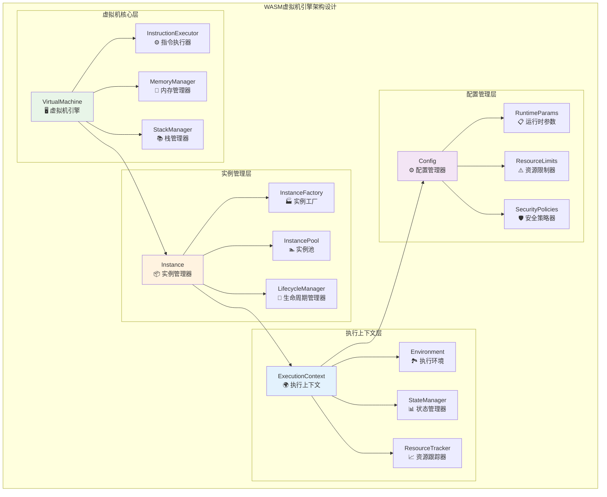
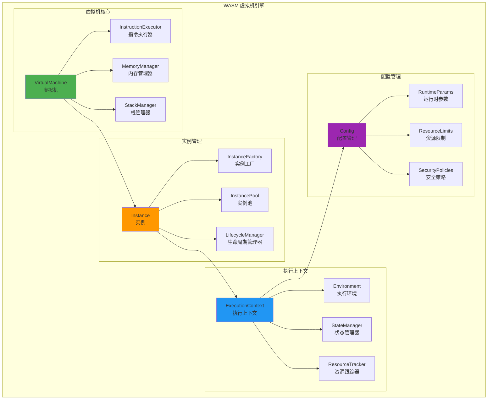
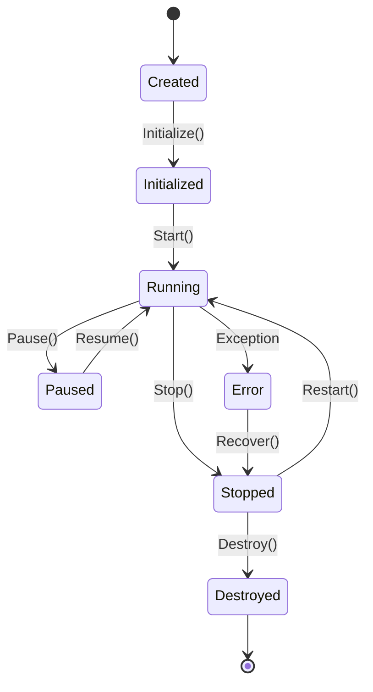
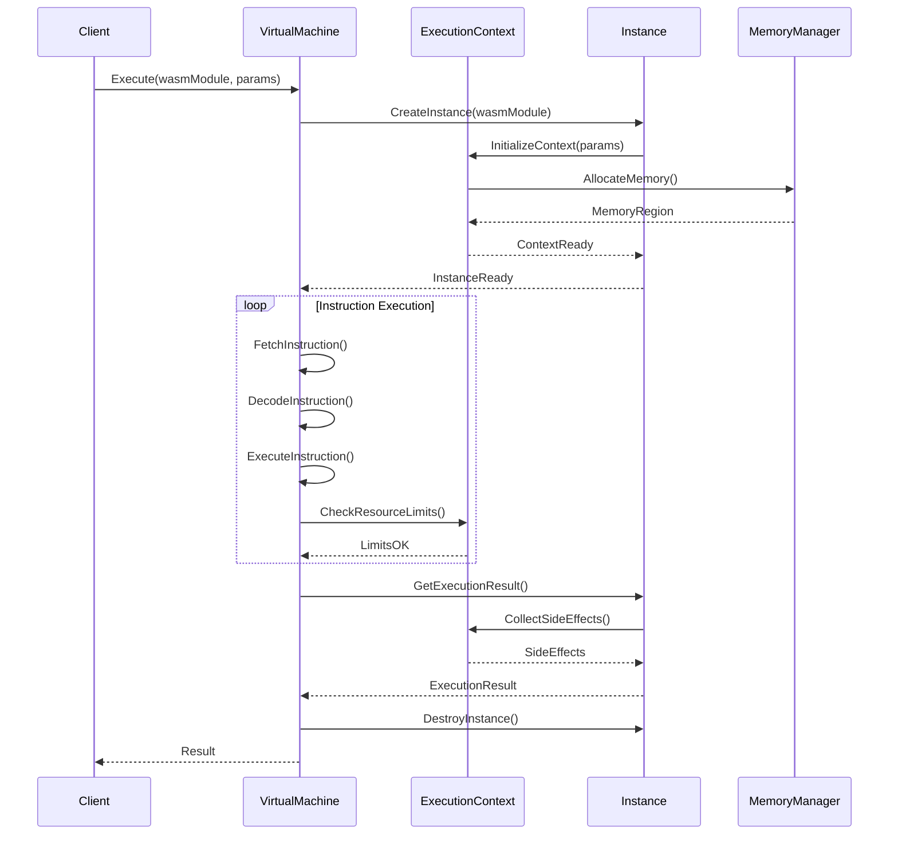
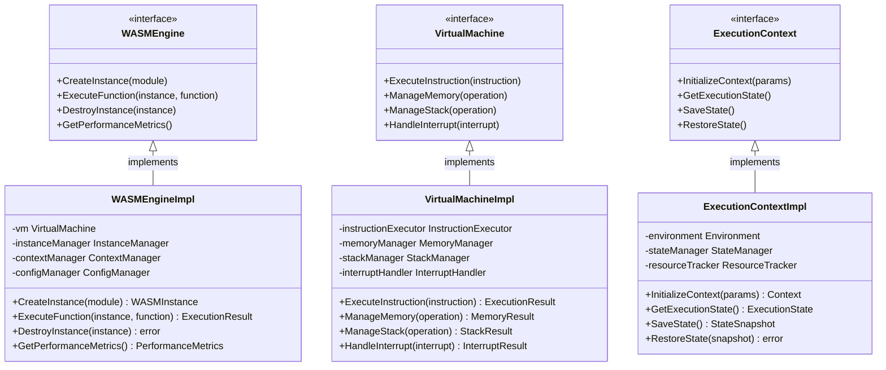

# WASM 虚拟机引擎（internal/core/engines/wasm/engine）

【模块目的】
　　本目录实现 WASM 虚拟机的核心引擎组件，负责 WASM 字节码的执行、实例管理、执行上下文维护和生命周期控制。通过高效的虚拟机实现和完善的资源管理，为智能合约提供安全、稳定、高性能的执行环境。

【设计原则】
- 安全隔离：严格的内存隔离和资源边界控制
- 高性能执行：优化的指令执行和内存管理
- 精确控制：细粒度的执行控制和资源监控
- 状态管理：完整的执行状态保存和恢复
- 错误恢复：健壮的错误处理和故障恢复

【核心职责】
1. **虚拟机执行**：WASM 指令的解释执行和性能优化
2. **实例管理**：WASM 模块实例的创建、配置和销毁
3. **执行上下文**：执行环境的初始化、维护和清理
4. **生命周期控制**：从创建到销毁的完整生命周期管理
5. **配置管理**：运行时参数的配置和动态调整

【实现架构】

　　采用**分层虚拟机**的4层实现架构，确保WASM指令的高效执行和精确的资源管理。



**架构层次说明：**

1. **虚拟机核心层**：实现WASM指令的解释执行、内存管理和栈操作
   - 高性能的指令解释执行引擎
   - 精确的线性内存管理和保护机制
   - 高效的调用栈和操作数栈管理

2. **实例管理层**：负责WASM实例的创建、池化管理和生命周期控制
   - 完整的实例工厂和创建流程
   - 智能的实例池化和复用策略
   - 自动的生命周期管理和资源回收

3. **执行上下文层**：维护执行环境、状态管理和资源跟踪
   - 完整的执行环境初始化和配置
   - 实时的执行状态管理和持久化
   - 精确的资源使用跟踪和监控

4. **配置管理层**：提供运行时配置、资源限制和安全策略管理
   - 灵活的运行时参数配置和调优
   - 严格的资源限制和配额管理
   - 全面的安全策略和权限控制

---

## 📁 **模块组织结构**

【内部模块架构】

```
internal/core/engines/wasm/engine/
├── 🖥️ vm.go                    # 虚拟机引擎 - 字节码解释执行核心
├── 🌍 context.go               # 执行上下文 - 环境状态和资源管理
├── ⚙️ config.go                # 引擎配置 - 参数管理和性能调优
├── 🔄 lifecycle.go             # 生命周期管理 - 实例创建到销毁控制
└── 📖 README.md                # 本文档
```

### **🎯 子模块职责分工**

| **子模块** | **核心职责** | **对外接口** | **内部组件** | **复杂度** |
|-----------|-------------|-------------|-------------|-----------|
| `vm.go` | 虚拟机执行和指令处理 | 虚拟机接口 | 执行器、内存管理、栈管理、调用栈 | ⭐⭐⭐⭐⭐ |
| `context.go` | 执行上下文和环境管理 | 上下文接口 | 环境、状态管理、资源跟踪 | ⭐⭐⭐⭐ |
| `config.go` | 配置管理和参数调优 | 配置接口 | 参数管理、限制器、策略器 | ⭐⭐⭐ |
| `lifecycle.go` | 生命周期和实例管理 | 生命周期接口 | 工厂、池化、状态机 | ⭐⭐⭐⭐ |

---

## 🔄 **统一虚拟机实现**

【实现策略】

　　所有虚拟机组件均严格遵循**初始化→执行→监控→清理**虚拟机架构模式，确保WASM代码的安全执行和资源的精确控制。

```mermaid
flowchart TD
    subgraph "统一虚拟机实现架构"
        subgraph "初始化阶段"
            A[实例请求] --> B{模块验证}
            B -->|通过| C[实例创建流程]
            B -->|失败| D[验证错误处理]
            C --> E[上下文初始化]
        end
        
        subgraph "配置准备阶段"
            E --> F[内存分配]
            F --> G[栈初始化]
            G --> H[全局变量设置]
            H --> I[函数表初始化]
        end
        
        subgraph "执行控制阶段"
            I --> J[指令获取]
            J --> K[指令解码]
            K --> L[指令执行]
            L --> M[状态更新]
        end
        
        subgraph "监控检查阶段"
            M --> N{资源检查}
            N -->|正常| O[继续执行]
            N -->|异常| P[异常处理]
            O --> Q{执行完成}
            Q -->|未完成| J
            Q -->|完成| R[结果收集]
        end
        
        subgraph "清理回收阶段"
            R --> S[状态保存]
            P --> T[错误记录]
            S --> U[资源释放]
            T --> U
            U --> V[实例清理]
        end
    end
```



**关键实现要点：**

1. **高效指令执行**：
   - 基于解释器和JIT编译的混合执行策略
   - 支持热点检测和动态优化机制
   - 实现指令缓存和预取优化技术

2. **精确资源管理**：
   - 线性内存的严格边界检查和保护
   - 调用栈深度和操作数栈的精确控制
   - 全局变量和函数表的安全访问管理

3. **完整生命周期控制**：
   - 从实例创建到销毁的完整状态机管理
   - 支持实例暂停、恢复和迁移机制
   - 实现自动资源回收和内存清理策略

【组件架构】



【文件说明】

## vm.go
**功能**：WASM 虚拟机的核心实现
**职责**：
- WASM 指令的解释执行
- 内存和栈的管理
- 函数调用和返回处理
- 异常和中断处理

**虚拟机架构**：
```go
type VirtualMachine struct {
    config          *VMConfig
    instructionSet  InstructionSet
    memoryManager   MemoryManager
    stackManager    StackManager
    callStack       CallStack
    执行费用ometer       执行费用ometer
    interruptHandler InterruptHandler
    debugger        Debugger
}
```

**执行模式**：
- **解释执行**：逐指令解释执行
- **JIT编译**：热点代码即时编译
- **AOT编译**：预先编译优化
- **混合模式**：解释和编译混合

## context.go
**功能**：执行上下文管理器
**职责**：
- 执行环境的初始化和配置
- 全局变量和局部变量管理
- 函数表和内存表管理
- 导入导出接口管理

**上下文结构**：
```go
type ExecutionContext struct {
    instance        *Instance
    globals         GlobalVariables
    memory          LinearMemory
    table          FunctionTable
    imports        ImportResolver
    exports        ExportManager
    hostBinding    HostBinding
    执行费用Remaining   uint64
    callDepth      int
    startTime      time.Time
}
```

**上下文生命周期**：
1. **初始化**：创建执行环境和分配资源
2. **配置**：设置参数和绑定宿主函数
3. **执行**：运行 WASM 代码
4. **监控**：跟踪资源使用和性能
5. **清理**：释放资源和重置状态

## config.go
**功能**：引擎配置管理器
**职责**：
- 运行时参数的配置和管理
- 资源限制的设置和执行
- 安全策略的配置和应用
- 性能参数的调整和优化

**配置结构**：
```go
type VMConfig struct {
    // 内存配置
    MemoryConfig MemoryConfig
    
    // 执行配置
    ExecutionConfig ExecutionConfig
    
    // 安全配置
    SecurityConfig SecurityConfig
    
    // 性能配置
    PerformanceConfig PerformanceConfig
    
    // 调试配置
    DebugConfig DebugConfig
}

type MemoryConfig struct {
    InitialPages    uint32  // 初始页数
    MaxPages        uint32  // 最大页数
    PageSize        uint32  // 页大小
    GrowthPolicy    GrowthPolicy // 增长策略
    ProtectionMode  ProtectionMode // 保护模式
}

type ExecutionConfig struct {
    MaxCallDepth    int           // 最大调用深度
    MaxInstructions uint64        // 最大指令数
    TimeoutDuration time.Duration // 执行超时
    EnableJIT       bool          // 启用JIT
    EnableProfiling bool          // 启用性能分析
}
```

## lifecycle.go
**功能**：实例生命周期管理器
**职责**：
- 实例的创建和初始化
- 实例状态的跟踪和管理
- 实例的暂停和恢复
- 实例的销毁和资源回收

**生命周期状态**：
```go
type InstanceState int

const (
    StateCreated    InstanceState = iota // 已创建
    StateInitialized                    // 已初始化
    StateRunning                        // 运行中
    StatePaused                         // 暂停
    StateStopped                        // 停止
    StateError                          // 错误
    StateDestroyed                      // 已销毁
)
```

**状态转换**：


【执行流程】



【性能优化】

1. **指令执行优化**：
   - 指令缓存和预取
   - 分支预测优化
   - 指令融合和宏操作

2. **内存管理优化**：
   - 内存池化管理
   - 预分配和延迟释放
   - 内存访问局部性优化

3. **JIT 编译优化**：
   - 热点检测和编译
   - 内联函数优化
   - 寄存器分配优化

4. **实例复用优化**：
   - 实例池化管理
   - 状态快照和恢复
   - 预热和缓存机制

【资源管理】

```go
// 资源监控
type ResourceMonitor struct {
    memoryUsage     AtomicUint64
    cpuTime         AtomicDuration
    instructionCount AtomicUint64
    执行费用Consumed     AtomicUint64
    callDepth       AtomicInt32
}

// 资源限制
type ResourceLimits struct {
    MaxMemory       uint64
    MaxCPUTime      time.Duration
    MaxInstructions uint64
    Max执行费用Limit     uint64
    MaxCallDepth    int
}
```

【错误处理】

| 错误类型 | 处理策略 | 恢复机制 |
|---------|---------|---------|
| 内存溢出 | 立即终止 | 内存清理 |
| 栈溢出 | 抛出异常 | 栈重置 |
| 指令错误 | 错误返回 | 状态回滚 |
| 超时错误 | 强制中断 | 资源释放 |
| 宿主调用错误 | 异常传播 | 上下文清理 |

---

## 🏗️ **依赖注入架构**

【fx框架集成】

　　WASM虚拟机引擎通过fx依赖注入框架实现组件装配和生命周期管理，确保虚拟机组件的模块化和可扩展性。

**依赖注入设计**：
- **引擎装配**：自动装配虚拟机、实例管理器、上下文管理器和配置管理器
- **组件协调**：通过依赖注入提供指令执行器、内存管理器和栈管理器
- **策略配置**：基于配置驱动的执行策略和资源管理策略
- **生命周期管理**：自动管理虚拟机组件的初始化、启动和清理

**核心组件依赖关系**：
- VirtualMachine依赖InstructionExecutor、MemoryManager、StackManager、CallStack
- Instance依赖InstanceFactory、InstancePool、LifecycleManager、ResourceTracker
- ExecutionContext依赖Environment、StateManager、ResourceTracker、SecurityManager
- Config依赖RuntimeParams、ResourceLimits、SecurityPolicies、PerformanceConfig

---

## 📊 **性能与监控**

【性能指标】

| **操作类型** | **目标延迟** | **吞吐量目标** | **资源利用率** | **监控方式** |
|-------------|-------------|---------------|--------------|------------|
| 指令执行 | < 1μs | > 1M IOPS | < 70% CPU | 实时监控 |
| 内存访问 | < 10ns | > 100M OPS | < 80% Memory | 批量统计 |
| 函数调用 | < 5μs | > 500K CPS | < 60% Stack | 关键路径监控 |
| 实例创建 | < 5ms | > 1000 IPS | < 50% Memory | 异步监控 |
| 状态切换 | < 1ms | > 5000 SPS | < 30% CPU | 实时监控 |

**性能优化策略：**
- **指令优化**：指令缓存、预取优化、热点检测、JIT编译技术
- **内存优化**：内存池化、延迟分配、边界检查优化、缓存局部性
- **栈优化**：栈预分配、快速调用、尾调用优化、栈溢出检测
- **实例优化**：实例池化、预热机制、状态复用、资源共享

---

## 🔗 **与公共接口的映射关系**

【接口实现映射】



**实现要点：**
- **接口契约**：严格遵循虚拟机接口定义和执行流程规范
- **错误处理**：分层的错误处理和虚拟机异常恢复机制
- **日志记录**：详细的执行过程日志和性能指标记录
- **测试覆盖**：全面的虚拟机测试、指令测试和性能基准测试

---

## 🚀 **后续扩展规划**

【模块演进方向】

1. **执行能力扩展**
   - 支持更多WASM提案和新指令集
   - 增强多线程和并行执行能力
   - 扩展SIMD指令和向量化执行
   - 添加异步执行和协程支持

2. **性能优化提升**
   - 引入更先进的JIT编译技术
   - 优化指令调度和流水线执行
   - 实现更智能的缓存和预取策略
   - 加强硬件特化和SIMD优化

3. **调试增强**
   - 完善调试信息生成和源码映射
   - 增强断点调试和单步执行
   - 提供更丰富的性能分析工具
   - 支持远程调试和可视化分析

4. **系统集成**
   - 与更多编程语言运行时集成
   - 支持WebAssembly系统接口（WASI）
   - 增强与容器和云平台的集成
   - 提供更完善的工具链支持

---

## 📋 **开发指南**

【虚拟机开发规范】

1. **新组件接入步骤**：
   - 定义虚拟机组件接口和执行契约
   - 实现核心执行逻辑和性能优化机制
   - 添加安全检查和资源管理功能
   - 完成组件测试和性能基准测试

2. **代码质量要求**：
   - 遵循Go语言最佳实践和项目编码规范
   - 实现完整的错误处理和资源管理机制
   - 提供详细的代码注释和技术文档
   - 保证100%的核心功能测试覆盖率

3. **性能要求**：
   - 关键路径延迟指标必须达到设计目标
   - 内存使用效率和并发安全的数据访问
   - 实现合理的资源清理和生命周期管理
   - 支持性能监控和可观测性要求

【参考文档】
- [WASM执行引擎](../README.md)
- [WASM编译器组件](../compiler/README.md)
- [WASM运行时系统](../runtime/README.md)
- [执行接口规范](../../../../pkg/interfaces/execution/)
- [WES架构设计文档](../../../../../docs/architecture/)

【监控指标】

- **执行性能**：
  - 指令执行速度（MIPS）
  - 函数调用开销
  - 内存访问延迟
  - JIT 编译时间

- **资源使用**：
  - 内存使用峰值
  - CPU 时间消耗
  - 执行费用 消耗统计
  - 调用栈深度

- **错误统计**：
  - 异常发生频率
  - 错误类型分布
  - 恢复成功率
  - 性能回退情况

【扩展指南】

1. **自定义指令集**：
```go
// 实现自定义指令
type CustomInstruction struct{}

func (i *CustomInstruction) Execute(vm *VirtualMachine, params []Value) error {
    // 自定义指令逻辑
    return nil
}

// 注册指令
vm.RegisterInstruction(0xFF, &CustomInstruction{})
```

2. **自定义内存管理**：
```go
// 实现自定义内存管理器
type CustomMemoryManager struct{}

func (m *CustomMemoryManager) Allocate(size uint32) (*MemoryRegion, error) {
    // 自定义内存分配
    return region, nil
}
```

【故障排查】

常见问题及解决方案：

1. **执行性能差**：
   - 启用 JIT 编译
   - 调整内存配置
   - 优化指令缓存

2. **内存泄漏**：
   - 检查实例销毁
   - 监控内存使用
   - 调整 GC 策略

3. **执行错误**：
   - 检查 WASM 模块
   - 验证宿主绑定
   - 查看错误日志

4. **资源耗尽**：
   - 调整资源限制
   - 优化算法实现
   - 增加监控告警

---

> 📝 **模板说明**：本README模板基于WES v0.0.1统一文档规范设计，使用时请根据具体模块需求替换相应的占位符内容，并确保所有章节都有实质性的技术内容。

> 🔄 **维护指南**：本文档应随着模块功能的演进及时更新，确保文档与代码实现的一致性。建议在每次重大功能变更后更新相应章节。

---

【依赖关系】

本模块依赖以下组件：
- WASM 运行时库：底层 WASM 执行支持
- 内存管理库：内存分配和保护
- JIT 编译器：即时编译支持
- 性能监控：执行性能分析
- 安全组件：沙箱和访问控制
