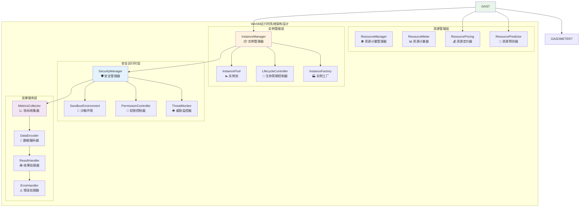
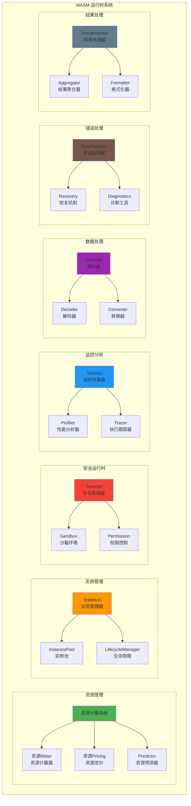
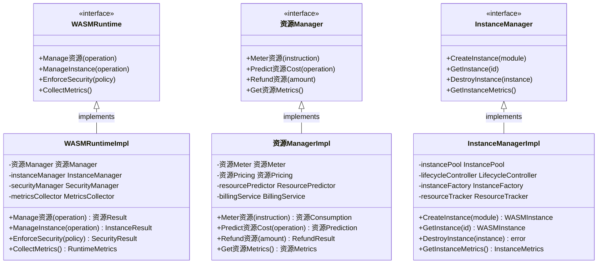

# WASM 运行时系统（internal/core/engines/wasm/runtime）

【模块目的】
　　本目录实现 WASM 运行时的各种支持组件，包括资源计量、实例管理、安全控制、性能监控、错误处理等核心运行时服务。通过完善的运行时系统，为 WASM 执行提供精确的资源控制、安全保护和性能优化支持。

【设计原则】
- 精确计量：准确的资源消耗计算和预测
- 安全防护：多层次的安全检查和防护机制
- 高效管理：优化的实例管理和资源调度
- 可观测性：详细的性能监控和分析
- 错误恢复：健壮的错误处理和故障恢复

【核心职责】
1. **资源计量管理**：精确的资源消耗计算、预测和控制
2. **实例生命周期**：WASM 实例的创建、管理和销毁
3. **安全运行时**：内存保护、权限控制和沙箱隔离
4. **性能监控**：执行性能的监控、分析和优化
5. **错误处理**：异常检测、错误恢复和故障诊断
6. **数据编解码**：执行数据的编码、解码和转换
7. **结果处理**：执行结果的收集、处理和转换

【实现架构】

　　采用**运行时支撑**的4层实现架构，确保WASM执行的精确计量、安全控制和高效管理。



**架构层次说明：**

1. **资源管理层**：实现精确的资源计量、定价和资源预测功能
   - 多粒度的资源消耗计量和预测算法
   - 动态的资源定价策略和成本优化
   - 智能的资源使用预测和规划机制

2. **实例管理层**：负责WASM实例的完整生命周期管理和池化复用
   - 高效的实例创建工厂和配置管理
   - 智能的实例池化和资源复用策略
   - 完整的生命周期控制和状态管理

3. **安全运行时层**：提供全面的安全保护、沙箱隔离和权限控制
   - 完整的沙箱环境和内存隔离机制
   - 细粒度的权限控制和访问管理
   - 实时的威胁检测和安全监控

4. **支撑服务层**：提供性能监控、数据处理和错误管理等基础服务
   - 全方位的性能指标收集和分析
   - 高效的数据编解码和格式转换
   - 完善的结果处理和错误恢复机制

---

## 📁 **模块组织结构**

【内部模块架构】

```
internal/core/engines/wasm/runtime/
├── ⛽ 资源.go                   # 资源计量系统 - 资源消耗跟踪核心
├── 📊 资源_meters.go            # 资源计量器 - 多类型计量实现
├── 💰 资源_pricing.go           # 资源定价策略 - 成本计算和优化
├── 📦 instance.go              # 实例管理器 - 创建、销毁、资源管理
├── 🛡️ security.go              # 安全管理器 - 内存保护和权限控制
├── 📈 metrics.go               # 性能监控 - 指标收集和分析
├── ⚠️ errors.go                # 错误处理 - 异常管理和诊断
├── 🔧 encoder.go               # 数据编解码 - 格式转换支持
├── 📤 result_handler.go        # 结果处理器 - 执行结果转换
├── 🔮 predictor.go             # 性能预测器 - 资源估算
└── 📖 README.md                # 本文档
```

### **🎯 子模块职责分工**

| **子模块** | **核心职责** | **对外接口** | **内部组件** | **复杂度** |
|-----------|-------------|-------------|-------------|-----------|
| `资源.go` & `资源_meters.go` & `资源_pricing.go` | 资源计量和定价管理 | 资源服务接口 | 计量器、定价器、预测器 | ⭐⭐⭐⭐ |
| `instance.go` | 实例生命周期管理 | 实例服务接口 | 工厂、池化、生命周期控制 | ⭐⭐⭐⭐⭐ |
| `security.go` | 安全运行时管理 | 安全服务接口 | 沙箱、权限控制、威胁监控 | ⭐⭐⭐⭐ |
| `metrics.go` & `predictor.go` | 性能监控和预测 | 监控服务接口 | 指标收集器、分析器、预测器 | ⭐⭐⭐ |
| `errors.go` | 错误处理和诊断 | 错误服务接口 | 错误分类器、诊断器、恢复器 | ⭐⭐⭐ |
| `encoder.go` & `result_handler.go` | 数据处理和结果转换 | 数据服务接口 | 编码器、解码器、处理器 | ⭐⭐ |

---

## 🔄 **统一运行时实现**

【实现策略】

　　所有运行时组件均严格遵循**计量→管理→保护→监控**运行时架构模式，确保WASM执行的精确控制和全面保护。

```mermaid
flowchart TD
    subgraph "统一运行时实现架构"
        subgraph "资源计量阶段"
            A[执行请求] --> B{资源检查}
            B -->|充足| C[资源分配流程]
            B -->|不足| D[资源不足处理]
            C --> E[计量器初始化]
        end
        
        subgraph "实例管理阶段"
            E --> F{实例池检查}
            F -->|有空闲| G[实例获取流程]
            F -->|无空闲| H[实例创建流程]
            G --> I[实例配置]
            H --> I
        end
        
        subgraph "安全保护阶段"
            I --> J[沙箱初始化]
            J --> K[权限检查]
            K --> L[安全策略应用]
            L --> M[威胁监控启动]
        end
        
        subgraph "执行监控阶段"
            M --> N[执行开始]
            N --> O[实时监控]
            O --> P{安全检查}
            P -->|通过| Q[继续执行]
            P -->|异常| R[安全异常处理]
            Q --> S{执行完成}
            S -->|未完成| O
            S -->|完成| T[结果收集]
        end
        
        subgraph "清理回收阶段"
            T --> U[资源结算]
            R --> V[异常记录]
            U --> W[实例归还]
            V --> X[资源清理]
            W --> Y[监控统计]
            X --> Y
        end
    end
```



**关键实现要点：**

1. **精确资源计量**：
   - 多维度的资源消耗跟踪和计算算法
   - 支持预付费和后付费的资源管理模式
   - 实现资源退款和动态定价调整机制

2. **智能实例管理**：
   - 基于负载的实例池动态调整策略
   - 支持实例预热和快速复用机制
   - 实现实例状态持久化和迁移能力

3. **全面安全保护**：
   - 多层次的沙箱隔离和内存保护
   - 细粒度的权限控制和访问审计
   - 实时的威胁检测和自动响应机制

【组件架构】



【文件说明】

## 资源 计量系统

### 资源.go
**功能**：资源 计量的核心实现
**职责**：
- 资源 消耗的精确计算
- 资源 限制的检查和控制
- 资源 退款机制的实现
- 资源 使用情况的统计

**资源 计量模型**：
```go
type 资源Meter struct {
    limit      uint64    // 资源 限制
    consumed   uint64    // 已消耗 资源
    refunded   uint64    // 已退款 资源
    operations []资源Operation // 操作记录
    pricing    资源Pricing     // 定价策略
}

type 资源Operation struct {
    Type        OperationType
    Cost        uint64
    Description string
    Timestamp   time.Time
}
```

### 资源_meters.go
**功能**：不同类型的 资源 计量器实现
**职责**：
- 指令级 资源 计量
- 内存操作 资源 计量
- 宿主调用 资源 计量
- 复合操作 资源 计量

**计量器类型**：
- **Basic资源Meter**：基础 资源 计量
- **Profiling资源Meter**：带性能分析的计量
- **Predictive资源Meter**：预测式 资源 计量
- **Composite资源Meter**：复合 资源 计量

### 资源_pricing.go
**功能**：资源 定价策略和成本计算
**职责**：
- 指令成本的定义和计算
- 动态定价策略的实现
- 成本优化和调整
- 定价模型的更新

**定价策略**：
```go
type 资源PricingStrategy struct {
    BaseInstructionCost  uint64
    MemoryAccessCost     uint64
    HostCallCost         uint64
    ComplexOperationCost map[string]uint64
    DynamicPricing       bool
    CostAdjustmentFactor float64
}
```

## 实例管理

### instance.go
**功能**：WASM 实例的生命周期管理
**职责**：
- 实例的创建和初始化
- 实例状态的跟踪和管理
- 实例资源的分配和回收
- 实例池的管理和优化

**实例结构**：
```go
type Instance struct {
    id          string
    module      *CompiledModule
    memory      *LinearMemory
    globals     []Global
    table       *Table
    exports     ExportMap
    imports     ImportMap
    资源ometer   资源Meter
    state       InstanceState
    metadata    InstanceMetadata
    startTime   time.Time
    lastAccess  time.Time
}
```

**实例池策略**：
- **固定大小池**：预分配固定数量实例
- **动态扩展池**：根据需求动态调整
- **LRU淘汰池**：最近最少使用淘汰
- **分层管理池**：按优先级分层管理

## 安全运行时

### security.go
**功能**：运行时安全管理和控制
**职责**：
- 内存访问的安全检查
- 权限控制和访问限制
- 沙箱环境的维护
- 安全违规的检测和处理

**安全机制**：
```go
type SecurityManager struct {
    memoryProtection MemoryProtection
    accessControl    AccessControl
    sandboxPolicy    SandboxPolicy
    threatDetector   ThreatDetector
    auditLogger      AuditLogger
}

type SecurityPolicy struct {
    AllowUnsafeOperations bool
    MemoryBoundsChecking  bool
    StackOverflowProtection bool
    ControlFlowIntegrity  bool
    DataExecutionPrevention bool
}
```

**安全检查类型**：
1. **内存安全**：边界检查、访问权限验证
2. **控制流安全**：返回地址保护、跳转验证
3. **数据安全**：数据完整性、类型安全
4. **API安全**：宿主调用权限、参数验证

## 性能监控

### metrics.go
**功能**：性能指标的收集和分析
**职责**：
- 执行性能的实时监控
- 性能指标的收集和统计
- 性能瓶颈的识别和分析
- 性能报告的生成

**监控指标**：
```go
type ExecutionMetrics struct {
    ExecutionTime     time.Duration
    InstructionCount  uint64
    MemoryUsage      MemoryUsageMetrics
    资源Consumption   资源Metrics
    HostCallStats    HostCallMetrics
    ErrorStats       ErrorMetrics
}

type MemoryUsageMetrics struct {
    InitialSize  uint32
    PeakSize     uint32
    FinalSize    uint32
    GrowthCount  int
    AccessCount  uint64
}
```

### predictor.go
**功能**：资源使用和性能预测
**职责**：
- 执行时间的预测
- 资源消耗的估算
- 性能瓶颈的预测
- 优化建议的生成

**预测模型**：
- **线性回归模型**：基于历史数据的线性预测
- **机器学习模型**：复杂模式的智能预测
- **统计模型**：基于统计分析的预测
- **混合模型**：多模型融合预测

## 数据处理

### encoder.go
**功能**：数据编码和序列化
**职责**：
- 执行参数的编码
- 执行结果的序列化
- 数据格式的转换
- 编码性能的优化

**编码格式**：
- **Binary编码**：高效的二进制格式
- **JSON编码**：可读的文本格式
- **MessagePack编码**：紧凑的二进制格式
- **Protocol Buffers**：结构化数据格式

## 错误处理

### errors.go
**功能**：错误处理和异常管理
**职责**：
- 错误类型的定义和分类
- 异常信息的收集和包装
- 错误恢复策略的实现
- 错误诊断工具的提供

**错误分类**：
```go
type RuntimeError struct {
    Type        ErrorType
    Code        ErrorCode
    Message     string
    Details     ErrorDetails
    StackTrace  []StackFrame
    Context     ErrorContext
    Timestamp   time.Time
    Recoverable bool
}

type ErrorType int

const (
    MemoryError      ErrorType = iota
    SecurityError
    ResourceError
    ValidationError
    ExecutionError
    InternalError
)
```

## 结果处理

### result_handler.go
**功能**：执行结果的处理和转换
**职责**：
- 执行结果的收集和整理
- 副作用的提取和处理
- 结果格式的标准化
- 结果验证和完整性检查

**结果结构**：
```go
type ExecutionResult struct {
    Success      bool
    ReturnValue  []byte
    资源Consumed  uint64
    MemoryUsage  uint32
    ExecutionTime time.Duration
    SideEffects  []SideEffect
    Logs         []LogEntry
    Metrics      ExecutionMetrics
    Error        *RuntimeError
}
```

【配置参数】

```go
type RuntimeConfig struct {
    // 资源 配置
    资源Config 资源Config
    
    // 实例配置
    InstanceConfig InstanceConfig
    
    // 安全配置
    SecurityConfig SecurityConfig
    
    // 监控配置
    MonitoringConfig MonitoringConfig
    
    // 性能配置
    PerformanceConfig PerformanceConfig
}

type 资源Config struct {
    Default资源Limit      uint64
    Max资源Limit          uint64
    资源PricingStrategy   string
    Enable资源Refund      bool
    资源Optimization      bool
}

type InstanceConfig struct {
    PoolSize            int
    MaxLifetime         time.Duration
    IdleTimeout         time.Duration
    PrewarmInstances    bool
    EnableInstanceReuse bool
}
```

【性能优化】

1. **资源 计量优化**：
   - 批量 资源 扣除
   - 预计算常见操作成本
   - 缓存定价信息

2. **实例管理优化**：
   - 实例预热和复用
   - 智能池大小调整
   - 异步实例创建

3. **内存管理优化**：
   - 内存池化管理
   - 延迟内存分配
   - 内存使用监控

4. **监控优化**：
   - 异步指标收集
   - 采样监控策略
   - 批量数据处理

【使用示例】

```go
// 创建运行时组件
runtime := NewWASMRuntime(config)

// 创建 资源 计量器
资源Meter := runtime.New资源Meter(资源Limit)

// 创建实例
instance, err := runtime.CreateInstance(module, 资源Meter)
if err != nil {
    return fmt.Errorf("failed to create instance: %w", err)
}

// 执行函数
result, err := instance.Execute("main", args)
if err != nil {
    return fmt.Errorf("execution failed: %w", err)
}

// 处理结果
processResult(result)

// 清理资源
runtime.DestroyInstance(instance)
```

【监控和诊断】

```go
// 性能监控
metrics := runtime.GetMetrics()
log.Infof("Execution time: %v", metrics.ExecutionTime)
log.Infof("资源 consumed: %d", metrics.资源Consumed)
log.Infof("Memory peak: %d bytes", metrics.MemoryPeak)

// 错误诊断
if err != nil {
    diag := runtime.DiagnoseError(err)
    log.Errorf("Error type: %s", diag.Type)
    log.Errorf("Error cause: %s", diag.Cause)
    log.Errorf("Recovery suggestion: %s", diag.Suggestion)
}
```

【扩展指南】

1. **自定义 资源 定价**：
```go
// 实现自定义定价策略
type CustomPricingStrategy struct{}

func (s *CustomPricingStrategy) GetInstructionCost(instruction Instruction) uint64 {
    // 自定义定价逻辑
    return cost
}
```

2. **自定义安全策略**：
```go
// 实现自定义安全检查
type CustomSecurityChecker struct{}

func (c *CustomSecurityChecker) CheckSecurity(operation Operation) error {
    // 自定义安全检查
    return nil
}
```

---

## 🏗️ **依赖注入架构**

【fx框架集成】

　　WASM运行时系统通过fx依赖注入框架实现组件装配和生命周期管理，确保运行时组件的模块化和高效协作。

**依赖注入设计**：
- **运行时装配**：自动装配资源管理器、实例管理器、安全管理器和监控服务
- **资源协调**：通过依赖注入提供统一的资源计量、分配和监控服务
- **安全集成**：基于配置驱动的安全策略和威胁防护机制
- **生命周期管理**：自动管理运行时组件的初始化、运行和清理过程

**核心组件依赖关系**：
- 资源Manager依赖资源Meter、资源Pricing、ResourcePredictor、BillingService
- InstanceManager依赖InstancePool、LifecycleController、InstanceFactory、ResourceTracker
- SecurityManager依赖SandboxEnvironment、PermissionController、ThreatMonitor、PolicyEngine
- 所有组件共享MetricsCollector、DataEncoder、ResultHandler、ErrorHandler等支撑服务

---

## 📊 **性能与监控**

【性能指标】

| **操作类型** | **目标延迟** | **吞吐量目标** | **资源利用率** | **监控方式** |
|-------------|-------------|---------------|--------------|------------|
| 资源计量 | < 1μs | > 1M OPS | < 20% CPU | 实时监控 |
| 实例创建 | < 5ms | > 1000 IPS | < 50% Memory | 批量统计 |
| 安全检查 | < 10μs | > 500K CPS | < 30% CPU | 关键路径监控 |
| 数据编码 | < 5μs | > 2M EPS | < 40% CPU | 异步监控 |
| 威胁检测 | < 50μs | > 100K TPS | < 60% CPU | 实时监控 |

**性能优化策略：**
- **资源优化**：批量资源扣除、预计算成本、智能定价、缓存策略
- **实例优化**：实例池化、预热机制、状态复用、资源共享
- **安全优化**：策略缓存、权限预检、威胁预测、并行验证
- **监控优化**：异步收集、批量处理、智能采样、压缩存储

---

## 🔗 **与公共接口的映射关系**

【接口实现映射】



**实现要点：**
- **接口契约**：严格遵循运行时接口定义和资源管理规范
- **错误处理**：分层的错误处理和运行时异常恢复机制
- **日志记录**：详细的运行时操作日志和性能指标记录
- **测试覆盖**：全面的运行时测试、资源测试和安全基准测试

---

## 🚀 **后续扩展规划**

【模块演进方向】

1. **计量能力扩展**
   - 支持更精细的资源计量粒度和算法
   - 增强动态定价和市场化定价机制
   - 扩展多维度资源计量和成本分析
   - 添加预测性资源规划和优化建议

2. **实例管理增强**
   - 引入更智能的实例调度和负载均衡
   - 优化实例迁移和状态持久化能力
   - 实现跨节点的实例协调和同步
   - 加强实例健康检查和自动恢复

3. **安全防护升级**
   - 完善威胁检测和攻击模式识别
   - 增强零信任安全模型和自适应防护
   - 提供更细粒度的权限控制和审计
   - 支持安全策略的动态更新和分发

4. **监控分析优化**
   - 与更多监控系统和APM工具集成
   - 支持自定义指标和告警规则配置
   - 增强性能瓶颈分析和优化建议
   - 提供更丰富的可视化和报表功能

---

## 📋 **开发指南**

【运行时开发规范】

1. **新组件接入步骤**：
   - 定义运行时组件接口和服务契约
   - 实现核心运行时逻辑和资源管理机制
   - 添加性能监控和安全防护功能
   - 完成组件测试和运行时压力测试

2. **代码质量要求**：
   - 遵循Go语言最佳实践和项目编码规范
   - 实现完整的错误处理和资源管理机制
   - 提供详细的代码注释和技术文档
   - 保证100%的核心功能测试覆盖率

3. **性能要求**：
   - 关键路径延迟指标必须达到设计目标
   - 内存使用效率和并发安全的数据访问
   - 实现合理的资源清理和生命周期管理
   - 支持性能监控和可观测性要求

【参考文档】
- [WASM执行引擎](../README.md)
- [WASM编译器组件](../compiler/README.md)
- [WASM虚拟机引擎](../engine/README.md)
- [执行接口规范](../../../../pkg/interfaces/execution/)
- [WES架构设计文档](../../../../../docs/architecture/)

【故障排查】

常见问题及解决方案：

1. **资源 计量不准确**：
   - 校验定价策略
   - 检查计量逻辑
   - 对比基准测试

2. **实例创建失败**：
   - 检查资源限制
   - 验证模块格式
   - 查看错误日志

3. **性能问题**：
   - 分析性能指标
   - 优化热点代码
   - 调整配置参数

4. **内存泄漏**：
   - 监控内存使用
   - 检查实例销毁
   - 分析内存分配

---

> 📝 **模板说明**：本README模板基于WES v0.0.1统一文档规范设计，使用时请根据具体模块需求替换相应的占位符内容，并确保所有章节都有实质性的技术内容。

> 🔄 **维护指南**：本文档应随着模块功能的演进及时更新，确保文档与代码实现的一致性。建议在每次重大功能变更后更新相应章节。

---

【依赖关系】

本模块依赖以下组件：
- WASM 核心库：底层 WASM 支持
- 内存管理：内存分配和保护
- 性能监控：指标收集和分析
- 安全组件：安全检查和防护
- 序列化库：数据编码和解码
