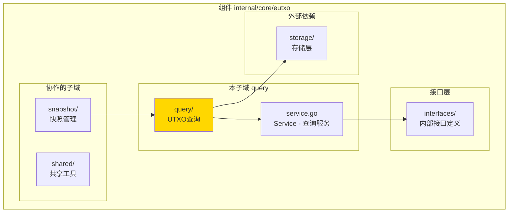
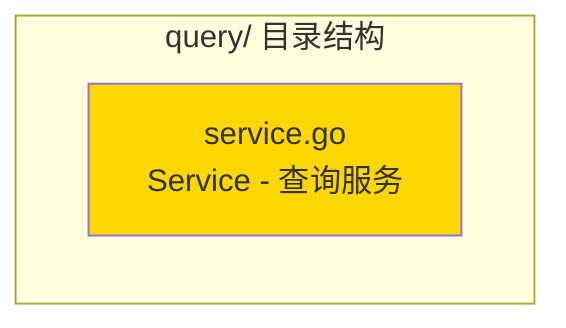

# query - UTXO查询子域

---

## 📌 版本信息

- **版本**：1.0
- **状态**：stable
- **最后更新**：2025-11-XX
- **最后审核**：2025-11-XX
- **所有者**：EUTXO 开发组
- **适用范围**：UTXO查询服务实现（内部使用）

---

## 🎯 子域定位

**路径**：`internal/core/eutxo/query/`

**所属组件**：`eutxo`

**核心职责**：提供UTXO查询服务，供EUTXO模块内部使用（特别是UTXOSnapshot）

**在组件中的角色**：
- UTXO查询的简化实现
- 仅供EUTXO模块内部使用
- 后续会迁移到统一的查询服务

---

## 🏗️ 架构设计

### 在组件中的位置

> **说明**：展示此子域在 EUTXO 组件内部的位置和协作关系



**位置说明**：

| 关系类型 | 目标 | 关系说明 |
|---------|------|---------|
| **依赖** | interfaces/ | 实现 InternalUTXOQuery 接口 |
| **依赖** | storage/ | 直接从 BadgerStore 查询 |
| **被依赖** | snapshot/ | 快照服务查询UTXO时使用 |

---

### 内部组织

> **说明**：展示此子域内部的文件组织和类型关系



---

## 📁 目录结构

```
internal/core/eutxo/query/
├── README.md                    # 本文档
└── service.go                   # Service - 查询服务实现
```

---

## 🔧 核心实现

### 实现文件：`service.go`

**核心类型**：`Service`

**职责**：实现 InternalUTXOQuery 接口，提供UTXO查询服务

**关键字段**：

```go
type Service struct {
    storage storage.BadgerStore  // 存储服务
    logger  log.Logger           // 日志记录器
}
```

**关键方法**：

| 方法名 | 职责 | 可见性 | 备注 |
|-------|------|-------|-----|
| `NewService()` | 构造函数 | Public | 用于依赖注入 |
| `GetUTXO()` | 获取单个UTXO | Public | 实现接口方法 |
| `ListUTXOs()` | 列表所有UTXO | Public | 实现接口方法 |
| `GetUTXOByOutPoint()` | 按OutPoint查询 | Public | 实现接口方法 |

---

## ⚠️ 重要说明

### 临时实现

**当前状态**：
- 此实现仅供 EUTXO 模块内部使用
- 后续 Query 模块实施时，会迁移到 `pkg/interfaces/persistence/QueryService`
- 避免依赖冲突，提供简化实现

**迁移计划**：
- 待 `persistence.QueryService` 完整实现后
- 将 UTXO 查询功能迁移到统一查询服务
- 此实现将被废弃

---

## 🔗 协作关系

### 依赖的接口

| 接口 | 来源 | 用途 |
|-----|------|-----|
| `InternalUTXOQuery` | `internal/core/eutxo/interfaces/` | 实现UTXO查询接口 |
| `storage.BadgerStore` | `pkg/interfaces/infrastructure/storage/` | 直接查询存储 |

---

### 被依赖关系

**被以下子域使用**：
- `snapshot/` - 快照服务查询UTXO时使用

**示例**：

```go
// 在 eutxo/snapshot 中使用
import "github.com/weisyn/v1/internal/core/eutxo/query"

func CreateSnapshot(utxoQuery interfaces.InternalUTXOQuery) error {
    // 查询所有UTXO
    utxos, err := utxoQuery.ListUTXOs(ctx)
    if err != nil {
        return err
    }
    
    // 创建快照
    // ...
}
```

---

## 🧪 测试

### 测试覆盖

| 测试类型 | 文件 | 覆盖率目标 | 当前状态 |
|---------|------|-----------|---------|
| 单元测试 | `query_test.go` | ≥ 80% | ⏳ 待实施 |
| 集成测试 | `../integration/` | 核心场景 | ⏳ 待实施 |

---

### 测试示例

```go
func TestService_GetUTXO(t *testing.T) {
    // Arrange
    mockStorage := newMockStorage()
    service := query.NewService(mockStorage, logger)
    
    outpoint := &transaction.OutPoint{...}
    
    // Act
    utxo, err := service.GetUTXO(ctx, outpoint)
    
    // Assert
    assert.NoError(t, err)
    assert.NotNil(t, utxo)
}
```

---

## 📊 关键设计决策

### 决策 1：内部使用实现

**问题**：为什么创建独立的查询实现而不是使用统一查询服务？

**方案**：创建简化的内部实现，仅供EUTXO模块使用

**理由**：
- 避免依赖冲突（统一查询服务还未完成）
- 满足UTXOSnapshot的查询需求
- 提供简单直接的实现

**权衡**：
- ✅ 优点：快速实现，避免依赖问题
- ⚠️ 缺点：代码重复，未来需要迁移

---

## 📚 相关文档

- [组件总览](../README.md)
- [内部接口](../interfaces/README.md)
- [公共接口](../../../../pkg/interfaces/eutxo/README.md)
- [统一查询服务](../../../persistence/README.md)

---

## 📝 变更历史

| 版本 | 日期 | 变更内容 | 作者 |
|-----|------|---------|------|
| 1.0 | 2025-11-XX | 初始版本 | EUTXO 开发组 |

---

## 🚧 待办事项

- [ ] 完善单元测试覆盖
- [ ] 迁移到统一查询服务
- [ ] 支持更复杂的查询条件
- [ ] 优化查询性能

