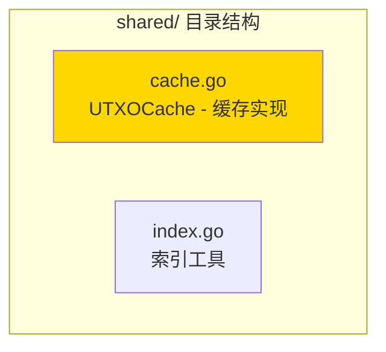

# shared - 共享工具子域

---

## 📌 版本信息

- **版本**：1.0
- **状态**：stable
- **最后更新**：2025-11-XX
- **最后审核**：2025-11-XX
- **所有者**：EUTXO 开发组
- **适用范围**：EUTXO模块共享工具实现

---

## 🎯 子域定位

**路径**：`internal/core/eutxo/shared/`

**所属组件**：`eutxo`

**核心职责**：提供EUTXO模块内部共享的工具和辅助功能

**在组件中的角色**：
- 共享工具的实现
- 缓存管理
- 索引管理
- 模块内部复用

---

## 🏗️ 架构设计

### 在组件中的位置

> **说明**：展示此子域在 EUTXO 组件内部的位置和协作关系

```mermaid
graph TB
    subgraph "组件 internal/core/eutxo"
        subgraph "本子域 shared"
            THIS["shared/<br/>共享工具"]
            
            CACHE["cache.go<br/>缓存管理"]
            INDEX["index.go<br/>索引管理"]
            
            THIS --> CACHE
            THIS --> INDEX
        end
        
        subgraph "协作的子域"
            WRITER["writer/<br/>UTXO写入"]
            SNAPSHOT["snapshot/<br/>快照管理"]
        end
    
    WRITER --> THIS
    SNAPSHOT --> THIS
    
    style THIS fill:#FFD700
```

**位置说明**：

| 关系类型 | 目标 | 关系说明 |
|---------|------|---------|
| **被依赖** | writer/ | 使用缓存和索引工具 |
| **被依赖** | snapshot/ | 使用缓存工具 |

---

### 内部组织

> **说明**：展示此子域内部的文件组织和类型关系



---

## 📁 目录结构

```
internal/core/eutxo/shared/
├── README.md                    # 本文档
├── cache.go                     # UTXOCache - 缓存实现
└── index.go                     # 索引工具函数
```

---

## 🔧 核心实现

### 实现文件：`cache.go`

**核心类型**：`UTXOCache`

**职责**：提供UTXO的LRU缓存实现

**关键字段**：

```go
type UTXOCache struct {
    cache    *lru.Cache           // LRU缓存
    mu       sync.RWMutex         // 读写锁
    maxSize  int                  // 最大缓存大小
}
```

**关键方法**：

| 方法名 | 职责 | 可见性 | 备注 |
|-------|------|-------|-----|
| `NewUTXOCache()` | 创建缓存 | Public | 构造函数 |
| `Get()` | 获取UTXO | Public | 从缓存读取 |
| `Put()` | 存储UTXO | Public | 写入缓存 |
| `Delete()` | 删除UTXO | Public | 从缓存删除 |
| `Clear()` | 清空缓存 | Public | 清空所有缓存 |

---

### 辅助文件

**index.go** - 索引工具：
- `BuildUTXOKey()` - 构建UTXO存储键
- `ParseUTXOKey()` - 解析UTXO存储键
- 索引相关的工具函数

---

## 🔗 协作关系

### 被依赖关系

**被以下子域使用**：
- `writer/` - 使用 UTXOCache 缓存UTXO，提升性能
- `snapshot/` - 使用缓存工具优化快照操作

**示例**：

```go
// 在 writer/service.go 中使用
import "github.com/weisyn/v1/internal/core/eutxo/shared"

type Service struct {
    cache *shared.UTXOCache
    // ...
}

func (s *Service) CreateUTXO(ctx context.Context, utxo *utxo.UTXO) error {
    // 写入存储
    err := s.storage.Set(key, data)
    if err != nil {
        return err
    }
    
    // 更新缓存
    s.cache.Put(key, utxo)
    
    return nil
}
```

---

## 🧪 测试

### 测试覆盖

| 测试类型 | 文件 | 覆盖率目标 | 当前状态 |
|---------|------|-----------|---------|
| 单元测试 | `shared_test.go` | ≥ 80% | ⏳ 待实施 |
| 集成测试 | `../integration/` | 核心场景 | ⏳ 待实施 |

---

### 测试示例

```go
func TestUTXOCache_GetPut(t *testing.T) {
    // Arrange
    cache := shared.NewUTXOCache(100)
    utxo := createTestUTXO()
    key := []byte("test-key")
    
    // Act
    cache.Put(key, utxo)
    retrieved, ok := cache.Get(key)
    
    // Assert
    assert.True(t, ok)
    assert.Equal(t, utxo, retrieved)
}
```

---

## 📊 关键设计决策

### 决策 1：LRU缓存策略

**问题**：如何管理UTXO缓存？

**方案**：使用LRU（最近最少使用）缓存策略

**理由**：
- 自动淘汰不常用的UTXO
- 保证缓存效率
- 支持并发访问

**权衡**：
- ✅ 优点：自动管理，效率高
- ⚠️ 缺点：需要额外的内存开销

---

### 决策 2：共享包设计

**问题**：为什么将工具放在shared包中？

**方案**：创建shared包，放置模块内共享的工具

**理由**：
- 避免代码重复
- 统一管理共享工具
- 易于维护和扩展

**权衡**：
- ✅ 优点：代码复用，易于维护
- ⚠️ 缺点：需要确保工具确实被共享使用

---

## 📚 相关文档

- [组件总览](../README.md)
- [UTXO写入](../writer/README.md)
- [UTXO快照](../snapshot/README.md)
- [接口与实现的组织架构](../../../../docs/system/standards/principles/code-organization.md)

---

## 📝 变更历史

| 版本 | 日期 | 变更内容 | 作者 |
|-----|------|---------|------|
| 1.0 | 2025-11-XX | 初始版本 | EUTXO 开发组 |

---

## 🚧 待办事项

- [ ] 完善单元测试覆盖
- [ ] 优化缓存性能
- [ ] 支持缓存大小动态调整
- [ ] 添加缓存指标收集

