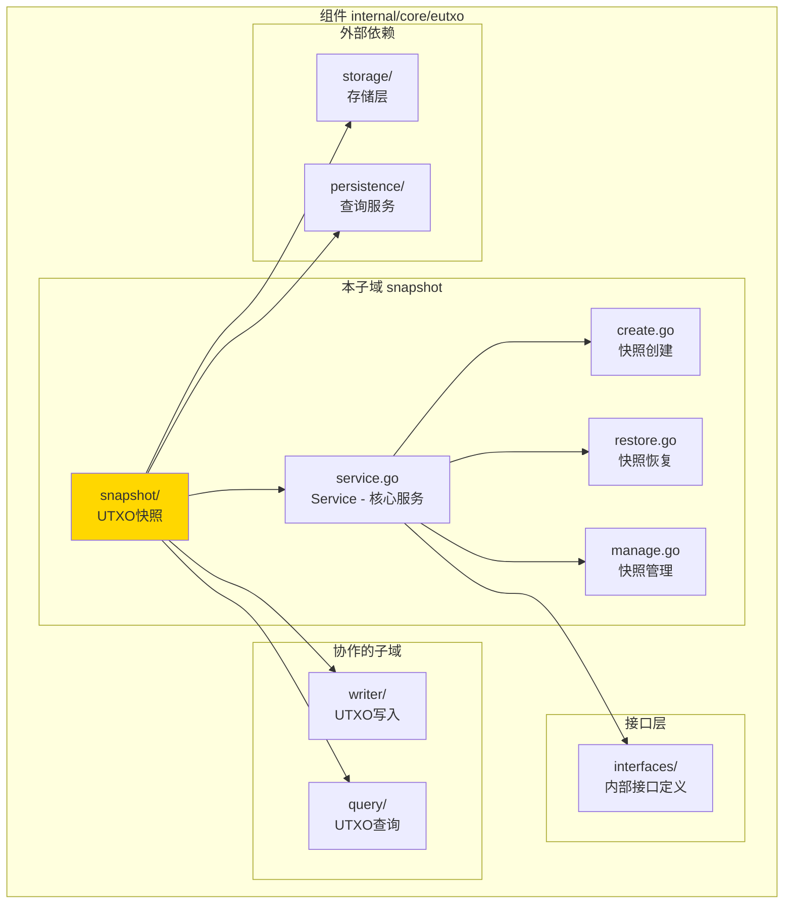
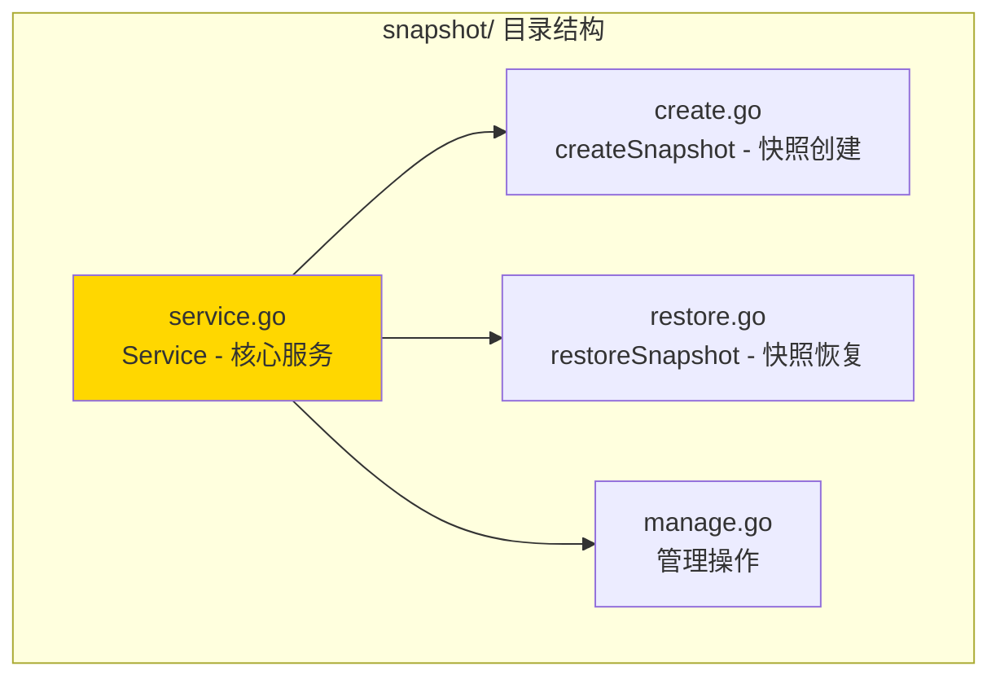

# snapshot - UTXO快照子域

---

## 📌 版本信息

- **版本**：1.0
- **状态**：stable
- **最后更新**：2025-11-XX
- **最后审核**：2025-11-XX
- **所有者**：EUTXO 开发组
- **适用范围**：UTXO快照服务实现

---

## 🎯 子域定位

**路径**：`internal/core/eutxo/snapshot/`

**所属组件**：`eutxo`

**核心职责**：管理UTXO快照的创建、恢复、删除，支持分叉处理和状态回滚

**在组件中的角色**：
- UTXO快照的核心逻辑实现
- 支持分叉处理的状态恢复
- 快照生命周期管理

---

## 🏗️ 架构设计

### 在组件中的位置

> **说明**：展示此子域在 EUTXO 组件内部的位置和协作关系



**位置说明**：

| 关系类型 | 目标 | 关系说明 |
|---------|------|---------|
| **依赖** | interfaces/ | 实现 InternalUTXOSnapshot 接口 |
| **依赖** | writer/ | 通过 UTXOWriter 恢复UTXO（延迟注入） |
| **依赖** | query/ | 通过 UTXOQuery 查询UTXO（延迟注入） |
| **依赖** | storage/ | 存储快照数据 |
| **依赖** | persistence/ | 查询链状态 |

---

### 内部组织

> **说明**：展示此子域内部的文件组织和类型关系



---

## 📁 目录结构

```
internal/core/eutxo/snapshot/
├── README.md                    # 本文档
├── service.go                   # Service - 核心服务实现
├── create.go                    # createSnapshot - 快照创建逻辑
├── restore.go                   # restoreSnapshot - 快照恢复逻辑
└── manage.go                    # 快照管理（删除、列表）
```

---

## 🔧 核心实现

### 实现文件：`service.go`

**核心类型**：`Service`

**职责**：实现 UTXOSnapshot 接口，提供快照服务

**关键字段**：

```go
type Service struct {
    // 依赖注入
    storage         storage.BadgerStore        // 存储服务（必需）
    hasher          crypto.HashManager          // 哈希管理器（必需）
    queryService    persistence.QueryService    // 查询服务（必需）
    logger          log.Logger                  // 日志记录器
    
    // 延迟注入
    utxoWriter      eutxo.UTXOWriter            // UTXO写入服务（延迟注入）
    utxoQuery       interfaces.InternalUTXOQuery // UTXO查询服务（延迟注入）
    
    // 指标收集
    metrics         *interfaces.SnapshotMetrics // 快照指标
    metricsMu       sync.Mutex                  // 指标锁
    
    // 并发控制
    mu              sync.Mutex                  // 快照操作锁
}
```

**关键方法**：

| 方法名 | 职责 | 可见性 | 备注 |
|-------|------|-------|-----|
| `NewService()` | 构造函数 | Public | 用于依赖注入 |
| `CreateSnapshot()` | 创建快照 | Public | 实现接口方法 |
| `RestoreSnapshot()` | 恢复快照 | Public | 实现接口方法 |
| `DeleteSnapshot()` | 删除快照 | Public | 实现接口方法 |
| `ListSnapshots()` | 列表快照 | Public | 实现接口方法 |
| `GetSnapshotMetrics()` | 获取快照指标 | Public | 实现接口方法 |
| `SetUTXOWriter()` | 设置UTXO写入服务 | Public | 延迟注入 |
| `SetUTXOQuery()` | 设置UTXO查询服务 | Public | 延迟注入 |

---

### 辅助文件

**create.go** - 快照创建逻辑：
- `createSnapshot()` - 完整的快照创建流程
- 查询所有UTXO
- 序列化UTXO集合
- 压缩数据
- 存储快照

**restore.go** - 快照恢复逻辑：
- `restoreSnapshot()` - 完整的快照恢复流程
- 加载快照数据
- 解压数据
- 验证快照完整性
- 恢复UTXO到存储

**manage.go** - 快照管理：
- `deleteSnapshot()` - 删除快照
- `listSnapshots()` - 列出所有快照
- `getSnapshot()` - 获取快照信息

---

## 🔗 协作关系

### 依赖的接口

| 接口 | 来源 | 用途 |
|-----|------|-----|
| `InternalUTXOSnapshot` | `internal/core/eutxo/interfaces/` | 实现快照接口 |
| `storage.BadgerStore` | `pkg/interfaces/infrastructure/storage/` | 存储快照数据 |
| `persistence.QueryService` | `pkg/interfaces/persistence/` | 查询链状态 |
| `eutxo.UTXOWriter` | `pkg/interfaces/eutxo.UTXOWriter` | 恢复UTXO（延迟注入） |
| `interfaces.InternalUTXOQuery` | `internal/core/eutxo/interfaces/` | 查询UTXO（延迟注入） |

---

### 被依赖关系

**被以下模块使用**：
- `chain/fork/` - 分叉处理时使用快照恢复状态

**示例**：

```go
// 在 chain/fork 中使用
import "github.com/weisyn/v1/pkg/interfaces/eutxo"

func HandleFork(utxoSnapshot eutxo.UTXOSnapshot, forkHeight uint64) error {
    // 检索分叉点的快照
    snapshot, err := utxoSnapshot.GetSnapshot(ctx, forkHeight)
    if err != nil {
        return err
    }
    
    // 恢复快照
    err = utxoSnapshot.RestoreSnapshot(ctx, snapshot)
    if err != nil {
        return err
    }
    
    return nil
}
```

---

## 🧪 测试

### 测试覆盖

| 测试类型 | 文件 | 覆盖率目标 | 当前状态 |
|---------|------|-----------|---------|
| 单元测试 | `snapshot_test.go` | ≥ 80% | ⏳ 待实施 |
| 集成测试 | `../integration/` | 核心场景 | ⏳ 待实施 |

---

### 测试示例

```go
func TestService_CreateSnapshot(t *testing.T) {
    // Arrange
    mockStorage := newMockStorage()
    mockHasher := newMockHasher()
    mockQueryService := newMockQueryService()
    service := snapshot.NewService(mockStorage, mockHasher, mockQueryService, logger)
    
    height := uint64(100)
    
    // Act
    snapshot, err := service.CreateSnapshot(ctx, height)
    
    // Assert
    assert.NoError(t, err)
    assert.NotNil(t, snapshot)
    assert.Equal(t, height, snapshot.Height)
}
```

---

## 📊 关键设计决策

### 决策 1：延迟依赖注入

**问题**：如何避免与 UTXOWriter 和 UTXOQuery 的循环依赖？

**方案**：使用延迟注入，通过 SetUTXOWriter() 和 SetUTXOQuery() 方法注入

**理由**：
- 避免循环依赖
- 保持依赖注入的灵活性
- 符合 fx 框架的延迟注入模式

**权衡**：
- ✅ 优点：解决循环依赖问题
- ⚠️ 缺点：需要在模块初始化时手动注入

---

### 决策 2：快照序列化和压缩

**问题**：如何存储大量UTXO数据？

**方案**：序列化UTXO集合，使用压缩算法压缩，然后存储

**理由**：
- 减少存储空间
- 提升传输效率
- 支持大数据量快照

**权衡**：
- ✅ 优点：节省存储，提升效率
- ⚠️ 缺点：压缩解压需要额外时间

---

### 决策 3：快照验证

**问题**：如何确保快照数据的完整性？

**方案**：快照包含哈希校验和，恢复时验证

**理由**：
- 确保数据完整性
- 防止数据损坏
- 支持安全恢复

**权衡**：
- ✅ 优点：保证数据安全
- ⚠️ 缺点：需要额外计算开销

---

## 📚 相关文档

- [组件总览](../README.md)
- [内部接口](../interfaces/README.md)
- [公共接口](../../../../pkg/interfaces/eutxo/README.md)
- [接口与实现的组织架构](../../../../docs/system/standards/principles/code-organization.md)

---

## 📝 变更历史

| 版本 | 日期 | 变更内容 | 作者 |
|-----|------|---------|------|
| 1.0 | 2025-11-XX | 初始版本 | EUTXO 开发组 |

---

## 🚧 待办事项

- [ ] 完善单元测试覆盖
- [ ] 优化快照性能
- [ ] 支持增量快照
- [ ] 添加快照校验机制

