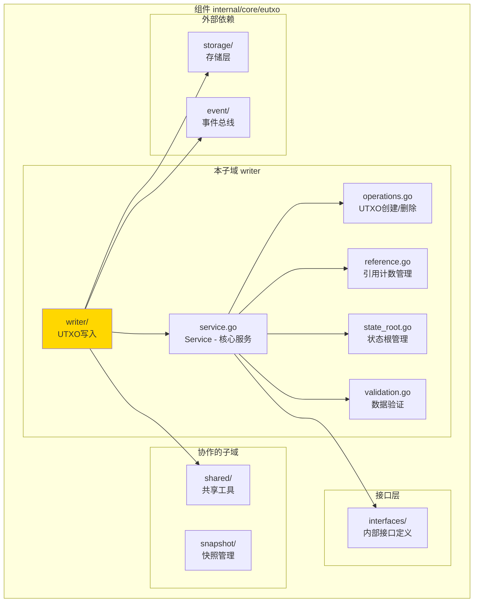
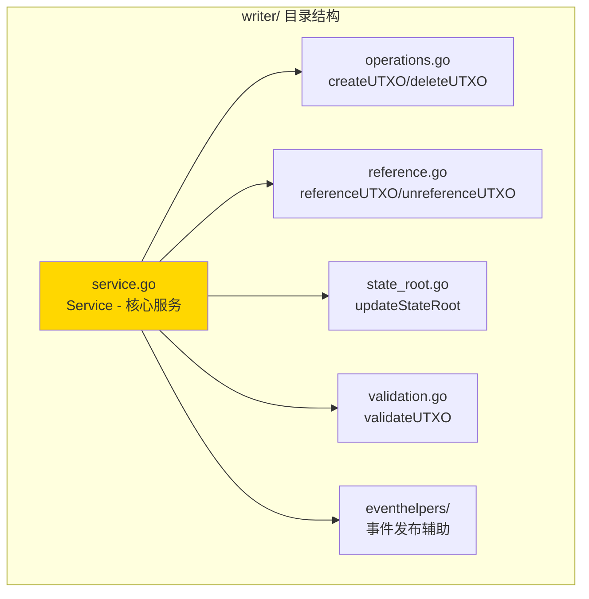

# writer - UTXO写入子域

---

## 📌 版本信息

- **版本**：1.0
- **状态**：stable
- **最后更新**：2025-11-XX
- **最后审核**：2025-11-XX
- **所有者**：EUTXO 开发组
- **适用范围**：UTXO写入服务实现

---

## 🎯 子域定位

**路径**：`internal/core/eutxo/writer/`

**所属组件**：`eutxo`

**核心职责**：实现UTXO的创建、删除、引用计数管理和状态根更新

**在组件中的角色**：
- UTXO写入的核心逻辑实现
- CQRS写路径的实现
- 直接操作存储层

---

## 🏗️ 架构设计

### 在组件中的位置

> **说明**：展示此子域在 EUTXO 组件内部的位置和协作关系



**位置说明**：

| 关系类型 | 目标 | 关系说明 |
|---------|------|---------|
| **依赖** | interfaces/ | 实现 InternalUTXOWriter 接口 |
| **依赖** | storage/ | 直接操作 BadgerStore |
| **依赖** | event/ | 发布 UTXO 变更事件 |
| **协作** | shared/ | 使用共享的缓存和索引工具 |

---

### 内部组织

> **说明**：展示此子域内部的文件组织和类型关系



---

## 📁 目录结构

```
internal/core/eutxo/writer/
├── README.md                    # 本文档
├── service.go                   # Service - 核心服务实现
├── operations.go                # createUTXO/deleteUTXO - UTXO操作
├── reference.go                 # referenceUTXO/unreferenceUTXO - 引用计数
├── state_root.go                # updateStateRoot - 状态根管理
├── validation.go                # validateUTXO - 数据验证
└── eventhelpers/                # 事件发布辅助
    └── publish_helpers.go
```

---

## 🔧 核心实现

### 实现文件：`service.go`

**核心类型**：`Service`

**职责**：实现 UTXOWriter 接口，提供UTXO写入服务

**关键字段**：

```go
type Service struct {
    // 依赖注入
    storage         storage.BadgerStore        // 存储服务（必需）
    hasher          crypto.HashManager          // 哈希管理器（必需）
    eventBus        event.EventBus              // 事件总线（可选）
    logger          log.Logger                  // 日志记录器
    
    // 缓存管理
    cache           *shared.UTXOCache          // UTXO缓存
    
    // 指标收集
    metrics         *interfaces.WriterMetrics   // 写入指标
    metricsMu       sync.Mutex                  // 指标锁
    
    // 并发控制
    mu              sync.RWMutex                // UTXO读写锁
}
```

**关键方法**：

| 方法名 | 职责 | 可见性 | 备注 |
|-------|------|-------|-----|
| `NewService()` | 构造函数 | Public | 用于依赖注入 |
| `CreateUTXO()` | 创建UTXO | Public | 实现接口方法 |
| `DeleteUTXO()` | 删除UTXO | Public | 实现接口方法 |
| `ReferenceUTXO()` | 增加引用计数 | Public | 实现接口方法 |
| `UnreferenceUTXO()` | 减少引用计数 | Public | 实现接口方法 |
| `UpdateStateRoot()` | 更新状态根 | Public | 实现接口方法 |
| `GetWriterMetrics()` | 获取写入指标 | Public | 实现接口方法 |

---

### 辅助文件

**operations.go** - UTXO操作逻辑：
- `createUTXO()` - 创建UTXO的内部实现
- `deleteUTXO()` - 删除UTXO的内部实现
- 存储操作和索引更新

**reference.go** - 引用计数管理：
- `referenceUTXO()` - 增加引用计数
- `unreferenceUTXO()` - 减少引用计数
- 引用计数为0时自动删除UTXO

**state_root.go** - 状态根管理：
- `updateStateRoot()` - 更新状态根
- 计算Merkle根
- 存储状态根

**validation.go** - 数据验证：
- `validateUTXO()` - 验证UTXO数据完整性
- 字段校验
- 格式验证

---

## 🔗 协作关系

### 依赖的接口

| 接口 | 来源 | 用途 |
|-----|------|-----|
| `InternalUTXOWriter` | `internal/core/eutxo/interfaces/` | 实现UTXO写入接口 |
| `storage.BadgerStore` | `pkg/interfaces/infrastructure/storage/` | 直接操作存储 |
| `crypto.HashManager` | `pkg/interfaces/infrastructure/crypto/` | 哈希计算 |
| `event.EventBus` | `pkg/interfaces/infrastructure/event/` | 发布事件（可选） |

---

### 被依赖关系

**被以下模块使用**：
- `tx/` - 交易处理时创建和删除UTXO
- `block/` - 区块处理时批量更新UTXO
- `snapshot/` - 快照恢复时创建UTXO

**示例**：

```go
// 在其他模块中使用
import "github.com/weisyn/v1/pkg/interfaces/eutxo"

func ProcessTransaction(utxoWriter eutxo.UTXOWriter, tx *transaction.Transaction) error {
    // 创建新UTXO
    for _, output := range tx.Outputs {
        utxo := createUTXOFromOutput(output)
        err := utxoWriter.CreateUTXO(ctx, utxo)
        if err != nil {
            return err
        }
    }
    
    // 删除已消费的UTXO
    for _, input := range tx.Inputs {
        err := utxoWriter.DeleteUTXO(ctx, input.OutPoint)
        if err != nil {
            return err
        }
    }
    
    return nil
}
```

---

## 🧪 测试

### 测试覆盖

| 测试类型 | 文件 | 覆盖率目标 | 当前状态 |
|---------|------|-----------|---------|
| 单元测试 | `writer_test.go` | ≥ 80% | ⏳ 待实施 |
| 集成测试 | `../integration/` | 核心场景 | ⏳ 待实施 |

---

### 测试示例

```go
func TestService_CreateUTXO(t *testing.T) {
    // Arrange
    mockStorage := newMockStorage()
    mockHasher := newMockHasher()
    service := writer.NewService(mockStorage, mockHasher, nil, logger)
    
    utxo := createTestUTXO()
    
    // Act
    err := service.CreateUTXO(ctx, utxo)
    
    // Assert
    assert.NoError(t, err)
}
```

---

## 📊 关键设计决策

### 决策 1：直接操作存储层

**问题**：为什么直接操作存储层而不是通过查询接口？

**方案**：UTXOWriter 直接操作 BadgerStore，不依赖查询接口

**理由**：
- CQRS架构要求：写操作和读操作分离
- 性能考虑：直接操作存储层，减少中间层
- 职责清晰：写操作只负责写入，不负责查询

**权衡**：
- ✅ 优点：性能好，职责清晰
- ⚠️ 缺点：需要直接操作存储细节

---

### 决策 2：缓存优化

**问题**：如何提升UTXO写入性能？

**方案**：使用 LRU 缓存缓存常用UTXO，减少存储访问

**理由**：
- 引用计数操作需要频繁访问UTXO
- 缓存可以显著提升性能
- LRU策略保证缓存效率

**权衡**：
- ✅ 优点：性能提升明显
- ⚠️ 缺点：需要管理缓存一致性

---

### 决策 3：引用计数自动删除

**问题**：如何管理资源UTXO的生命周期？

**方案**：引用计数为0时自动删除UTXO

**理由**：
- 支持资源UTXO的多重引用
- 自动管理生命周期，无需手动删除
- 符合EUTXO模型设计

**权衡**：
- ✅ 优点：自动化管理，减少错误
- ⚠️ 缺点：需要确保引用计数正确

---

## 📚 相关文档

- [组件总览](../README.md)
- [内部接口](../interfaces/README.md)
- [公共接口](../../../../pkg/interfaces/eutxo/README.md)
- [接口与实现的组织架构](../../../../docs/system/standards/principles/code-organization.md)

---

## 📝 变更历史

| 版本 | 日期 | 变更内容 | 作者 |
|-----|------|---------|------|
| 1.0 | 2025-11-XX | 初始版本 | EUTXO 开发组 |

---

## 🚧 待办事项

- [ ] 完善单元测试覆盖
- [ ] 优化缓存策略
- [ ] 添加批量写入支持
- [ ] 支持事务回滚

