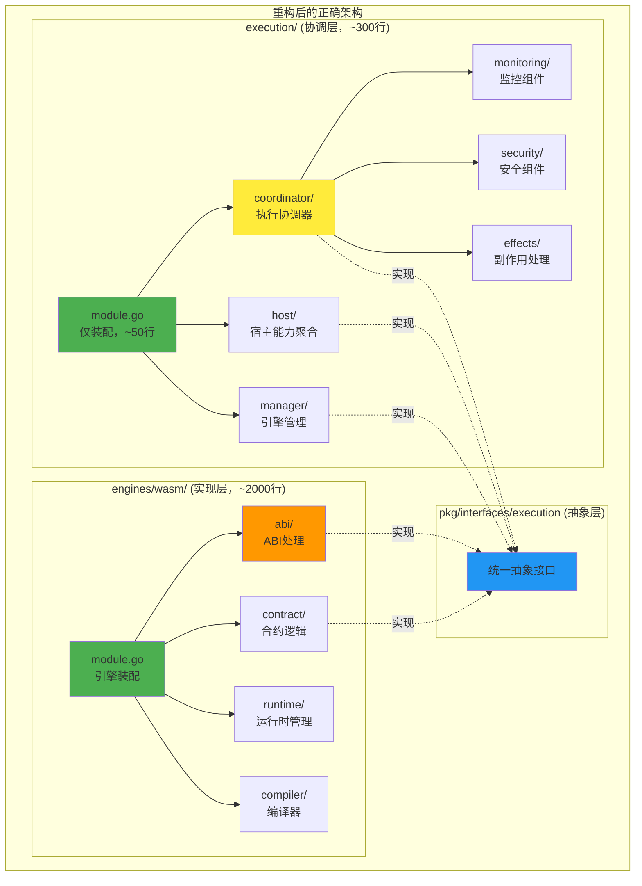

# Execution模块架构重构实施跟踪

## 🎯 重构目标

基于深度架构审查报告，完成 `internal/core/execution` 模块的架构重构，解决以下核心问题：

1. **边界设计违背高内聚低耦合原则** - 重新划分execution与engines的职责边界
2. **module.go违背统一设计要求** - 将751行的module.go重构为标准的装配文件
3. **目录结构不符合项目惯例** - 按功能重组目录结构，遵循项目统一规范

## 📋 实施计划

### 🔴 Phase 1: 职责边界重新划分 (高优先级)

#### 1.1 明确边界设计原则
- [ ] **任务**: 制定execution与engines的职责边界文档
  - 定义execution职责：引擎注册分发、宿主能力聚合、执行协调调度、结果归约输出
  - 定义engines职责：具体引擎实现、字节码编译、运行时管理、ABI编解码
  - 禁止事项：execution不做具体实现，engines不做协调管理
- [ ] **验收标准**: 边界文档清晰，职责不重叠不遗漏

#### 1.2 识别越界实现
- [ ] **任务**: 审计当前execution目录中的越界实现
  - 标记应该移动到engines/wasm的文件：`abi_manager.go`、`contract_*.go`
  - 标记应该重组的实现：`metrics_monitor.go`、`audit_tracker.go`等
  - 标记应该保留的协调逻辑：`resource_execution_coordinator.go`、`host/`、`manager/`
- [ ] **验收标准**: 生成完整的文件迁移清单

### 🟡 Phase 2: module.go 瘦身重构 (中优先级)

#### 2.1 分离实现代码
- [ ] **任务**: 将module.go中的实现代码移动到对应子目录
  - 创建 `execution/monitoring/` 目录
  - 移动 `ProductionMetricsCollector` → `monitoring/metrics_collector.go`
  - 移动 `ProductionAuditEmitter` → `monitoring/audit_emitter.go`
  - 移动 `ProductionSideEffectProcessor` → `effects/side_effect_processor.go`
- [ ] **验收标准**: module.go仅保留依赖注入装配代码，约50行

#### 2.2 重构依赖注入架构
- [ ] **任务**: 按照标准fx模式重构module.go
  - 使用清晰的 `ModuleInput`/`ModuleOutput` 结构
  - 所有Provider函数移到对应的constructor.go文件
  - 遵循其他模块的装配模式（参考consensus、mempool）
- [ ] **验收标准**: module.go结构与其他模块一致

### 🟢 Phase 3: 目录结构重组 (低优先级)

#### 3.1 创建标准目录结构
- [ ] **任务**: 按照项目惯例重组目录结构
  - 创建 `execution/coordinator/` - 执行协调器
  - 创建 `execution/monitoring/` - 监控组件  
  - 创建 `execution/security/` - 安全组件
  - 创建 `execution/effects/` - 副作用处理
  - 保留 `execution/host/` - 宿主能力
  - 保留 `execution/manager/` - 引擎管理
- [ ] **验收标准**: 目录结构清晰，功能分组合理

## 🚨 风险控制

### 编译安全保障
- 每个Phase完成后必须确保 `go build ./...` 成功
- 关键路径变更需要运行 `go test ./...` 验证
- 保持向后兼容，避免破坏现有功能

### 增量实施策略
- 采用小步快跑，每个任务独立验证
- 优先处理高风险的边界问题
- 保留回滚路径，必要时可恢复

## 📈 进度跟踪

- **Phase 1**: 🔴 未开始
- **Phase 2**: 🔴 未开始  
- **Phase 3**: 🔴 未开始

## 🎯 最终目标架构

重构完成后，execution模块将成为一个轻量级的协调层，真正实现高内聚低耦合的架构设计。
