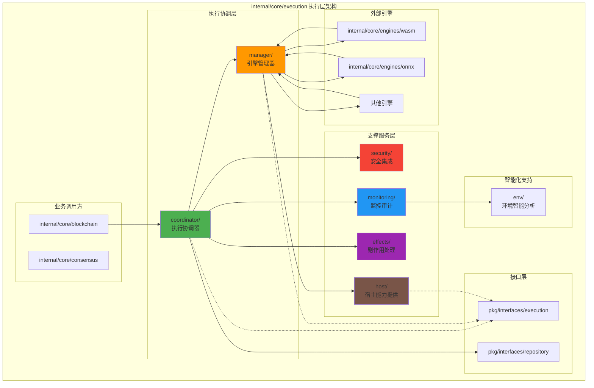
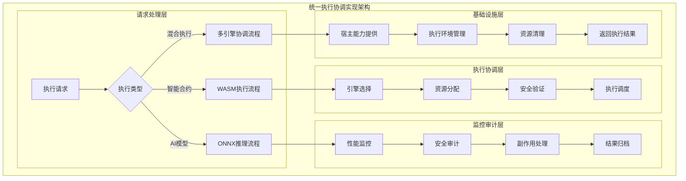
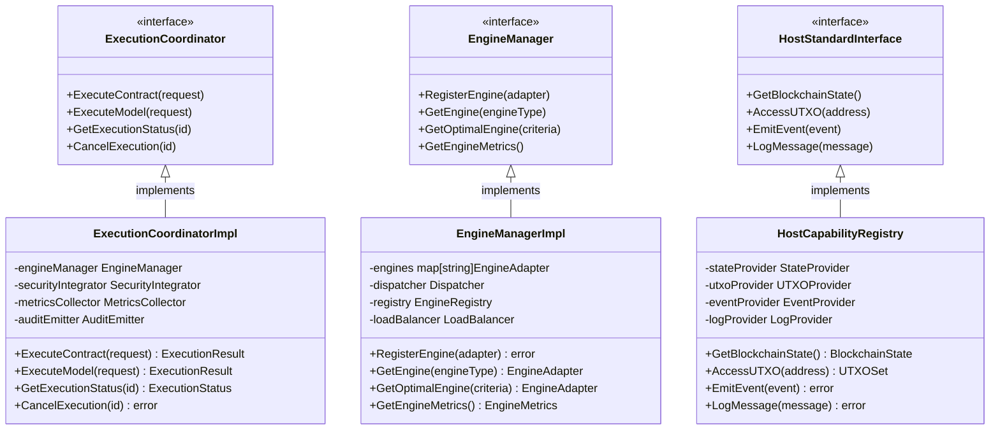

# 区块链计算执行层（internal/core/execution）

【模块定位】
　　本目录为区块链核心的"计算执行层"，与 `consensus/`、`repositories/` 等核心模块平级，负责统一协调多执行环境的合约/模型执行。通过标准化的执行流程和完善的监控审计机制，为区块链提供安全、可靠、高性能的计算执行能力。

【设计原则】
- 引擎无关性：通过抽象接口支持多种执行引擎（WASM、ONNX等）
- 安全第一：多层次安全验证，零信任架构，严格权限控制
- 高可观测性：全方位监控、审计、指标收集和分析
- 高可靠性：故障隔离、自动恢复、负载均衡和熔断保护
- 可扩展性：模块化设计，支持新引擎和新功能的平滑接入

【契约关系】
- 实现接口：`pkg/interfaces/execution`（EngineManager、HostStandardInterface 等）
- 依赖接口：`pkg/interfaces/repository`（数据访问）、`pkg/types`（通用类型）
- 提供服务：为 `internal/core/blockchain` 提供统一的执行协调服务
- 消费服务：从 `internal/core/engines/*` 注册和使用具体的执行引擎

【执行层架构设计】



【核心职责】
1. **统一执行协调**：为区块链提供统一的执行入口和协调服务
2. **多引擎管理**：注册、发现、选择和调度多种执行引擎
3. **宿主能力提供**：为执行引擎提供标准化的区块链交互接口
4. **安全验证集成**：多层次安全验证、威胁检测和权限控制
5. **监控审计服务**：全方位的执行监控、审计和指标收集
6. **副作用处理**：统一处理执行过程中产生的状态变更、事件等副作用
7. **智能化支持**：基于AI的性能分析、优化建议和预测服务

【边界与约束】
- ✅ **做什么**：
  - 提供统一的执行协调和管理服务
  - 实现安全的多引擎执行环境
  - 提供完整的监控、审计和分析能力
  - 管理执行过程中的副作用和状态变更
- ❌ **不做什么**：
  - 不直接实现具体的执行引擎（委托给 `internal/core/engines/*`）
  - 不直接进行数据持久化（委托给 `pkg/interfaces/repository`）
  - 不暴露对外API（内部服务，由上层模块调用）
  - 不处理网络通信和共识逻辑

【模块组织】

## 核心模块

### coordinator/ - 执行协调器
统一的执行流程协调，集成安全验证、配额管理、审计追踪等功能。

### manager/ - 引擎管理器  
多执行引擎的注册、发现、选择、调度和生命周期管理。

## 支撑模块

### monitoring/ - 监控审计系统
性能指标收集、审计事件记录、可靠性监控和告警服务。

### security/ - 安全集成系统
多层次安全验证、威胁检测、配额管理和权限控制。

### effects/ - 副作用处理系统
UTXO、状态、事件等副作用的处理、归档和回滚机制。

### host/ - 宿主能力提供系统
为执行引擎提供标准化的区块链交互接口和宿主函数。

## 智能化模块

### env/ - 执行环境支持系统
基于机器学习的环境分析、性能优化建议和智能预测。

### ~~migration/ - 数据迁移系统~~
**已移除**：execution模块应专注于合约/模型执行协调，数据迁移不属于执行层职责。

### abi/ - 合约ABI通用能力
提供 ABI 模型、编码/解码、验证、类型系统、兼容性与内存存储；作为库供执行层其他模块复用。

【关键特性】

## 高性能执行
- 多引擎并行执行支持
- 智能负载均衡和资源调度
- 性能监控和自动优化

## 企业级安全
- 零信任安全架构
- 多层次安全验证
- 实时威胁检测和防护

## 全方位可观测性
- 完整的执行监控和审计
- 丰富的性能指标和分析
- 智能化的运维支持

## 高可靠性
- 故障隔离和自动恢复
- 完整的回滚和恢复机制
- 多重数据保护措施

---

## 🔄 **统一执行协调实现**

【实现策略】

　　所有子模块均严格遵循**执行协调统一**架构模式，确保多执行环境的安全、可靠、高性能协同工作。



**关键实现要点：**

1. **执行协调统一**：
   - 统一的执行请求处理流程
   - 智能的引擎选择和负载均衡
   - 跨引擎的资源协调和管理

2. **安全验证集成**：
   - 多层次安全验证机制
   - 威胁检测和防护策略
   - 权限控制和访问管理

3. **监控审计完整**：
   - 全方位的执行监控
   - 完整的审计追踪记录
   - 副作用的统一处理

---

## 🏗️ **依赖注入架构**

【fx框架集成】

　　全面采用fx依赖注入框架，实现组件间的松耦合和生命周期自动管理。

```go
// 示例：执行层模块依赖注入配置
package execution

import (
    "go.uber.org/fx"
    "github.com/weisyn/v1/pkg/interfaces/execution"
)

// Module 执行层模块
var Module = fx.Module("execution",
    // 导入核心组件
    fx.Provide(
        // 执行协调层
        coordinator.NewExecutionCoordinator,
        coordinator.NewResourceCoordinator,
        
        // 引擎管理层
        manager.NewEngineManager,
        manager.NewEngineRegistry,
        manager.NewDispatcher,
        
        // 支撑服务层
        monitoring.NewMetricsCollector,
        monitoring.NewAuditEmitter,
        security.NewSecurityIntegrator,
        security.NewQuotaManager,
        effects.NewSideEffectProcessor,
        effects.NewSideEffectArchiver,
        
        // 宿主能力层
        host.NewHostCapabilityRegistry,
        host.NewProviderRegistry,
        
        // 智能化支持
        env.NewEnvironmentAdvisor,
    ),
    
    // 导出公共接口
    fx.Provide(
        fx.Annotate(
            func(coord *coordinator.ExecutionCoordinator) execution.ExecutionCoordinator {
                return coord
            },
            fx.As(new(execution.ExecutionCoordinator)),
        ),
        fx.Annotate(
            func(mgr *manager.EngineManager) execution.EngineManager {
                return mgr
            },
            fx.As(new(execution.EngineManager)),
        ),
        fx.Annotate(
            func(registry *host.HostCapabilityRegistry) execution.HostStandardInterface {
                return registry
            },
            fx.As(new(execution.HostStandardInterface)),
        ),
        // ... 其他接口导出
    ),
    
    // 生命周期管理
    fx.Invoke(RegisterEnginesAndProviders),
    fx.Invoke(InitializeExecutionServices),
)

// 引擎和提供者注册
func RegisterEnginesAndProviders(
    engineManager *manager.EngineManager,
    hostRegistry *host.HostCapabilityRegistry,
    engines []execution.EngineAdapter `group:"engines"`,
    providers []execution.HostProvider `group:"host_providers"`,
) error {
    // 注册执行引擎
    for _, engine := range engines {
        if err := engineManager.RegisterEngine(engine); err != nil {
            return err
        }
    }
    
    // 注册宿主能力提供者
    for _, provider := range providers {
        if err := hostRegistry.RegisterProvider(provider); err != nil {
            return err
        }
    }
    
    return nil
}

// 执行服务初始化
func InitializeExecutionServices(
    coordinator *coordinator.ExecutionCoordinator,
    securityIntegrator *security.SecurityIntegrator,
    config *ExecutionConfig,
) error {
    // 初始化安全策略
    if err := securityIntegrator.Initialize(config.Security); err != nil {
        return err
    }
    
    // 启动执行协调器
    if err := coordinator.Start(); err != nil {
        return err
    }
    
    return nil
}
```

**依赖管理特点：**
- **自动生命周期**：组件启动和停止由fx自动管理
- **接口导向**：通过接口而非具体类型进行依赖
- **层次清晰**：明确的依赖方向，避免循环依赖
- **测试友好**：支持依赖注入的单元测试

---

## 📊 **性能与监控**

【性能指标】

| **操作类型** | **目标延迟** | **吞吐量目标** | **成功率** | **监控方式** |
|-------------|-------------|---------------|-----------|------------|
| 执行协调 | < 5ms | > 2000 RPS | > 99% | 实时监控 |
| 引擎管理 | < 10ms | > 1000 OPS | > 98% | 批量统计 |
| 安全验证 | < 2ms | > 5000 VPS | > 99.9% | 关键路径监控 |
| 监控审计 | < 1ms | > 10000 EPS | > 99% | 异步监控 |
| 副作用处理 | < 20ms | > 500 SPS | > 97% | 实时监控 |

**性能优化策略：**
- **执行优化**：智能引擎选择、负载均衡、资源预分配
- **监控优化**：异步监控、批量处理、智能采样
- **安全优化**：缓存验证结果、并行验证、快速路径
- **资源优化**：连接池、对象池、内存复用

---

## 🔗 **与公共接口的映射关系**

【接口实现映射】



**实现要点：**
- **接口契约**：严格遵循公共接口的方法签名和语义
- **错误处理**：标准化的错误返回和异常处理机制
- **日志记录**：完善的操作日志和性能指标记录
- **测试覆盖**：每个接口方法都有对应的单元测试和集成测试

---

## 🚀 **后续扩展规划**

【模块演进方向】

1. **执行能力增强**
   - 支持更多执行引擎类型
   - 实现跨引擎协作机制
   - 添加动态引擎加载能力

2. **安全性提升**
   - 实现零知识证明验证
   - 添加硬件安全模块支持
   - 增强威胁检测和防护

3. **性能优化改进**
   - 实现GPU加速执行
   - 优化内存和资源管理
   - 添加智能预测和调度

4. **监控运维增强**
   - 实现AI驱动的性能分析
   - 添加自动故障恢复机制
   - 提供可视化监控面板

---

## 📋 **开发指南**

【子模块开发规范】

1. **新建子模块步骤**：
   - 在interfaces/中定义内部接口
   - 创建子模块目录和基础文件
   - 实现核心业务逻辑
   - 添加完整的单元测试
   - 更新fx依赖注入配置

2. **代码质量要求**：
   - 遵循Go语言最佳实践
   - 100%的接口方法测试覆盖
   - 完善的错误处理机制
   - 清晰的代码注释和文档

3. **性能要求**：
   - 关键路径延迟指标达标
   - 内存使用合理，避免泄漏
   - 并发安全的数据访问
   - 合理的资源清理机制

【参考文档】
- [执行协调器](coordinator/README.md)
- [引擎管理器](manager/README.md)
- [监控审计系统](monitoring/README.md)
- [安全集成系统](security/README.md)
- [副作用处理系统](effects/README.md)
- [宿主能力提供系统](host/README.md)
- [执行环境智能顾问](env/README.md)
- [ABI管理子模块](abi/README.md)
- [内部接口层](interfaces/README.md)
- [WES架构设计文档](../../../docs/architecture/)

---

> 📝 **模板说明**：本README模板基于WES v0.0.1统一文档规范设计，使用时请根据具体模块需求替换相应的占位符内容，并确保所有章节都有实质性的技术内容。

> 🔄 **维护指南**：本文档应随着模块功能的演进及时更新，确保文档与代码实现的一致性。建议在每次重大功能变更后更新相应章节。
