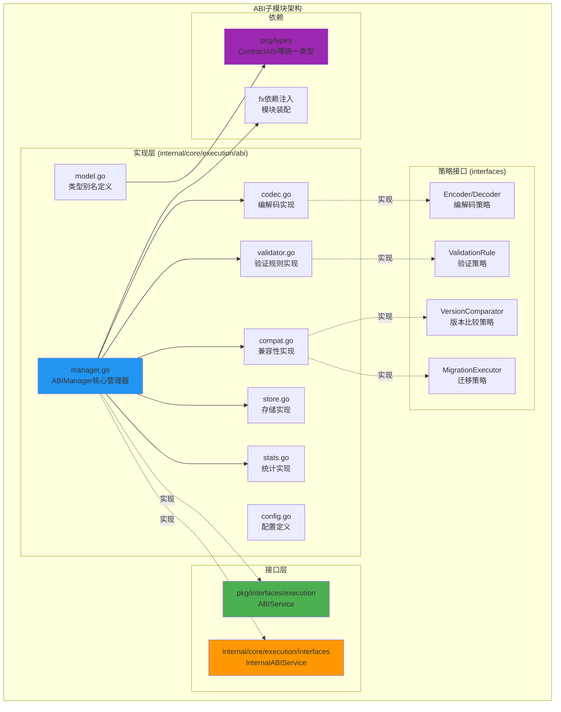

# ABI 子模块（internal/core/execution/abi）

【模块定位】
　　本子模块负责合约应用二进制接口（ABI）的管理、编解码、验证与兼容性检查，作为执行层的核心能力之一。通过统一的ABI管理机制，为智能合约的交互提供类型安全、版本兼容的标准化服务。

【设计原则】
- 接口集中：扩展性接口集中到 `internal/core/execution/interfaces`，遵循架构约束
- 类型复用：复用 `pkg/types` 统一类型定义，避免重复定义和类型转换
- 高内聚低耦合：专注ABI管理职责，不涉及执行调度、网络通信等跨域功能
- 依赖倒置：通过fx依赖注入提供服务，支持策略组件的灵活替换
- 可测试性：接口驱动设计，支持单元测试和集成测试

【核心职责】
1. **ABI注册管理**：合约ABI的注册、存储和检索
2. **参数编解码**：函数参数和返回值的标准化编解码
3. **类型验证**：ABI定义的结构完整性和类型安全验证  
4. **版本兼容性**：ABI版本间的兼容性检查和迁移支持
5. **统计监控**：ABI使用统计和性能监控
6. **配置管理**：ABI管理器的灵活配置支持

【架构设计】



【文件结构说明】

## 核心管理文件

### manager.go
**功能**：ABI管理器的核心实现
**职责**：
- 实现 `pkg/interfaces/execution.ABIService` 公共接口
- 实现 `internal/core/execution/interfaces.InternalABIService` 内部接口
- 协调各策略组件完成ABI管理功能
- 提供统一的ABI操作入口点

**核心方法**：
```go
// 公共接口方法
RegisterABI(contractID string, abi *types.ContractABI) error
EncodeParameters(contractID, method string, args []interface{}) ([]byte, error)
DecodeResult(contractID, method string, data []byte) ([]interface{}, error)

// 内部接口方法
GetABIStats() *interfaces.ABIStats
```

### model.go
**功能**：ABI相关数据模型的类型别名定义
**设计特点**：
- 复用 `pkg/types` 中的标准ABI类型定义
- 通过类型别名避免重复定义和维护成本
- 确保类型一致性和向后兼容性

**核心类型别名**：
```go
type ContractABI = types.ContractABI
type FunctionABI = types.ContractFunction  
type ParameterABI = types.ABIParam
type EventABI = types.ContractEvent
```

## 策略实现文件

### codec.go
**功能**：ABI编解码的默认实现
**接口实现**：实现 `interfaces.Encoder` 和 `interfaces.Decoder`
**设计特点**：
- 非导出实现，通过接口进行依赖注入
- 支持函数调用编码和返回值解码
- 类型安全的参数处理机制

### validator.go  
**功能**：ABI验证规则的默认实现
**接口实现**：实现 `interfaces.ValidationRule` 和 `interfaces.ValidationService`
**设计特点**：
- 可扩展的验证规则框架
- 分级验证严重程度（Error/Warning/Info）
- 详细的验证错误报告和修复建议

### compat.go
**功能**：版本兼容性检查的默认实现
**接口实现**：实现 `interfaces.VersionComparator`、`interfaces.MigrationExecutor`、`interfaces.CompatibilityService`
**设计特点**：
- 语义化版本比较支持
- 自动兼容性报告生成
- 支持ABI版本迁移策略

## 支撑服务文件

### store.go
**功能**：ABI存储的内存实现
**设计特点**：
- 高性能的内存存储实现
- 支持版本化ABI管理
- 可扩展为持久化存储

### stats.go
**功能**：ABI使用统计收集
**设计特点**：
- 轻量级统计信息收集
- 支持性能监控和分析
- 线程安全的统计更新

### config.go
**功能**：ABI管理器配置定义
**设计特点**：
- 灵活的配置选项支持
- 合理的默认值设置
- 支持运行时配置调整

【接口集中化架构】

## 公共接口层
**位置**：`pkg/interfaces/execution.ABIService`
**目标用户**：外部模块（API层、区块链核心等）
**功能范围**：提供最小必要的ABI服务功能集

## 内部接口层  
**位置**：`internal/core/execution/interfaces`
**目标用户**：执行层内部组件
**功能范围**：扩展功能，包括统计信息、兼容性检查等内部能力

## 策略接口设计
根据架构约束，以下接口已集中到 `internal/core/execution/interfaces/abi.go`：
- **编解码策略**：`Encoder`、`Decoder` - 支持不同编码格式的扩展
- **验证策略**：`ValidationRule`、`ValidationService` - 支持自定义验证规则
- **兼容性策略**：`VersionComparator`、`MigrationExecutor` - 支持版本策略扩展

**接口集中化优势**：
- 统一管理扩展点，避免接口污染
- 支持跨子模块的策略注入和替换
- 保持实现包的内聚性和专注度

【依赖关系】

## 上游依赖
- `pkg/types`：复用统一的ABI类型定义
- `internal/core/execution/interfaces`：实现内部扩展接口
- `fx依赖注入框架`：模块装配和生命周期管理

## 下游依赖
- 不依赖执行引擎具体实现
- 不依赖网络通信组件  
- 不依赖持久化存储实现

## 可选依赖注入
通过fx框架支持以下组件的可选注入：
- 自定义编码器实现
- 自定义验证规则
- 自定义版本比较策略

【使用示例】

## 1. 基本ABI管理
```go
// 通过fx依赖注入获取ABI服务
type SmartContractService struct {
    abiService execution.ABIService
}

func NewSmartContractService(abi execution.ABIService) *SmartContractService {
    return &SmartContractService{abiService: abi}
}

func (s *SmartContractService) DeployContract(contractCode []byte, abiDef *types.ContractABI) error {
    // 注册合约ABI
    contractID := "0x" + generateContractAddress()
    return s.abiService.RegisterABI(contractID, abiDef)
}
```

## 2. 函数调用编码
```go
func (s *SmartContractService) CallContract(contractID, methodName string, args []interface{}) ([]byte, error) {
    // 编码函数参数
    encodedParams, err := s.abiService.EncodeParameters(contractID, methodName, args)
    if err != nil {
        return nil, fmt.Errorf("参数编码失败: %w", err)
    }
    
    // 构造完整的函数调用数据
    callData := append(methodSelector(methodName), encodedParams...)
    return callData, nil
}
```

## 3. 返回值解码
```go
func (s *SmartContractService) HandleContractResult(contractID, methodName string, resultData []byte) ([]interface{}, error) {
    // 解码函数返回值
    results, err := s.abiService.DecodeResult(contractID, methodName, resultData)
    if err != nil {
        return nil, fmt.Errorf("返回值解码失败: %w", err)
    }
    
    return results, nil
}
```

## 4. 内部统计监控
```go
// 内部组件使用扩展接口
func (s *SmartContractService) GetABIMetrics() *interfaces.ABIStats {
    if internalABI, ok := s.abiService.(interfaces.InternalABIService); ok {
        return internalABI.GetABIStats()
    }
    return nil
}
```

【fx模块集成】

## 模块提供配置
```go
// 在 internal/core/execution/module.go 中的集成
func ProvideServices(input ModuleInput) (ModuleOutput, error) {
    // 创建ABI管理器，使用默认策略
    abiManager := abi.NewABIManager(abi.DefaultABIManagerConfig())
    
    return ModuleOutput{
        ABIService: abiManager,  // 作为公共接口提供
        // 其他服务...
    }, nil
}
```

## 可选策略注入（高级用法）
```go
// 支持自定义编码器注入
fx.Module("abi_custom",
    fx.Provide(
        custom.NewAdvancedEncoder,
        fx.Annotate(
            abi.NewABIManagerWithCustomEncoder,
            fx.As(new(execution.ABIService)),
        ),
    ),
)
```

【配置管理】

## 默认配置
```go
type ABIManagerConfig struct {
    EnableCompatibilityCheck bool          // 启用兼容性检查
    DefaultABIVersion       string        // 默认ABI版本
    MaxABISize              int64         // ABI定义最大大小
    EnableStatistics        bool          // 启用统计收集
    CacheSize               int           // 缓存大小
}

func DefaultABIManagerConfig() *ABIManagerConfig {
    return &ABIManagerConfig{
        EnableCompatibilityCheck: true,
        DefaultABIVersion:       "1.0.0",
        MaxABISize:              1024 * 1024, // 1MB
        EnableStatistics:        true,
        CacheSize:               1000,
    }
}
```

【最佳实践】

## 1. ABI设计规范
- **版本管理**：为每个ABI定义明确的版本号，遵循语义化版本规范
- **向前兼容**：新版本ABI应保持向前兼容，避免破坏性变更
- **文档完整**：为每个函数和参数提供详细的文档说明
- **类型安全**：使用明确的参数类型，避免动态类型带来的风险

## 2. 性能优化
- **缓存策略**：合理使用ABI缓存，减少重复解析开销
- **批量操作**：支持批量ABI注册和参数编码，提高吞吐量
- **内存管理**：及时释放不再使用的ABI定义，避免内存泄漏
- **编码优化**：选择高效的编码格式，平衡性能和兼容性

## 3. 错误处理
- **详细错误信息**：提供具体的错误位置和修复建议
- **优雅降级**：在ABI不可用时提供备用处理方案
- **日志记录**：记录关键操作和异常情况，便于问题排查
- **监控告警**：对ABI操作失败率进行监控和告警

【扩展指南】

## 1. 添加新的验证规则
```go
// 实现 interfaces.ValidationRule 接口
type CustomValidationRule struct{}

func (r *CustomValidationRule) Validate(abi *types.ContractABI) []interfaces.ValidationError {
    // 自定义验证逻辑
    return []interfaces.ValidationError{}
}

func (r *CustomValidationRule) GetRuleName() string {
    return "custom_rule"
}

func (r *CustomValidationRule) GetSeverity() interfaces.ValidationSeverity {
    return interfaces.ValidationSeverityWarning
}
```

## 2. 扩展编码格式支持
```go
// 实现 interfaces.Encoder 接口
type CustomEncoder struct{}

func (e *CustomEncoder) EncodeFunctionCall(fn *types.ContractFunction, args []interface{}) ([]byte, error) {
    // 自定义编码逻辑
    return nil, nil
}
```

---

## 🏗️ **依赖注入架构**

【fx框架集成】

　　全面采用fx依赖注入框架，实现ABI管理组件间的松耦合和灵活的策略替换。

**依赖注入设计**：
- **ABI管理装配**：自动装配ABI管理器、编解码器、验证器、兼容性检查器
- **策略组件注入**：通过接口注入可替换的编码策略、验证规则、版本比较器
- **接口导向**：通过接口而非具体类型进行依赖注入
- **生命周期管理**：自动管理ABI组件的初始化、配置和清理

**核心组件依赖关系**：
- ABIManager依赖Encoder、Decoder、ValidationService、CompatibilityService
- ValidationService依赖多个ValidationRule实现
- CompatibilityService依赖VersionComparator、MigrationExecutor
- 所有组件共享ABIStore、ABIStats、Logger、Config等支撑服务

---

## 📊 **性能与监控**

【性能指标】

| **操作类型** | **目标延迟** | **吞吐量目标** | **缓存命中率** | **监控方式** |
|-------------|-------------|---------------|---------------|------------|
| ABI注册 | < 5ms | > 1000 RPS | N/A | 批量统计 |
| 参数编码 | < 2ms | > 5000 EPS | > 80% | 实时监控 |
| 结果解码 | < 1ms | > 8000 DPS | > 85% | 实时监控 |
| 兼容性检查 | < 10ms | > 500 CPS | > 90% | 关键路径监控 |
| ABI验证 | < 3ms | > 2000 VPS | > 75% | 异步监控 |

**性能优化策略：**
- **编码优化**：预编译模板、类型缓存、批量编码
- **解码优化**：快速解析、内存复用、惰性解码
- **验证优化**：规则缓存、并行验证、快速失败
- **存储优化**：热点缓存、压缩存储、版本去重

---

## 🔗 **与公共接口的映射关系**

【接口实现映射】

```mermaid
classDiagram
    class ABIService {
        <<interface>>
        +RegisterABI(contractID, abi)
        +EncodeParameters(contractID, method, args)
        +DecodeResult(contractID, method, data)
        +GetABIInfo(contractID)
    }
    
    class ABIManager {
        -encoder Encoder
        -decoder Decoder
        -validator ValidationService
        -compatibilityService CompatibilityService
        -store ABIStore
        -stats ABIStats
        +RegisterABI(contractID, abi) error
        +EncodeParameters(contractID, method, args) []byte
        +DecodeResult(contractID, method, data) []interface{}
        +GetABIInfo(contractID) ABIInfo
    }
    
    class Encoder {
        <<interface>>
        +EncodeFunctionCall(function, args)
        +EncodeConstructor(constructor, args)
        +EncodeEvent(event, data)
        +GetEncodingFormat()
    }
    
    class EncoderImpl {
        -typeSystem TypeSystem
        -formatters map[string]Formatter
        -cache EncodingCache
        +EncodeFunctionCall(function, args) []byte
        +EncodeConstructor(constructor, args) []byte
        +EncodeEvent(event, data) []byte
        +GetEncodingFormat() string
    }
    
    class ValidationService {
        <<interface>>
        +ValidateABI(abi)
        +ValidateParameters(function, args)
        +GetValidationRules()
        +AddValidationRule(rule)
    }
    
    class ValidationServiceImpl {
        -rules []ValidationRule
        -severity ValidationSeverity
        -reporter ValidationReporter
        +ValidateABI(abi) []ValidationError
        +ValidateParameters(function, args) ValidationResult
        +GetValidationRules() []ValidationRule
        +AddValidationRule(rule) error
    }
    
    ABIService <|-- ABIManager : implements
    Encoder <|-- EncoderImpl : implements
    ValidationService <|-- ValidationServiceImpl : implements
```

**实现要点：**
- **接口契约**：严格遵循ABI服务接口定义和编解码规范
- **错误处理**：分层的错误处理和ABI异常恢复机制
- **日志记录**：详细的ABI操作日志和性能指标记录
- **测试覆盖**：全面的ABI功能测试、编解码测试和兼容性测试

---

## 🚀 **后续扩展规划**

【模块演进方向】

1. **ABI标准扩展**
   - 支持更多区块链平台的ABI格式
   - 实现跨链ABI转换和兼容性映射
   - 添加动态ABI生成和智能推断

2. **性能优化改进**
   - 实现GPU加速的ABI编解码
   - 优化大规模ABI数据的存储和检索
   - 添加智能缓存和预测性加载

3. **兼容性增强**
   - 完善ABI版本迁移和升级机制
   - 增强向后兼容性检查和警告
   - 实现智能ABI修复和建议

4. **开发工具集成**
   - 提供可视化的ABI管理界面
   - 集成IDE插件和开发工具支持
   - 添加ABI文档生成和API文档

---

## 📋 **开发指南**

【ABI组件开发规范】

1. **新组件接入步骤**：
   - 定义ABI组件接口和服务契约
   - 实现核心ABI处理逻辑和编解码机制
   - 添加验证规则和兼容性检查功能
   - 完成ABI测试和性能基准测试

2. **代码质量要求**：
   - 遵循Go语言最佳实践和项目编码规范
   - 实现完整的错误处理和类型安全机制
   - 提供详细的代码注释和技术文档
   - 保证100%的核心ABI功能测试覆盖率

3. **性能要求**：
   - ABI编解码延迟必须达到设计目标
   - 内存使用效率和缓存策略优化
   - 实现合理的类型转换和数据处理
   - 支持高频ABI操作和批量处理

【参考文档】
- [执行协调器](../coordinator/README.md)
- [宿主能力提供系统](../host/README.md)
- [执行引擎管理器](../manager/README.md)
- [内部接口层](../interfaces/README.md)
- [执行接口规范](../../../../pkg/interfaces/execution/)
- [WES架构设计文档](../../../../docs/architecture/)

---

> 📝 **模板说明**：本README模板基于WES v0.0.1统一文档规范设计，使用时请根据具体模块需求替换相应的占位符内容，并确保所有章节都有实质性的技术内容。

> 🔄 **维护指南**：本文档应随着模块功能的演进及时更新，确保文档与代码实现的一致性。建议在每次重大功能变更后更新相应章节。

---

**注意**：本模块遵循项目的接口集中化架构约束，所有扩展性接口已集中到 `internal/core/execution/interfaces/abi.go`。实现包专注于具体功能实现，通过fx依赖注入支持策略组件的灵活替换和扩展。
