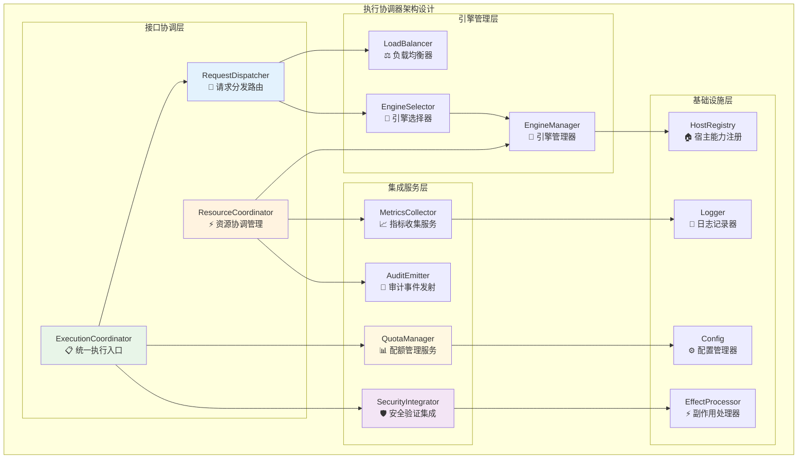
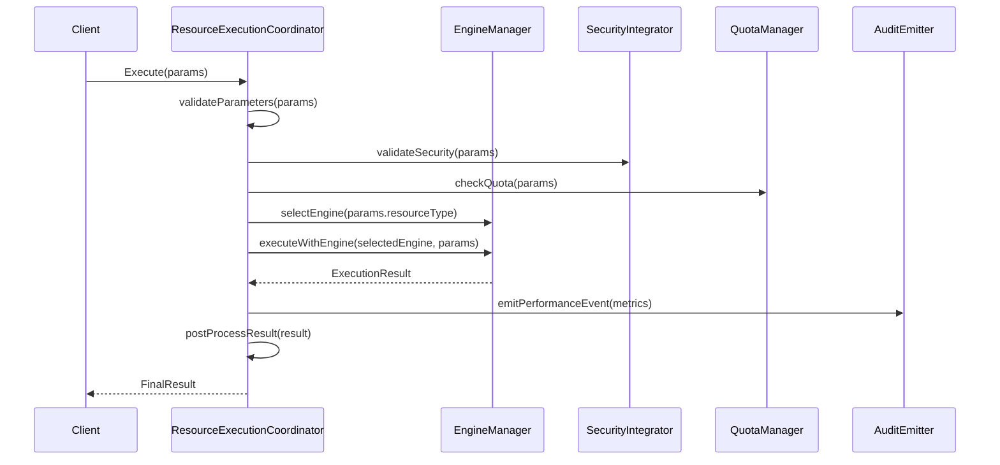
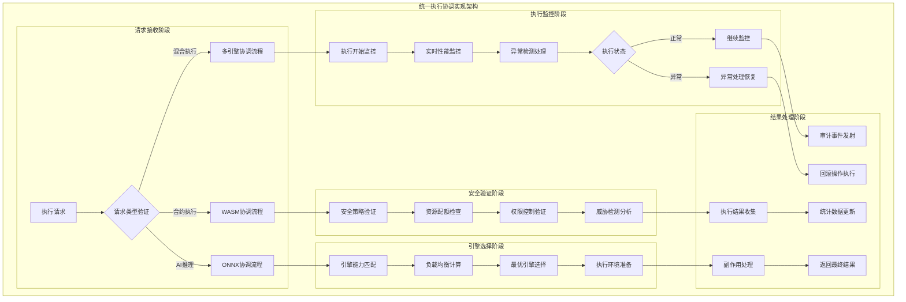
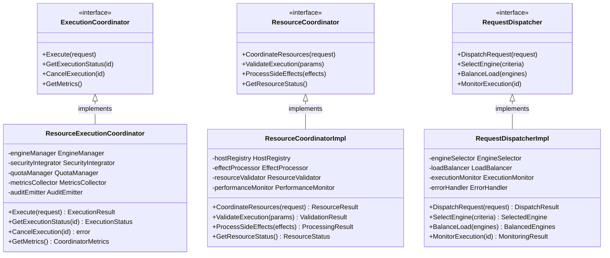

# 执行协调器（internal/core/execution/coordinator）

【模块定位】
　　本模块是WES系统中执行层的核心协调组件，负责统一管理和分发执行请求，提供标准化的执行流程控制。通过统一协调的架构设计，为多引擎执行环境提供一致的执行体验，支撑区块链智能合约和AI模型的高效执行需求，确保执行安全和性能优化。

【设计原则】
- **统一协调**：封装不同执行引擎的差异，提供统一的执行接口
- **流程标准化**：规范执行前预处理、执行中监控、执行后处理的完整流程
- **高可靠性**：集成安全验证、配额管理、审计追踪等可靠性保障
- **智能调度**：基于引擎能力和负载情况进行智能的执行调度
- **扩展性**：支持新执行引擎的平滑接入和扩展

【核心职责】
1. **执行请求分发**：根据资源类型和引擎能力，将执行请求路由到合适的引擎
2. **执行流程管理**：标准化执行前验证、执行中监控、执行后处理的完整生命周期
3. **安全集成协调**：整合安全验证、配额管理、权限检查等安全机制
4. **性能监控与审计**：统一收集执行指标、审计事件，提供可观测性支持
5. **错误处理与恢复**：标准化错误分类、错误恢复、失败回滚机制

【实现架构】

　　采用**协调器模式**的4层实现架构，确保执行流程的统一管理和智能调度。



**架构层次说明：**

1. **接口协调层**：提供统一的执行协调接口和请求分发能力
   - 统一执行入口点管理
   - 资源协调和生命周期管理
   - 智能请求路由和分发

2. **集成服务层**：集成各类支撑服务，提供完整的执行保障
   - 多层次安全验证集成
   - 配额管理和资源控制
   - 审计事件和性能指标收集

3. **引擎管理层**：管理和调度各种执行引擎，实现智能选择
   - 执行引擎的统一管理
   - 基于能力和负载的智能选择
   - 跨引擎负载均衡和资源优化

4. **基础设施层**：提供底层支撑能力和基础服务
   - 宿主能力注册和管理
   - 副作用处理和状态管理
   - 日志记录和配置管理

---

## 📁 **模块组织结构**

【内部模块架构】

```
internal/core/execution/coordinator/
├── 📋 resource_execution_coordinator.go    # 资源执行协调器核心实现
├── 🔧 resource_coordinator_impl.go         # 协调器接口默认实现
├── 📝 README.md                           # 本文档
└── 📊 tests/                              # 测试文件目录
    ├── coordinator_test.go                 # 协调器单元测试
    └── integration_test.go                 # 集成测试套件
```

### **🎯 子模块职责分工**

| **文件模块** | **核心职责** | **对外接口** | **内部组件** | **复杂度** |
|-------------|-------------|-------------|-------------|-----------|
| `resource_execution_coordinator.go` | 执行请求的完整生命周期管理 | ExecutionCoordinator | 分发器、验证器、监控器 | 高 |
| `resource_coordinator_impl.go` | 协调器接口的标准实现 | 接口适配和桥接 | 依赖注入、配置管理 | 中 |
| `tests/` | 协调器功能测试验证 | 测试接口和工具 | 单元测试、集成测试 | 中 |

【文件说明】

## resource_execution_coordinator.go
**功能**：资源执行协调器的核心实现
**职责**：
- 执行请求的完整生命周期管理
- 引擎选择与执行分发
- 安全验证与配额检查集成
- 性能监控与审计事件收集
- 副作用处理与后处理协调

**核心方法**：
- `Execute(ctx, params)`: 执行资源的主入口方法
- `validateParameters()`: 参数验证和预处理
- `selectEngine()`: 引擎选择和能力匹配
- `postProcessResult()`: 执行结果后处理
- `extractSideEffects()`: 副作用提取和处理

## resource_coordinator_impl.go
**功能**：执行协调器接口的默认实现
**职责**：
- 提供 ExecutionCoordinator 接口的标准实现
- 集成各种依赖组件的协调逻辑
- 提供测试和开发时的 NoOp 实现

**核心组件**：
- `DefaultExecutionCoordinator`: 标准协调器实现
- `NoOp*` 系列: 测试用的空操作实现
- 配置管理和依赖注入支持

【执行流程】



【错误处理策略】

| 错误类型 | 处理策略 | 恢复机制 |
|---------|---------|---------|
| 参数验证失败 | 立即返回错误 | 无需恢复 |
| 安全验证失败 | 记录安全事件，拒绝执行 | 审计记录 |
| 配额超限 | 记录配额事件，等待或拒绝 | 资源释放 |
| 引擎执行失败 | 记录执行指标，包装错误 | 状态回滚 |
| 后处理失败 | 记录审计事件，不影响主结果 | 日志记录 |

【配置参数】

```go
type CoordinatorConfig struct {
    EnableAuditEvents      bool   // 启用审计事件
    EnableAuditTracking    bool   // 启用审计追踪
    EnableQuotaManagement  bool   // 启用配额管理
    EnableSecurityValidation bool // 启用安全验证
    MaxExecutionTimeout    time.Duration // 最大执行超时
    Default执行费用Limit        uint64        // 默认执行费用限制
}
```

【性能指标】

- **执行延迟**：从请求到结果的端到端延迟
- **吞吐量**：单位时间内处理的执行请求数
- **成功率**：执行成功的请求占比
- **引擎利用率**：各执行引擎的使用分布
- **资源消耗**：内存、CPU、执行费用 的消耗情况

【扩展指南】

1. **新增引擎支持**：
   - 实现 EngineAdapter 接口
   - 在 EngineManager 中注册新引擎
   - 配置引擎能力映射

2. **自定义安全策略**：
   - 实现 SecurityValidator 接口
   - 在 SecurityIntegrator 中注册验证器
   - 配置策略权重和优先级

3. **扩展监控指标**：
   - 实现自定义 MetricsCollector
   - 添加新的性能维度
   - 集成外部监控系统

【依赖关系】

---

## 🔄 **统一执行协调实现**

【实现策略】

　　所有协调组件均严格遵循**执行协调统一**架构模式，确保多引擎执行的安全、可靠、高性能协同工作。



**关键实现要点：**

1. **统一协调流程**：
   - 标准化的请求接收和验证流程
   - 智能的引擎选择和负载均衡
   - 完整的生命周期监控和管理

2. **安全验证集成**：
   - 多层次安全策略验证
   - 动态资源配额管理
   - 实时威胁检测和防护

3. **执行监控完整**：
   - 全方位的执行状态监控
   - 异常检测和自动恢复
   - 完整的审计追踪记录

---

## 🏗️ **依赖注入架构**

【fx框架集成】

　　全面采用fx依赖注入框架，实现协调器组件间的松耦合和生命周期自动管理。

**依赖注入设计**：
- **协调器装配**：自动装配执行协调器、资源协调器、请求分发器
- **服务集成**：统一注入安全、监控、引擎管理等支撑服务
- **接口导向**：通过接口而非具体类型进行依赖注入
- **生命周期管理**：自动管理协调器组件的初始化、运行和清理

**核心组件依赖关系**：
- ExecutionCoordinator依赖EngineManager、SecurityIntegrator、MetricsCollector、AuditEmitter
- ResourceCoordinator依赖QuotaManager、HostRegistry、EffectProcessor
- RequestDispatcher依赖EngineSelector、LoadBalancer、PerformanceMonitor
- 所有组件共享Logger、Config、ErrorHandler等基础服务

---

## 📊 **性能与监控**

【性能指标】

| **操作类型** | **目标延迟** | **吞吐量目标** | **成功率** | **监控方式** |
|-------------|-------------|---------------|-----------|------------|
| 执行协调 | < 5ms | > 2000 RPS | > 99% | 实时监控 |
| 安全验证 | < 2ms | > 5000 VPS | > 99.9% | 关键路径监控 |
| 引擎选择 | < 3ms | > 3000 SPS | > 98% | 批量统计 |
| 请求分发 | < 1ms | > 10000 DPS | > 99.5% | 异步监控 |
| 结果处理 | < 10ms | > 1500 RPS | > 97% | 实时监控 |

**性能优化策略：**
- **协调优化**：智能请求路由、异步处理、批量操作
- **验证优化**：策略缓存、并行验证、快速失败
- **选择优化**：能力预计算、负载预测、亲和性调度
- **监控优化**：采样监控、异步收集、智能压缩

---

## 🔗 **与公共接口的映射关系**

【接口实现映射】



**实现要点：**
- **接口契约**：严格遵循执行协调接口定义和语义约定
- **错误处理**：分层的错误处理和协调器异常恢复机制
- **日志记录**：详细的协调操作日志和性能指标记录
- **测试覆盖**：全面的协调器测试、集成测试和性能基准测试

---

## 🚀 **后续扩展规划**

【模块演进方向】

1. **协调能力增强**
   - 支持更复杂的多引擎协作模式
   - 实现跨节点的分布式执行协调
   - 添加智能预测和预调度能力

2. **安全验证升级**
   - 引入零知识证明验证机制
   - 实现动态安全策略更新
   - 增强威胁检测和自适应防护

3. **性能优化改进**
   - 实现GPU加速的执行协调
   - 优化内存使用和对象池化
   - 添加机器学习驱动的性能优化

4. **监控运维增强**
   - 实现可视化的执行监控面板
   - 添加自动故障诊断和恢复
   - 提供智能运维决策支持

---

## 📋 **开发指南**

【协调器开发规范】

1. **新组件接入步骤**：
   - 定义协调器组件接口和服务契约
   - 实现核心协调逻辑和流程控制
   - 添加性能监控和安全验证功能
   - 完成组件测试和协调器集成测试

2. **代码质量要求**：
   - 遵循Go语言最佳实践和项目编码规范
   - 实现完整的错误处理和异常恢复机制
   - 提供详细的代码注释和技术文档
   - 保证100%的核心功能测试覆盖率

3. **性能要求**：
   - 关键路径延迟指标必须达到设计目标
   - 内存使用效率和并发安全的数据访问
   - 实现合理的资源清理和生命周期管理
   - 支持性能监控和可观测性要求

【参考文档】
- [执行引擎管理器](../manager/README.md)
- [安全集成系统](../security/README.md)
- [监控审计系统](../monitoring/README.md)
- [副作用处理系统](../effects/README.md)
- [执行接口规范](../../../../pkg/interfaces/execution/)
- [WES架构设计文档](../../../../docs/architecture/)

---

> 📝 **模板说明**：本README模板基于WES v0.0.1统一文档规范设计，使用时请根据具体模块需求替换相应的占位符内容，并确保所有章节都有实质性的技术内容。

> 🔄 **维护指南**：本文档应随着模块功能的演进及时更新，确保文档与代码实现的一致性。建议在每次重大功能变更后更新相应章节。

【依赖关系】

本模块依赖以下组件：
- `pkg/interfaces/execution`: 执行接口定义
- `internal/core/execution/security`: 安全集成组件
- `internal/core/execution/monitoring`: 监控审计组件
- `internal/core/execution/effects`: 副作用处理组件
- `pkg/types`: 通用类型定义

【使用示例】

```go
// 创建协调器
coordinator := NewResourceExecutionCoordinator(
    engineManager,
    hostRegistry,
    config,
)

// 执行资源
result, err := coordinator.Execute(ctx, types.ExecutionParams{
    ResourceID:   resourceID,
    ResourceType: types.EngineTypeWASM,
    Caller:       callerAddr,
    Input:        inputData,
    执行费用Limit:     执行费用Limit,
})

if err != nil {
    // 处理执行错误
    return fmt.Errorf("execution failed: %w", err)
}

// 处理执行结果
processResult(result)
```
