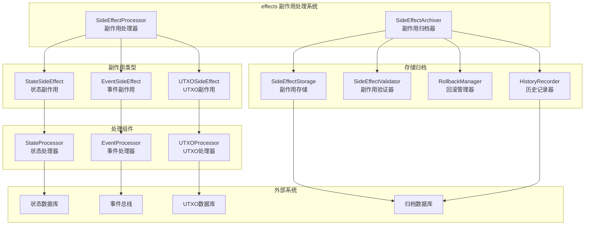
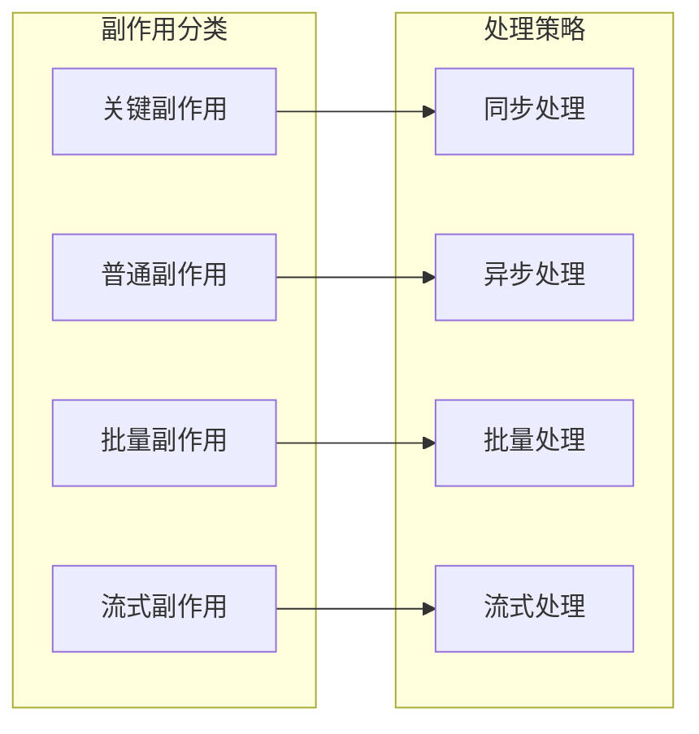

# 副作用处理系统（internal/core/execution/effects）

【模块目的】
　　本目录实现执行层的副作用处理系统，负责管理和处理执行过程中产生的各种副作用，包括状态变更、事件发射、UTXO操作等。采用MVP设计原则，专注于核心功能，避免过度设计。

【设计原则】
- **MVP优先**：专注于核心副作用处理功能，避免企业级过度设计
- **零配置**：采用合理默认值，无需复杂配置即可运行
- **内存优先**：使用内存存储，减少外部依赖和复杂性
- **基础校验**：提供必要的数据完整性检查，避免过度验证
- **简化回滚**：实现基本回滚能力，依赖上层执行引擎处理复杂回滚

【核心职责】
1. **基础副作用处理**：对UTXO、状态、事件三类副作用进行基础处理
2. **内存存储管理**：提供高性能的内存副作用存储和检索
3. **基础数据校验**：确保副作用数据的基本完整性和有效性
4. **统计数据收集**：收集处理性能数据，用于监控和优化
5. **简化归档机制**：提供最小化的副作用归档功能
6. **基础回滚支持**：提供基本的回滚接口，实际回滚由上层处理

【架构组件】



【文件说明】

## side_effect_processor.go
**功能**：生产级副作用处理器实现（MVP版本）
**核心职责**：
- 统一的副作用处理入口，支持三种类型副作用
- 实时统计数据收集，用于性能监控和分析
- 基础错误处理和日志记录
- 简化的批量处理支持

**核心组件**：
```go
type ProductionSideEffectProcessor struct {
    archiver *SideEffectArchiver      // 基础归档器
    logger   log.Logger              // 日志记录器
    config   *SideEffectProcessorConfig // 处理器配置
    stats    *processingStats        // 统计数据收集器
    mu       sync.RWMutex           // 并发安全保护
}
```

**主要方法**：
- `ProcessUTXOSideEffects()`: 处理UTXO副作用并更新统计
- `ProcessStateSideEffects()`: 处理状态副作用并更新统计
- `ProcessEventSideEffects()`: 处理事件副作用并更新统计
- `ProcessBatch()`: 批量处理副作用集合
- `Rollback()`: 基础回滚操作（简化实现）
- `GetProcessingStats()`: 获取详细的处理统计数据

## side_effect_archiver.go
**功能**：基础副作用归档器实现（MVP版本）
**核心职责**：
- 内存副作用存储，避免复杂的持久化逻辑
- 基础数据完整性验证，确保数据有效性
- 简化的归档会话管理
- NoOp历史记录，最小化审计开销

**归档组件**：
```go
type SideEffectArchiver struct {
    storage         *basicSideEffectStorage    // 内存存储
    validator       *basicSideEffectValidator // 基础验证器
    rollbackManager *basicRollbackManager     // 简化回滚管理器
    historyRecorder *noOpHistoryRecorder      // NoOp历史记录器
    config          *ArchiverConfig           // 简化配置
    sessions        map[string]*ArchiveSession // 会话管理
    sequences       map[string]uint64          // 序列号生成
}
```

**简化策略**：
- **内存存储**：使用内存存储，提高性能，减少复杂性
- **基础验证**：只验证必要的字段，避免过度校验
- **NoOp审计**：最小化历史记录，通过日志提供必要可观测性
- **简化回滚**：提供基本回滚接口，实际回滚由上层处理

【副作用类型详解】

## UTXO副作用（UTXOSideEffect）
**定义**：与UTXO模型相关的副作用操作（简化版本）

```go
type UTXOSideEffect struct {
    Type      UTXOEffectType         // 操作类型：create, consume, update
    UTXOID    string                 // UTXO唯一标识
    Amount    uint64                 // UTXO金额
    Owner     string                 // UTXO所有者
    TokenType string                 // 代币类型
    Metadata  map[string]interface{} // 扩展元数据
}
```

**处理流程**：
1. 验证UTXO操作的合法性
2. 检查UTXO的存在性和状态
3. 执行UTXO的创建、消费或更新
4. 更新UTXO索引和状态数据库
5. 记录操作历史和审计轨迹

## 状态副作用（StateSideEffect）
**定义**：与状态数据相关的副作用操作（简化版本）

```go
type StateSideEffect struct {
    Type     StateEffectType        // 操作类型：set, delete, update
    Key      string                 // 状态键
    OldValue []byte                 // 旧值（用于回滚）
    NewValue []byte                 // 新值
    Contract string                 // 合约地址
    Metadata map[string]interface{} // 扩展元数据
}
```

**处理流程**：
1. 验证状态操作权限
2. 检查状态键的存在性
3. 记录状态变更前的快照
4. 执行状态的读取、写入或删除
5. 更新状态版本和时间戳
6. 建立变更历史记录

## 事件副作用（EventSideEffect）
**定义**：与事件发射相关的副作用操作（简化版本）

```go
type EventSideEffect struct {
    Type      EventEffectType        // 事件类型：emit, log, notify
    EventName string                 // 事件名称
    Contract  string                 // 合约地址
    Data      map[string]interface{} // 事件数据
    Indexed   []string               // 索引字段
    Timestamp int64                  // 事件时间戳
}
```

**处理流程**：
1. 验证事件格式和内容
2. 确定事件的目标订阅者
3. 按优先级排序事件队列
4. 发射事件到事件总线
5. 记录事件发射历史
6. 处理事件发射结果

【处理策略】（MVP版本）



| 副作用类型 | 处理策略 | 优先级 | 超时时间 | 重试策略 |
|-----------|---------|--------|---------|---------|
| UTXO创建 | 同步处理 | 高 | 5秒 | 立即重试3次 |
| UTXO消费 | 同步处理 | 高 | 5秒 | 立即重试3次 |
| 状态写入 | 同步处理 | 中 | 3秒 | 延迟重试5次 |
| 状态读取 | 异步处理 | 低 | 1秒 | 指数退避重试 |
| 事件发射 | 异步处理 | 中 | 2秒 | 延迟重试3次 |
| 历史记录 | 批量处理 | 低 | 10秒 | 定期重试 |

【回滚机制】

```go
// 回滚策略接口
type RollbackStrategy interface {
    CanRollback(effect SideEffect) bool
    CreateRollbackPlan(effects []SideEffect) RollbackPlan
    ExecuteRollback(plan RollbackPlan) error
    ValidateRollback(plan RollbackPlan) error
}

// 回滚计划
type RollbackPlan struct {
    PlanID          string
    Effects         []SideEffect
    RollbackSteps   []RollbackStep
    Dependencies    []string
    EstimatedTime   time.Duration
    SafetyChecks    []SafetyCheck
}
```

**回滚类型**：
1. **即时回滚**：立即撤销副作用操作
2. **延迟回滚**：延迟一段时间后执行回滚
3. **条件回滚**：满足特定条件时触发回滚
4. **级联回滚**：回滚相关联的所有副作用
5. **部分回滚**：只回滚部分副作用操作

【归档配置】

```go
type ArchiverConfig struct {
    // 归档策略
    ArchiveStrategy      string // "immediate", "batch", "scheduled"
    BatchSize           int
    BatchInterval       time.Duration
    
    // 存储配置
    StorageType         string // "database", "file", "distributed"
    CompressionLevel    int
    EncryptionEnabled   bool
    
    // 保留策略
    RetentionPeriod     time.Duration
    MaxArchiveSize      uint64
    AutoCleanupEnabled  bool
    
    // 性能配置
    WorkerPoolSize      int
    BufferSize          int
    FlushInterval       time.Duration
}
```

【性能优化】

1. **并发处理**：
   - 并行处理不相关的副作用
   - 使用工作池模式提高并发度
   - 避免处理过程中的锁竞争

2. **批量优化**：
   - 批量提交状态变更
   - 批量发射相关事件
   - 批量归档副作用数据

3. **缓存策略**：
   - 缓存频繁访问的状态数据
   - 缓存UTXO查询结果
   - 缓存事件订阅信息

4. **内存管理**：
   - 及时释放处理完的副作用对象
   - 使用对象池减少内存分配
   - 控制并发处理的内存使用

【监控指标】

- **处理性能指标**：
  - 副作用处理时延
  - 处理吞吐量
  - 处理成功率
  - 队列积压数量

- **资源使用指标**：
  - 内存使用量
  - CPU使用率
  - 磁盘I/O统计
  - 网络传输量

- **可靠性指标**：
  - 处理失败率
  - 回滚成功率
  - 数据一致性检查
  - 恢复时间统计

【扩展指南】

1. **自定义副作用类型**：
```go
// 定义自定义副作用
type CustomSideEffect struct {
    EffectType string
    Data       interface{}
    Metadata   map[string]interface{}
}

// 实现自定义处理器
type CustomEffectProcessor struct{}

func (p *CustomEffectProcessor) Process(effect CustomSideEffect) error {
    // 自定义处理逻辑
    return nil
}
```

2. **扩展归档策略**：
```go
// 实现自定义归档策略
type CustomArchiveStrategy struct{}

func (s *CustomArchiveStrategy) ShouldArchive(effect SideEffect) bool {
    // 自定义归档条件
    return true
}

func (s *CustomArchiveStrategy) Archive(effects []SideEffect) error {
    // 自定义归档逻辑
    return nil
}
```

【故障排查】

常见问题及解决方案：

1. **副作用处理失败**：
   - 检查处理器配置和状态
   - 查看错误日志和堆栈信息
   - 验证依赖组件的可用性

2. **数据不一致**：
   - 执行数据一致性检查
   - 分析副作用处理日志
   - 必要时执行数据修复

3. **性能问题**：
   - 监控处理队列长度
   - 优化并发处理配置
   - 调整批处理参数

4. **回滚失败**：
   - 检查回滚计划的有效性
   - 验证依赖关系是否正确
   - 分析回滚执行日志

【依赖关系】

本模块依赖以下组件：
- `pkg/types`: 通用类型定义
- `pkg/interfaces/execution`: 执行接口
- 状态存储系统：用于状态数据持久化
- 事件系统：用于事件发射和订阅
- UTXO存储系统：用于UTXO数据管理
- 日志系统：用于操作日志记录
