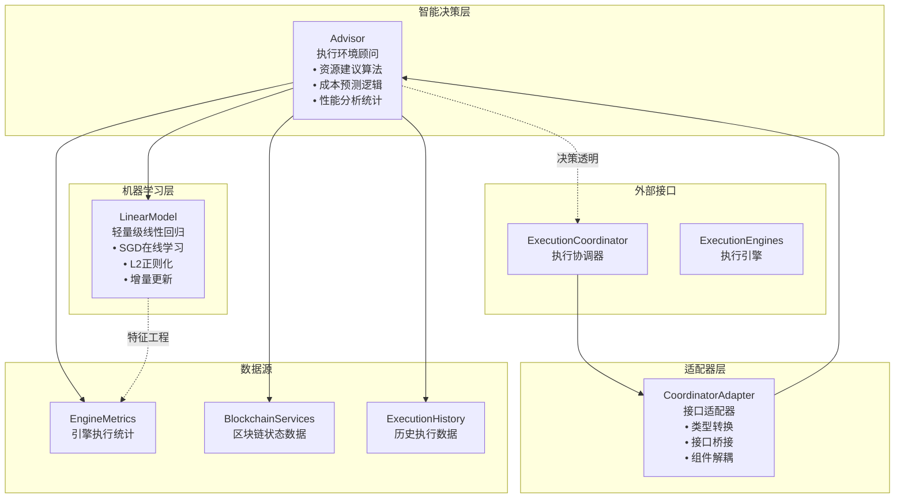
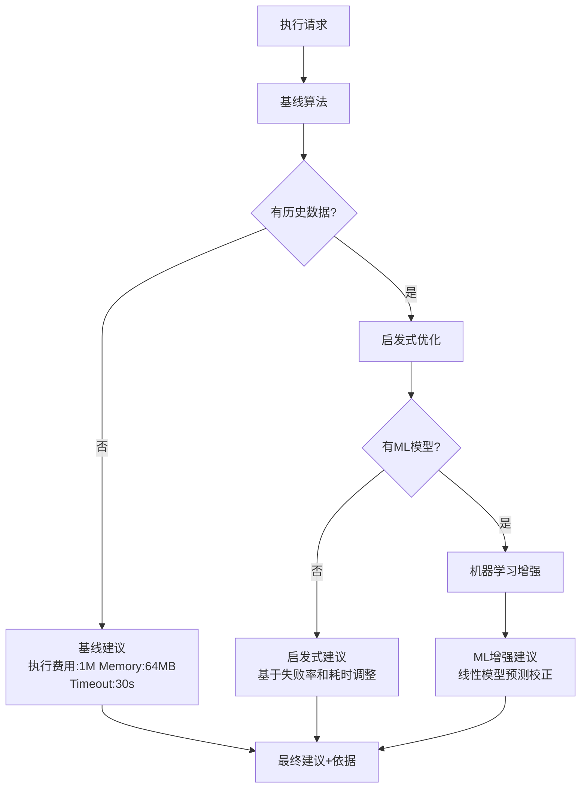

# 执行环境智能顾问系统（internal/core/execution/env）

【模块目的】
　　本模块实现执行环境的智能化决策支持系统，通过数据驱动的分析和轻量级机器学习技术，为智能合约和AI模型执行提供资源建议、成本预测和性能分析能力。采用MVP设计原则，专注于实用性和高性能。

【设计原则】
- 数据驱动决策：基于真实执行数据进行科学决策
- 轻量级AI：使用轻量级机器学习算法，无外部依赖
- 无副作用：所有建议和预测都是只读操作，不影响执行流程
- 渐进增强：基线算法→启发式优化→机器学习增强的三层架构
- 生产就绪：微秒级响应，完整错误处理，优雅降级
- 自适应学习：在线学习模型，随着数据积累持续改进

【核心职责】
1. **智能资源建议**：基于历史数据和ML模型提供执行费用、内存、并发度等资源限制建议
2. **精确成本预测**：预测单次执行的执行费用消耗和时间成本，包含置信度评估
3. **性能历史分析**：分析合约或模型的历史执行性能，提供统计指标和趋势
4. **在线学习优化**：通过轻量级线性模型进行在线参数调优
5. **接口适配桥接**：为不同组件间的接口差异提供适配器模式解决方案

【架构组件】



【文件说明】

## advisor.go
**功能**：执行环境智能顾问系统
**职责**：
- 基于历史数据和机器学习模型提供智能化资源建议
- 预测执行成本，包含执行费用消耗和时间预测
- 分析历史执行性能，提供统计指标和趋势分析
- 提供无副作用的决策支持，不影响核心执行流程

**核心组件**：
```go
type Advisor struct {
    txService    blockchain.TransactionService
    blockService blockchain.BlockService
    metrics      execiface.EngineManager
    clock        func() time.Time
    getMetrics   func() map[types.EngineType]EngineMetricsSnapshot
    model        *LinearModel
}
```

**主要功能**：
- `AdviseResourceLimits()`: 智能资源限制建议
- `PredictExecutionCost()`: 执行成本预测
- `AnalyzePerformanceHistory()`: 历史性能分析
- `WithMetricsProvider()`: 配置指标数据源
- `WithModel()`: 配置机器学习模型

**算法策略**：
```go
type ResourceAdvice struct {
    执行费用Limit    uint64 // 执行费用限制建议
    MemoryLimit uint32 // 内存限制建议
    Concurrency uint32 // 并发度建议
    TimeoutMs   int64  // 超时时间建议
    Rationale   string // 建议依据说明
}
```

## ml.go
**功能**：轻量级机器学习引擎
**职责**：
- 提供在线线性回归模型用于执行时间预测
- 支持增量学习和模型参数在线更新
- 零外部依赖的纯Go机器学习实现
- 针对执行环境优化的特征工程

**机器学习模型**：
```go
type LinearModel struct {
    weights      []float64 // 特征权重向量
    intercept    float64   // 截距项
    learningRate float64   // 学习率(0.05)
    l2           float64   // L2正则化系数(0.001)
    samples      int       // 已处理样本数量
}
```

**核心算法**：
- **SGD优化**：随机梯度下降在线学习
- **L2正则化**：防止过拟合，提高泛化能力
- **特征归一化**：输入特征要求归一化到[0,1]范围
- **数值稳定**：预测值自动截断为非负数

**特征工程**：
```go
// 标准3特征输入（已归一化）
features := []float64{
    执行费用Norm,   // 执行费用使用量归一化
    avgDur,    // 平均执行时间归一化（秒）
    failRate,  // 失败率（0-1）
}
```

## coordinator_adapter.go
**功能**：执行协调器适配器
**职责**：
- 将Advisor适配为ExecutionCoordinator期望的接口
- 提供类型转换和接口桥接功能
- 实现适配器模式解耦组件依赖
- 支持现有代码的无缝集成

**适配器结构**：
```go
type CoordinatorAdapter struct {
    advisor *Advisor // 底层环境顾问实例
}
```

**接口适配**：
- `AdviseResourceLimits()`: 资源建议接口适配
- `PredictExecutionCost()`: 成本预测接口适配
- `AnalyzePerformanceHistory()`: 性能分析接口适配

**类型转换**：
```go
type CoordinatorResourceAdvice struct {
    执行费用Limit    uint64
    MemoryLimit uint32
    Concurrency uint32
    TimeoutMs   int64
    Rationale   string
}
```

【智能决策算法】

## 渐进增强三层架构


**启发式调整策略**：
```go
// 失败率调整策略
if failRate > 0.05 {
    concurrency = 1        // 降低并发度
    timeout += 10_000      // 增加超时时间
    执行费用 *= 1.1            // 增加执行费用限制
    rationale += "；failRate>5%"
}

// 执行时间调整策略  
if avgDur > 120 {
    timeout += (avgDur-120) * 5
    timeout = min(timeout, 120_000)
    rationale += "；avgDur>120ms"
}
```

【机器学习模型】

## 数学原理
**预测函数**：
```
ŷ = w₁×执行费用Norm + w₂×avgDur + w₃×failRate + b
```

**损失函数（MSE + L2正则化）**：
```
L = (y - ŷ)² + λ∑wᵢ²
```

**参数更新（SGD）**：
```
wᵢ ← wᵢ - α(∂L/∂wᵢ)
b ← b - α(∂L/∂b)
```

**关键参数**：
- 学习率α = 0.05
- L2正则化λ = 0.001  
- 就绪阈值 = 10个样本

## 特征归一化
```go
// 输入特征要求归一化到[0,1]范围
执行费用Norm := float64(执行费用) / 2_000_000.0    // 执行费用归一化
avgDur := float64(duration_ms) / 1000.0  // 时间归一化(秒)
failRate := float64(fails) / float64(total)  // 失败率[0,1]
```

【性能指标】

- **响应性能**：
  - 建议生成时间：微秒级
  - 预测计算时间：纳秒级
  - 内存占用：最小化设计
  - 无阻塞操作：只读无副作用

- **预测准确性**：
  - 置信度评估：基于样本数量
  - 模型收敛：10个样本后生效
  - 预测校正：基于实际执行反馈
  - 渐进改善：随数据积累持续优化

【使用示例】

```go
// 创建基础顾问
advisor := NewAdvisor(txService, blockService, engineManager)

// 配置指标提供者
advisor = advisor.WithMetricsProvider(func() map[types.EngineType]EngineMetricsSnapshot {
    return getEngineMetrics()
})

// 配置机器学习模型
model := NewLinearModel(3)
advisor = advisor.WithModel(model)

// 获取资源建议
advice, err := advisor.AdviseResourceLimits(ctx, contractAddr, function)
if err == nil {
    fmt.Printf("建议执行费用限制: %d, 超时: %dms, 依据: %s", 
               advice.执行费用Limit, advice.TimeoutMs, advice.Rationale)
}

// 预测执行成本
prediction, err := advisor.PredictExecutionCost(ctx, params)
if err == nil {
    fmt.Printf("预期执行费用: %d, 预期时间: %dms, 置信度: %.2f", 
               prediction.Expected执行费用, prediction.ExpectedTimeMs, prediction.ConfidencePct)
}

// 创建协调器适配器
adapter := NewCoordinatorAdapter(advisor)
coordinator.SetEnvAdvisor(adapter)
```

【扩展指南】

1. **自定义指标提供者**：
```go
// 实现自定义指标快照提供者
func customMetricsProvider() map[types.EngineType]EngineMetricsSnapshot {
    return map[types.EngineType]EngineMetricsSnapshot{
        types.EngineTypeWASM: {
            ExecutionCount: 1000,
            FailureCount:   50,
            LastDurationMs: 120,
        },
    }
}
advisor = advisor.WithMetricsProvider(customMetricsProvider)
```

2. **模型在线学习**：
```go
// 在线更新机器学习模型
for executionResult := range executionResults {
    features := []float64{
        normalize执行费用(executionResult.执行费用),
        normalizeDuration(executionResult.Duration),
        calculateFailRate(executionHistory),
    }
    target := float64(executionResult.Duration) / 1000.0
    model.Update(features, target)
}
```

【故障排查】

常见问题及解决方案：

1. **预测结果不准确**：
   - 检查特征归一化是否正确
   - 确保有足够样本数据（≥10个）
   - 调整学习率和正则化参数

2. **性能影响**：
   - 检查指标提供者的计算复杂度
   - 确保所有操作都是只读无副作用
   - 考虑缓存和异步处理

3. **模型不收敛**：
   - 验证特征范围是否在[0,1]
   - 检查学习率设置
   - 增加训练样本数量

【依赖关系】

本模块依赖以下组件：
- `pkg/interfaces/blockchain`: 区块链服务接口
- `pkg/interfaces/execution`: 执行引擎管理接口
- `pkg/types`: 通用类型定义
- `context`: 上下文管理
