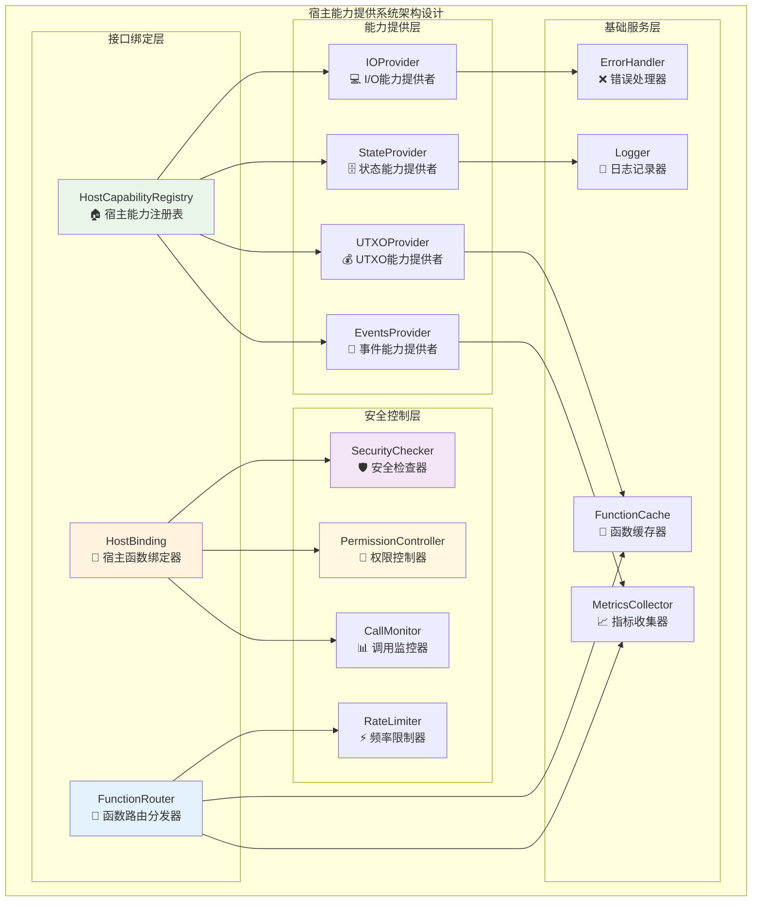
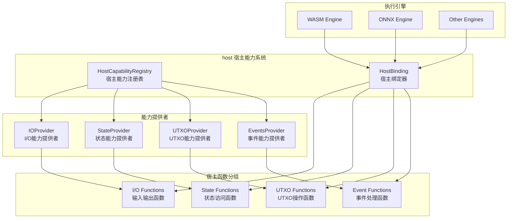
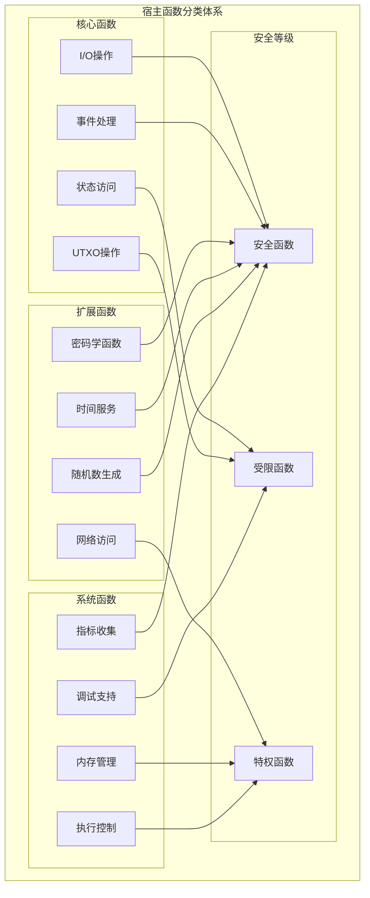
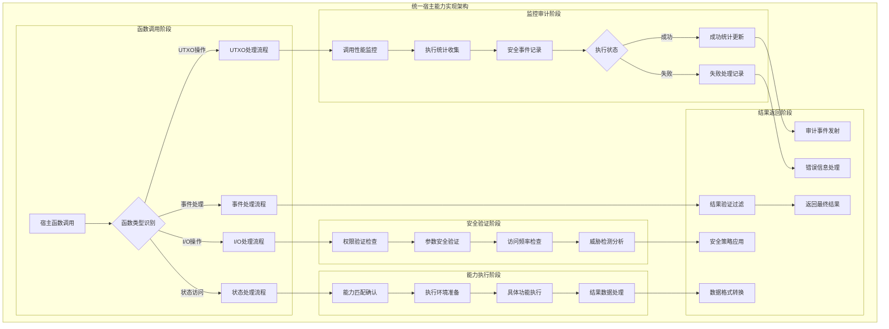
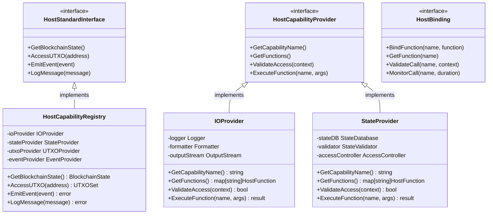

# 宿主能力提供系统（internal/core/execution/host）

【模块定位】
　　本模块是WES系统中执行层的宿主环境能力提供组件，为执行引擎提供与区块链环境交互的标准化接口。通过安全隔离的宿主函数方式，让运行在沙箱环境中的智能合约和AI模型能够安全地访问区块链状态、处理I/O操作、管理UTXO等核心功能，支撑多引擎执行的区块链交互需求，确保执行安全和接口标准化。

【设计原则】
- **安全隔离**：严格控制宿主函数的访问权限，确保沙箱安全
- **标准化接口**：提供统一的宿主函数接口，屏蔽底层实现差异
- **能力分组**：按功能域对宿主能力进行分组管理和权限控制
- **智能路由**：基于执行上下文和权限策略的智能函数路由
- **性能优化**：优化宿主函数调用的性能开销和资源使用
- **可扩展性**：支持新宿主能力的动态注册和平滑扩展

【核心职责】
1. **宿主能力注册**：统一管理和注册各类宿主能力提供者
2. **标准接口提供**：为执行引擎提供标准化的宿主函数接口
3. **权限控制管理**：控制不同执行上下文的宿主函数访问权限
4. **调用路由分发**：将宿主函数调用路由到对应的能力提供者
5. **性能监控审计**：监控宿主函数的调用性能和使用情况
6. **安全策略执行**：实施多层次的宿主函数安全访问策略

【实现架构】

　　采用**能力提供者模式**的4层实现架构，确保宿主函数的安全、标准、高效访问。



**架构层次说明：**

1. **接口绑定层**：提供宿主能力的注册管理和函数绑定能力
   - 统一的能力提供者注册管理
   - 执行上下文相关的函数绑定
   - 智能的函数调用路由分发

2. **能力提供层**：实现各类核心宿主能力的具体功能
   - I/O操作能力（输入输出、日志记录）
   - 状态访问能力（读写、历史查询）
   - UTXO管理能力（查询、创建、消费）
   - 事件处理能力（发射、监听、订阅）

3. **安全控制层**：实施多层次的安全策略和访问控制
   - 权限验证和安全检查
   - 细粒度的权限控制管理
   - 实时调用监控和异常检测
   - 频率限制和防护机制

4. **基础服务层**：提供底层支撑服务和性能优化
   - 函数缓存和性能优化
   - 调用指标收集和分析
   - 统一错误处理和恢复
   - 详细操作日志记录

【架构组件】



【文件说明】

## registry.go
**功能**：宿主能力注册表的核心实现
**职责**：
- 统一管理所有宿主能力提供者
- 提供能力的注册、发现和获取服务
- 维护能力提供者的生命周期
- 处理能力冲突和依赖关系

**核心组件**：
```go
type HostCapabilityRegistry struct {
    providers       map[string]HostCapabilityProvider
    bindings        map[string]HostBinding
    securityPolicy  HostSecurityPolicy
    metrics         HostMetricsCollector
    logger          Logger
}
```

**主要方法**：
- `RegisterProvider()`: 注册宿主能力提供者
- `GetProvider()`: 获取指定的能力提供者
- `CreateBinding()`: 为执行上下文创建宿主绑定
- `ValidateCapabilities()`: 验证能力的有效性

## binding.go
**功能**：宿主函数绑定器
**职责**：
- 将宿主函数绑定到执行引擎环境
- 管理函数调用的路由和分发
- 提供函数调用的安全检查
- 监控函数调用的性能和使用

**绑定策略**：
```go
type HostBinding struct {
    Context         ExecutionContext
    AllowedFunctions map[string]bool
    FunctionRouter   FunctionRouter
    SecurityChecker  SecurityChecker
    CallMonitor     CallMonitor
}
```

## provider_io.go
**功能**：I/O能力提供者
**提供功能**：
- 标准输入输出操作
- 日志记录功能
- 调试信息输出
- 格式化数据输出

**宿主函数**：
```go
// I/O相关宿主函数
func host_print(message string)
func host_println(message string)
func host_log(level string, message string)
func host_debug(data []byte)
func host_format(format string, args ...interface{}) string
```

## provider_state.go
**功能**：状态能力提供者
**提供功能**：
- 区块链状态读取
- 状态数据写入
- 状态历史查询
- 状态验证功能

**宿主函数**：
```go
// 状态相关宿主函数
func host_state_get(key string) []byte
func host_state_set(key string, value []byte)
func host_state_delete(key string)
func host_state_exists(key string) bool
func host_state_keys(prefix string) []string
func host_state_get_history(key string, version uint64) []byte
```

## provider_utxo.go
**功能**：UTXO能力提供者
**提供功能**：
- UTXO查询和验证
- UTXO创建和消费
- 交易构建辅助
- 余额计算功能

**宿主函数**：
```go
// UTXO相关宿主函数
func host_utxo_get(utxo_id string) UTXOInfo
func host_utxo_exists(utxo_id string) bool
func host_utxo_create(output UTXOOutput) string
func host_utxo_consume(utxo_id string) bool
func host_balance_get(address string) uint64
func host_tx_inputs_get() []UTXOInput
func host_tx_outputs_get() []UTXOOutput
```

## provider_events.go
**功能**：事件能力提供者
**提供功能**：
- 事件发射和广播
- 事件监听和订阅
- 事件过滤和路由
- 事件历史查询

**宿主函数**：
```go
// 事件相关宿主函数
func host_event_emit(event_type string, data []byte)
func host_event_subscribe(event_type string, callback string)
func host_event_unsubscribe(subscription_id string)
func host_event_get_history(event_type string, from_time uint64) []Event
```

【宿主函数分类】



【权限控制体系】

| 函数类别 | 权限等级 | 默认状态 | 适用场景 | 风险评估 |
|---------|---------|---------|---------|---------|
| I/O操作 | 安全 | 启用 | 所有执行环境 | 低 |
| 状态读取 | 受限 | 启用 | 需要状态访问的合约 | 中 |
| 状态写入 | 受限 | 需授权 | 状态变更合约 | 高 |
| UTXO查询 | 受限 | 启用 | UTXO相关合约 | 中 |
| UTXO操作 | 受限 | 需授权 | 交易处理合约 | 高 |
| 事件发射 | 安全 | 启用 | 需要通知的合约 | 低 |
| 网络访问 | 特权 | 禁用 | 特殊场景 | 极高 |
| 系统调用 | 特权 | 禁用 | 系统级操作 | 极高 |

【安全机制】

```go
// 宿主函数安全策略
type HostSecurityPolicy struct {
    // 全局策略
    GlobalAllowedFunctions []string
    GlobalDeniedFunctions  []string
    
    // 权限矩阵
    PermissionMatrix map[string][]string // role -> functions
    
    // 调用限制
    CallRateLimits map[string]RateLimit // function -> limit
    
    // 参数验证
    ParameterValidators map[string]ParameterValidator
    
    // 返回值过滤
    ReturnValueFilters map[string]ReturnValueFilter
}
```

**安全检查流程**：
1. **权限验证**：检查执行上下文是否有调用权限
2. **参数验证**：验证函数参数的合法性和安全性
3. **频率限制**：检查函数调用频率是否超限
4. **资源检查**：验证函数调用所需的资源
5. **返回值过滤**：过滤敏感信息的返回

【性能优化策略】

1. **函数缓存**：
   - 缓存频繁调用的函数结果
   - 减少重复的状态查询
   - 优化UTXO查询性能

2. **批量操作**：
   - 批量状态读写操作
   - 批量UTXO查询
   - 批量事件发射

3. **异步执行**：
   - 异步事件发射
   - 异步日志记录
   - 异步指标收集

4. **内存管理**：
   - 对象池化
   - 内存预分配
   - 及时垃圾回收

【监控指标】

```go
// 宿主函数调用指标
type HostFunctionMetrics struct {
    CallCount       uint64        // 调用次数
    TotalDuration   time.Duration // 总耗时
    AverageDuration time.Duration // 平均耗时
    ErrorCount      uint64        // 错误次数
    LastCallTime    time.Time     // 最后调用时间
}

// 系统级监控指标
type HostSystemMetrics struct {
    ActiveBindings    int      // 活跃绑定数
    TotalFunctions    int      // 总函数数
    MemoryUsage      uint64   // 内存使用量
    CPUUsage         float64  // CPU使用率
}
```

【配置参数】

```go
type HostConfig struct {
    // 功能开关
    EnableIOFunctions    bool
    EnableStateFunctions bool
    EnableUTXOFunctions  bool
    EnableEventFunctions bool
    
    // 性能配置
    MaxConcurrentCalls   int
    CallTimeoutDuration  time.Duration
    CacheSize           int
    
    // 安全配置
    SecurityPolicyPath   string
    EnableCallMonitoring bool
    EnableParameterValidation bool
    
    // 调试配置
    EnableDebugFunctions bool
    LogLevel            string
    MetricsEnabled      bool
}
```

【使用示例】

```go
// 注册宿主能力提供者
registry := NewHostCapabilityRegistry()
registry.RegisterProvider("io", NewIOProvider())
registry.RegisterProvider("state", NewStateProvider())
registry.RegisterProvider("utxo", NewUTXOProvider())
registry.RegisterProvider("events", NewEventsProvider())

// 为执行上下文创建绑定
binding := registry.CreateBinding(executionContext)

// 在WASM引擎中使用宿主函数
wasmEngine.RegisterHostFunction("host_print", binding.GetFunction("host_print"))
wasmEngine.RegisterHostFunction("host_state_get", binding.GetFunction("host_state_get"))
```

【扩展指南】

1. **添加新的宿主能力**：
```go
// 实现宿主能力提供者接口
type CustomHostProvider struct{}

func (p *CustomHostProvider) GetCapabilityName() string {
    return "custom"
}

func (p *CustomHostProvider) GetFunctions() map[string]HostFunction {
    return map[string]HostFunction{
        "custom_function": p.customFunction,
    }
}

func (p *CustomHostProvider) customFunction(args []interface{}) (interface{}, error) {
    // 自定义函数实现
    return result, nil
}
```

2. **自定义安全策略**：
```go
// 实现自定义安全检查器
type CustomSecurityChecker struct{}

func (c *CustomSecurityChecker) CheckPermission(function string, context ExecutionContext) bool {
    // 自定义权限检查逻辑
    return true
}
```

【故障排查】

常见问题及解决方案：

1. **宿主函数调用失败**：
   - 检查函数是否正确注册
   - 验证权限配置是否正确
   - 查看安全策略设置

2. **性能问题**：
   - 监控函数调用频率
   - 检查缓存命中率
   - 优化函数实现

3. **安全问题**：
   - 审查安全策略配置
   - 检查权限矩阵设置
   - 分析调用模式

4. **内存泄漏**：
   - 检查对象生命周期
   - 监控内存使用情况
   - 优化缓存策略

---

## 📁 **模块组织结构**

【内部模块架构】

```
internal/core/execution/host/
├── 🏠 registry.go                    # 宿主能力注册表核心实现
├── 🔗 binding.go                     # 宿主函数绑定器实现
├── 💻 provider_io.go                 # I/O能力提供者实现
├── 🗄️ provider_state.go              # 状态能力提供者实现
├── 💰 provider_utxo.go               # UTXO能力提供者实现
├── 📢 provider_events.go             # 事件能力提供者实现
├── 📝 README.md                      # 本文档
└── 📊 tests/                         # 测试文件目录
    ├── registry_test.go               # 注册表单元测试
    ├── binding_test.go                # 绑定器单元测试
    ├── providers_test.go              # 能力提供者测试
    └── integration_test.go            # 宿主系统集成测试
```

### **🎯 子模块职责分工**

| **文件模块** | **核心职责** | **对外接口** | **内部组件** | **复杂度** |
|-------------|-------------|-------------|-------------|-----------|
| `registry.go` | 宿主能力的统一注册和管理 | HostCapabilityRegistry | 能力注册器、发现器、生命周期管理 | 高 |
| `binding.go` | 宿主函数的绑定和路由分发 | HostBinding | 函数路由器、安全检查器、调用监控 | 高 |
| `provider_*.go` | 各类宿主能力的具体实现 | 能力提供者接口 | I/O、状态、UTXO、事件处理器 | 中 |
| `tests/` | 宿主系统功能测试验证 | 测试工具和框架 | 单元测试、集成测试、性能测试 | 中 |

---

## 🔄 **统一宿主能力实现**

【实现策略】

　　所有宿主能力提供者均严格遵循**能力提供者统一**架构模式，确保宿主函数的安全、标准、高效执行。



**关键实现要点：**

1. **统一能力接口**：
   - 标准化的宿主函数调用接口
   - 一致的参数验证和结果处理
   - 统一的错误处理和异常恢复

2. **安全访问控制**：
   - 多层次的权限验证机制
   - 智能的威胁检测和防护
   - 动态的访问频率控制

3. **性能监控完整**：
   - 全方位的调用性能监控
   - 详细的使用统计和分析
   - 完整的安全审计记录

---

## 🏗️ **依赖注入架构**

【fx框架集成】

　　全面采用fx依赖注入框架，实现宿主能力组件间的松耦合和生命周期自动管理。

**依赖注入设计**：
- **能力注册**：自动装配各类宿主能力提供者和注册表
- **绑定管理**：统一注入函数绑定器、路由器、安全检查器
- **服务集成**：通过接口注入监控、日志、配置等支撑服务
- **生命周期管理**：自动管理宿主组件的初始化、绑定和清理

**核心组件依赖关系**：
- HostCapabilityRegistry依赖各类Provider（IO、State、UTXO、Events）
- HostBinding依赖SecurityChecker、PermissionController、CallMonitor
- FunctionRouter依赖RateLimiter、FunctionCache、MetricsCollector
- 所有组件共享Logger、Config、ErrorHandler等基础服务

---

## 📊 **性能与监控**

【性能指标】

| **操作类型** | **目标延迟** | **吞吐量目标** | **安全级别** | **监控方式** |
|-------------|-------------|---------------|-------------|------------|
| I/O函数调用 | < 100μs | > 50K IOPS | 安全 | 异步监控 |
| 状态读取 | < 500μs | > 20K RPS | 受限 | 实时监控 |
| 状态写入 | < 2ms | > 5K WPS | 受限 | 关键路径监控 |
| UTXO查询 | < 1ms | > 10K QPS | 受限 | 批量统计 |
| 事件发射 | < 200μs | > 30K EPS | 安全 | 异步监控 |

**性能优化策略：**
- **调用优化**：函数缓存、批量操作、异步执行
- **安全优化**：权限缓存、并行验证、快速失败
- **监控优化**：采样监控、智能压缩、异步收集
- **资源优化**：对象池化、内存复用、连接复用

---

## 🔗 **与公共接口的映射关系**

【接口实现映射】



**实现要点：**
- **接口契约**：严格遵循宿主能力接口定义和安全规范
- **错误处理**：分层的错误处理和宿主函数异常恢复机制
- **日志记录**：详细的宿主调用日志和性能指标记录
- **测试覆盖**：全面的宿主能力测试、安全测试和性能基准测试

---

## 🚀 **后续扩展规划**

【模块演进方向】

1. **能力类型扩展**
   - 支持更多类型的宿主能力提供者
   - 实现跨链交互和外部API调用能力
   - 添加密码学和硬件安全模块支持

2. **安全机制增强**
   - 实现更细粒度的权限控制模型
   - 添加基于行为的异常检测机制
   - 增强威胁情报集成和自适应防护

3. **性能优化改进**
   - 实现智能的函数调用预测和缓存
   - 优化高频调用的性能路径
   - 添加GPU加速的宿主函数支持

4. **可观测性提升**
   - 实现可视化的宿主调用监控面板
   - 添加智能的性能分析和优化建议
   - 提供详细的安全审计和合规报告

---

## 📋 **开发指南**

【宿主能力开发规范】

1. **新能力接入步骤**：
   - 定义宿主能力提供者接口和函数契约
   - 实现核心宿主函数和安全访问控制
   - 添加性能监控和调用统计功能
   - 完成能力测试和安全验证测试

2. **代码质量要求**：
   - 遵循Go语言最佳实践和项目编码规范
   - 实现完整的权限验证和安全检查机制
   - 提供详细的代码注释和技术文档
   - 保证100%的安全关键功能测试覆盖率

3. **性能要求**：
   - 宿主函数调用延迟必须达到设计目标
   - 内存使用效率和并发安全的数据访问
   - 实现合理的缓存策略和资源管理
   - 支持高频调用和性能监控要求

【参考文档】
- [执行协调器](../coordinator/README.md)
- [执行引擎管理器](../manager/README.md)
- [安全集成系统](../security/README.md)
- [副作用处理系统](../effects/README.md)
- [执行接口规范](../../../../pkg/interfaces/execution/)
- [WES架构设计文档](../../../../docs/architecture/)

---

> 📝 **模板说明**：本README模板基于WES v0.0.1统一文档规范设计，使用时请根据具体模块需求替换相应的占位符内容，并确保所有章节都有实质性的技术内容。

> 🔄 **维护指南**：本文档应随着模块功能的演进及时更新，确保文档与代码实现的一致性。建议在每次重大功能变更后更新相应章节。

【依赖关系】

本模块依赖以下组件：
- `pkg/interfaces/execution`: 执行接口定义
- `pkg/types`: 通用类型定义
- 状态存储系统：用于状态函数实现
- UTXO管理系统：用于UTXO函数实现
- 事件系统：用于事件函数实现
- 安全管理系统：用于权限控制
- 监控系统：用于性能指标收集
