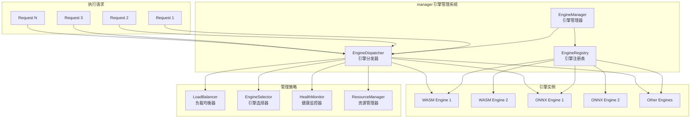
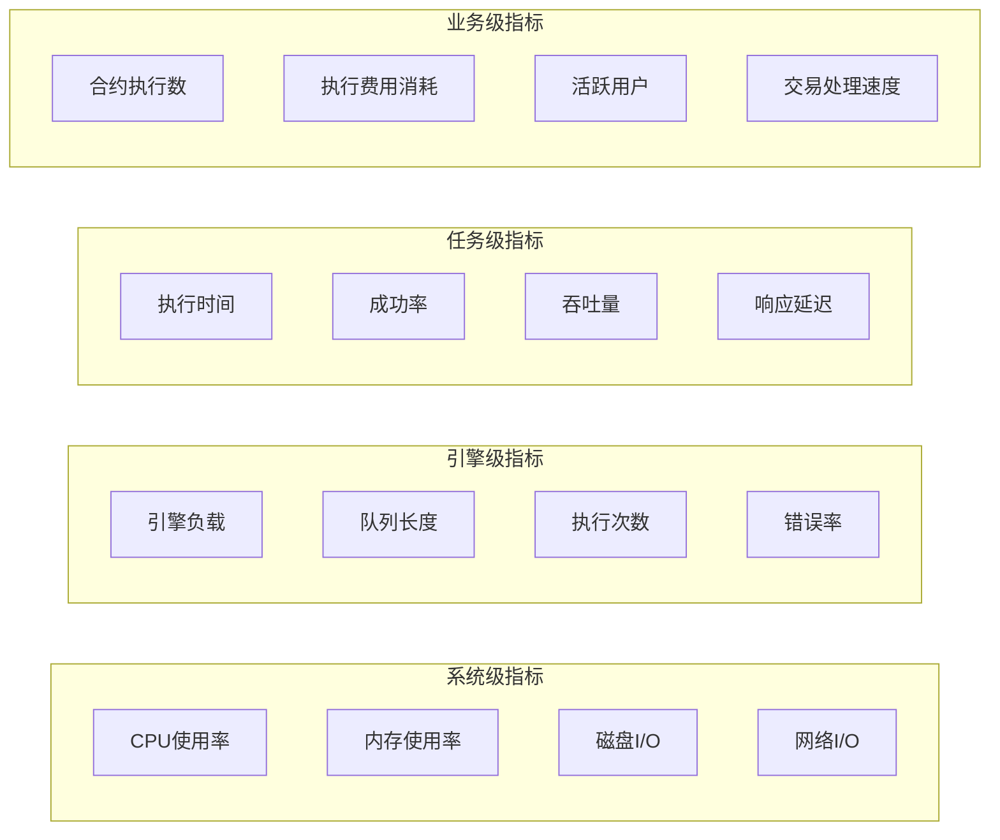

# 执行引擎管理系统（internal/core/execution/manager）

【模块目的】
　　本目录实现执行引擎的统一管理系统，负责引擎的注册、发现、选择、调度和生命周期管理。作为执行层的核心管理组件，提供多引擎环境下的统一管理和智能调度能力。

【设计原则】
- 引擎无关：提供统一的引擎管理接口，支持不同类型的执行引擎
- 动态管理：支持引擎的动态注册、卸载和热插拔
- 智能调度：根据任务特性和引擎能力进行智能的引擎选择
- 负载均衡：在多引擎实例间实现负载均衡和资源优化
- 故障隔离：引擎故障不影响其他引擎和整体系统稳定性

【核心职责】
1. **引擎注册管理**：统一管理各类执行引擎的注册和发现
2. **引擎选择调度**：根据任务需求智能选择最适合的执行引擎
3. **执行请求分发**：将执行请求分发到选定的引擎实例
4. **引擎生命周期**：管理引擎实例的创建、初始化、销毁等生命周期
5. **性能监控优化**：监控引擎性能，进行负载均衡和资源优化
6. **故障检测恢复**：检测引擎故障，执行故障恢复和隔离

【架构组件】



【文件说明】

## engine_manager.go
**功能**：执行引擎管理器的核心实现
**职责**：
- 引擎的统一注册和管理
- 执行请求的接收和路由
- 引擎健康状态监控
- 系统级资源管理和优化

**核心组件**：
```go
type EngineManager struct {
    registry      EngineRegistry
    dispatcher    EngineDispatcher
    loadBalancer  LoadBalancer
    healthMonitor HealthMonitor
    metrics       EngineMetricsCollector
    config        ManagerConfig
    logger        Logger
}
```

**主要方法**：
- `RegisterEngine()`: 注册新的执行引擎
- `UnregisterEngine()`: 卸载执行引擎
- `ExecuteWithEngine()`: 使用指定引擎执行
- `ExecuteWithSelection()`: 智能选择引擎执行
- `GetEngineStatus()`: 获取引擎状态信息
- `GetSystemMetrics()`: 获取系统性能指标

## dispatcher.go
**功能**：执行请求分发器
**职责**：
- 执行请求的智能路由
- 引擎负载均衡
- 请求队列管理
- 执行结果聚合

**分发策略**：
```go
type DispatchStrategy string

const (
    RoundRobin     DispatchStrategy = "round_robin"     // 轮询调度
    LeastLoaded    DispatchStrategy = "least_loaded"    // 最少负载
    WeightedRandom DispatchStrategy = "weighted_random" // 加权随机
    Capability     DispatchStrategy = "capability"      // 能力匹配
    Affinity       DispatchStrategy = "affinity"        // 亲和性调度
)
```

**核心功能**：
- 请求预处理和验证
- 引擎能力匹配
- 负载均衡计算
- 执行结果后处理

## registry.go
**功能**：引擎注册表
**职责**：
- 引擎实例的注册和发现
- 引擎元数据管理
- 引擎能力信息维护
- 引擎生命周期跟踪

**注册信息**：
```go
type EngineRegistration struct {
    EngineID     string
    EngineType   types.EngineType
    Version      string
    Capabilities []string
    Instance     execution.EngineAdapter
    Metadata     map[string]interface{}
    Status       EngineStatus
    RegisterTime time.Time
    LastSeen     time.Time
}
```

**能力描述**：
```go
type EngineCapability struct {
    Name         string   // 能力名称
    Version      string   // 能力版本
    ResourceTypes []string // 支持的资源类型
    Features     []string // 特性列表
    Performance  PerformanceProfile // 性能描述
    Limitations  []string // 限制条件
}
```

【引擎选择策略】

```mermaid
graph TB
    subgraph "引擎选择决策树"
        START["开始选择"]
        
        CHECK_TYPE["检查资源类型"]
        FILTER_TYPE["过滤支持的引擎"]
        
        CHECK_CAPABILITY["检查能力需求"]
        FILTER_CAPABILITY["过滤满足能力的引擎"]
        
        CHECK_LOAD["检查负载情况"]
        FILTER_LOAD["过滤可用引擎"]
        
        CHECK_AFFINITY["检查亲和性"]
        APPLY_AFFINITY["应用亲和性策略"]
        
        SELECT_OPTIMAL["选择最优引擎"]
        FALLBACK["降级选择"]
        
        RESULT["返回选择结果"]
    end
    
    START --> CHECK_TYPE
    CHECK_TYPE --> FILTER_TYPE
    FILTER_TYPE --> CHECK_CAPABILITY
    CHECK_CAPABILITY --> FILTER_CAPABILITY
    FILTER_CAPABILITY --> CHECK_LOAD
    CHECK_LOAD --> FILTER_LOAD
    FILTER_LOAD --> CHECK_AFFINITY
    CHECK_AFFINITY --> APPLY_AFFINITY
    APPLY_AFFINITY --> SELECT_OPTIMAL
    SELECT_OPTIMAL --> RESULT
    SELECT_OPTIMAL --> FALLBACK
    FALLBACK --> RESULT
```



【选择因子权重】

| 选择因子 | 权重 | 影响范围 | 计算方法 |
|---------|------|---------|---------|
| 引擎类型匹配 | 40% | 强制过滤 | 完全匹配=1, 不匹配=0 |
| 能力匹配度 | 25% | 优先级排序 | 匹配能力数/总需求能力数 |
| 当前负载 | 20% | 负载均衡 | (最大负载-当前负载)/最大负载 |
| 历史性能 | 10% | 性能优化 | 平均执行时间的倒数 |
| 亲和性 | 5% | 优化选择 | 亲和性分数0-1 |

【负载均衡算法】

```go
// 负载均衡器接口
type LoadBalancer interface {
    SelectEngine(engines []EngineInfo, request ExecutionRequest) (EngineInfo, error)
    UpdateEngineLoad(engineID string, load LoadInfo)
    GetEngineLoads() map[string]LoadInfo
}

// 负载信息
type LoadInfo struct {
    CPU        float64   // CPU使用率
    Memory     uint64    // 内存使用量
    Queue      int       // 队列长度
    ActiveJobs int       // 活跃任务数
    Timestamp  time.Time // 更新时间
}
```

**负载均衡策略**：
1. **轮询均衡**：依次轮流分配请求
2. **加权轮询**：根据引擎能力分配权重
3. **最少连接**：选择当前负载最轻的引擎
4. **加权最少连接**：结合权重的最少连接算法
5. **一致性哈希**：基于请求特征的一致性分配

【健康监控机制】

```go
// 引擎健康状态
type EngineHealth struct {
    Status      EngineStatus  // 引擎状态
    LastCheck   time.Time     // 最后检查时间
    Uptime      time.Duration // 运行时间
    ErrorCount  uint64        // 错误计数
    SuccessRate float64       // 成功率
    Performance PerformanceMetrics // 性能指标
}

// 健康检查策略
type HealthCheckConfig struct {
    Enabled          bool          // 是否启用健康检查
    Interval         time.Duration // 检查间隔
    Timeout          time.Duration // 检查超时
    FailureThreshold int           // 失败阈值
    SuccessThreshold int           // 恢复阈值
    CheckEndpoint    string        // 检查端点
}
```

**健康状态分类**：
- **Healthy**: 引擎正常运行
- **Degraded**: 引擎性能下降但可用
- **Unhealthy**: 引擎故障不可用
- **Unknown**: 引擎状态未知
- **Recovering**: 引擎正在恢复中

【性能指标体系】



【配置参数】

```go
type ManagerConfig struct {
    // 引擎管理配置
    MaxEngines           int           // 最大引擎数量
    DefaultEngineType    string        // 默认引擎类型
    EngineStartTimeout   time.Duration // 引擎启动超时
    EngineStopTimeout    time.Duration // 引擎停止超时
    
    // 调度配置
    DispatchStrategy     string        // 分发策略
    LoadBalanceAlgorithm string        // 负载均衡算法
    AffinityEnabled      bool          // 是否启用亲和性
    
    // 健康检查配置
    HealthCheckEnabled   bool          // 是否启用健康检查
    HealthCheckInterval  time.Duration // 健康检查间隔
    FailureThreshold     int           // 故障阈值
    
    // 性能配置
    MaxQueueSize         int           // 最大队列大小
    RequestTimeout       time.Duration // 请求超时时间
    MetricsEnabled       bool          // 是否启用指标收集
}
```

【故障处理策略】

| 故障类型 | 检测方法 | 处理策略 | 恢复机制 |
|---------|---------|---------|---------|
| 引擎无响应 | 健康检查超时 | 标记不可用，停止分发 | 定期重试，自动恢复 |
| 执行失败 | 执行结果错误 | 重试其他引擎 | 分析原因，修复后恢复 |
| 内存泄漏 | 内存使用持续增长 | 重启引擎实例 | 更新引擎版本 |
| 性能下降 | 响应时间增加 | 降低权重分配 | 性能调优后恢复 |
| 崩溃异常 | 进程退出 | 自动重启引擎 | 检查日志，修复问题 |

【使用示例】

```go
// 创建引擎管理器
manager := NewEngineManager(config)

// 注册WASM引擎
wasmEngine := wasm.NewWASMEngine()
manager.RegisterEngine("wasm-1", types.EngineTypeWASM, wasmEngine)

// 注册ONNX引擎
onnxEngine := onnx.NewONNXEngine()
manager.RegisterEngine("onnx-1", types.EngineTypeONNX, onnxEngine)

// 执行请求 - 自动选择引擎
result, err := manager.ExecuteWithSelection(ctx, types.ExecutionParams{
    ResourceType: types.EngineTypeWASM,
    ResourceID:   contractID,
    Input:        inputData,
    执行费用Limit:     执行费用Limit,
})

// 执行请求 - 指定引擎
result, err := manager.ExecuteWithEngine(ctx, "wasm-1", params)
```

【扩展指南】

1. **自定义分发策略**：
```go
// 实现自定义分发策略
type CustomDispatcher struct{}

func (d *CustomDispatcher) Dispatch(request ExecutionRequest, engines []EngineInfo) (EngineInfo, error) {
    // 自定义分发逻辑
    return selectedEngine, nil
}

// 注册自定义策略
manager.RegisterDispatchStrategy("custom", &CustomDispatcher{})
```

2. **自定义健康检查**：
```go
// 实现自定义健康检查
type CustomHealthChecker struct{}

func (h *CustomHealthChecker) CheckHealth(engine EngineInfo) EngineHealth {
    // 自定义健康检查逻辑
    return health
}
```

3. **自定义负载均衡**：
```go
// 实现自定义负载均衡算法
type CustomLoadBalancer struct{}

func (lb *CustomLoadBalancer) SelectEngine(engines []EngineInfo, request ExecutionRequest) (EngineInfo, error) {
    // 自定义选择逻辑
    return selectedEngine, nil
}
```

【故障排查】

常见问题及解决方案：

1. **引擎注册失败**：
   - 检查引擎接口实现
   - 验证引擎配置参数
   - 查看注册日志信息

2. **分发选择错误**：
   - 检查选择策略配置
   - 验证引擎能力匹配
   - 分析负载均衡算法

3. **性能问题**：
   - 监控系统资源使用
   - 分析引擎负载分布
   - 优化分发策略参数

4. **引擎故障**：
   - 查看引擎健康状态
   - 分析错误日志信息
   - 执行引擎重启恢复

【依赖关系】

本模块依赖以下组件：
- `pkg/interfaces/execution`: 执行接口定义
- `pkg/types`: 通用类型定义
- `internal/core/engines/*`: 各种执行引擎实现
- 监控系统：用于性能指标收集
- 配置管理：用于管理器配置
- 日志系统：用于操作日志记录
