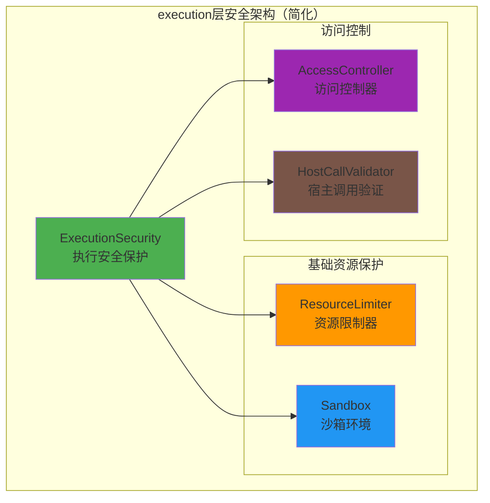
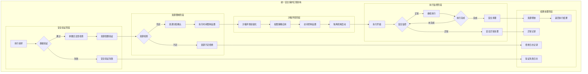
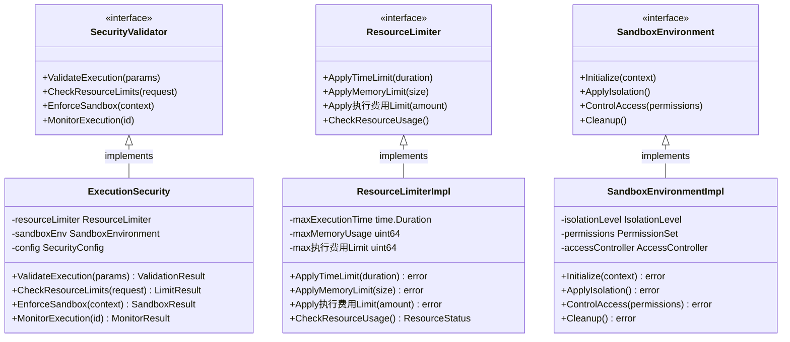

# 执行安全保护（internal/core/execution/security）

【模块重新定位】
　　基于"区块链节点 → 自包含 → 自运行"的核心原则，本模块专注于execution层的**最小必要安全保护**，确保智能合约和AI推理模型的安全执行，而非企业级安全管理。

【设计原则】
- **极简安全**：只保护execution核心流程，避免过度设计
- **自包含运行**：固化安全策略，无需外部依赖和复杂配置
- **资源保护优先**：重点防护资源耗尽，确保节点稳定运行
- **执行环境隔离**：提供基础沙箱保护，防止恶意代码影响节点

【真实业务需求】
基于execution模块的核心职责（执行智能合约和AI推理模型），security模块的真实需求是：

1. **基础资源限制**：防止单次执行耗尽节点资源
   - 执行时间限制（防止死循环）
   - 内存使用限制（防止内存攻击）
   - 执行费用消耗限制（防止资源滥用）

2. **安全执行环境**：确保代码在受控环境中运行
   - 沙箱隔离机制
   - 宿主函数访问控制
   - 系统调用限制

3. **基础访问验证**：控制执行权限范围
   - 模块导入验证
   - 函数调用权限检查

【不再支持的企业级功能】
以下功能超出了execution层的职责范围，已从架构中移除：

- ❌ **威胁检测系统**：属于SOC/安全运营中心职责
- ❌ **复杂配额管理**：多维度配额分配超出execution需求
- ❌ **实时安全监控**：属于基础设施监控层职责  
- ❌ **威胁情报集成**：外部安全服务，非节点内部需求
- ❌ **合规性检查**：属于业务层合规要求
- ❌ **异常检测分析**：属于运维监控层职责

【简化架构】



【核心职责】
1. **资源限制保护**：防止执行过程耗尽节点资源
2. **沙箱环境提供**：确保代码在安全隔离环境中运行
3. **访问权限控制**：限制宿主函数和系统调用范围
4. **基础执行验证**：验证执行参数的合法性

【文件说明】

## execution_security.go（简化重构）
**功能**：执行安全保护的核心实现
**核心职责**：
- 执行前资源限制检查
- 沙箱环境初始化
- 宿主函数访问控制
- 执行参数安全验证

**核心组件**：
```go
type ExecutionSecurity struct {
    // 资源限制配置（固化策略）
    maxExecutionTime time.Duration // 最大执行时间：30秒
    maxMemoryUsage   uint64        // 最大内存使用：64MB  
    max执行费用Limit      uint64        // 最大执行费用限制：100万
    
    // 访问控制配置（固化策略）
    sandboxEnabled   bool          // 沙箱模式：强制启用
    allowedHostFuncs []string      // 允许的宿主函数白名单
}
```

**主要方法**：
- `ValidateExecution()`: 执行前安全验证
- `ApplyResourceLimits()`: 应用资源限制
- `ValidateHostCall()`: 验证宿主函数调用
- `CreateSandboxContext()`: 创建沙箱执行上下文

## resource_limiter.go（新增）
**功能**：资源限制器实现
**核心职责**：
- 执行时间控制
- 内存使用监控
- 执行费用消耗限制

## sandbox_env.go（新增）
**功能**：沙箱执行环境
**核心职责**：
- 进程隔离机制
- 文件系统访问控制
- 网络访问隔离

【固化安全策略】
基于"自运行节点"原则，所有安全策略均为固化配置，无需运行时调整：

```go
// 固化的安全配置
const (
    MaxExecutionTimeMs = 30000    // 30秒执行超时
    MaxMemoryBytes     = 67108864 // 64MB内存限制
    Max执行费用Limit        = 1000000  // 100万执行费用限制
    
    SandboxMode        = true     // 强制沙箱模式
    HostCallWhitelist  = []string{
        "blockchain.getBlockHeight",
        "blockchain.getTransaction", 
        "storage.get",
        "storage.set",
    }
)
```

【性能基准】
简化后的security模块性能目标：

| 操作 | 目标性能 | 资源消耗 |
|------|---------|---------|
| 执行前验证 | < 1ms | 最小化 |
| 沙箱初始化 | < 5ms | 低内存 |
| 资源限制检查 | < 0.1ms | 零分配 |
| 宿主调用验证 | < 0.5ms | 内存池复用 |

【集成方式】
security模块通过coordinator统一调用，不直接对外暴露：

```go
// coordinator中的集成示例
func (c *ExecutionCoordinator) Execute(params types.ExecutionParams) (*types.ExecutionResult, error) {
    // 1. 安全验证（简化）
    if err := c.security.ValidateExecution(params); err != nil {
        return nil, fmt.Errorf("security validation failed: %w", err)
    }
    
    // 2. 应用资源限制
    ctx := c.security.ApplyResourceLimits(context.Background())
    
    // 3. 执行合约/模型
    return c.executeInSandbox(ctx, params)
}
```

【验收标准】
1. ✅ **功能完备性**：满足execution层基础安全需求
2. ✅ **性能优异性**：安全检查延迟 < 1ms
3. ✅ **资源经济性**：内存占用 < 1MB
4. ✅ **配置简单性**：零配置即可运行
5. ✅ **代码简洁性**：核心代码 < 500行

【后续演进】
security模块将专注于execution安全的持续优化：
- 性能优化：进一步降低安全检查开销
- 沙箱增强：更完善的进程隔离机制
- 兼容性：支持更多执行引擎的安全需求

---

## 📁 **模块组织结构**

【内部模块架构】

```
internal/core/execution/security/
├── 🛡️ execution_security.go          # 执行安全保护核心实现
├── ⚡ resource_limiter.go            # 资源限制器实现
├── 🏠 sandbox_env.go                 # 沙箱执行环境实现
├── 📝 README.md                      # 本文档
└── 📊 tests/                         # 测试文件目录
    ├── security_test.go               # 安全保护单元测试
    ├── resource_test.go               # 资源限制测试
    └── sandbox_test.go                # 沙箱环境测试
```

### **🎯 子模块职责分工**

| **文件模块** | **核心职责** | **对外接口** | **内部组件** | **复杂度** |
|-------------|-------------|-------------|-------------|-----------|
| `execution_security.go` | 执行安全保护核心逻辑 | ExecutionSecurity | 验证器、限制器、监控器 | 中 |
| `resource_limiter.go` | 资源使用限制和控制 | ResourceLimiter | 时间控制、内存监控、执行费用限制 | 中 |
| `sandbox_env.go` | 沙箱执行环境管理 | SandboxEnvironment | 隔离机制、权限控制、访问管理 | 高 |
| `tests/` | 安全功能测试验证 | 测试工具和框架 | 单元测试、集成测试、安全测试 | 中 |

---

## 🔄 **统一安全保护实现**

【实现策略】

　　所有安全保护组件均严格遵循**最小必要安全保护**原则，确保执行环境的基础安全和资源保护。



**关键实现要点：**

1. **基础安全验证**：
   - 执行参数的基本合法性验证
   - 资源配额和权限的基础检查
   - 恶意模式的简单识别和拒绝

2. **资源限制保护**：
   - 固化的资源限制策略执行
   - 执行时间、内存、执行费用的严格控制
   - 资源耗尽的及时检测和中断

3. **沙箱环境隔离**：
   - 基础的进程隔离和权限控制
   - 系统调用和文件访问的限制
   - 网络访问的完全隔离

---

## 🏗️ **依赖注入架构**

【fx框架集成】

　　采用fx依赖注入框架实现安全组件的简洁装配和生命周期管理。

**依赖注入设计**：
- **安全组件装配**：自动装配执行安全器、资源限制器、沙箱环境
- **固化策略应用**：通过配置注入固化的安全策略和限制参数
- **接口导向**：通过接口而非具体类型进行依赖注入
- **生命周期管理**：简化的组件初始化和清理过程

**核心组件依赖关系**：
- ExecutionSecurity依赖ResourceLimiter、SandboxEnvironment
- ResourceLimiter依赖固化的配置参数和监控接口
- SandboxEnvironment依赖操作系统隔离机制和权限控制
- 所有组件共享基础的Logger和Config服务

---

## 📊 **性能与监控**

【性能指标】

| **操作类型** | **目标延迟** | **资源占用** | **成功率** | **监控方式** |
|-------------|-------------|-------------|-----------|------------|
| 执行前验证 | < 1ms | 最小化 | > 99% | 实时监控 |
| 沙箱初始化 | < 5ms | 低内存 | > 98% | 批量统计 |
| 资源限制检查 | < 0.1ms | 零分配 | > 99.9% | 关键路径监控 |
| 安全监控 | < 0.5ms | 内存池复用 | > 99% | 异步监控 |
| 环境清理 | < 2ms | 及时回收 | > 97% | 批量统计 |

**性能优化策略：**
- **验证优化**：固化策略、快速失败、缓存结果
- **监控优化**：采样监控、异步处理、批量记录
- **资源优化**：对象池化、内存复用、及时释放
- **隔离优化**：轻量级沙箱、快速启动、高效清理

---

## 🔗 **与公共接口的映射关系**

【接口实现映射】



**实现要点：**
- **接口契约**：严格遵循安全验证接口定义和保护规范
- **错误处理**：简化的错误处理和安全异常恢复机制
- **日志记录**：必要的安全操作日志和异常记录
- **测试覆盖**：完整的安全功能测试和基准性能测试

---

## 🚀 **后续扩展规划**

【模块演进方向】

1. **安全机制增强**
   - 优化沙箱隔离的性能和安全性
   - 增强资源限制的精确度和效率
   - 改进威胁检测的准确性和速度

2. **性能优化改进**
   - 进一步降低安全检查的延迟开销
   - 优化沙箱环境的启动和清理性能
   - 减少安全监控的资源消耗

3. **兼容性扩展**
   - 支持更多执行引擎的安全需求
   - 适配不同操作系统的沙箱机制
   - 兼容更多类型的资源限制场景

4. **监控能力提升**
   - 提供更详细的安全监控指标
   - 增强安全异常的诊断能力
   - 优化安全日志的结构和内容

---

## 📋 **开发指南**

【安全组件开发规范】

1. **新组件接入步骤**：
   - 定义安全组件接口和验证契约
   - 实现核心安全逻辑和资源保护机制
   - 添加必要的监控和日志记录功能
   - 完成安全测试和性能基准测试

2. **代码质量要求**：
   - 遵循Go语言最佳实践和项目编码规范
   - 实现完整的错误处理和异常恢复机制
   - 提供详细的代码注释和技术文档
   - 保证100%的安全关键功能测试覆盖率

3. **性能要求**：
   - 安全检查延迟必须控制在设计目标以内
   - 内存使用最小化，避免不必要的分配
   - 实现高效的资源清理和生命周期管理
   - 支持高频执行的安全验证需求

【参考文档】
- [执行协调器](../coordinator/README.md)
- [宿主能力提供系统](../host/README.md)
- [执行引擎管理器](../manager/README.md)
- [副作用处理系统](../effects/README.md)
- [执行接口规范](../../../../pkg/interfaces/execution/)
- [WES架构设计文档](../../../../docs/architecture/)

---

> 📝 **模板说明**：本README模板基于WES v0.0.1统一文档规范设计，使用时请根据具体模块需求替换相应的占位符内容，并确保所有章节都有实质性的技术内容。

> 🔄 **维护指南**：本文档应随着模块功能的演进及时更新，确保文档与代码实现的一致性。建议在每次重大功能变更后更新相应章节。

**注意**：本模块不再承担企业级安全管理职责，专注于为区块链节点execution层提供最小必要的安全保护。