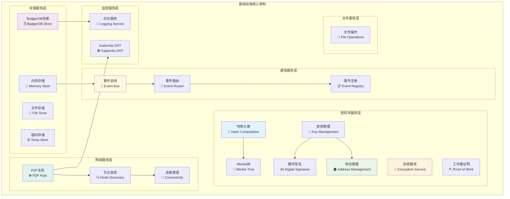
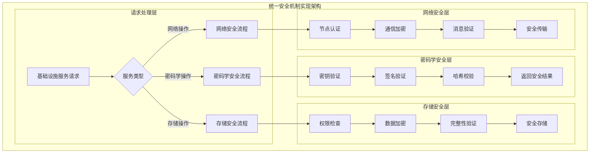
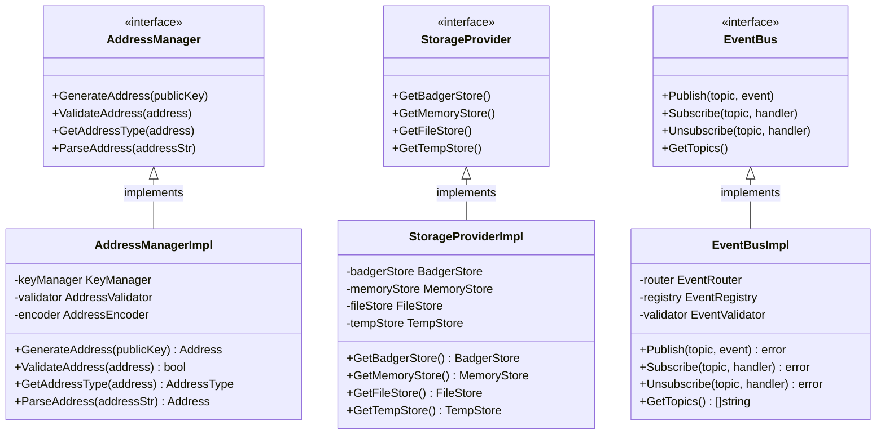

# 基础设施核心模块（internal/core/infrastructure）

【模块定位】
　　本模块是WES系统中基础设施服务的核心实现层，负责为整个区块链系统提供密码学、存储、日志、事件、节点管理、文件操作等底层基础能力。通过模块化的架构设计和统一的接口标准，提供高性能、高可靠性的基础设施服务，支撑上层业务模块的核心需求，确保系统的稳定运行和安全保障。

【设计原则】
- **统一接口标准**：严格实现pkg/interfaces/infrastructure定义的所有公共接口
- **模块化设计**：按功能域组织子模块，确保高内聚低耦合
- **安全优先**：密码学和安全机制贯穿所有基础设施组件
- **高性能优化**：采用缓存、连接池、异步处理等技术提升性能
- **依赖注入驱动**：遵循fx框架，通过依赖注入实现组件协作
- **可观测性保障**：完善的日志、事件和监控机制

【核心职责】
1. **密码学服务**：提供地址、加密、哈希、密钥、Merkle树、PoW、签名等密码学能力
2. **存储服务**：提供BadgerDB、内存存储、文件存储、临时存储等多种存储后端
3. **日志服务**：提供统一的结构化日志记录和管理能力
4. **事件服务**：提供事件总线、路由、注册、验证等事件驱动架构支持
5. **节点服务**：提供P2P网络节点的构建、连接、发现等网络基础能力
6. **文件服务**：提供文件系统操作和管理的抽象接口

【实现架构】

　　采用**分层模块化**的六层实现架构，确保基础设施服务的有序组织和高效协作。



**架构层次说明：**

1. **密码学服务层**：为整个系统提供完整的密码学基础能力
   - 地址生成和验证
   - 数据加密和解密
   - 哈希计算和验证

2. **存储服务层**：提供多种存储后端的统一抽象
   - 持久化存储（BadgerDB）
   - 高速缓存（内存存储）
   - 文件系统存储

3. **通信服务层**：支持事件驱动架构的核心组件
   - 异步事件传递
   - 智能事件路由
   - 动态事件注册

4. **网络服务层**：P2P网络的基础设施支持
   - 网络主机构建
   - 节点发现机制
   - 连接管理优化

5. **监控服务层**：系统可观测性的基础支撑
   - 结构化日志记录
   - 分布式哈希表

6. **文件服务层**：文件系统操作的抽象接口
   - 跨平台文件操作
   - 文件权限管理

---

## 📁 **模块组织结构**

【内部模块架构】

```
internal/core/infrastructure/
├── 🔐 crypto/                 # 密码学服务实现
│   ├── address/               # 地址生成和验证
│   ├── encryption/            # 数据加密解密
│   ├── hash/                  # 哈希计算服务
│   ├── key/                   # 密钥管理服务
│   ├── merkle/                # Merkle树实现
│   ├── pow/                   # 工作量证明
│   ├── signature/             # 数字签名服务
│   └── module.go              # 密码学模块装配
├── 🗄️ storage/                # 存储服务实现
│   ├── badger/                # BadgerDB存储后端
│   ├── memory/                # 内存存储后端
│   ├── file/                  # 文件存储后端
│   ├── tempstore/             # 临时存储后端
│   ├── provider.go            # 存储提供者
│   └── module.go              # 存储模块装配
├── 📝 log/                    # 日志服务实现
│   ├── log.go                 # 日志接口实现
│   ├── module.go              # 日志模块装配
│   └── example.go             # 使用示例
├── 📡 event/                  # 事件服务实现
│   ├── eventbus.go            # 事件总线核心
│   ├── router.go              # 事件路由器
│   ├── registry.go            # 事件注册器
│   ├── coordinator.go         # 事件协调器
│   ├── standards.go           # 事件标准定义
│   ├── validator.go           # 事件验证器
│   └── module.go              # 事件模块装配
├── 🌐 node/                   # 节点服务实现
│   ├── service.go             # 节点服务接口
│   ├── impl/                  # 节点服务实现
│   │   ├── host/              # P2P主机构建
│   │   └── discovery/         # 节点发现机制
│   ├── module.go              # 节点模块装配
│   └── TROUBLESHOOTING.md     # 故障排查指南
├── 🕸️ kademlia/               # Kademlia DHT实现
│   ├── manager.go             # DHT管理器
│   ├── bucket.go              # K桶管理
│   ├── distance.go            # 距离计算
│   ├── selector.go            # 节点选择
│   ├── keyspace/              # 键空间管理
│   ├── peerdiversity/         # 节点多样性
│   └── module.go              # Kademlia模块装配
├── 📂 file/                   # 文件服务实现（预留）
└── 📖 README.md               # 本文档
```

### **🎯 子模块职责分工**

| **子模块** | **核心职责** | **对外接口** | **内部组件** | **复杂度** |
|-----------|-------------|-------------|-------------|-----------|
| `crypto/` | 密码学服务提供 | 7个密码学接口 | 地址、加密、哈希、密钥、Merkle、PoW、签名 | ⭐⭐⭐⭐⭐ |
| `storage/` | 存储后端管理 | StorageProvider接口 | BadgerDB、内存、文件、临时存储 | ⭐⭐⭐⭐ |
| `log/` | 日志记录服务 | Logger接口 | 结构化日志、级别控制 | ⭐⭐ |
| `event/` | 事件驱动支持 | EventBus相关接口 | 总线、路由、注册、协调、验证 | ⭐⭐⭐⭐ |
| `node/` | P2P节点服务 | NodeService接口 | 主机构建、发现、连接管理 | ⭐⭐⭐⭐⭐ |
| `kademlia/` | 分布式哈希表 | KademliaManager接口 | DHT管理、K桶、距离计算、节点选择 | ⭐⭐⭐⭐ |
| `file/` | 文件系统抽象 | FileService接口 | 文件操作、权限管理 | ⭐⭐ |

---

## 🔄 **统一安全机制实现**

【实现策略】

　　所有子模块均严格遵循**安全优先**架构模式，确保系统安全性和数据完整性。



**关键实现要点：**

1. **密码学安全保障**：
   - 所有密钥操作都有安全验证
   - 签名验证确保数据完整性
   - 哈希校验防止数据篡改

2. **存储安全机制**：
   - 敏感数据自动加密存储
   - 访问权限严格控制
   - 数据完整性实时验证

3. **网络安全防护**：
   - P2P节点身份认证
   - 通信数据端到端加密
   - 消息完整性验证

---

## 🏗️ **依赖注入架构**

【fx框架集成】

　　全面采用fx依赖注入框架，实现组件间的松耦合和生命周期自动管理。

```go
// 示例：基础设施模块依赖注入配置
package infrastructure

import (
    "go.uber.org/fx"
    "github.com/weisyn/v1/pkg/interfaces/infrastructure"
)

// Module 基础设施核心模块
var Module = fx.Module("infrastructure",
    // 导入子模块
    fx.Provide(
        // 密码学服务层
        crypto.NewAddressManager,
        crypto.NewEncryptionManager,
        crypto.NewHashManager,
        crypto.NewKeyManager,
        crypto.NewMerkleManager,
        crypto.NewPoWEngine,
        crypto.NewSignatureManager,
        
        // 存储服务层
        storage.NewBadgerStore,
        storage.NewMemoryStore,
        storage.NewFileStore,
        storage.NewTempStore,
        storage.NewStorageProvider,
        
        // 通信服务层
        event.NewEventBus,
        event.NewEventRouter,
        event.NewEventRegistry,
        
        // 网络服务层
        node.NewNodeService,
        kademlia.NewKademliaManager,
        
        // 监控服务层
        log.NewLogger,
    ),
    
    // 导出公共接口
    fx.Provide(
        fx.Annotate(
            func(mgr *crypto.AddressManager) infrastructure.AddressManager {
                return mgr
            },
            fx.As(new(infrastructure.AddressManager)),
        ),
        fx.Annotate(
            func(provider *storage.Provider) infrastructure.StorageProvider {
                return provider
            },
            fx.As(new(infrastructure.StorageProvider)),
        ),
        // ... 其他接口导出
    ),
)
```

**依赖管理特点：**
- **自动生命周期**：组件启动和停止由fx自动管理
- **接口导向**：通过接口而非具体类型进行依赖
- **层次清晰**：明确的依赖方向，避免循环依赖
- **测试友好**：支持依赖注入的单元测试

---

## 📊 **性能与监控**

【性能指标】

| **操作类型** | **目标延迟** | **吞吐量目标** | **缓存命中率** | **监控方式** |
|-------------|-------------|---------------|--------------|------------|
| 哈希计算 | < 1ms | > 10000 OPS | N/A | 实时监控 |
| 签名验证 | < 5ms | > 2000 OPS | N/A | 实时监控 |
| 存储读取 | < 10ms | > 5000 QPS | > 90% | 批量统计 |
| 存储写入 | < 50ms | > 1000 TPS | N/A | 关键路径监控 |
| 事件传递 | < 2ms | > 20000 EPS | N/A | 异步监控 |
| 节点发现 | < 100ms | > 100 DPS | > 80% | 实时监控 |

**性能优化策略：**
- **密码学优化**：硬件加速、算法优化、批量处理
- **存储优化**：多级缓存、预取机制、批量写入
- **网络优化**：连接池、异步处理、智能路由
- **事件优化**：异步传递、批量处理、优先级队列

---

## 🔗 **与公共接口的映射关系**

【接口实现映射】



**实现要点：**
- **接口契约**：严格遵循公共接口的方法签名和语义
- **错误处理**：标准化的错误返回和异常处理机制
- **日志记录**：完善的操作日志和性能指标记录
- **测试覆盖**：每个接口方法都有对应的单元测试和集成测试

---

## 🚀 **后续扩展规划**

【模块演进方向】

1. **安全增强**
   - 硬件安全模块(HSM)集成
   - 零知识证明支持
   - 多重签名优化

2. **性能提升**
   - GPU加速密码学计算
   - 分布式存储后端
   - 异步处理优化

3. **功能扩展**
   - 更多密码学算法支持
   - 云存储后端集成
   - 高级事件路由策略

4. **运维增强**
   - 自动故障恢复
   - 性能调优建议
   - 健康检查机制

---

## 📋 **开发指南**

【子模块开发规范】

1. **新建子模块步骤**：
   - 在pkg/interfaces/infrastructure中定义公共接口
   - 创建子模块目录和基础文件
   - 实现核心业务逻辑
   - 添加完整的单元测试
   - 更新fx依赖注入配置

2. **代码质量要求**：
   - 遵循Go语言最佳实践
   - 100%的接口方法测试覆盖
   - 完善的错误处理机制
   - 清晰的代码注释和文档

3. **性能要求**：
   - 关键路径延迟指标达标
   - 内存使用合理，避免泄漏
   - 并发安全的数据访问
   - 合理的资源清理机制

【参考文档】
- [密码学服务](crypto/README.md)
- [存储服务](storage/README.md)
- [事件服务](event/README.md)
- [节点服务](node/README.md)
- [WES架构设计文档](../../../docs/architecture/)

---

> 📝 **模板说明**：本README模板基于WES v0.0.1统一文档规范设计，使用时请根据具体模块需求替换相应的占位符内容，并确保所有章节都有实质性的技术内容。

> 🔄 **维护指南**：本文档应随着模块功能的演进及时更新，确保文档与代码实现的一致性。建议在每次重大功能变更后更新相应章节。
