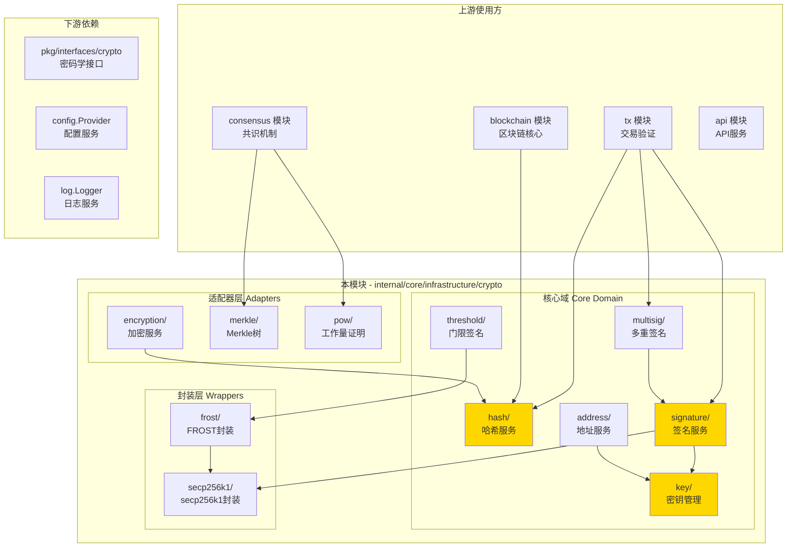
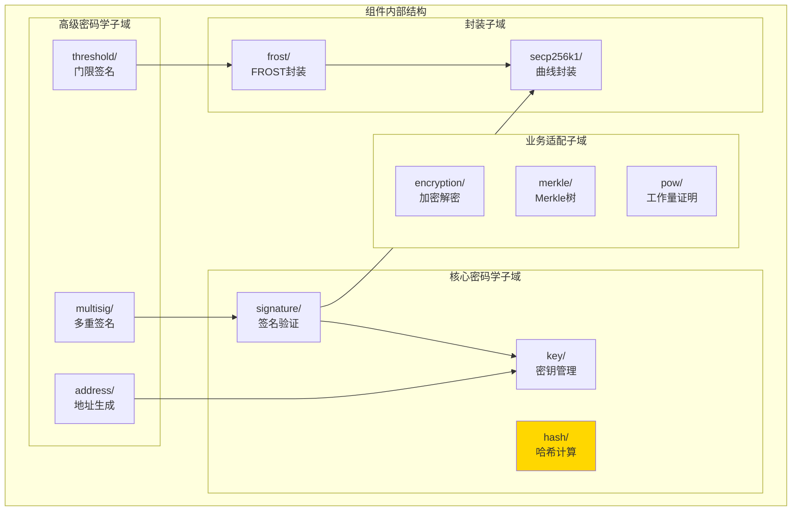
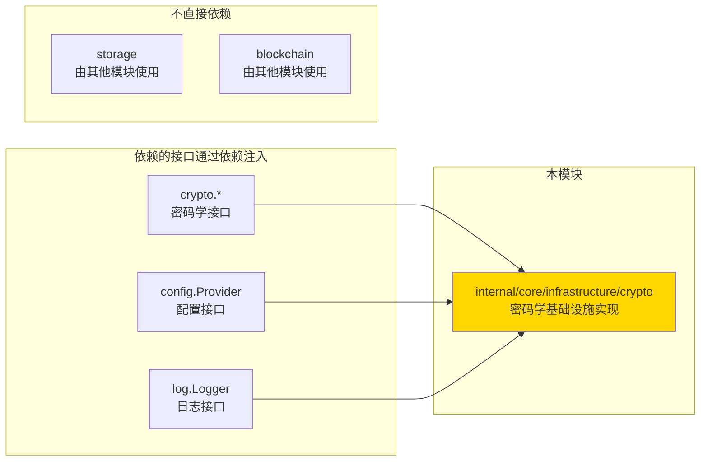

# Crypto - 密码学基础设施实现

---

## 📌 版本信息

- **版本**：1.0
- **状态**：stable
- **最后更新**：2025-11-15
- **最后审核**：2025-11-15
- **所有者**：密码学基础设施组
- **适用范围**：WES 项目密码学基础设施实现

---

## 🎯 实现定位

**路径**：`internal/core/infrastructure/crypto/`

**目的**：提供密码学基础设施的具体实现，实现密码学接口，并通过 `module.go` 配置依赖注入。

**核心原则**：
- ✅ 实现密码学接口（`pkg/interfaces/infrastructure/crypto`）
- ✅ 通过 `module.go` 统一管理依赖注入
- ✅ 保持实现与接口分离
- ✅ 遵循密码学安全最佳实践

**解决什么问题**：
- 提供统一的密码学服务（哈希、签名、密钥管理等）
- 支持多种签名方案（单签、多重签名、门限签名）
- 封装和隔离第三方密码学库依赖
- 提供高性能、安全的密码学操作

**不解决什么问题**（边界）：
- ❌ 不包含业务逻辑（由 tx 模块处理）
- ❌ 不处理协议层问题（由 blockchain 模块处理）
- ❌ 不管理持久化存储（由 storage 模块处理）

---

## 🏗️ 架构设计

### 整体架构

> **说明**：展示密码学基础设施模块的整体架构，包括核心域和适配器层



**架构说明**：

| 层级 | 组件 | 职责 | 关键机制 |
|-----|------|------|---------|
| **核心域** | hash, signature, key | 核心密码学算法 | 标准库、封装层 |
| **核心域** | address, multisig, threshold | 高级密码学功能 | 依赖核心域服务 |
| **适配器** | encryption, merkle, pow | 特定场景适配 | 业务适配层 |
| **封装层** | secp256k1, frost | 依赖隔离 | 封装第三方库 |
| **依赖** | interfaces, config, log | 外部接口 | 依赖注入 |

---

### 内部结构

> **说明**：展示组件内部的子模块组织和协作关系



**子域说明**：

| 子域 | 核心组件 | 职责 | 协作关系 |
|-----|---------|------|---------|
| **核心密码学** | hash, signature, key | 基础密码学算法 | hash为其他服务提供基础 |
| **高级密码学** | address, multisig, threshold | 高级签名功能 | 依赖核心密码学子域 |
| **业务适配** | encryption, merkle, pow | 业务场景适配 | 使用核心密码学服务 |
| **封装** | secp256k1, frost | 依赖隔离 | 为核心域提供封装接口 |

---

### 依赖关系

> **说明**：展示本组件依赖的外部组件接口



**依赖说明**：

| 依赖模块 | 依赖接口 | 用途 | 约束条件 |
|---------|---------|------|---------|
| **pkg/interfaces/infrastructure/crypto** | `KeyManager`, `SignatureManager` 等 | 实现密码学接口 | 必须实现所有接口方法 |
| **pkg/interfaces/config** | `Provider` | 配置管理 | 可选，用于POW配置 |
| **pkg/interfaces/infrastructure/log** | `Logger` | 日志记录 | 可选，nil时使用no-op logger |

---

## 📐 目录结构

```
internal/core/infrastructure/crypto/
├── README.md                    # 本文档（实现总览）
├── module.go                    # 依赖注入配置 ⭐
├── factory.go                   # 服务工厂（创建所有服务）
│
├── hash/                        # 哈希服务子域
│   ├── hash.go
│   ├── proto_adapters.go
│   └── README.md
│
├── key/                         # 密钥管理子域
│   ├── key.go
│   └── README.md
│
├── signature/                   # 签名服务子域
│   ├── signature.go
│   ├── signature_unix.go
│   ├── signature_wasm.go
│   └── README.md
│
├── address/                     # 地址服务子域
│   ├── address.go
│   ├── proto_converter.go
│   └── README.md
│
├── multisig/                   # 多重签名子域
│   ├── verifier.go
│   └── README.md
│
├── threshold/                  # 门限签名子域
│   ├── verifier.go
│   ├── bls.go
│   ├── frost.go
│   └── README.md
│
├── encryption/                 # 加密服务子域
│   ├── encryption.go
│   └── README.md
│
├── merkle/                     # Merkle树子域
│   ├── merkle.go
│   ├── tree.go
│   ├── proof.go
│   └── README.md
│
├── pow/                        # 工作量证明子域
│   ├── engine.go
│   ├── mining.go
│   └── README.md
│
├── secp256k1/                  # secp256k1封装层
│   └── curve.go
│
└── frost/                      # FROST封装层
    ├── verifier.go
    └── README.md
```

---

## 🔧 核心实现文件

### 实现 1：`factory.go`

**实现对象**：`CreateCryptoServices`

**职责**：创建所有密码学服务实例，处理服务间的依赖关系

**关键逻辑**：

```go
func CreateCryptoServices(input ServiceInput) (ServiceOutput, error) {
    // 1. 创建基础服务（无依赖）
    hashService := hash.NewHashService()
    keyManager := key.NewKeyManager()
    
    // 2. 创建依赖服务
    addressService := address.NewAddressService(keyManager)
    sigService := signature.NewSignatureService(keyManager, addressService)
    
    // 3. 创建高级服务
    multiSigVerifier := multisig.NewMultiSignatureVerifier(sigService)
    
    // 4. 返回所有服务
    return ServiceOutput{...}, nil
}
```

**实现要点**：
- 服务创建顺序遵循依赖关系
- 处理可选依赖（Logger、Config）
- 统一的错误处理和日志记录

---

### 实现 2：`module.go`

**实现对象**：`Module`, `ProvideCryptoServices`

**职责**：配置FX依赖注入，将实现绑定到公共接口

**关键配置**：

```go
func Module() fx.Option {
    return fx.Module("crypto",
        fx.Provide(ProvideCryptoServices),
    )
}

func ProvideCryptoServices(params CryptoParams) (CryptoOutput, error) {
    serviceOutput, err := CreateCryptoServices(...)
    return CryptoOutput{
        KeyManager:       serviceOutput.KeyManager,
        SignatureManager: serviceOutput.SignatureManager,
        // ... 其他服务
    }, nil
}
```

**配置说明**：

| 配置项 | 说明 | 备注 |
|-------|------|-----|
| `fx.Module` | 定义模块名称 | "crypto" |
| `fx.Provide` | 提供服务 | 通过 `CryptoOutput` 结构体导出 |
| `CryptoOutput` | 输出结构 | 使用 `fx.Out` 标签，支持无名注入 |

---

## ⚙️ 依赖注入配置（module.go）⭐

**文件**：`module.go`

**职责**：
- 将具体实现绑定到公共接口
- 配置组件的依赖关系
- 管理组件生命周期

**依赖注入示意图**：

```
module.go 配置
    ↓ fx.Provide
ProvideCryptoServices 构造函数
    ↓ 调用
CreateCryptoServices 工厂函数
    ↓ 创建服务实例
ServiceOutput 服务集合
    ↓ 转换为
CryptoOutput (fx.Out)
    ↓ 供其他模块使用
其他模块通过接口调用（KeyManager、SignatureManager等）
```

**关键约束**：
- ✅ 实现 → 通过 factory 创建服务实例
- ✅ module.go → 绑定到公共接口（通过 CryptoOutput）
- ✅ 其他模块 → 通过接口使用（依赖注入）

---

## 🔄 架构层次关系

```
pkg/interfaces/infrastructure/crypto/              ← 公共接口（对外契约）
    ↓ 实现
internal/core/infrastructure/crypto/              ← 您在这里（具体实现）
    ├── hash/             实现 HashManager
    ├── signature/         实现 SignatureManager
    ├── key/              实现 KeyManager
    ├── address/           实现 AddressManager
    ├── multisig/         实现 MultiSignatureVerifier
    └── ...
    ↓ 装配
internal/core/infrastructure/crypto/module.go     ← 依赖注入配置
    ↓ 提供
其他模块通过公共接口调用
    ├── tx 模块使用 SignatureManager
    ├── consensus 模块使用 HashManager、POWEngine
    └── blockchain 模块使用 HashManager
```

**关键约束**：
- ✅ 实现 → 实现公共接口
- ✅ module.go → 绑定到公共接口（通过 CryptoOutput）
- ❌ 禁止：实现 → 直接暴露具体类型给外部

---

## 📊 实现细节

### 关键设计决策

**决策 1：依赖隔离封装层**
- **问题**：需要隔离区块链特定库（dcrd、btcd）依赖
- **方案**：创建封装层（secp256k1、frost）封装第三方库
- **理由**：保持核心代码与第三方库解耦，便于未来替换
- **权衡**：增加一层抽象，但提升可维护性

**决策 2：服务工厂模式**
- **问题**：服务创建逻辑复杂，依赖关系多
- **方案**：使用 factory.go 集中管理服务创建
- **理由**：将复杂逻辑从 module.go 分离，保持 module.go 简洁
- **权衡**：增加文件，但提高可维护性

**决策 3：多重签名提取到Crypto层**
- **问题**：MultiKey验证逻辑在TX层，违反职责分离
- **方案**：提取到 crypto/multisig 子域
- **理由**：密码学验证属于基础设施层职责
- **权衡**：增加模块，但职责更清晰

---

### 性能优化

| 优化点 | 方案 | 效果 |
|-------|------|-----|
| 哈希缓存 | 实现哈希结果缓存 | 减少重复计算 |
| 批量验证 | 支持批量签名验证 | 提高吞吐量 |
| 内存池 | 使用对象池管理密钥 | 减少GC压力 |

---

### 错误处理

**错误处理原则**：
- ✅ 使用明确的错误类型
- ✅ 包含足够的上下文信息
- ✅ 区分可恢复和不可恢复错误

**典型错误**：
- `ErrInvalidKey` - 无效的密钥格式
- `ErrInvalidSignature` - 无效的签名
- `ErrInvalidAddress` - 无效的地址格式

---

### 并发安全

| 字段/方法 | 是否并发安全 | 保护机制 |
|----------|------------|---------|
| `HashManager` | ✅ 是 | 无状态 |
| `SignatureManager` | ✅ 是 | 无状态 |
| `KeyManager` | ✅ 是 | 无状态 |
| `MerkleTreeManager` | ⚠️ 部分 | 内部缓存需同步 |

---

## 🧪 测试

**测试覆盖**：

| 测试类型 | 覆盖率目标 | 当前状态 |
|---------|-----------|---------|
| 单元测试 | ≥ 80% | 各子域有独立测试 |
| 集成测试 | 核心场景 | factory.go 集成测试 |

**测试示例**：

```go
func TestCreateCryptoServices(t *testing.T) {
    // Arrange
    input := ServiceInput{
        ConfigProvider: mockConfigProvider(),
        Logger: mockLogger(),
    }
    
    // Act
    output, err := CreateCryptoServices(input)
    
    // Assert
    assert.NoError(t, err)
    assert.NotNil(t, output.KeyManager)
    assert.NotNil(t, output.SignatureManager)
}
```

---

## 📚 相关文档

- [公共接口目录](../../../pkg/interfaces/infrastructure/crypto/README.md)
- [系统设计文档](../../../docs/system/designs/crypto/design.md)
- [代码组织规范](../../../docs/system/standards/principles/code-organization.md)

---

## 🔍 关键依赖

| 依赖接口 | 用途 | 来源 |
|---------|------|-----|
| `crypto.KeyManager` | 密钥管理 | `pkg/interfaces/infrastructure/crypto/` |
| `crypto.SignatureManager` | 签名验证 | `pkg/interfaces/infrastructure/crypto/` |
| `config.Provider` | 配置管理 | `pkg/interfaces/config/` |
| `log.Logger` | 日志记录 | `pkg/interfaces/infrastructure/log/` |

---

## 📝 变更历史

| 版本 | 日期 | 变更内容 | 作者 |
|-----|------|---------|------|
| 1.0 | 2025-11-15 | 初始版本，完成密码学基础设施重构 | 密码学基础设施组 |

---

## 🚧 待办事项

- [ ] ECIES 封装（encryption模块仍使用go-ethereum）
- [ ] 性能基准测试
- [ ] 并发安全审计
