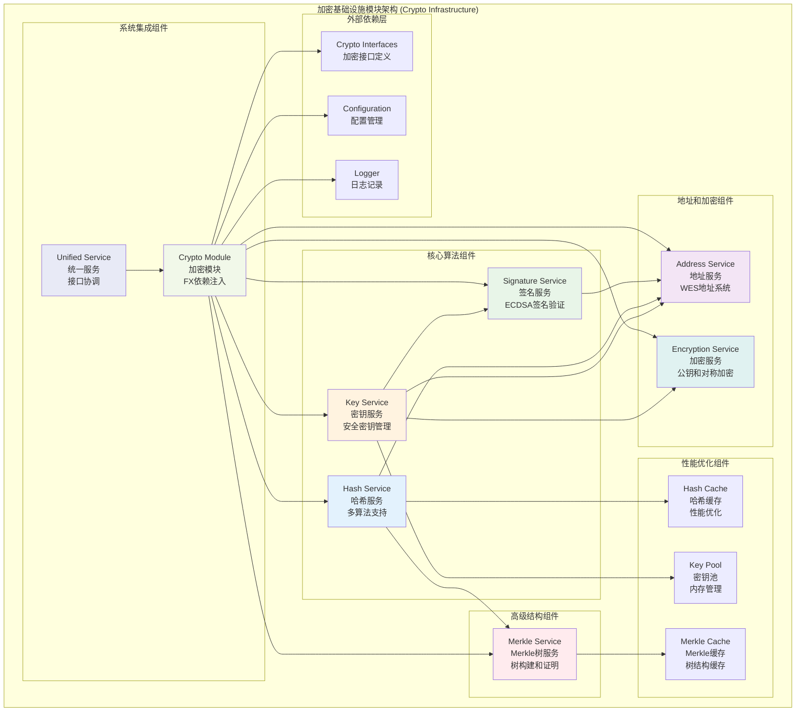

# 加密基础设施模块 (Crypto Infrastructure Module)

## 【模块定位】

**加密基础设施模块**是WES区块链系统的核心密码学组件，负责提供完整的密码学基础设施服务。作为区块链系统安全性的基石，加密模块采用模块化设计，实现了高性能、安全增强的密码学功能，包括哈希计算、数字签名、密钥管理、地址生成、加密解密、Merkle树构建等核心功能，为整个区块链系统提供可靠的密码学安全保障。

## 【设计原则】

### 安全优先原则

- **标准兼容**: 使用经过验证的密码学库和国际标准算法
- **常量时间操作**: 防止时序侧信道攻击
- **安全内存管理**: 使用后立即清除敏感数据
- **防重放保护**: 防止签名重放攻击

### 高性能优化原则

- **缓存机制**: 实现哈希缓存和对象池优化
- **并行处理**: 大型操作使用goroutine并行执行
- **批量操作**: 支持批量签名验证和哈希计算
- **内存优化**: 减少内存分配开销

### 模块化设计原则

- **功能分离**: 每个子模块专注特定的密码学功能
- **接口统一**: 统一的接口设计和错误处理机制
- **可扩展性**: 支持新算法和功能的扩展
- **依赖注入**: 通过FX框架实现依赖管理

## 【核心职责】

### 密码学算法服务

- 提供SHA256、Keccak256、RIPEMD160等多种哈希算法
- 实现ECDSA数字签名和验证功能
- 支持secp256k1椭圆曲线密码学
- 提供密码学安全的随机数生成

### 密钥管理服务

- 密钥对的生成、验证和转换
- 安全的私钥内存管理和清除
- 公钥压缩和解压缩
- 密钥格式转换和序列化

### 地址系统管理

- WES地址的生成和验证
- 支持P2PKH和P2SH地址格式
- Base58编码和解码
- 地址格式转换和校验

### 加密解密服务

- ECIES公钥加密和解密
- AES-GCM对称加密
- 密码派生函数(PBKDF2, Scrypt)
- 安全的密钥派生

### Merkle树服务

- Merkle树的构建和根哈希计算
- Merkle证明的生成和验证
- 树结构的缓存和优化
- 批量叶子节点处理

### 系统集成服务

- 统一的加密服务接口
- 模块化的依赖注入
- 配置管理和服务协调
- 性能监控和错误处理

## 【架构组件】



## 【目录结构说明】

```text
crypto/
├── address/                    # 地址服务 - WES地址系统
│   ├── address.go                 # 地址生成和验证核心逻辑
│   ├── json_helper.go             # JSON序列化辅助函数
│   ├── proto_converter.go         # Protobuf转换器
│   ├── address_test.go            # 地址服务测试
│   └── README.md                  # 地址服务文档
├── encryption/                 # 加密服务 - 公钥和对称加密
│   ├── encryption.go              # 加密解密核心逻辑
│   ├── encryption_test.go         # 加密服务测试
│   └── README.md                  # 加密服务文档
├── hash/                       # 哈希服务 - 多种哈希算法
│   ├── hash.go                    # 哈希计算核心逻辑
│   ├── block_hash.go              # 区块哈希专用功能
│   ├── transaction_hash.go        # 交易哈希专用功能
│   ├── proto_adapters.go          # Protobuf适配器
│   ├── hash_test.go               # 哈希服务测试
│   └── README.md                  # 哈希服务文档
├── key/                        # 密钥服务 - 密钥管理
│   ├── key.go                     # 密钥生成和管理核心逻辑
│   ├── key_test.go                # 密钥服务测试
│   └── README.md                  # 密钥服务文档
├── merkle/                     # Merkle服务 - Merkle树功能
│   ├── tree.go                    # Merkle树构建逻辑
│   ├── proof.go                   # Merkle证明生成和验证
│   ├── merkle.go                  # Merkle服务主逻辑
│   ├── tree_test.go               # 树构建测试
│   ├── proof_test.go              # 证明功能测试
│   ├── merkle_test.go             # Merkle服务测试
│   └── README.md                  # Merkle服务文档
├── signature/                  # 签名服务 - 数字签名
│   ├── signature.go               # 签名验证核心逻辑
│   ├── signature_unix.go          # Unix平台特定实现
│   ├── signature_wasm.go          # WASM平台特定实现
│   ├── signature_test.go          # 签名服务测试
│   └── README.md                  # 签名服务文档
├── module.go                   # 模块定义 - FX依赖注入配置
└── README.md                   # 本文档 - 加密模块总览
```

## 【依赖关系】

### 上层调用依赖

- **internal/core/blockchain**: 区块链核心模块
- **internal/core/consensus**: 共识机制模块
- **internal/core/mempool**: 内存池模块
- **pkg/api**: API服务层

### 平级基础设施依赖

- **pkg/interfaces/infrastructure/crypto**: 加密接口定义
- **pkg/interfaces/config**: 配置管理接口
- **pkg/interfaces/infrastructure/log**: 日志记录接口

### 下层库依赖

- **github.com/ethereum/go-ethereum/crypto**: 以太坊密码学库
- **golang.org/x/crypto**: Go扩展密码学库
- **github.com/btcsuite/btcutil**: Bitcoin工具库
- **github.com/google/uuid**: UUID生成库

### 框架依赖

- **go.uber.org/fx**: 依赖注入框架
- **pb/blockchain/core**: Protobuf类型定义
- **Go标准库**: crypto系列、sync、context等

## 【系统特性】

### 密码学安全性

- **标准算法**: 使用NIST和业界认可的密码学算法
- **常量时间**: 关键操作使用常量时间实现，防止时序攻击
- **安全内存**: 自动清除敏感数据，防止内存泄露
- **强随机性**: 使用密码学安全的随机数生成器

### 高性能优化

- **缓存机制**: 哈希计算和Merkle树构建的智能缓存
- **对象池**: 减少频繁的内存分配开销
- **并行处理**: 支持批量操作的并行执行
- **内存优化**: 高效的内存使用和垃圾回收

### 跨平台支持

- **多平台**: 支持Unix和WASM平台
- **条件编译**: 针对不同平台的优化实现
- **标准兼容**: 保证跨平台的算法一致性
- **性能调优**: 平台特定的性能优化

### 企业级特性

- **模块化**: 清晰的模块边界和职责分离
- **可扩展**: 支持新算法和功能的无缝集成
- **监控友好**: 完整的日志记录和性能监控
- **配置灵活**: 支持多种配置方式和环境

## 【配置管理】

### 密码学算法配置

```yaml
crypto_algorithms:
  hash:
    default_algorithm: "SHA256"     # 默认哈希算法
    supported_algorithms:           # 支持的哈希算法
      - "SHA256"
      - "Keccak256" 
      - "RIPEMD160"
      - "DoubleSHA256"
    cache_enabled: true             # 启用哈希缓存
    cache_size: 1000                # 缓存大小
    
  signature:
    curve: "secp256k1"              # 椭圆曲线
    hash_algorithm: "SHA256"        # 签名哈希算法
    recovery_enabled: true          # 启用公钥恢复
    batch_verification: true        # 批量验证
    
  encryption:
    symmetric_algorithm: "AES-GCM"  # 对称加密算法
    key_derivation: "PBKDF2"        # 密钥派生函数
    iterations: 10000               # 派生迭代次数
```

### 性能优化配置

```yaml
crypto_performance:
  memory_management:
    key_pool_size: 100              # 密钥池大小
    auto_cleanup: true              # 自动清理
    cleanup_interval: "30s"         # 清理间隔
    
  caching:
    hash_cache_size: 1000           # 哈希缓存大小
    merkle_cache_size: 500          # Merkle缓存大小
    cache_ttl: "1h"                 # 缓存TTL
    
  parallel_processing:
    enabled: true                   # 启用并行处理
    max_workers: 8                  # 最大工作协程数
    batch_size: 100                 # 批处理大小
```

## 【外部接口】

### 统一加密服务接口

- **CryptoService**: 统一加密服务
  - `GenerateKeyPair() ([]byte, []byte, error)`
  - `Sign(message, privateKey) ([]byte, error)`
  - `Verify(message, signature, publicKey) bool`
  - `PublicKeyToAddress(publicKey) (string, error)`
  - `Hash(data) []byte`

### 哈希服务接口

- **HashManager**: 哈希管理器
  - `SHA256(data) []byte`
  - `Keccak256(data) []byte`
  - `RIPEMD160(data) []byte`
  - `DoubleSHA256(data) []byte`

### 签名服务接口

- **SignatureManager**: 签名管理器
  - `Sign(message, privateKey) ([]byte, error)`
  - `Verify(message, signature, publicKey) bool`
  - `RecoverPublicKey(message, signature) ([]byte, error)`
  - `BatchVerify(messages, signatures, publicKeys) bool`

## 【相关文档】

- **地址服务**: `internal/core/infrastructure/crypto/address/README.md`
- **加密服务**: `internal/core/infrastructure/crypto/encryption/README.md`
- **哈希服务**: `internal/core/infrastructure/crypto/hash/README.md`
- **密钥服务**: `internal/core/infrastructure/crypto/key/README.md`
- **Merkle服务**: `internal/core/infrastructure/crypto/merkle/README.md`
- **签名服务**: `internal/core/infrastructure/crypto/signature/README.md`
- **加密接口**: `pkg/interfaces/infrastructure/crypto/README.md`

## 【使用策略】

### 开发策略

- **接口优先**: 优先使用统一的接口，而非直接调用子服务
- **安全实践**: 严格遵循密码学安全最佳实践
- **性能优化**: 充分利用缓存和批量操作提高性能

### 安全策略

- **密钥管理**: 使用安全的密钥生成和存储机制
- **数据清理**: 及时清除内存中的敏感数据
- **随机性**: 确保随机数生成的密码学安全性

### 扩展策略

- **算法扩展**: 通过接口扩展支持新的密码学算法
- **平台适配**: 针对新平台提供特定优化实现
- **缓存优化**: 根据使用模式优化缓存策略

## 【错误处理】

### 密码学错误

- **ErrInvalidKey**: 无效的密钥格式或长度
- **ErrInvalidSignature**: 无效的签名格式或验证失败
- **ErrInvalidAddress**: 无效的地址格式或校验失败
- **ErrCryptographicOperation**: 密码学操作失败

### 系统错误

- **ErrInsufficientEntropy**: 随机数熵不足
- **ErrMemoryAllocation**: 内存分配失败
- **ErrOperationTimeout**: 操作超时
- **ErrServiceUnavailable**: 服务不可用

### 错误恢复机制

- **自动重试**: 对临时性错误实施智能重试
- **降级服务**: 在部分功能失败时提供基础服务
- **安全清理**: 错误发生时安全清理敏感数据
- **监控告警**: 关键错误的实时监控和告警
