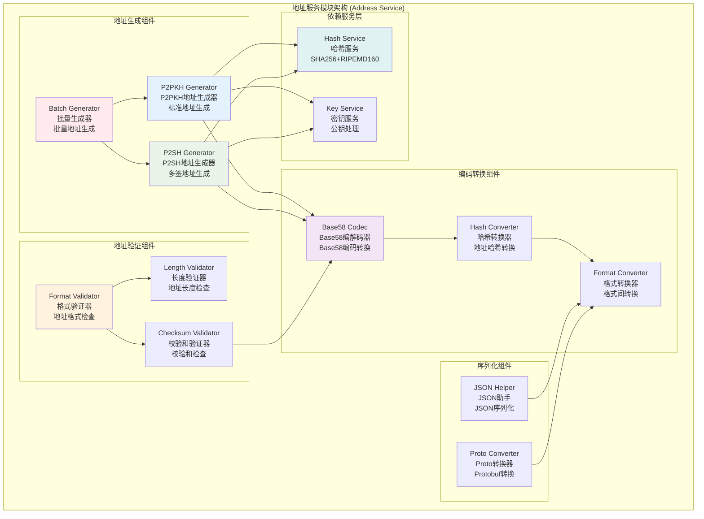
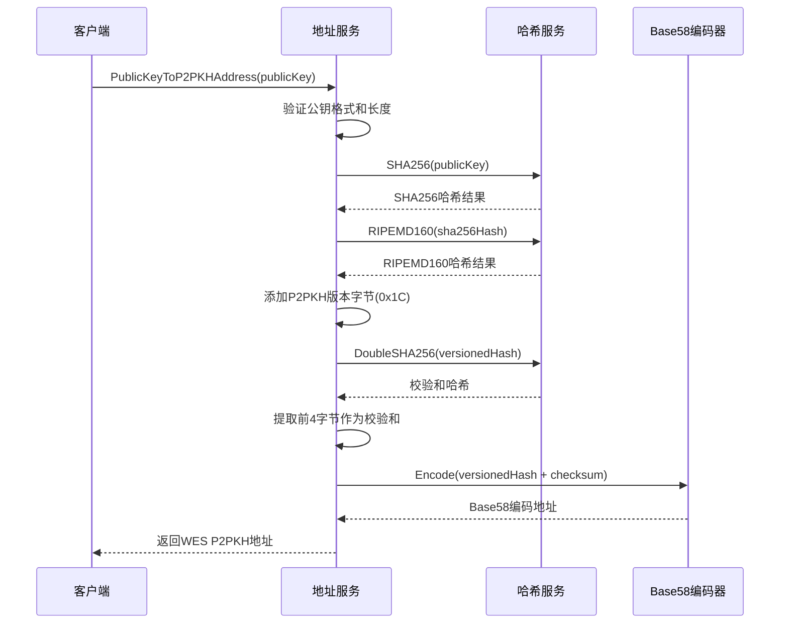
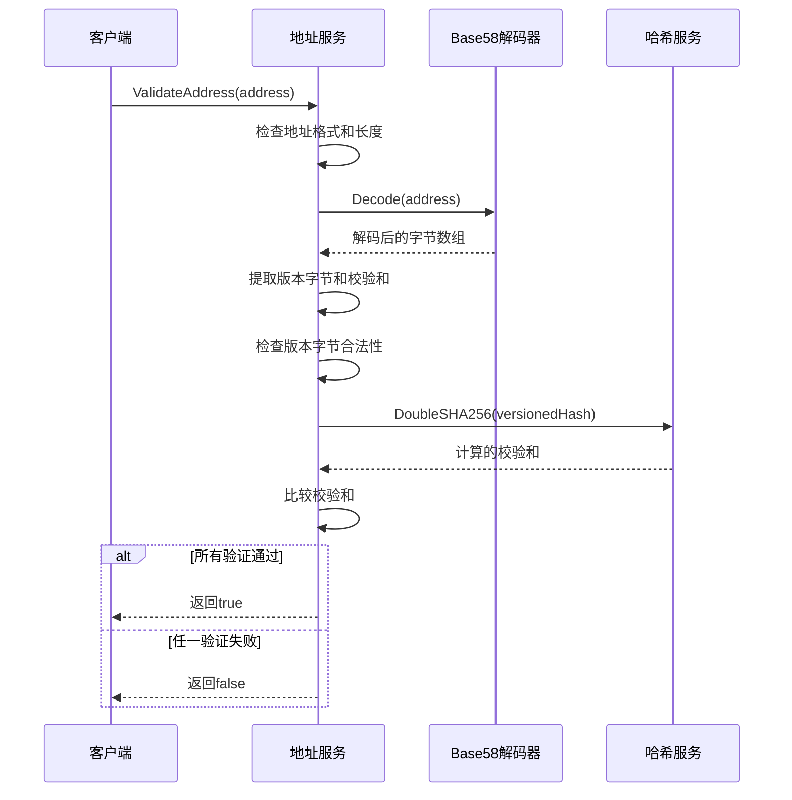
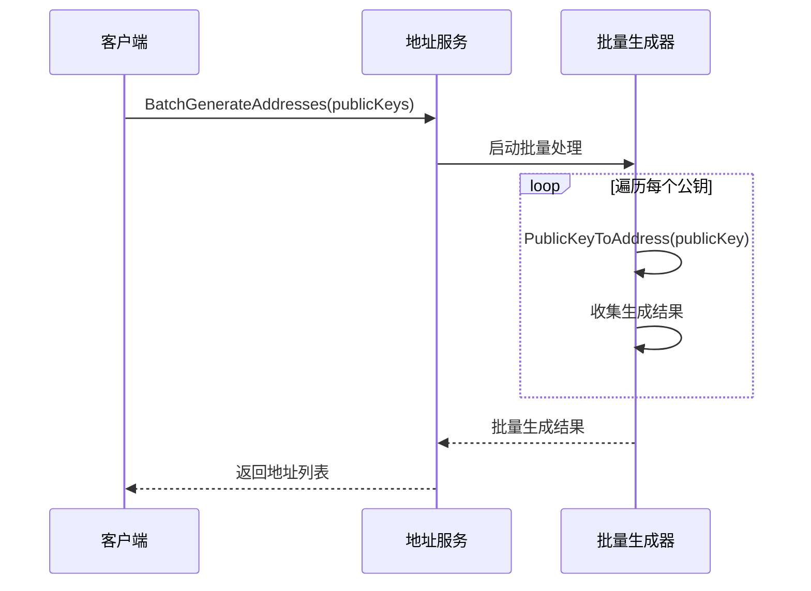

# 地址服务模块 (Address Service Module)

## 【模块定位】

**地址服务模块**是WES区块链系统的地址管理核心组件，负责实现完整的WES地址系统。作为连接公钥和用户友好地址的关键桥梁，地址服务模块支持P2PKH和P2SH两种地址格式，实现从公钥到地址的安全转换、地址验证、格式转换等核心功能，为整个区块链系统提供标准化、安全可靠的地址管理服务。

## 【设计原则】

### 安全性优先原则

- **密码学安全**: 使用SHA256和RIPEMD160双重哈希确保安全性
- **校验机制**: 内置校验和机制防止地址错误
- **格式验证**: 严格的地址格式验证和长度检查
- **防篡改**: 通过哈希和编码确保地址不可篡改

### 标准兼容原则

- **Bitcoin兼容**: 地址生成算法与Bitcoin标准兼容
- **Base58编码**: 使用标准Base58编码，避免混淆字符
- **版本管理**: 支持不同类型地址的版本标识
- **格式规范**: 遵循行业标准的地址格式规范

### 高性能设计原则

- **批量处理**: 支持批量地址生成和验证
- **缓存优化**: 对频繁使用的地址进行缓存
- **内存管理**: 高效的内存使用和垃圾回收
- **并发安全**: 支持并发地址操作

## 【核心职责】

### 地址生成服务

- 从公钥生成P2PKH(Pay-to-Public-Key-Hash)地址
- 支持P2SH(Pay-to-Script-Hash)多重签名地址生成
- 实现压缩和未压缩公钥的地址转换
- 提供批量地址生成功能

### 地址验证服务

- 验证地址格式的正确性和完整性
- 检查地址长度和字符合法性
- 验证地址校验和的正确性
- 支持不同版本地址的验证

### 格式转换服务

- Base58编码和解码操作
- 地址与哈希之间的相互转换
- 不同地址格式之间的转换
- JSON和Protobuf序列化支持

### 工具函数服务

- 地址哈希提取和验证
- 公钥压缩和解压缩
- 地址类型识别和分类
- 地址信息查询和分析

## 【架构组件】



## 【目录结构说明】

```text
address/
├── address.go                  # 地址服务核心逻辑 - 地址生成和验证主要实现
├── json_helper.go              # JSON序列化助手 - JSON格式转换和序列化
├── proto_converter.go          # Protobuf转换器 - Protobuf格式转换
├── address_test.go             # 地址服务测试 - 完整的单元测试套件
└── README.md                   # 本文档 - 地址服务详细说明
```

## 【依赖关系】

### 上层调用依赖

- **internal/core/infrastructure/crypto**: 加密模块主服务
- **internal/core/blockchain/services**: 区块链业务服务
- **pkg/api**: API服务层地址相关接口

### 平级服务依赖

- **crypto/hash**: 哈希服务 - SHA256和RIPEMD160计算
- **crypto/key**: 密钥服务 - 公钥处理和验证
- **crypto/signature**: 签名服务 - 公钥验证支持

### 外部库依赖

- **github.com/mr-tron/base58**: Base58编码库（纯编码库，无区块链依赖）
- **golang.org/x/crypto/ripemd160**: RIPEMD160哈希算法
- **crypto/sha256**: SHA256哈希算法
- **pkg/interfaces/infrastructure/crypto**: 加密接口定义

### Go标准库依赖

- **errors**: 错误处理
- **fmt**: 格式化操作
- **strings**: 字符串处理

## 【系统特性】

### WES地址系统

- **双重哈希**: 使用SHA256+RIPEMD160双重哈希确保安全性
- **版本标识**: P2PKH(0x1C)和P2SH(0x9C)版本字节区分地址类型
- **校验机制**: 4字节校验和防止地址输入错误
- **标准长度**: 20字节地址哈希标准长度

### 地址类型支持

- **P2PKH地址**: 标准的公钥哈希地址，适用于单一签名
- **P2SH地址**: 脚本哈希地址，适用于多重签名和复杂脚本
- **压缩公钥**: 支持33字节压缩公钥地址生成
- **未压缩公钥**: 支持64字节未压缩公钥地址生成

### 安全性保障

- **格式验证**: 严格的地址格式和长度验证
- **校验和验证**: 双重SHA256校验和验证
- **防篡改**: 任何字符修改都会导致校验失败
- **标准兼容**: 与Bitcoin地址算法完全兼容

### 性能优化

- **批量处理**: 支持批量地址生成，提高处理效率
- **内存优化**: 高效的内存使用，避免不必要的分配
- **并发安全**: 所有操作都是线程安全的
- **缓存友好**: 设计支持上层缓存优化

## 【工作流程】

### P2PKH地址生成流程



### 地址验证流程



### 批量地址生成流程



## 【配置管理】

### 地址系统配置

```yaml
address_system:
  weisyn_config:
    p2pkh_version: 0x1C             # P2PKH地址版本字节
    p2sh_version: 0x9C              # P2SH地址版本字节
    address_hash_length: 20         # 地址哈希长度（字节）
    checksum_length: 4              # 校验和长度（字节）
    
  supported_formats:
    p2pkh_enabled: true             # 启用P2PKH地址
    p2sh_enabled: true              # 启用P2SH地址
    compressed_key: true            # 支持压缩公钥
    uncompressed_key: true          # 支持未压缩公钥
    
  validation:
    strict_validation: true         # 严格验证模式
    checksum_validation: true       # 校验和验证
    format_validation: true         # 格式验证
    length_validation: true         # 长度验证
```

### 性能优化配置

```yaml
address_performance:
  batch_processing:
    enabled: true                   # 启用批量处理
    max_batch_size: 1000            # 最大批处理大小
    parallel_workers: 4             # 并行工作协程数
    
  memory_management:
    pool_enabled: false             # 地址服务无状态，禁用对象池
    gc_optimization: true           # 垃圾回收优化
    buffer_reuse: true              # 缓冲区复用
    
  encoding:
    base58_optimization: true       # Base58编码优化
    hash_caching: false             # 禁用哈希缓存（委托给哈希服务）
    string_interning: false         # 字符串驻留
```

### 错误处理配置

```yaml
address_error_handling:
  validation_errors:
    detailed_messages: true         # 详细错误消息
    error_codes: true               # 错误代码
    stack_trace: false              # 堆栈跟踪（生产环境禁用）
    
  recovery:
    auto_retry: false               # 地址操作无需重试
    fallback_validation: true       # 回退验证
    graceful_degradation: true      # 优雅降级
```

## 【外部接口】

### 地址生成接口

- **PublicKeyToAddress**: 公钥转地址
  - `PublicKeyToAddress(publicKey []byte) (string, error)`
  - `PublicKeyToP2PKHAddress(publicKey []byte) (string, error)`
  - `PublicKeyToP2SHAddress(publicKey []byte) (string, error)`

### 地址验证接口

- **ValidateAddress**: 地址验证
  - `ValidateAddress(address string) bool`
  - `ValidateP2PKHAddress(address string) bool`
  - `ValidateP2SHAddress(address string) bool`
  - `GetAddressType(address string) (AddressType, error)`

### 格式转换接口

- **AddressToHash**: 地址转哈希
  - `AddressToHash(address string) ([]byte, error)`
  - `HashToAddress(hash []byte, version byte) (string, error)`

### 批量操作接口

- **BatchOperations**: 批量操作
  - `BatchGenerateAddresses(publicKeys [][]byte) ([]string, error)`
  - `BatchValidateAddresses(addresses []string) ([]bool, error)`

### 工具函数接口

- **AddressUtils**: 地址工具
  - `IsValidAddressFormat(address string) bool`
  - `ExtractAddressHash(address string) ([]byte, error)`
  - `CompareAddresses(addr1, addr2 string) bool`

## 【相关文档】

- **加密模块总览**: `internal/core/infrastructure/crypto/README.md`
- **哈希服务**: `internal/core/infrastructure/crypto/hash/README.md`
- **密钥服务**: `internal/core/infrastructure/crypto/key/README.md`
- **签名服务**: `internal/core/infrastructure/crypto/signature/README.md`
- **加密接口**: `pkg/interfaces/infrastructure/crypto/README.md`
- **区块链服务**: `internal/core/blockchain/services/README.md`

## 【使用策略】

### 开发策略

- **接口优先**: 优先使用统一的地址接口，保持一致性
- **类型检查**: 严格检查地址类型，避免混用
- **批量操作**: 大量地址操作时使用批量接口提高性能

### 安全策略

- **验证优先**: 任何地址使用前都要进行验证
- **格式检查**: 严格检查地址格式和长度
- **校验和验证**: 始终验证地址校验和的正确性

### 性能策略

- **批量处理**: 多个地址操作时使用批量接口
- **缓存利用**: 在上层实现地址缓存机制
- **内存管理**: 及时释放不需要的地址字符串

### 扩展策略

- **新地址类型**: 通过版本字节支持新的地址类型
- **编码格式**: 支持Base58以外的编码格式扩展
- **验证规则**: 支持自定义验证规则的扩展

## 【错误处理】

### 地址生成错误

- **ErrInvalidPublicKey**: 无效的公钥格式或长度
- **ErrUnsupportedKeyType**: 不支持的公钥类型
- **ErrHashGenerationFailed**: 哈希生成失败
- **ErrEncodingFailed**: Base58编码失败

### 地址验证错误

- **ErrInvalidAddressFormat**: 无效的地址格式
- **ErrInvalidAddressLength**: 无效的地址长度
- **ErrInvalidChecksum**: 无效的校验和
- **ErrUnsupportedAddressType**: 不支持的地址类型

### 格式转换错误

- **ErrDecodingFailed**: Base58解码失败
- **ErrInvalidHashLength**: 无效的哈希长度
- **ErrInvalidVersionByte**: 无效的版本字节
- **ErrConversionFailed**: 格式转换失败

### 错误恢复机制

- **输入验证**: 所有接口都进行严格的输入参数验证
- **快速失败**: 遇到错误立即返回，不进行无意义的处理
- **错误分类**: 清晰的错误分类和错误代码
- **日志记录**: 记录关键错误信息用于调试和监控
