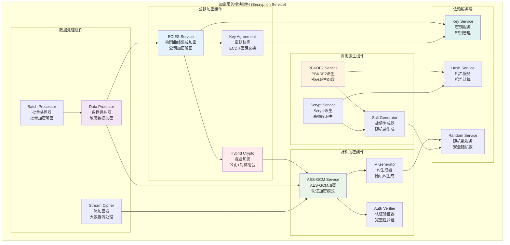
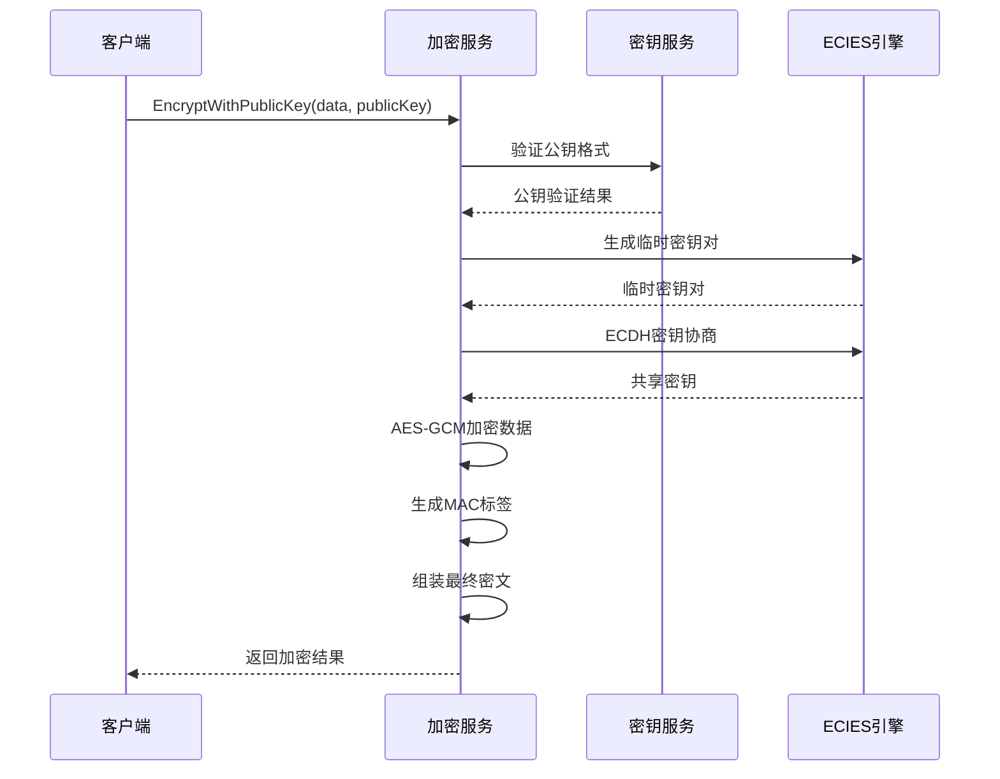
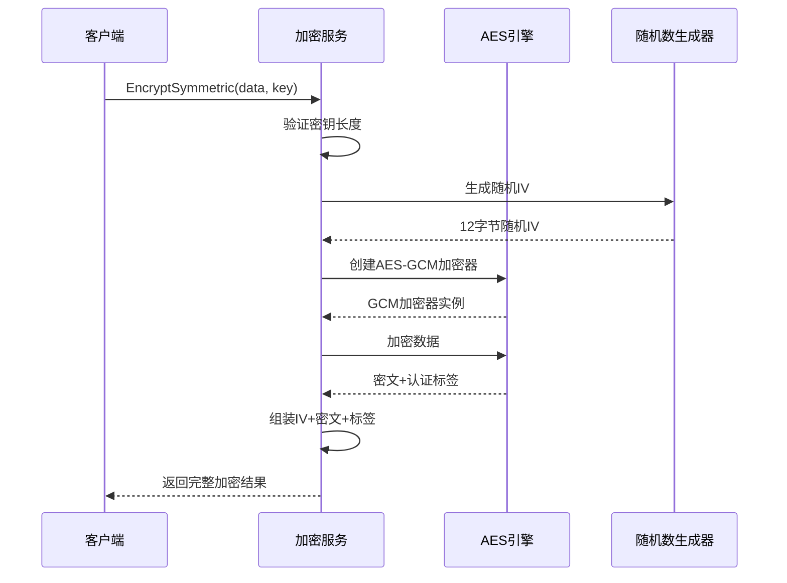
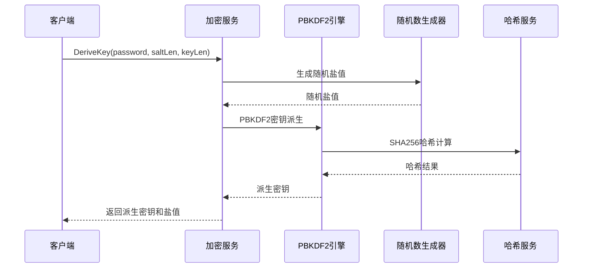

# 加密服务模块 (Encryption Service Module)

## 【模块定位】

**加密服务模块**是WES区块链系统的数据加密核心组件，负责提供完整的加密解密功能。作为保护敏感数据和通信安全的关键模块，加密服务实现了公钥加密(ECIES)和对称加密(AES-GCM)两套完整的加密体系，支持密码派生、密钥管理、安全数据传输等核心功能，为整个区块链系统提供企业级的数据保护和隐私安全保障。

## 【设计原则】

### 安全性优先原则

- **密码学标准**: 使用经过验证的加密算法(ECIES、AES-GCM)
- **前向安全**: 支持前向安全的密钥派生机制
- **抗攻击性**: 防止已知的密码学攻击方式
- **安全清理**: 自动清除内存中的敏感密钥数据

### 多层加密原则

- **公钥加密**: ECIES椭圆曲线集成加密方案
- **对称加密**: AES-GCM认证加密模式
- **混合加密**: 结合公钥和对称加密的优势
- **密钥派生**: PBKDF2和Scrypt安全密钥派生

### 性能优化原则

- **算法效率**: 选择高性能的加密算法实现
- **内存管理**: 高效的密钥和数据内存管理
- **批量处理**: 支持批量数据的加密解密
- **硬件加速**: 利用硬件加速功能(如可用)

## 【核心职责】

### 公钥加密服务

- 实现ECIES(椭圆曲线集成加密方案)加密解密
- 支持secp256k1椭圆曲线公钥加密
- 提供公钥加密的密钥协商机制
- 实现混合加密方案的密钥封装

### 对称加密服务

- 实现AES-GCM认证加密模式
- 支持256位密钥的高强度加密
- 提供认证加密确保数据完整性
- 实现安全的随机IV生成

### 密钥派生服务

- 实现PBKDF2密码派生函数
- 支持Scrypt密码派生算法
- 提供盐值生成和管理
- 实现可配置的迭代次数

### 数据保护服务

- 提供敏感数据的加密存储
- 实现安全的数据传输加密
- 支持数据完整性验证
- 提供密钥的安全销毁

## 【架构组件】



## 【目录结构说明】

```text
encryption/
├── encryption.go               # 加密服务核心逻辑 - 加密解密主要实现
├── encryption_test.go          # 加密服务测试 - 完整的单元测试套件
└── README.md                   # 本文档 - 加密服务详细说明
```

## 【依赖关系】

### 上层调用依赖

- **internal/core/infrastructure/crypto**: 加密模块主服务
- **internal/core/blockchain/services**: 区块链业务服务
- **pkg/api**: API服务层数据加密需求

### 平级服务依赖

- **crypto/key**: 密钥服务 - 密钥生成和管理
- **crypto/hash**: 哈希服务 - 哈希计算支持
- **crypto/signature**: 签名服务 - 密钥验证支持

### 外部库依赖

- **github.com/ethereum/go-ethereum/crypto/ecies**: ECIES加密库
- **golang.org/x/crypto/pbkdf2**: PBKDF2密钥派生
- **golang.org/x/crypto/scrypt**: Scrypt密钥派生
- **crypto/aes**: AES加密算法
- **crypto/cipher**: 加密模式实现

### Go标准库依赖

- **crypto/rand**: 密码学随机数生成
- **crypto/sha256**: SHA256哈希算法
- **errors**: 错误处理
- **fmt**: 格式化操作

## 【系统特性】

### ECIES公钥加密

- **椭圆曲线**: 基于secp256k1椭圆曲线的安全性
- **集成方案**: 密钥协商+对称加密+MAC的完整方案
- **前向安全**: 每次加密使用新的临时密钥对
- **完整性保护**: 内置MAC确保数据完整性

### AES-GCM对称加密

- **认证加密**: AES-GCM模式提供加密和认证
- **高性能**: 硬件加速的AES实现
- **随机IV**: 每次加密使用新的随机初始化向量
- **256位密钥**: 使用256位密钥提供最高安全级别

### 密钥派生功能

- **PBKDF2标准**: 符合RFC2898标准的密码派生
- **Scrypt算法**: 内存困难的密码派生算法
- **可配置迭代**: 支持自定义迭代次数和参数
- **盐值保护**: 随机盐值防止彩虹表攻击

### 安全性保障

- **密钥清理**: 使用后立即清除内存中的密钥
- **常量时间**: 关键操作使用常量时间实现
- **随机性**: 使用密码学安全的随机数生成
- **防篡改**: 认证加密模式防止数据篡改

## 【工作流程】

### ECIES加密流程



### AES-GCM加密流程



### 密钥派生流程



## 【配置管理】

### 加密算法配置

```yaml
encryption_algorithms:
  public_key:
    algorithm: "ECIES"              # 公钥加密算法
    curve: "secp256k1"              # 椭圆曲线
    key_size: 256                   # 密钥长度(位)
    
  symmetric:
    algorithm: "AES-GCM"            # 对称加密算法
    key_size: 256                   # 密钥长度(位)
    iv_size: 12                     # IV长度(字节)
    tag_size: 16                    # 认证标签长度(字节)
    
  key_derivation:
    default_algorithm: "PBKDF2"     # 默认密钥派生算法
    pbkdf2_iterations: 10000        # PBKDF2迭代次数
    scrypt_n: 32768                 # Scrypt N参数
    scrypt_r: 8                     # Scrypt r参数  
    scrypt_p: 1                     # Scrypt p参数
    salt_size: 32                   # 盐值长度(字节)
```

### 安全参数配置

```yaml
encryption_security:
  randomness:
    entropy_source: "crypto/rand"   # 熵源
    iv_randomness: true             # IV随机性
    salt_randomness: true           # 盐值随机性
    
  memory_security:
    key_clearing: true              # 密钥清理
    secure_erase: true              # 安全擦除
    memory_lock: false              # 内存锁定(可选)
    
  validation:
    input_validation: true          # 输入验证
    key_validation: true            # 密钥验证
    length_validation: true         # 长度验证
    format_validation: true         # 格式验证
```

### 性能优化配置

```yaml
encryption_performance:
  processing:
    batch_size: 1000               # 批处理大小
    parallel_workers: 4            # 并行工作协程数
    buffer_size: 8192              # 缓冲区大小
    
  memory_management:
    pool_enabled: true             # 启用对象池
    gc_optimization: true          # 垃圾回收优化
    memory_limit: "100MB"          # 内存限制
    
  hardware:
    aes_ni_enabled: true           # AES-NI硬件加速
    simd_enabled: true             # SIMD指令集
    assembly_optimization: true    # 汇编优化
```

## 【外部接口】

### 公钥加密接口

- **PublicKeyEncryption**: 公钥加密
  - `EncryptWithPublicKey(data, publicKey) ([]byte, error)`
  - `DecryptWithPrivateKey(ciphertext, privateKey) ([]byte, error)`
  - `GenerateKeyPairForEncryption() (*ecdsa.PrivateKey, *ecdsa.PublicKey, error)`

### 对称加密接口

- **SymmetricEncryption**: 对称加密
  - `EncryptSymmetric(data, key) ([]byte, error)`
  - `DecryptSymmetric(ciphertext, key) ([]byte, error)`
  - `GenerateSymmetricKey(keySize) ([]byte, error)`

### 密钥派生接口

- **KeyDerivation**: 密钥派生
  - `DeriveKeyPBKDF2(password, salt, iterations, keyLen) ([]byte, error)`
  - `DeriveKeyScrypt(password, salt, N, r, p, keyLen) ([]byte, error)`
  - `GenerateSalt(size) ([]byte, error)`

### 混合加密接口

- **HybridEncryption**: 混合加密
  - `HybridEncrypt(data, publicKey) ([]byte, error)`
  - `HybridDecrypt(ciphertext, privateKey) ([]byte, error)`

### 批量操作接口

- **BatchEncryption**: 批量加密
  - `BatchEncrypt(dataList, keys) ([][]byte, error)`
  - `BatchDecrypt(ciphertextList, keys) ([][]byte, error)`

## 【相关文档】

- **加密模块总览**: `internal/core/infrastructure/crypto/README.md`
- **密钥服务**: `internal/core/infrastructure/crypto/key/README.md`
- **哈希服务**: `internal/core/infrastructure/crypto/hash/README.md`
- **签名服务**: `internal/core/infrastructure/crypto/signature/README.md`
- **加密接口**: `pkg/interfaces/infrastructure/crypto/README.md`
- **区块链服务**: `internal/core/blockchain/services/README.md`

## 【使用策略】

### 加密策略

- **算法选择**: 根据安全需求选择合适的加密算法
- **密钥管理**: 使用安全的密钥生成和存储机制
- **混合加密**: 大数据加密时使用混合加密方案

### 安全策略

- **密钥保护**: 确保密钥的安全生成、存储和销毁
- **随机性**: 使用密码学安全的随机数生成器
- **参数验证**: 严格验证所有输入参数

### 性能策略

- **批量处理**: 大量数据加密时使用批量接口
- **硬件加速**: 充分利用硬件加速功能
- **内存管理**: 及时清理敏感数据的内存

### 扩展策略

- **新算法**: 通过接口扩展支持新的加密算法
- **新模式**: 支持新的加密模式和参数配置
- **平台优化**: 针对不同平台的性能优化

## 【错误处理】

### 加密操作错误

- **ErrInvalidKeyLength**: 无效的密钥长度
- **ErrInvalidCiphertext**: 无效的密文格式
- **ErrDecryptionFailed**: 解密操作失败
- **ErrEmptyData**: 不能加密空数据

### 密钥派生错误

- **ErrInvalidPassword**: 无效的密码
- **ErrInvalidSalt**: 无效的盐值
- **ErrInvalidIterations**: 无效的迭代次数
- **ErrKeyDerivationFailed**: 密钥派生失败

### 系统错误

- **ErrInsufficientEntropy**: 随机数熵不足
- **ErrMemoryAllocation**: 内存分配失败
- **ErrHardwareAcceleration**: 硬件加速初始化失败
- **ErrCipherInitialization**: 加密器初始化失败

### 错误恢复机制

- **输入验证**: 所有接口都进行严格的输入参数验证
- **自动重试**: 对临时性错误实施智能重试
- **安全清理**: 错误发生时安全清理敏感数据
- **降级处理**: 硬件加速失败时回退到软件实现
