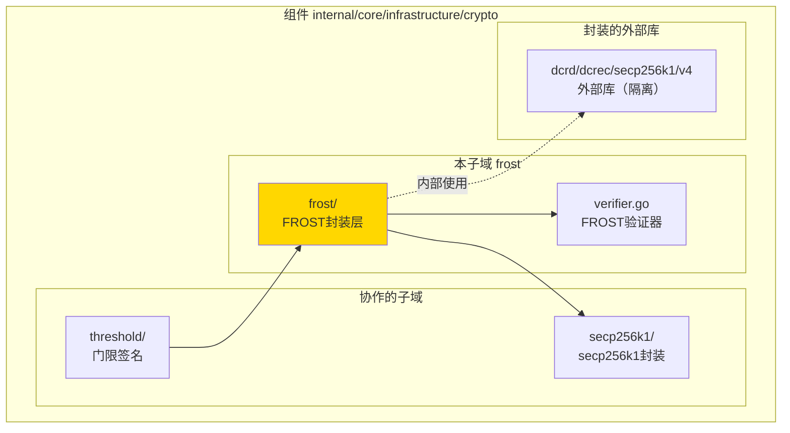
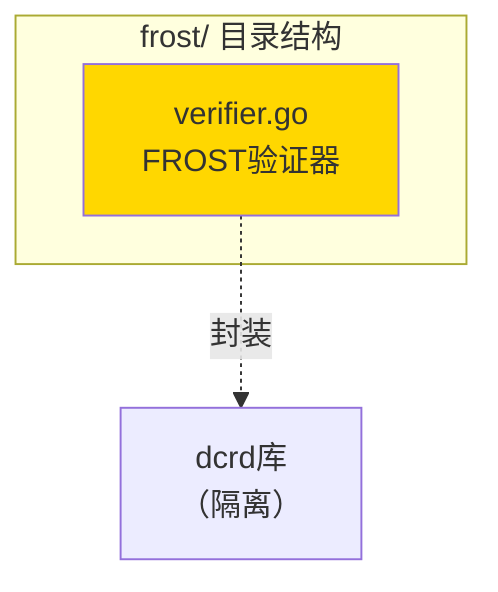

# frost - FROST封装层实现子域

---

## 📌 版本信息

- **版本**：1.0
- **状态**：stable
- **最后更新**：2025-11-15
- **最后审核**：2025-11-15
- **所有者**：密码学基础设施组
- **适用范围**：WES 项目 FROST 门限签名封装层实现

---

## 🎯 子域定位

**路径**：`internal/core/infrastructure/crypto/frost/`

**所属组件**：`crypto`

**核心职责**：封装 FROST 门限签名实现，隔离区块链特定依赖（dcrd），提供纯密码学接口

**在组件中的角色**：
- 封装层：隔离 `dcrd/dcrec/secp256k1/v4` 依赖
- 对外提供纯密码学接口，不暴露区块链概念
- 被 `threshold` 子域使用（threshold/frost.go 包装器）

---

## 🏗️ 架构设计

### 在组件中的位置

> **说明**：展示此子域在组件内部的位置和协作关系



**位置说明**：

| 关系类型 | 目标 | 关系说明 |
|---------|------|---------|
| **依赖** | secp256k1/ | 使用 secp256k1 封装层进行曲线运算 |
| **封装** | dcrd/dcrec/secp256k1/v4 | 封装dcrd库，仅内部使用 |
| **被依赖** | threshold/ | threshold/frost.go 使用此封装层 |

---

### 内部组织

> **说明**：展示此子域内部的文件组织和类型关系



---

## 📁 目录结构

```
internal/core/infrastructure/crypto/frost/
├── README.md                    # 本文档
└── verifier.go                  # FROST验证器实现（封装dcrd）
```

---

## 🔧 核心实现

### 实现文件：`verifier.go`

**核心类型**：`FROSTVerifier`

**职责**：实现 `ThresholdSignatureVerifier` 接口，封装dcrd的FROST实现

**关键字段**：

```go
type FROSTVerifier struct{}
```

**关键方法**：

| 方法名 | 职责 | 可见性 | 备注 |
|-------|------|-------|-----|
| `NewFROSTVerifier()` | 构造函数 | Public | 用于依赖注入 |
| `VerifyThresholdSignature()` | 门限签名验证 | Public | 实现接口方法 |
| `VerifySignatureShare()` | 签名份额验证 | Public | 实现接口方法 |

**实现要点**：
- 封装 `dcrd/dcrec/secp256k1/v4`，仅在模块内部使用
- 对外不暴露dcrd类型，只提供密码学操作接口
- 支持 Ed25519 和 secp256k1 两种曲线

---

## 🔗 协作关系

### 依赖的接口

| 接口 | 来源 | 用途 |
|-----|------|-----|
| `ThresholdSignatureVerifier` | `pkg/interfaces/infrastructure/crypto/threshold.go` | 实现的接口 |

### 内部依赖（封装隔离）

| 库 | 用途 | 封装方式 |
|-----|------|---------|
| `dcrd/dcrec/secp256k1/v4` | secp256k1 曲线运算 | 仅在模块内使用，不暴露给外部 |

---

### 被依赖关系

**被以下子域使用**：
- `threshold/frost.go` - 使用 `frost.NewFROSTVerifier()` 创建验证器

**示例**：

```go
// 在 threshold/frost.go 中使用
import "github.com/weisyn/v1/internal/core/infrastructure/crypto/frost"

type FROSTThresholdVerifier struct {
    frostVerifier *frost.FROSTVerifier
}

func NewFROSTThresholdVerifier() *FROSTThresholdVerifier {
    return &FROSTThresholdVerifier{
        frostVerifier: frost.NewFROSTVerifier(),
    }
}
```

---

## 🧪 测试

### 测试覆盖

| 测试类型 | 文件 | 覆盖率目标 | 当前状态 |
|---------|------|-----------|---------|
| 单元测试 | （待添加） | ≥ 80% | 待实现 |

---

## 📊 关键设计决策

### 决策 1：封装 dcrd 而非直接使用

**问题**：dcrd 是区块链特定库，是否应该直接依赖？

**方案**：创建封装层，隔离 dcrd 依赖

**理由**：
- dcrd 来自 Decred 区块链项目，包含区块链特定概念
- 封装层只使用其椭圆曲线数学运算，隔离区块链概念
- 便于未来替换底层实现

**权衡**：
- ✅ 优点：隔离依赖，保持接口稳定
- ⚠️ 缺点：增加一层抽象

### 决策 2：支持多种曲线

**问题**：是否只支持 secp256k1？

**方案**：支持 Ed25519 和 secp256k1 两种曲线

**理由**：
- Ed25519 使用标准库，无需封装
- secp256k1 使用封装层，统一接口
- 提高灵活性，支持不同场景

---

## 📚 相关文档

- [组件总览](../README.md)
- [threshold子域](../threshold/README.md)
- [顶层设计](../../../../docs/system/designs/crypto/design.md)
- [接口与实现的组织架构](../../../../docs/system/standards/principles/code-organization.md)

---

## 📝 变更历史

| 版本 | 日期 | 变更内容 | 作者 |
|-----|------|---------|------|
| 1.0 | 2025-11-15 | 初始版本，封装dcrd依赖 | 密码学基础设施组 |

---

## 🚧 待办事项

- [ ] 添加单元测试
- [ ] 性能基准测试
- [ ] 完整FROST实现（当前为简化版）

---

## 📝 参考标准

- **RFC 9483**: FROST (Flexible Round-Optimized Schnorr Threshold Signatures)
- **支持的曲线**：Ed25519、secp256k1
