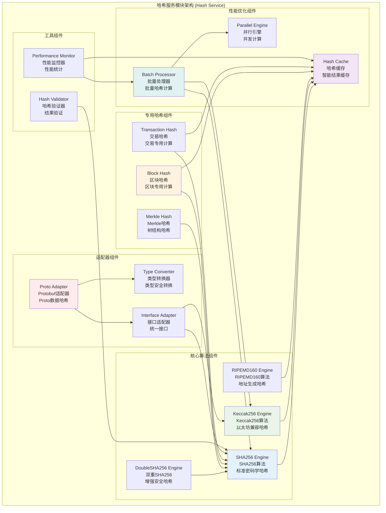
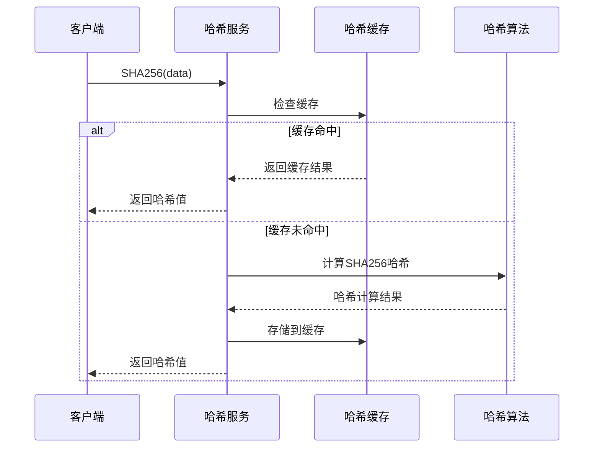
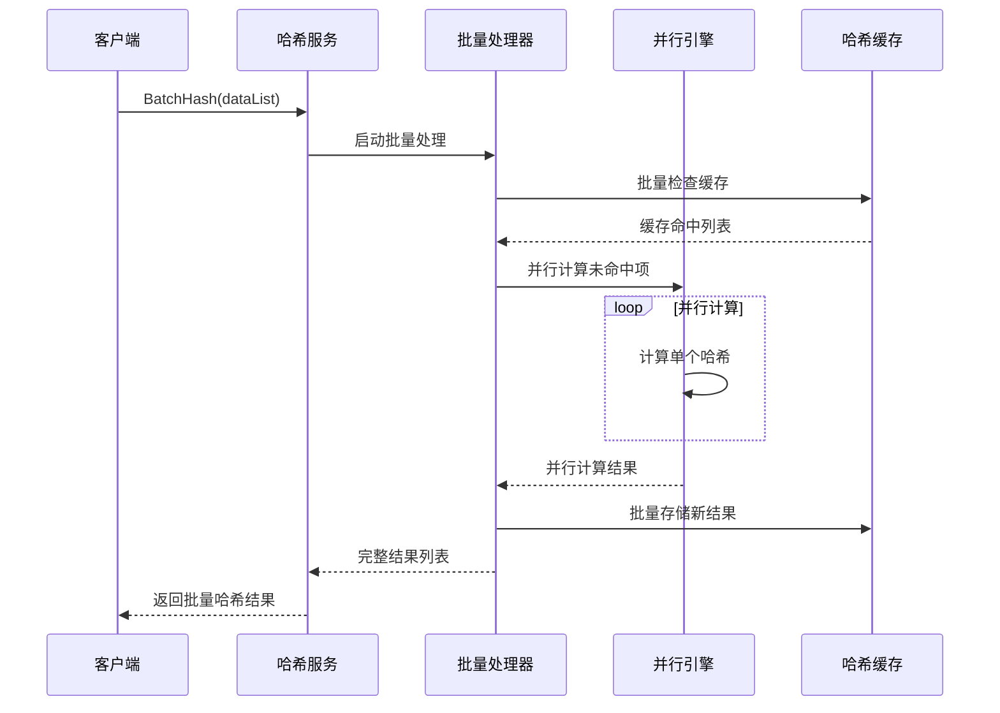
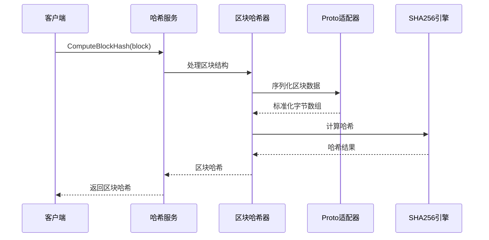

# 哈希服务模块 (Hash Service Module)

## 【模块定位】

**哈希服务模块**是WES区块链系统的密码学哈希核心组件，负责提供完整的哈希计算基础设施。作为区块链系统数据完整性和身份验证的基石，哈希服务实现了多种标准密码学哈希算法，包括SHA256、Keccak256、RIPEMD160、DoubleSHA256等，支持高性能缓存机制、批量计算、专用哈希功能，为整个区块链系统提供快速、安全、可靠的哈希计算服务。

## 【设计原则】

### 安全性优先原则

- **标准算法**: 使用经过验证的密码学哈希算法
- **常量时间**: 关键比较操作使用常量时间实现
- **抗碰撞性**: 选择具有强抗碰撞性的哈希函数
- **防篡改**: 确保哈希结果的不可篡改性

### 高性能优化原则

- **智能缓存**: 实现哈希结果的智能缓存机制
- **批量计算**: 支持批量数据的哈希计算
- **并发安全**: 支持多线程并发哈希计算
- **内存优化**: 高效的内存使用和垃圾回收

### 多算法支持原则

- **算法多样性**: 支持多种标准哈希算法
- **灵活选择**: 根据使用场景选择最适合的算法
- **扩展性**: 支持新哈希算法的无缝集成
- **兼容性**: 保持与现有系统的兼容性

## 【核心职责】

### 标准哈希计算

- 实现SHA256标准哈希算法
- 提供Keccak256以太坊兼容哈希
- 支持RIPEMD160哈希计算
- 实现DoubleSHA256双重哈希

### 区块链专用哈希

- 提供区块哈希计算专用功能
- 实现交易哈希计算专用功能
- 支持Merkle树哈希计算
- 提供地址生成哈希支持

### 高性能缓存服务

- 实现智能哈希结果缓存
- 提供缓存命中率优化
- 支持缓存大小动态调整
- 实现缓存过期和清理机制

### Protobuf适配服务

- 提供Protobuf数据结构哈希计算
- 实现标准化的序列化哈希
- 支持跨平台哈希一致性
- 提供类型安全的哈希接口

## 【架构组件】



## 【目录结构说明】

```text
hash/
├── hash.go                     # 哈希服务核心逻辑 - 主要哈希算法实现
├── block_hash.go               # 区块哈希专用功能 - 区块相关哈希计算
├── transaction_hash.go         # 交易哈希专用功能 - 交易相关哈希计算
├── proto_adapters.go           # Protobuf适配器 - Proto数据结构哈希
├── hash_test.go                # 哈希服务测试 - 完整的单元测试套件
└── README.md                   # 本文档 - 哈希服务详细说明
```

## 【依赖关系】

### 上层调用依赖

- **internal/core/infrastructure/crypto**: 加密模块主服务
- **internal/core/blockchain**: 区块链核心模块
- **internal/core/consensus**: 共识机制模块
- **internal/core/mempool**: 内存池模块

### 平级服务依赖

- **crypto/signature**: 签名服务 - 签名验证中的哈希计算
- **crypto/address**: 地址服务 - 地址生成中的哈希计算
- **crypto/merkle**: Merkle服务 - Merkle树构建中的哈希计算

### 外部库依赖

- **golang.org/x/crypto/sha3**: Keccak256算法实现
- **golang.org/x/crypto/ripemd160**: RIPEMD160算法实现
- **crypto/sha256**: SHA256算法标准库
- **crypto/subtle**: 常量时间比较操作

### Go标准库依赖

- **sync**: 并发控制和锁机制
- **fmt**: 格式化和错误处理
- **errors**: 错误定义和处理

## 【系统特性】

### 多算法支持

- **SHA256**: 最广泛使用的密码学哈希算法
- **Keccak256**: 以太坊兼容的哈希算法
- **RIPEMD160**: 160位输出的哈希算法，用于地址生成
- **DoubleSHA256**: 双重SHA256，增强安全性

### 智能缓存机制

- **LRU缓存**: 最近最少使用的缓存淘汰策略
- **动态大小**: 支持缓存大小的动态调整
- **命中率统计**: 实时统计缓存命中率
- **过期清理**: 自动清理过期的缓存条目

### 高性能优化

- **并发安全**: 所有操作都是线程安全的
- **批量计算**: 支持批量数据的高效哈希计算
- **内存优化**: 减少内存分配和垃圾回收压力
- **硬件加速**: 利用硬件加速功能(如可用)

### 专用功能

- **区块哈希**: 针对区块结构优化的哈希计算
- **交易哈希**: 针对交易结构优化的哈希计算
- **Protobuf支持**: 原生支持Protobuf数据结构
- **类型安全**: 强类型接口确保使用正确性

## 【工作流程】

### 标准哈希计算流程



### 批量哈希计算流程



### 区块哈希计算流程



## 【配置管理】

### 哈希算法配置

```yaml
hash_algorithms:
  default_algorithm: "SHA256"       # 默认哈希算法
  supported_algorithms:             # 支持的算法列表
    - "SHA256"
    - "Keccak256"
    - "RIPEMD160"
    - "DoubleSHA256"
    
  algorithm_preferences:
    block_hash: "SHA256"            # 区块哈希首选算法
    transaction_hash: "SHA256"      # 交易哈希首选算法
    address_hash: "RIPEMD160"       # 地址哈希首选算法
    merkle_hash: "SHA256"           # Merkle哈希首选算法
```

### 缓存配置

```yaml
hash_cache:
  enabled: true                     # 启用哈希缓存
  max_size: 1000                    # 最大缓存条目数
  eviction_policy: "LRU"            # 淘汰策略
  ttl: "1h"                         # 缓存生存时间
  
  performance:
    hit_rate_target: 0.8            # 目标缓存命中率
    cleanup_interval: "10m"         # 清理间隔
    size_check_interval: "5m"       # 大小检查间隔
    
  monitoring:
    statistics_enabled: true        # 启用统计
    hit_rate_logging: true          # 记录命中率
    performance_metrics: true       # 性能指标
```

### 性能优化配置

```yaml
hash_performance:
  batch_processing:
    enabled: true                   # 启用批量处理
    max_batch_size: 1000            # 最大批处理大小
    parallel_workers: 4             # 并行工作协程数
    
  memory_management:
    buffer_pool_enabled: true       # 启用缓冲池
    gc_optimization: true           # 垃圾回收优化
    memory_limit: "50MB"            # 内存限制
    
  hardware:
    sha_extension_enabled: true     # SHA硬件扩展
    simd_enabled: true              # SIMD指令集
    assembly_optimization: true     # 汇编优化
```

## 【外部接口】

### 标准哈希接口

- **StandardHash**: 标准哈希计算
  - `SHA256(data []byte) []byte`
  - `Keccak256(data []byte) []byte`
  - `RIPEMD160(data []byte) []byte`
  - `DoubleSHA256(data []byte) []byte`

### 专用哈希接口

- **SpecializedHash**: 专用哈希计算
  - `ComputeBlockHash(block *Block) []byte`
  - `ComputeTransactionHash(tx *Transaction) []byte`
  - `ComputeMerkleHash(hashes [][]byte) []byte`

### 批量处理接口

- **BatchHash**: 批量哈希计算
  - `BatchSHA256(dataList [][]byte) [][]byte`
  - `BatchKeccak256(dataList [][]byte) [][]byte`
  - `BatchHash(dataList [][]byte, algorithm string) [][]byte`

### 缓存管理接口

- **CacheManager**: 缓存管理
  - `GetCacheStats() *CacheStatistics`
  - `ClearCache() error`
  - `SetCacheSize(size int) error`
  - `GetCacheHitRate() float64`

### Protobuf适配接口

- **ProtoHashAdapter**: Protobuf哈希适配
  - `HashProtoMessage(msg proto.Message) []byte`
  - `HashBlockProto(block *pb.Block) []byte`
  - `HashTransactionProto(tx *pb.Transaction) []byte`

## 【相关文档】

- **加密模块总览**: `internal/core/infrastructure/crypto/README.md`
- **签名服务**: `internal/core/infrastructure/crypto/signature/README.md`
- **地址服务**: `internal/core/infrastructure/crypto/address/README.md`
- **Merkle服务**: `internal/core/infrastructure/crypto/merkle/README.md`
- **加密接口**: `pkg/interfaces/infrastructure/crypto/README.md`
- **区块链核心**: `internal/core/blockchain/README.md`

## 【使用策略】

### 算法选择策略

- **默认SHA256**: 大多数场景使用SHA256算法
- **兼容Keccak256**: 与以太坊生态系统交互时使用
- **地址RIPEMD160**: 地址生成场景使用RIPEMD160
- **安全DoubleSHA256**: 高安全要求场景使用双重哈希

### 性能优化策略

- **批量处理**: 大量数据哈希时使用批量接口
- **缓存利用**: 充分利用缓存机制提高性能
- **并发计算**: 利用多核并行计算能力

### 缓存策略

- **热点数据**: 优先缓存频繁访问的数据哈希
- **缓存监控**: 定期监控缓存命中率和性能
- **动态调整**: 根据使用模式动态调整缓存大小

### 扩展策略

- **新算法**: 通过接口扩展支持新的哈希算法
- **新功能**: 支持新的专用哈希功能
- **性能优化**: 针对新硬件的性能优化

## 【错误处理】

### 算法错误

- **ErrUnsupportedAlgorithm**: 不支持的哈希算法
- **ErrAlgorithmInitialization**: 算法初始化失败
- **ErrHashComputation**: 哈希计算失败
- **ErrInvalidHashLength**: 无效的哈希长度

### 缓存错误

- **ErrCacheInitialization**: 缓存初始化失败
- **ErrCacheOverflow**: 缓存溢出
- **ErrCacheCorruption**: 缓存数据损坏
- **ErrCacheCleanup**: 缓存清理失败

### 输入错误

- **ErrEmptyData**: 空数据输入
- **ErrInvalidDataFormat**: 无效的数据格式
- **ErrDataTooLarge**: 数据过大
- **ErrNilPointer**: 空指针输入

### 错误恢复机制

- **输入验证**: 所有接口都进行严格的输入验证
- **自动重试**: 对临时性错误实施智能重试
- **降级处理**: 缓存失败时直接计算哈希
- **监控告警**: 关键错误的实时监控和告警
