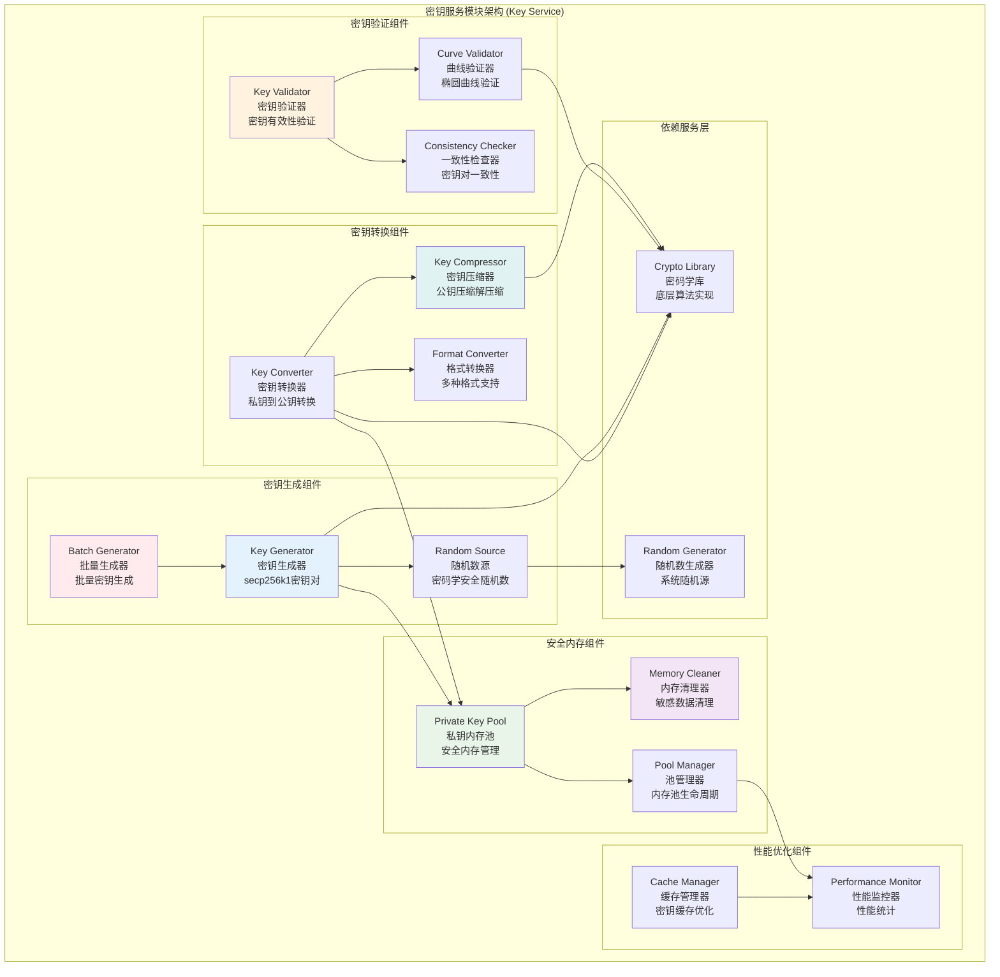

# 密钥服务模块 (Key Service Module)

## 【模块定位】

**密钥服务模块**是WES区块链系统的密钥管理核心组件，负责提供完整的密钥生命周期管理服务。作为区块链系统密码学安全的基础，密钥服务实现了密钥对生成、验证、转换、安全存储等核心功能，支持secp256k1椭圆曲线、密钥压缩解压缩、安全内存管理，为整个区块链系统提供安全可靠的密钥管理基础设施。

## 【设计原则】

### 安全性优先原则

- **密码学安全**: 使用密码学安全的随机数生成器
- **安全内存管理**: 使用后立即清除敏感密钥数据
- **防泄露**: 多层防护机制防止密钥泄露
- **标准兼容**: 遵循secp256k1标准和最佳实践

### 高性能设计原则

- **内存池**: 实现私钥内存池优化性能
- **批量操作**: 支持批量密钥生成和验证
- **并发安全**: 支持多线程并发密钥操作
- **零拷贝**: 减少密钥数据的不必要复制

### 安全内存管理原则

- **自动清理**: 密钥使用完毕后自动清理内存
- **池化管理**: 使用内存池管理私钥的安全分配
- **防泄露**: 多种机制防止内存泄露和数据残留
- **监控审计**: 密钥操作的完整审计日志

## 【核心职责】

### 密钥生成服务

- 生成符合secp256k1标准的密钥对
- 提供密码学安全的随机数源
- 支持批量密钥生成优化
- 实现密钥质量验证和检查

### 密钥转换服务

- 私钥到公钥的安全转换
- 公钥压缩和解压缩操作
- 密钥格式转换和序列化
- 支持多种密钥表示格式

### 密钥验证服务

- 验证私钥的有效性和格式
- 检查公钥的合法性和标准符合性
- 密钥对一致性验证
- 椭圆曲线点有效性验证

### 安全内存管理

- 私钥的安全内存分配和释放
- 内存池的生命周期管理
- 敏感数据的安全擦除
- 内存使用监控和优化

## 【架构组件】



## 【目录结构说明】

```text
key/
├── key.go                      # 密钥服务核心逻辑 - 密钥生成、转换、验证主要实现
├── key_test.go                 # 密钥服务测试 - 完整的单元测试套件
└── README.md                   # 本文档 - 密钥服务详细说明
```

## 【依赖关系】

### 上层调用依赖

- **internal/core/infrastructure/crypto**: 加密模块主服务
- **crypto/signature**: 签名服务 - 密钥用于签名操作
- **crypto/address**: 地址服务 - 公钥生成地址
- **crypto/encryption**: 加密服务 - 密钥用于加密操作

### 外部库依赖

- **github.com/ethereum/go-ethereum/crypto**: 以太坊密码学库
- **github.com/ethereum/go-ethereum/crypto/secp256k1**: secp256k1实现
- **golang.org/x/crypto/sha3**: Keccak256算法
- **crypto/ecdsa**: ECDSA标准库
- **crypto/elliptic**: 椭圆曲线标准库

### Go标准库依赖

- **crypto/rand**: 密码学随机数生成
- **sync**: 并发控制和内存池管理
- **runtime**: 运行时控制和垃圾回收
- **time**: 时间操作和超时控制
- **context**: 上下文控制和取消操作

## 【系统特性】

### secp256k1椭圆曲线

- **标准曲线**: 使用Bitcoin和以太坊相同的椭圆曲线
- **高安全性**: 256位密钥长度提供高安全级别
- **性能优化**: 优化的椭圆曲线运算实现
- **兼容性**: 与现有区块链生态系统完全兼容

### 安全内存管理特性

- **私钥池**: 专门的私钥内存池管理机制
- **自动清理**: 使用完毕后自动清理敏感数据
- **防泄露**: 多层防护防止内存数据泄露
- **池化优化**: 减少内存分配和垃圾回收压力

### 密钥压缩支持

- **压缩公钥**: 33字节压缩公钥格式
- **未压缩公钥**: 64字节未压缩公钥格式
- **动态转换**: 支持两种格式间的动态转换
- **标准兼容**: 符合Bitcoin公钥压缩标准

### 高性能优化

- **批量生成**: 支持批量密钥生成优化
- **并发安全**: 所有操作都是线程安全的
- **内存优化**: 高效的内存使用和管理
- **缓存机制**: 智能缓存频繁使用的密钥

## 【配置管理】

### 密钥生成配置

```yaml
key_generation:
  curve: "secp256k1"              # 椭圆曲线类型
  key_size: 256                   # 密钥长度(位)
  random_source: "crypto/rand"    # 随机数源
  
  batch_processing:
    enabled: true                 # 启用批量处理
    max_batch_size: 100           # 最大批处理大小
    parallel_workers: 4           # 并行工作协程数
    
  validation:
    strict_validation: true       # 严格验证模式
    curve_validation: true        # 椭圆曲线验证
    quality_check: true           # 密钥质量检查
```

### 内存管理配置

```yaml
memory_management:
  private_key_pool:
    enabled: true                 # 启用私钥内存池
    initial_size: 10              # 初始池大小
    max_size: 100                 # 最大池大小
    cleanup_interval: "30s"       # 清理间隔
    
  security:
    auto_cleanup: true            # 自动清理
    secure_erase: true            # 安全擦除
    memory_lock: false            # 内存锁定(可选)
    
  performance:
    gc_optimization: true         # 垃圾回收优化
    memory_limit: "50MB"          # 内存限制
    pool_monitoring: true         # 池监控
```

### 安全参数配置

```yaml
key_security:
  randomness:
    entropy_source: "system"      # 熵源类型
    min_entropy: 256              # 最小熵值(位)
    entropy_check: true           # 熵值检查
    
  validation:
    key_pair_consistency: true    # 密钥对一致性检查
    curve_point_validation: true  # 曲线点验证
    private_key_range: true       # 私钥范围检查
    
  audit:
    operation_logging: true       # 操作日志
    sensitive_data_logging: false # 敏感数据日志(禁用)
    performance_metrics: true     # 性能指标
```

## 【外部接口】

### 密钥生成接口

- **KeyGeneration**: 密钥生成
  - `GenerateKeyPair() (*ecdsa.PrivateKey, *ecdsa.PublicKey, error)`
  - `GeneratePrivateKey() (*ecdsa.PrivateKey, error)`
  - `BatchGenerateKeyPairs(count int) ([]*ecdsa.PrivateKey, []*ecdsa.PublicKey, error)`

### 密钥转换接口

- **KeyConversion**: 密钥转换
  - `PrivateKeyToPublicKey(privateKey *ecdsa.PrivateKey) *ecdsa.PublicKey`
  - `CompressPublicKey(publicKey *ecdsa.PublicKey) []byte`
  - `DecompressPublicKey(compressed []byte) (*ecdsa.PublicKey, error)`

### 密钥验证接口

- **KeyValidation**: 密钥验证
  - `ValidatePrivateKey(privateKey *ecdsa.PrivateKey) error`
  - `ValidatePublicKey(publicKey *ecdsa.PublicKey) error`
  - `ValidateKeyPair(privateKey *ecdsa.PrivateKey, publicKey *ecdsa.PublicKey) error`

### 格式转换接口

- **FormatConversion**: 格式转换
  - `PrivateKeyToBytes(privateKey *ecdsa.PrivateKey) []byte`
  - `PublicKeyToBytes(publicKey *ecdsa.PublicKey) []byte`
  - `BytesToPrivateKey(data []byte) (*ecdsa.PrivateKey, error)`
  - `BytesToPublicKey(data []byte) (*ecdsa.PublicKey, error)`

### 内存管理接口

- **MemoryManagement**: 内存管理
  - `GetPoolStatistics() *PoolStatistics`
  - `CleanupPool() error`
  - `SetPoolSize(size int) error`

## 【相关文档】

- **加密模块总览**: `internal/core/infrastructure/crypto/README.md`
- **签名服务**: `internal/core/infrastructure/crypto/signature/README.md`
- **地址服务**: `internal/core/infrastructure/crypto/address/README.md`
- **加密服务**: `internal/core/infrastructure/crypto/encryption/README.md`
- **加密接口**: `pkg/interfaces/infrastructure/crypto/README.md`

## 【使用策略】

### 密钥生成策略

- **随机性**: 确保使用密码学安全的随机数生成器
- **验证**: 生成后验证密钥的有效性和质量
- **批量优化**: 大量密钥生成时使用批量接口

### 安全策略

- **内存保护**: 使用私钥内存池保护敏感数据
- **及时清理**: 密钥使用完毕后立即清理
- **格式标准**: 严格遵循密钥格式标准

### 性能策略

- **池化管理**: 充分利用内存池机制
- **缓存优化**: 合理缓存频繁使用的密钥
- **并发处理**: 利用多核并发能力

### 扩展策略

- **新曲线**: 支持新椭圆曲线的扩展
- **新格式**: 支持新密钥格式的扩展
- **新算法**: 支持新密钥算法的集成

## 【错误处理】

### 密钥生成错误

- **ErrInsufficientEntropy**: 随机数熵不足
- **ErrKeyGenerationFailed**: 密钥生成失败
- **ErrInvalidCurve**: 无效的椭圆曲线
- **ErrRandomSourceUnavailable**: 随机数源不可用

### 密钥验证错误

- **ErrInvalidPrivateKey**: 无效的私钥
- **ErrInvalidPublicKey**: 无效的公钥
- **ErrKeyPairMismatch**: 密钥对不匹配
- **ErrInvalidKeyLength**: 无效的密钥长度

### 内存管理错误

- **ErrPoolInitialization**: 内存池初始化失败
- **ErrPoolOverflow**: 内存池溢出
- **ErrMemoryAllocation**: 内存分配失败
- **ErrCleanupFailed**: 清理操作失败

### 错误恢复机制

- **自动重试**: 对临时性错误实施智能重试
- **降级处理**: 内存池失败时使用直接分配
- **安全清理**: 错误发生时安全清理敏感数据
- **监控告警**: 关键错误的实时监控和告警
