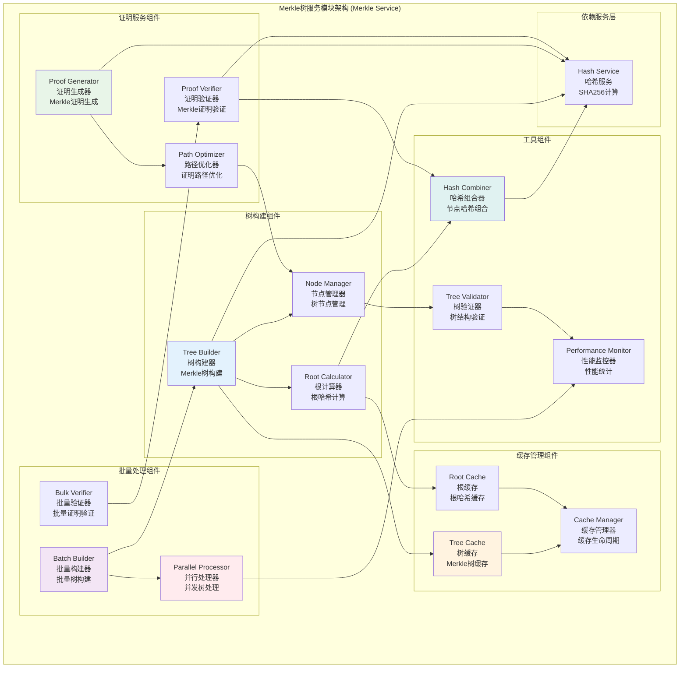

# Merkle树服务模块 (Merkle Tree Service Module)

## 【模块定位】

**Merkle树服务模块**是WES区块链系统的数据完整性验证核心组件，负责提供完整的Merkle树构建和验证服务。作为区块链系统数据完整性和高效验证的关键技术，Merkle服务实现了Merkle树构建、根哈希计算、Merkle证明生成和验证等核心功能，支持智能缓存机制、批量处理、并发操作，为整个区块链系统提供高性能的数据完整性保障和快速验证能力。

## 【设计原则】

### 数据完整性原则

- **强完整性**: 任何数据修改都会改变Merkle根哈希
- **可验证性**: 提供完整的Merkle证明生成和验证
- **防篡改**: 通过哈希链确保数据不可篡改
- **高效验证**: O(log n)复杂度的数据验证

### 高性能设计原则

- **智能缓存**: 实现Merkle树和根哈希的智能缓存
- **批量处理**: 支持批量叶子节点的高效处理
- **并发构建**: 支持大型Merkle树的并发构建
- **内存优化**: 高效的树结构内存管理

### 标准化原则

- **SHA256哈希**: 使用标准SHA256算法构建Merkle树
- **二叉树结构**: 标准的二叉Merkle树实现
- **证明格式**: 标准化的Merkle证明格式
- **兼容性**: 与标准Merkle树实现兼容

## 【核心职责】

### Merkle树构建服务

- 从叶子节点哈希构建完整Merkle树
- 计算Merkle根哈希
- 支持动态叶子节点数量
- 处理奇数节点的标准化处理

### Merkle证明服务

- 生成指定叶子节点的Merkle证明
- 验证Merkle证明的正确性
- 支持批量证明生成和验证
- 提供证明路径优化

### 缓存优化服务

- 实现Merkle树结构的智能缓存
- 提供根哈希的快速查找缓存
- 支持缓存大小动态调整
- 实现缓存命中率优化

### 批量处理服务

- 支持批量叶子节点的Merkle树构建
- 提供批量证明生成和验证
- 实现并发树构建优化
- 支持大规模数据的高效处理

## 【架构组件】



## 【目录结构说明】

```text
merkle/
├── tree.go                     # Merkle树构建逻辑 - 树结构和构建算法
├── proof.go                    # Merkle证明功能 - 证明生成和验证
├── merkle.go                   # Merkle服务主逻辑 - 统一服务接口
├── tree_test.go                # 树构建测试 - 树构建功能测试
├── proof_test.go               # 证明功能测试 - 证明生成验证测试
├── merkle_test.go              # Merkle服务测试 - 集成功能测试
└── README.md                   # 本文档 - Merkle服务详细说明
```

## 【依赖关系】

### 上层调用依赖

- **internal/core/infrastructure/crypto**: 加密模块主服务
- **internal/core/blockchain**: 区块链核心模块 - 区块验证
- **internal/core/consensus**: 共识机制模块 - 共识验证
- **internal/core/mempool**: 内存池模块 - 交易验证

### 平级服务依赖

- **crypto/hash**: 哈希服务 - SHA256哈希计算
- **crypto/signature**: 签名服务 - 签名验证支持

### Go标准库依赖

- **crypto/sha256**: SHA256哈希算法
- **sync**: 并发控制和缓存管理
- **errors**: 错误处理和定义

## 【系统特性】

### 标准Merkle树实现

- **二叉树结构**: 标准的二叉Merkle树实现
- **SHA256哈希**: 使用SHA256算法构建节点哈希
- **奇数处理**: 标准化的奇数叶子节点处理
- **根哈希计算**: 高效的根哈希计算算法

### 高性能优化

- **智能缓存**: 树结构和根哈希的多级缓存
- **批量处理**: 支持批量叶子节点的高效处理
- **并发构建**: 大型树的并发构建优化
- **内存优化**: 高效的树节点内存管理

### Merkle证明系统

- **证明生成**: 高效的Merkle证明生成算法
- **证明验证**: 快速的证明验证机制
- **路径优化**: 最短证明路径算法
- **批量验证**: 支持批量证明验证

### 缓存机制

- **多级缓存**: 节点缓存、根缓存、树缓存
- **LRU策略**: 最近最少使用的缓存淘汰策略
- **动态调整**: 根据使用模式动态调整缓存大小
- **命中率优化**: 智能的缓存命中率优化

## 【配置管理】

### Merkle树配置

```yaml
merkle_tree:
  algorithm:
    hash_function: "SHA256"       # 哈希函数
    tree_type: "binary"           # 树类型
    leaf_hash_prefix: "0x00"      # 叶子哈希前缀
    internal_hash_prefix: "0x01"  # 内部节点哈希前缀
    
  construction:
    parallel_construction: true   # 并行构建
    max_workers: 4                # 最大工作协程数
    min_parallel_size: 1000       # 最小并行处理大小
    
  validation:
    strict_validation: true       # 严格验证
    hash_validation: true         # 哈希验证
    structure_validation: true    # 结构验证
```

### 缓存配置

```yaml
merkle_cache:
  tree_cache:
    enabled: true                 # 启用树缓存
    max_size: 100                 # 最大缓存树数
    ttl: "1h"                     # 缓存生存时间
    
  root_cache:
    enabled: true                 # 启用根缓存
    max_size: 1000                # 最大缓存根数
    ttl: "30m"                    # 缓存生存时间
    
  node_cache:
    enabled: true                 # 启用节点缓存
    max_size: 10000               # 最大缓存节点数
    eviction_policy: "LRU"        # 淘汰策略
    
  performance:
    cleanup_interval: "10m"       # 清理间隔
    hit_rate_target: 0.8          # 目标命中率
    memory_limit: "100MB"         # 内存限制
```

### 性能优化配置

```yaml
merkle_performance:
  batch_processing:
    enabled: true                 # 启用批量处理
    max_batch_size: 10000         # 最大批处理大小
    parallel_workers: 8           # 并行工作协程数
    
  memory_management:
    pool_enabled: true            # 启用对象池
    gc_optimization: true         # 垃圾回收优化
    memory_limit: "200MB"         # 内存限制
    
  concurrency:
    max_concurrent_trees: 10      # 最大并发树数
    worker_pool_size: 16          # 工作池大小
    queue_size: 1000              # 队列大小
```

## 【外部接口】

### Merkle树构建接口

- **TreeConstruction**: 树构建
  - `BuildMerkleTree(hashes [][]byte) (*Node, error)`
  - `ComputeMerkleRoot(hashes [][]byte) ([]byte, error)`
  - `BatchBuildTrees(hashLists [][][]byte) ([]*Node, error)`

### Merkle证明接口

- **ProofGeneration**: 证明生成
  - `GenerateMerkleProof(tree *Node, leafIndex int) (*MerkleProof, error)`
  - `GenerateBatchProofs(tree *Node, leafIndices []int) ([]*MerkleProof, error)`

- **ProofVerification**: 证明验证
  - `VerifyMerkleProof(proof *MerkleProof, leafHash, rootHash []byte) bool`
  - `BatchVerifyProofs(proofs []*MerkleProof, leafHashes [][]byte, rootHash []byte) []bool`

### 缓存管理接口

- **CacheManagement**: 缓存管理
  - `GetCacheStatistics() *CacheStats`
  - `ClearCache(cacheType string) error`
  - `SetCacheSize(cacheType string, size int) error`

### 工具函数接口

- **TreeUtilities**: 树工具
  - `GetTreeDepth(leafCount int) int`
  - `GetLeafCount(tree *Node) int`
  - `ValidateTreeStructure(tree *Node) error`
  - `PrintTree(tree *Node) string`

## 【相关文档】

- **加密模块总览**: `internal/core/infrastructure/crypto/README.md`
- **哈希服务**: `internal/core/infrastructure/crypto/hash/README.md`
- **区块链核心**: `internal/core/blockchain/README.md`
- **共识机制**: `internal/core/consensus/README.md`
- **加密接口**: `pkg/interfaces/infrastructure/crypto/README.md`

## 【使用策略】

### 树构建策略

- **批量构建**: 大量数据时使用批量树构建接口
- **并行优化**: 充分利用并行构建能力
- **缓存利用**: 重复使用相同数据的树结构

### 证明策略

- **证明缓存**: 缓存频繁使用的Merkle证明
- **批量验证**: 多个证明时使用批量验证接口
- **路径优化**: 利用最短路径算法减少证明大小

### 性能策略

- **内存管理**: 及时释放不需要的树结构
- **缓存调优**: 根据使用模式调整缓存策略
- **并发控制**: 合理控制并发树构建数量

### 扩展策略

- **新哈希算法**: 支持新哈希算法的扩展
- **新树结构**: 支持其他树结构的扩展
- **新证明格式**: 支持新证明格式的扩展

## 【错误处理】

### 树构建错误

- **ErrEmptyHashList**: 空哈希列表
- **ErrNilHash**: 存在空哈希
- **ErrTreeConstructionFailed**: 树构建失败
- **ErrInvalidTreeStructure**: 无效的树结构

### 证明相关错误

- **ErrInvalidProof**: 无效的Merkle证明
- **ErrProofGenerationFailed**: 证明生成失败
- **ErrProofVerificationFailed**: 证明验证失败
- **ErrInvalidLeafIndex**: 无效的叶子索引

### 缓存错误

- **ErrCacheInitialization**: 缓存初始化失败
- **ErrCacheOverflow**: 缓存溢出
- **ErrCacheCorruption**: 缓存数据损坏
- **ErrCacheCleanup**: 缓存清理失败

### 错误恢复机制

- **输入验证**: 所有接口都进行严格的输入验证
- **自动重试**: 对临时性错误实施智能重试
- **降级处理**: 缓存失败时直接计算结果
- **监控告警**: 关键错误的实时监控和告警
