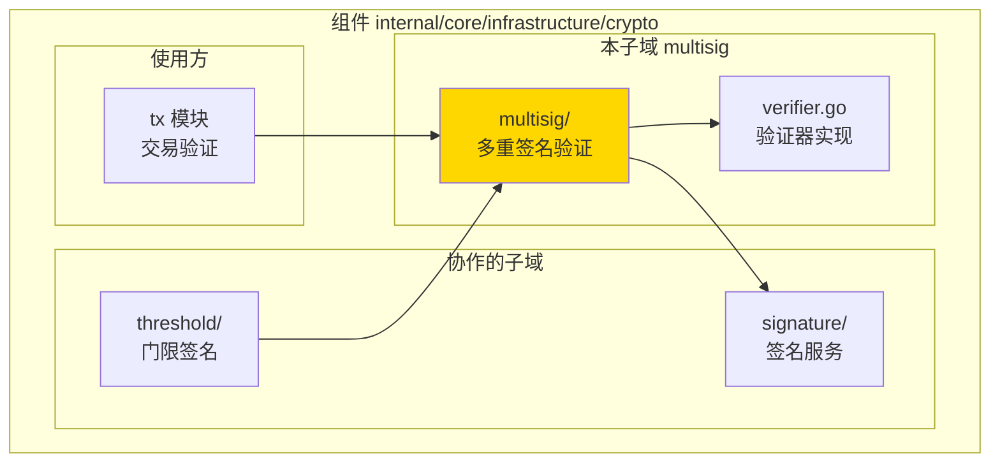
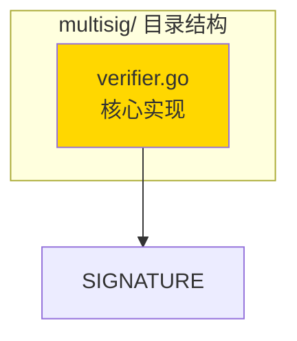

# multisig - 多重签名实现子域

---

## 📌 版本信息

- **版本**：1.0
- **状态**：stable
- **最后更新**：2025-11-15
- **最后审核**：2025-11-15
- **所有者**：密码学基础设施组
- **适用范围**：WES 项目多重签名验证实现

---

## 🎯 子域定位

**路径**：`internal/core/infrastructure/crypto/multisig/`

**所属组件**：`crypto`

**核心职责**：实现 M-of-N 多重签名验证，提供密码学级别的多重签名验证能力

**在组件中的角色**：
- 提供多重签名验证服务（`MultiSignatureVerifier`）
- 依赖 `SignatureManager` 进行单签名验证
- 被 `threshold` 子域使用（门限签名也涉及多重签名逻辑）
- 被 `tx` 模块使用（MultiKeyLock 验证）

---

## 🏗️ 架构设计

### 在组件中的位置

> **说明**：展示此子域在组件内部的位置和协作关系



**位置说明**：

| 关系类型 | 目标 | 关系说明 |
|---------|------|---------|
| **依赖** | signature/ | 使用 `SignatureManager` 进行单签名验证 |
| **被依赖** | threshold/ | threshold 使用 multisig 进行多重签名验证 |
| **被依赖** | tx 模块 | MultiKeyPlugin 使用 multisig 验证 MultiKeyLock |

---

### 内部组织

> **说明**：展示此子域内部的文件组织和类型关系



---

## 📁 目录结构

```
internal/core/infrastructure/crypto/multisig/
├── README.md                    # 本文档
└── verifier.go                  # 多重签名验证器实现
```

---

## 🔧 核心实现

### 实现文件：`verifier.go`

**核心类型**：`MultiSignatureVerifierImpl`

**职责**：实现 `MultiSignatureVerifier` 接口，提供 M-of-N 多重签名验证

**关键字段**：

```go
type MultiSignatureVerifierImpl struct {
    signatureManager cryptointf.SignatureManager
}
```

**关键方法**：

| 方法名 | 职责 | 可见性 | 备注 |
|-------|------|-------|-----|
| `NewMultiSignatureVerifier()` | 构造函数 | Public | 用于依赖注入 |
| `VerifyMultiSignature()` | M-of-N验证 | Public | 实现接口方法 |

---

## 🔗 协作关系

### 依赖的接口

| 接口 | 来源 | 用途 |
|-----|------|-----|
| `SignatureManager` | `pkg/interfaces/infrastructure/crypto/` | 单签名验证 |

---

### 被依赖关系

**被以下模块使用**：
- `tx/verifier/plugins/authz/multi_key.go` - MultiKeyLock 验证
- `threshold/` - 门限签名可能需要多重签名逻辑

**示例**：

```go
// 在 tx 模块中使用
import "github.com/weisyn/v1/internal/core/infrastructure/crypto/multisig"

func NewMultiKeyPlugin(multiSigVerifier crypto.MultiSignatureVerifier) {
    // 使用 multiSigVerifier.VerifyMultiSignature(...)
}
```

---

## 🧪 测试

### 测试覆盖

| 测试类型 | 文件 | 覆盖率目标 | 当前状态 |
|---------|------|-----------|---------|
| 单元测试 | （待添加） | ≥ 80% | 待实现 |

---

## 📊 关键设计决策

### 决策 1：依赖 SignatureManager 而非直接实现

**问题**：是否直接实现签名验证逻辑？

**方案**：依赖 `SignatureManager` 接口，委托给签名服务

**理由**：
- 复用已有签名验证逻辑
- 保持职责分离
- 算法扩展时只需修改 SignatureManager

**权衡**：
- ✅ 优点：代码复用，职责清晰
- ⚠️ 缺点：增加一层调用

---

## 📚 相关文档

- [组件总览](../README.md)
- [公共接口](../../../../pkg/interfaces/infrastructure/crypto/multisig.go)
- [接口与实现的组织架构](../../../../docs/system/standards/principles/code-organization.md)

---

## 📝 变更历史

| 版本 | 日期 | 变更内容 | 作者 |
|-----|------|---------|------|
| 1.0 | 2025-11-15 | 初始版本，从 tx 模块提取 | 密码学基础设施组 |

---

## 🚧 待办事项

- [ ] 添加单元测试
- [ ] 性能基准测试
- [ ] 支持更多签名算法

