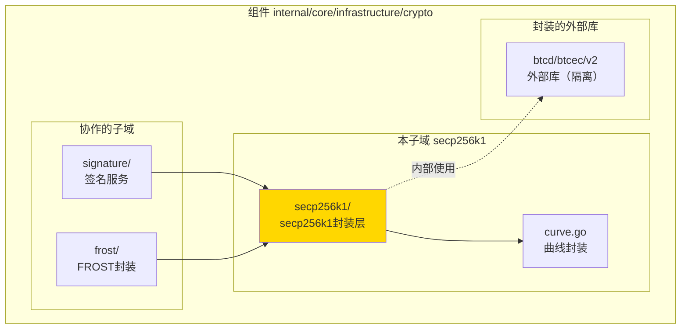
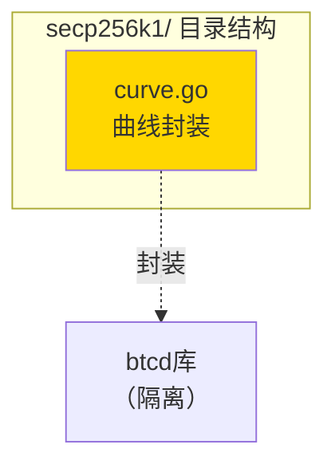

# secp256k1 - secp256k1封装层实现子域

---

## 📌 版本信息

- **版本**：1.0
- **状态**：stable
- **最后更新**：2025-11-15
- **最后审核**：2025-11-15
- **所有者**：密码学基础设施组
- **适用范围**：WES 项目 secp256k1 椭圆曲线封装层实现

---

## 🎯 子域定位

**路径**：`internal/core/infrastructure/crypto/secp256k1/`

**所属组件**：`crypto`

**核心职责**：封装 secp256k1 椭圆曲线实现，隔离区块链特定依赖（btcd），提供统一的 secp256k1 曲线接口

**在组件中的角色**：
- 封装层：隔离 `btcd/btcec/v2` 依赖
- 对外提供统一的 secp256k1 曲线接口
- 被 `signature` 和 `frost` 子域使用

---

## 🏗️ 架构设计

### 在组件中的位置

> **说明**：展示此子域在组件内部的位置和协作关系



**位置说明**：

| 关系类型 | 目标 | 关系说明 |
|---------|------|---------|
| **封装** | btcd/btcec/v2 | 封装btcd库，仅内部使用 |
| **被依赖** | signature/ | 签名服务使用此封装层 |
| **被依赖** | frost/ | FROST验证器使用此封装层 |

---

### 内部组织

> **说明**：展示此子域内部的文件组织和类型关系



---

## 📁 目录结构

```
internal/core/infrastructure/crypto/secp256k1/
├── README.md                    # 本文档
└── curve.go                     # secp256k1曲线封装
```

---

## 🔧 核心实现

### 实现文件：`curve.go`

**核心类型**：`Curve`

**职责**：封装 btcd 的 secp256k1 实现，提供统一的曲线接口

**关键字段**：

```go
type Curve struct{}
```

**关键方法**：

| 方法名 | 职责 | 可见性 | 备注 |
|-------|------|-------|-----|
| `NewCurve()` | 构造函数 | Public | 用于依赖注入 |
| `S256()` | 返回曲线实例 | Public | 返回 `elliptic.Curve` |
| `RecoverPubkey()` | 公钥恢复 | Public | 从签名恢复公钥 |
| `VerifySignature()` | 签名验证 | Public | 验证签名有效性 |

**实现要点**：
- 封装 `btcd/btcec/v2`，仅在模块内部使用
- 对外提供标准 `elliptic.Curve` 接口
- 提供公钥恢复和签名验证等便捷方法

---

## 🔗 协作关系

### 依赖的接口

| 接口 | 来源 | 用途 |
|-----|------|-----|
| `elliptic.Curve` | `crypto/elliptic` | 标准库椭圆曲线接口 |

### 内部依赖（封装隔离）

| 库 | 用途 | 封装方式 |
|-----|------|---------|
| `btcd/btcec/v2` | secp256k1 曲线数学运算 | 仅在模块内使用，不暴露给外部 |

---

### 被依赖关系

**被以下子域使用**：
- `signature/` - 使用 `NewCurve().S256()` 创建曲线
- `frost/` - 使用 secp256k1 曲线进行FROST验证

**示例**：

```go
// 在 signature/signature.go 中使用
import "github.com/weisyn/v1/internal/core/infrastructure/crypto/secp256k1"

type SignatureService struct {
    secp256k1Curve *secp256k1.Curve
}

func (ss *SignatureService) verifyECDSA(...) {
    curve := ss.secp256k1Curve.S256()
    // 使用 curve 进行ECDSA验证
}
```

---

## 🧪 测试

### 测试覆盖

| 测试类型 | 文件 | 覆盖率目标 | 当前状态 |
|---------|------|-----------|---------|
| 单元测试 | （待添加） | ≥ 80% | 待实现 |

---

## 📊 关键设计决策

### 决策 1：封装 btcd 而非直接使用

**问题**：btcd 是区块链特定库，是否应该直接依赖？

**方案**：创建封装层，隔离 btcd 依赖

**理由**：
- btcd 来自 Bitcoin 区块链项目，包含区块链特定代码
- 封装层只使用其 secp256k1 纯数学运算
- 便于未来替换底层实现（如使用标准库或其他库）

**权衡**：
- ✅ 优点：隔离依赖，保持接口稳定
- ⚠️ 缺点：增加一层抽象

### 决策 2：提供便捷方法

**问题**：是否只提供 S256() 方法？

**方案**：提供 S256()、RecoverPubkey()、VerifySignature() 等便捷方法

**理由**：
- S256() 返回标准接口，兼容性好
- RecoverPubkey() 和 VerifySignature() 提供常用功能
- 减少其他模块对 btcd 的直接依赖

---

## 📚 相关文档

- [组件总览](../README.md)
- [signature子域](../signature/README.md)
- [frost子域](../frost/README.md)
- [接口与实现的组织架构](../../../../docs/system/standards/principles/code-organization.md)

---

## 📝 变更历史

| 版本 | 日期 | 变更内容 | 作者 |
|-----|------|---------|------|
| 1.0 | 2025-11-15 | 初始版本，封装btcd依赖 | 密码学基础设施组 |

---

## 🚧 待办事项

- [ ] 添加单元测试
- [ ] 性能基准测试

