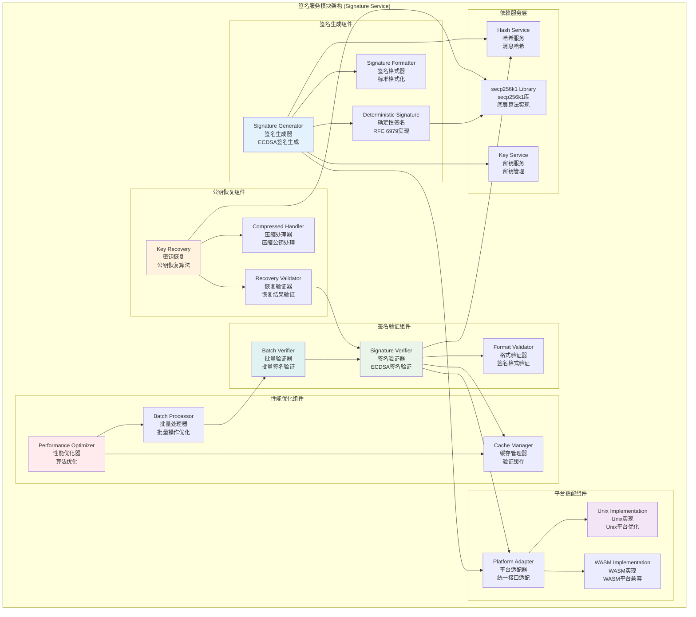

# 签名服务模块 (Signature Service Module)

## 【模块定位】

**签名服务模块**是WES区块链系统的数字签名核心组件，负责提供完整的数字签名和验证服务。作为区块链系统身份验证和数据完整性的关键保障，签名服务实现了ECDSA数字签名算法，支持签名生成、验证、公钥恢复、批量验证等核心功能，具备跨平台兼容性(Unix/WASM)，为整个区块链系统提供安全可靠的身份认证和数据完整性验证基础设施。

## 【设计原则】

### 密码学安全原则

- **标准算法**: 使用ECDSA标准数字签名算法
- **secp256k1曲线**: 采用Bitcoin和以太坊相同的椭圆曲线
- **防重放攻击**: 实现签名的防重放保护机制
- **常量时间**: 关键操作使用常量时间实现

### 高性能设计原则

- **批量验证**: 支持多个签名的批量验证优化
- **公钥恢复**: 高效的ECDSA公钥恢复算法
- **并发安全**: 支持多线程并发签名操作
- **内存优化**: 高效的签名数据内存管理

### 跨平台兼容原则

- **多平台支持**: 支持Unix和WASM平台
- **条件编译**: 针对不同平台的优化实现
- **API一致性**: 保证跨平台的接口一致性
- **性能调优**: 平台特定的性能优化

## 【核心职责】

### 数字签名服务

- 使用ECDSA算法生成数字签名
- 支持secp256k1椭圆曲线签名
- 实现确定性签名生成(RFC 6979)
- 提供签名格式标准化

### 签名验证服务

- 验证ECDSA数字签名的正确性
- 支持批量签名验证优化
- 实现签名格式验证
- 提供快速验证算法

### 公钥恢复服务

- 从签名和消息恢复公钥
- 支持压缩和未压缩公钥恢复
- 实现高效的恢复算法
- 提供恢复结果验证

### 跨平台支持服务

- 提供Unix平台优化实现
- 支持WASM平台兼容性
- 实现平台特定性能优化
- 保证跨平台结果一致性

## 【架构组件】



## 【目录结构说明】

```text
signature/
├── signature.go                # 签名服务核心逻辑 - 主要签名算法实现
├── signature_unix.go           # Unix平台特定实现 - Unix系统优化
├── signature_wasm.go           # WASM平台特定实现 - WASM兼容性
├── signature_test.go           # 签名服务测试 - 完整的单元测试套件
└── README.md                   # 本文档 - 签名服务详细说明
```

## 【依赖关系】

### 上层调用依赖

- **internal/core/infrastructure/crypto**: 加密模块主服务
- **internal/core/blockchain**: 区块链核心模块 - 交易签名验证
- **internal/core/consensus**: 共识机制模块 - 共识签名
- **internal/core/mempool**: 内存池模块 - 交易验证

### 平级服务依赖

- **crypto/key**: 密钥服务 - 密钥生成和管理
- **crypto/hash**: 哈希服务 - 消息哈希计算
- **crypto/address**: 地址服务 - 地址验证支持

### 外部库依赖

- **github.com/ethereum/go-ethereum/crypto/secp256k1**: secp256k1算法库
- **crypto/ecdsa**: ECDSA标准库实现
- **crypto/rand**: 密码学随机数生成
- **math/big**: 大整数运算

### Go标准库依赖

- **bytes**: 字节数组操作
- **errors**: 错误处理和定义
- **fmt**: 格式化操作

## 【系统特性】

### ECDSA数字签名

- **secp256k1曲线**: 使用与Bitcoin相同的椭圆曲线
- **确定性签名**: 实现RFC 6979确定性签名标准
- **标准格式**: 符合DER编码和Bitcoin签名格式
- **恢复ID**: 支持公钥恢复的恢复ID机制

### 高性能验证

- **快速验证**: 优化的ECDSA验证算法
- **批量验证**: 支持多个签名的批量验证
- **公钥恢复**: 高效的公钥恢复算法
- **缓存优化**: 验证结果的智能缓存

### 跨平台兼容

- **Unix优化**: 针对Unix系统的性能优化
- **WASM支持**: 完整的WebAssembly平台支持
- **条件编译**: 平台特定的编译优化
- **API一致**: 跨平台的接口一致性保证

### 安全特性

- **防重放**: 签名防重放攻击保护
- **常量时间**: 关键比较操作使用常量时间
- **格式验证**: 严格的签名格式验证
- **错误处理**: 安全的错误处理机制

## 【配置管理】

### 签名算法配置

```yaml
signature_algorithm:
  ecdsa:
    curve: "secp256k1"            # 椭圆曲线
    hash_algorithm: "SHA256"      # 哈希算法
    deterministic: true           # 确定性签名(RFC 6979)
    recovery_id: true             # 启用恢复ID
    
  format:
    encoding: "DER"               # 签名编码格式
    compression: true             # 公钥压缩
    strict_validation: true       # 严格格式验证
    
  security:
    replay_protection: true       # 防重放保护
    constant_time: true           # 常量时间操作
    secure_random: true           # 安全随机数
```

### 性能优化配置

```yaml
signature_performance:
  verification:
    batch_verification: true      # 批量验证
    max_batch_size: 1000          # 最大批量大小
    parallel_workers: 4           # 并行工作协程数
    
  caching:
    verification_cache: true      # 验证缓存
    cache_size: 10000             # 缓存大小
    cache_ttl: "1h"               # 缓存TTL
    
  recovery:
    recovery_cache: true          # 恢复缓存
    compressed_preference: true   # 压缩公钥优先
    recovery_optimization: true   # 恢复算法优化
```

### 平台特定配置

```yaml
platform_specific:
  unix:
    native_optimization: true     # 原生优化
    asm_acceleration: true        # 汇编加速
    simd_instructions: true       # SIMD指令
    
  wasm:
    compatibility_mode: true      # 兼容模式
    performance_fallback: true    # 性能回退
    memory_optimization: true     # 内存优化
    
  cross_platform:
    api_consistency: true         # API一致性
    result_verification: true     # 结果验证
    test_coverage: true           # 测试覆盖
```

## 【外部接口】

### 签名生成接口

- **SignatureGeneration**: 签名生成
  - `Sign(message []byte, privateKey *ecdsa.PrivateKey) ([]byte, error)`
  - `SignWithRecovery(message []byte, privateKey *ecdsa.PrivateKey) ([]byte, byte, error)`
  - `SignDeterministic(message []byte, privateKey *ecdsa.PrivateKey) ([]byte, error)`

### 签名验证接口

- **SignatureVerification**: 签名验证
  - `Verify(message, signature []byte, publicKey *ecdsa.PublicKey) bool`
  - `VerifyWithRecovery(message, signature []byte, recoveryID byte, publicKey *ecdsa.PublicKey) bool`
  - `BatchVerify(messages [][]byte, signatures [][]byte, publicKeys []*ecdsa.PublicKey) []bool`

### 公钥恢复接口

- **KeyRecovery**: 公钥恢复
  - `RecoverPublicKey(message, signature []byte, recoveryID byte) (*ecdsa.PublicKey, error)`
  - `RecoverCompressedPublicKey(message, signature []byte, recoveryID byte) ([]byte, error)`
  - `ValidateRecoveredKey(message, signature []byte, recoveredKey *ecdsa.PublicKey) bool`

### 批量操作接口

- **BatchOperations**: 批量操作
  - `BatchSign(messages [][]byte, privateKeys []*ecdsa.PrivateKey) ([][]byte, error)`
  - `BatchVerifyParallel(messages [][]byte, signatures [][]byte, publicKeys []*ecdsa.PublicKey) []bool`
  - `BatchRecover(messages [][]byte, signatures [][]byte, recoveryIDs []byte) ([]*ecdsa.PublicKey, error)`

### 工具函数接口

- **SignatureUtils**: 签名工具
  - `ValidateSignatureFormat(signature []byte) error`
  - `ExtractRS(signature []byte) (r, s *big.Int, error)`
  - `SerializeSignature(r, s *big.Int) []byte`
  - `GetSignatureLength() int`

## 【相关文档】

- **加密模块总览**: `internal/core/infrastructure/crypto/README.md`
- **密钥服务**: `internal/core/infrastructure/crypto/key/README.md`
- **哈希服务**: `internal/core/infrastructure/crypto/hash/README.md`
- **地址服务**: `internal/core/infrastructure/crypto/address/README.md`
- **区块链核心**: `internal/core/blockchain/README.md`
- **加密接口**: `pkg/interfaces/infrastructure/crypto/README.md`

## 【使用策略】

### 签名策略

- **确定性签名**: 优先使用确定性签名避免随机性问题
- **恢复ID**: 使用恢复ID减少存储和传输开销
- **格式标准**: 严格遵循标准签名格式

### 验证策略

- **批量验证**: 多个签名时使用批量验证提高性能
- **缓存利用**: 充分利用验证缓存机制
- **并行处理**: 利用多核并行验证能力

### 平台策略

- **平台感知**: 根据运行平台选择最优实现
- **性能测试**: 定期进行跨平台性能测试
- **兼容性**: 确保跨平台结果一致性

### 安全策略

- **密钥保护**: 确保私钥的安全使用和清理
- **防重放**: 实施签名防重放保护机制
- **格式验证**: 严格验证签名格式和参数

## 【错误处理】

### 签名生成错误

- **ErrInvalidPrivateKey**: 无效的私钥
- **ErrSignatureGenerationFailed**: 签名生成失败
- **ErrInvalidMessage**: 无效的消息
- **ErrRandomGenerationFailed**: 随机数生成失败

### 签名验证错误

- **ErrInvalidSignature**: 无效的签名
- **ErrInvalidPublicKey**: 无效的公钥
- **ErrVerificationFailed**: 验证失败
- **ErrInvalidSignatureFormat**: 无效的签名格式

### 公钥恢复错误

- **ErrInvalidRecoveryID**: 无效的恢复ID
- **ErrRecoveryFailed**: 公钥恢复失败
- **ErrRecoveredKeyMismatch**: 恢复密钥不匹配
- **ErrInvalidHashLength**: 无效的哈希长度

### 批量操作错误

- **ErrSignatureBatchMismatch**: 签名和数据数量不匹配
- **ErrBatchProcessingFailed**: 批量处理失败
- **ErrParallelProcessingError**: 并行处理错误
- **ErrBatchSizeExceeded**: 批量大小超限

### 错误恢复机制

- **输入验证**: 所有接口都进行严格的输入验证
- **自动重试**: 对临时性错误实施智能重试
- **降级处理**: 批量操作失败时回退到单个处理
- **监控告警**: 关键错误的实时监控和告警
