# 事件总线基础设施实现 (Event Bus Infrastructure Implementation)

## 【模块定位】

　　**事件总线基础设施模块**是WES区块链系统事件通信机制的核心实现。本模块基于asaskevich/EventBus构建，并扩展了域注册、智能路由、事件验证等企业级功能，为整个系统提供高性能、可靠的异步事件通信服务。

## 【设计理念】

### 基础设施职责

　　作为基础设施层，本模块遵循"**提供机制，不定义业务**"的原则：
- 提供事件发布、订阅、路由等核心机制
- 不硬编码任何业务域名称
- 支持组件动态注册和自管理
- 保持最大的灵活性和可扩展性

### 架构设计

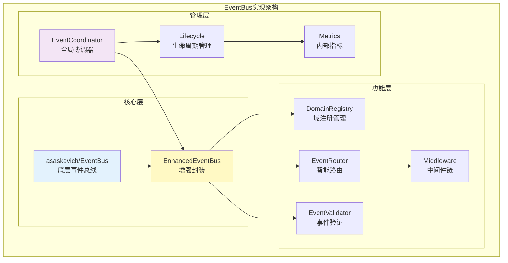

## 【核心组件】

### EventBus - 事件总线核心

#### 基础功能
- **发布订阅**：支持同步/异步的事件发布和订阅
- **一次性订阅**：支持只响应一次的事件订阅
- **批量操作**：支持批量发布和订阅
- **历史记录**：可选的事件历史记录功能

#### 增强功能
- **域管理**：动态域注册和验证
- **智能路由**：基于规则的事件路由
- **优先级处理**：支持事件优先级队列
- **中间件支持**：可插拔的中间件机制

### DomainRegistry - 域注册中心

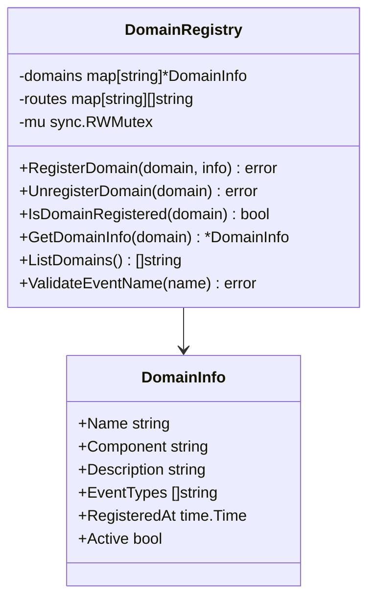

### EventRouter - 智能路由器

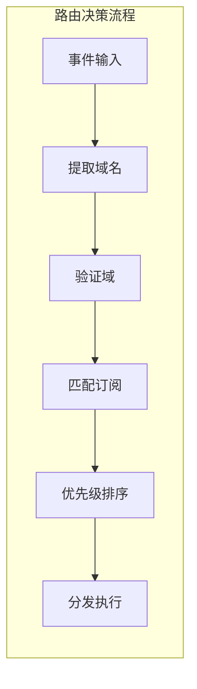

#### 路由策略

| 策略 | 说明 | 应用场景 |
|------|------|---------|
| Direct | 直接路由到指定订阅者 | 点对点通信 |
| Broadcast | 广播到所有订阅者 | 状态同步 |
| RoundRobin | 轮询分发 | 负载均衡 |
| Priority | 按优先级分发 | 关键事件处理 |
| Filter | 基于条件过滤 | 选择性处理 |

### EventValidator - 事件验证器

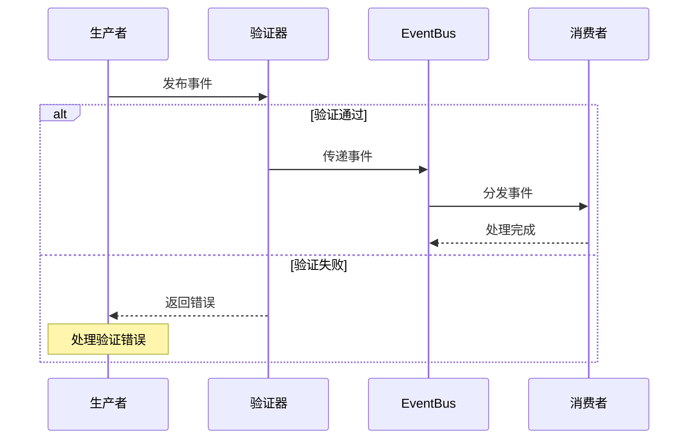

## 【实现细节】

### 模块初始化

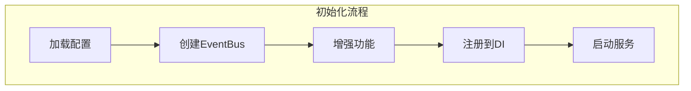

### 事件发布流程

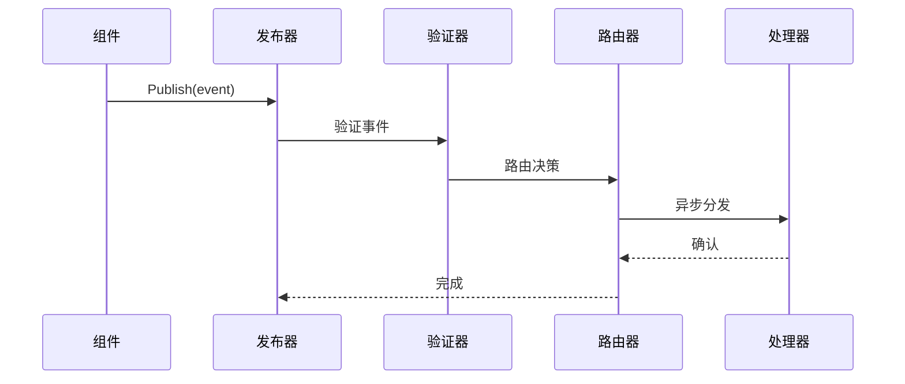

### 事件订阅流程

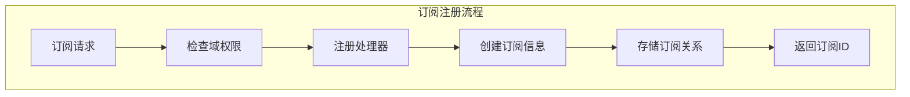

## 【配置管理】

### 配置结构

```go
type Config struct {
    // 基础配置
    Enabled                bool   // 是否启用
    
    // 增强功能开关
    EnableEnhancedFeatures bool   // 启用增强功能
    EnableDomainRegistry   bool   // 启用域注册
    EnableSmartRouter      bool   // 启用智能路由
    EnableValidator        bool   // 启用验证器
    
    // 域管理配置
    StrictDomainCheck      bool   // 严格域检查
    WarnCrossDomain        bool   // 跨域警告
    AllowUnregisteredDomain bool  // 允许未注册域
    
    // 性能配置
    AsyncPublish          bool    // 异步发布
    WorkerPoolSize        int     // 工作池大小
    BufferSize            int     // 缓冲区大小
    MaxRetries            int     // 最大重试次数
    RetryInterval         time.Duration // 重试间隔
    
    // 监控配置
    EnableMetrics         bool    // 启用指标
    MetricsInterval       time.Duration // 指标更新间隔
}
```

### 配置优先级

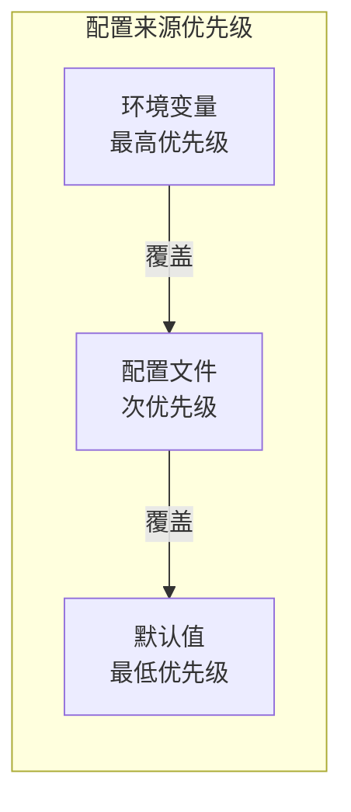

## 【性能优化】

### 优化策略

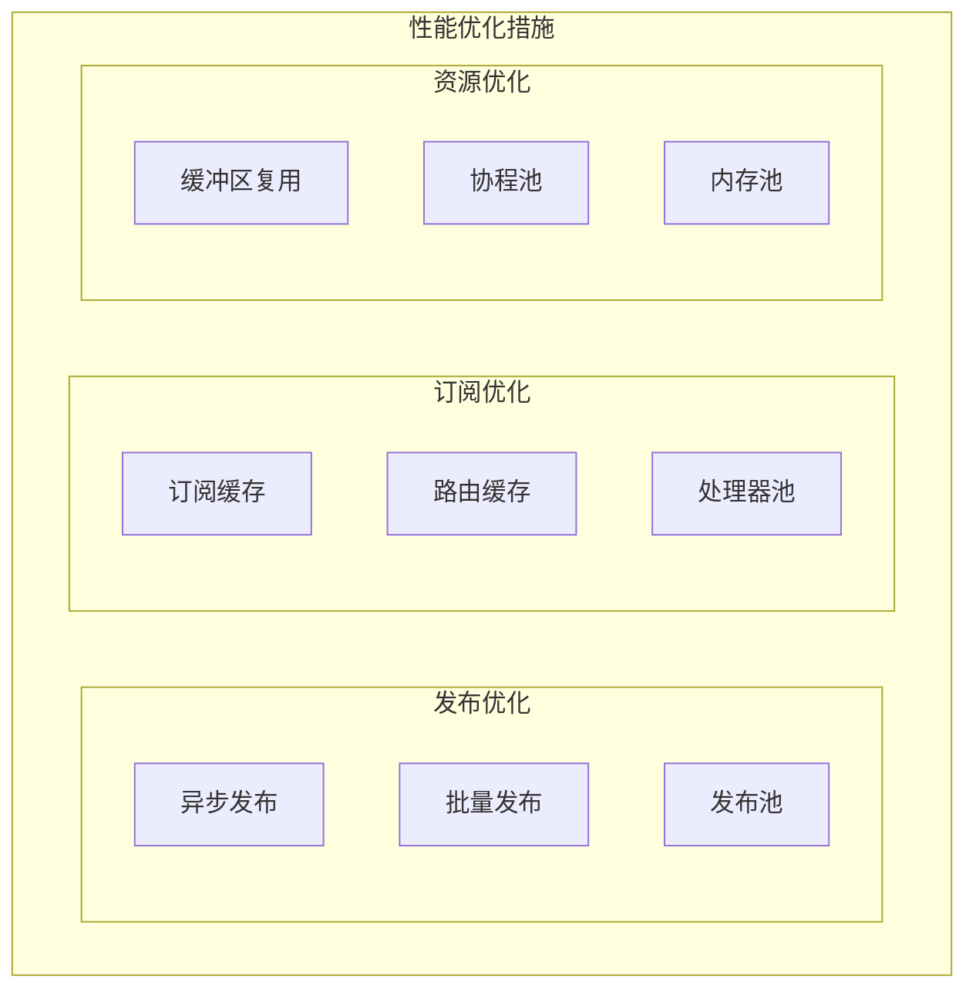

### 性能基准

| 操作 | 基准值 | 测试条件 |
|------|--------|---------|
| 单事件发布 | < 100μs | 1个订阅者 |
| 批量发布(100) | < 1ms | 10个订阅者 |
| 事件路由 | < 10μs | 100个订阅者 |
| 端到端延迟 | < 1ms | 正常负载 |

## 【错误处理】

### 错误分类和处理

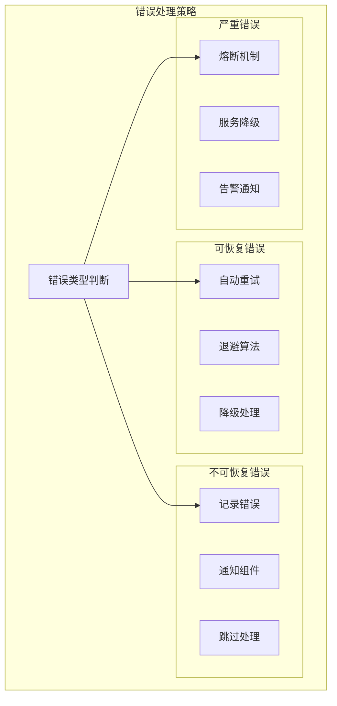

### 重试机制

| 策略 | 说明 | 参数 |
|------|------|------|
| 线性退避 | 固定间隔重试 | interval=1s |
| 指数退避 | 指数增长间隔 | base=1s, factor=2 |
| 随机退避 | 随机间隔重试 | min=1s, max=10s |
| 有限重试 | 限制重试次数 | maxRetries=3 |

## 【监控指标】

### 内部指标

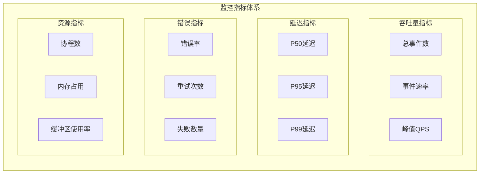

## 【扩展机制】

### 中间件支持

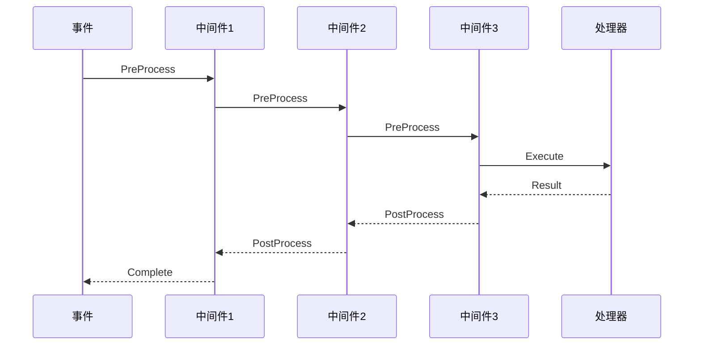

### 插件接口

| 接口 | 功能 | 示例 |
|------|------|------|
| EventFilter | 事件过滤 | 权限过滤、内容过滤 |
| EventTransformer | 事件转换 | 格式转换、数据映射 |
| EventValidator | 事件验证 | Schema验证、业务规则 |
| EventInterceptor | 事件拦截 | 日志记录、审计追踪 |

## 【测试支持】

### 测试工具

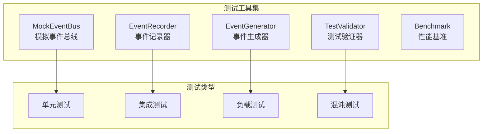

## 【故障处理】

### 故障场景

| 场景 | 处理策略 | 恢复机制 |
|------|---------|---------|
| 处理器panic | 捕获并记录 | 重启处理器 |
| 事件堆积 | 流量控制 | 扩容缓冲区 |
| 内存泄漏 | 监控告警 | 重启服务 |
| 死锁 | 超时检测 | 强制释放 |

## 【最佳实践】

### 实现建议

#### DO - 推荐做法

- ✅ 使用对象池减少GC压力
- ✅ 实现优雅关闭机制
- ✅ 添加必要的监控指标
- ✅ 使用context进行超时控制
- ✅ 实现幂等的事件处理

#### DON'T - 避免做法

- ❌ 在处理器中执行阻塞操作
- ❌ 忽略错误处理
- ❌ 创建过多的goroutine
- ❌ 使用全局变量存储状态
- ❌ 硬编码配置参数

## 【维护指南】

### 日常维护

- 定期检查错误日志
- 监控性能指标趋势
- 清理过期的订阅关系
- 更新依赖库版本
- 执行性能基准测试

### 故障排查

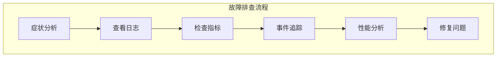

## 【版本历史】

| 版本 | 变更内容 | 日期 |
|------|---------|------|
| v1.0.0 | 初始版本，基础EventBus | 2024-01 |
| v1.1.0 | 添加域注册功能 | 2024-02 |
| v1.2.0 | 实现智能路由 | 2024-03 |
| v1.3.0 | 添加中间件支持 | 2024-04 |

## 【附录】

### 依赖项

- github.com/asaskevich/EventBus - 底层事件总线
- go.uber.org/fx - 依赖注入框架
- github.com/google/uuid - UUID生成

### 相关模块

- pkg/interfaces/infrastructure/event - 接口定义
- internal/config/event - 配置管理
- internal/core/*/integration/event - 集成示例