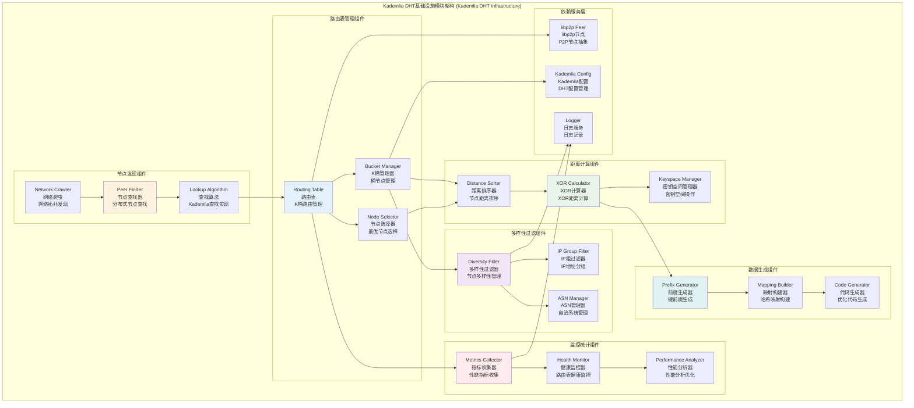

# Kademlia DHT基础设施模块 (Kademlia DHT Infrastructure Module)

## 【模块定位】

**Kademlia DHT基础设施模块**是WES区块链系统的分布式哈希表核心组件，负责提供P2P网络中的节点发现、路由管理和数据定位服务。作为区块链P2P网络层的关键基础设施，Kademlia模块实现了完整的Kademlia分布式哈希表算法，包括路由表管理、XOR距离计算、节点多样性过滤、K桶管理等核心功能，为整个区块链系统提供高效、可靠的分布式网络服务。

## 【设计原则】

### Kademlia算法原则

- **XOR距离度量**: 基于XOR运算的一致性距离度量
- **二进制树结构**: 基于二进制前缀的树状路由结构
- **对称性**: 节点间距离的对称性和一致性
- **单调性**: 距离度量的单调性保证

### 分布式系统原则

- **去中心化**: 无中心节点的完全分布式架构
- **自组织**: 节点自动发现和路由表自维护
- **容错性**: 节点故障的自动检测和恢复
- **可扩展性**: 支持大规模P2P网络的扩展

### 高性能优化原则

- **并发安全**: 完全线程安全的并发路由表操作
- **缓存优化**: LRU缓存机制优化节点访问
- **批量处理**: 批量节点操作和查询优化
- **内存管理**: 高效的内存使用和垃圾回收

## 【核心职责】

### 路由表管理服务

- 维护基于Kademlia算法的路由表结构
- 实现K桶的节点添加、删除和查找
- 提供节点距离计算和排序功能
- 管理路由表的动态更新和维护

### 节点发现服务

- 实现基于XOR距离的节点查找算法
- 提供最近邻节点的快速查找
- 支持节点网络拓扑的自动发现
- 实现节点活跃性检测和验证

### 分布式数据定位

- 提供基于键的数据定位服务
- 实现分布式哈希的一致性映射
- 支持数据的分布式存储和检索
- 提供负载均衡的数据分布策略

### 网络多样性管理

- 实现节点IP地址多样性过滤
- 防止单点故障和网络分区
- 优化网络拓扑的健壮性
- 提供ASN (自治系统) 级别的多样性

### 性能监控服务

- 收集路由表性能指标
- 监控节点查找延迟和成功率
- 提供网络健康状态评估
- 实现路由表优化建议

## 【架构组件】



## 【目录结构说明】

```text
kademlia/
├── manager.go                  # 路由表管理器 - Kademlia路由表核心实现
├── bucket.go                   # K桶管理 - 桶节点管理和LRU缓存
├── distance.go                 # 距离计算 - XOR距离计算实现
├── sorting.go                  # 节点排序 - 基于距离的节点排序
├── selector.go                 # 节点选择 - 最优节点选择算法
├── util.go                     # 工具函数 - 通用工具和辅助函数
├── errors.go                   # 错误定义 - Kademlia相关错误类型
├── config.go                   # 配置管理 - DHT配置和参数管理
├── module.go                   # 模块定义 - FX依赖注入配置
├── IMPLEMENTATION_TRACKING.md  # 实现跟踪 - 重构进度和计划文档
├── keyspace/                   # 密钥空间模块 - XOR密钥空间实现
│   ├── keyspace.go                # 密钥空间核心实现
│   ├── xor.go                     # XOR距离计算实现
│   ├── xor_test.go                # XOR计算测试
│   └── README.md                  # 密钥空间模块文档
├── peerdiversity/              # 节点多样性模块 - 节点多样性过滤
│   ├── filter.go                  # 多样性过滤器实现
│   └── README.md                  # 节点多样性模块文档
├── generate/                   # 代码生成模块 - 优化代码生成工具
│   ├── main.go                    # 前缀映射生成器
│   └── README.md                  # 代码生成模块文档
└── README.md                   # 本文档 - Kademlia模块总览
```

## 【依赖关系】

### 上层调用依赖

- **internal/core/network**: 网络模块 - P2P网络通信和节点管理
- **internal/core/node**: 节点模块 - 节点发现和连接管理
- **pkg/api**: API服务层 - DHT查询和数据检索

### 平级基础设施依赖

- **pkg/interfaces/infrastructure/kademlia**: Kademlia接口定义
- **pkg/interfaces/infrastructure/log**: 日志记录接口
- **pkg/types**: 公共类型定义

### 外部库依赖

- **github.com/libp2p/go-libp2p/core/peer**: libp2p节点抽象
- **math/big**: 大整数运算支持 (XOR距离计算)
- **net**: 网络地址处理
- **crypto/sha256**: SHA256哈希算法

### Go标准库依赖

- **context**: 上下文管理和取消操作
- **sync**: 并发控制和读写锁
- **time**: 时间处理和定时器
- **sort**: 排序算法支持

## 【已知问题与修复方案】

### ⚠️ K桶事件桥接问题（2025-09-11发现）

**问题描述**：
　　矿工节点在区块广播时出现"no closest peers found for submission"错误，日志审查发现发现模块多次"connect_success"并"发布peer连接事件"，但K桶路由表实际为空（0 个peer），导致FindClosestPeers无法找到候选节点进行区块提交。

**根本原因**：

- **事件桥接失效**：发现模块发布的"peer连接事件"与K桶管理器订阅的事件主题/结构不匹配，导致connect_success无法正确落表入桶
- **启动时序问题**：K桶管理器未对已连接peers执行一次性全量导入，错过早期连接导致空表
- **缺乏兜底机制**：miner_block_sender完全依赖K桶查找，缺乏回退策略

**修复方案**：

1. **统一事件桥接**：确保发现模块发布的peer连接事件与K桶管理器订阅的事件主题/字段完全一致
2. **启动全量导入**：K桶管理器启动时从host.Peerstore/Network.Peers()执行一次性全量导入已连接peers
3. **实现回退策略**：在miner_block_sender中增加K桶为空时的兜底逻辑，直接使用支持目标协议的已连接peers
4. **增加诊断端点**：提供K桶状态查询接口，便于运维排障和状态监控

**验收标准**：

- 矿工日志出现"路由表总共有 N 个peer（N>0）→ 找到 M 个最近节点（M>0）→ 成功提交"
- 无"no closest peers found for submission"错误
- 聚合节点日志出现"收到并处理区块提交"记录
- 连续多轮稳定通过（≥3次）且平均提交耗时<1s

---

## 【系统特性】

### Kademlia算法特性

- **XOR距离度量**: 使用XOR运算定义节点间的距离
- **二进制前缀**: 基于二进制前缀的树状路由结构
- **K桶管理**: 每个桶最多存储K个节点，使用LRU淘汰策略
- **对数查找**: O(log N)复杂度的分布式节点查找

### 分布式网络特性

- **去中心化**: 无单点故障的完全分布式架构
- **自组织**: 节点自动加入和离开网络
- **容错性**: 自动检测和处理节点故障
- **负载均衡**: 数据和查询的自动负载均衡

### 网络多样性特性

- **IP多样性**: 确保路由表中节点的IP地址多样性
- **ASN多样性**: 基于自治系统的网络拓扑多样性
- **地理分布**: 支持地理位置的分布式优化
- **故障隔离**: 防止网络分区和单点故障

### 性能优化特性

- **并发安全**: 完全线程安全的路由表操作
- **缓存机制**: LRU缓存优化频繁访问的节点
- **批量操作**: 支持批量节点查询和更新
- **内存优化**: 高效的内存使用和垃圾回收

## 【配置管理】

### Kademlia核心配置

```yaml
kademlia:
  # 基础配置
  bucket_size: 20                   # K桶大小 (Kademlia标准值)
  max_latency: "10s"                # 最大节点延迟
  usefulness_grace_period: "60s"    # 节点有用性宽限期
  refresh_interval: "1h"            # 路由表刷新间隔
  
  # 查找配置
  alpha: 3                          # 并发查找数量
  lookup_timeout: "30s"             # 查找超时时间
  max_lookup_steps: 20              # 最大查找步数
  
  # 健康检查
  ping_timeout: "5s"                # Ping超时时间
  health_check_interval: "10m"      # 健康检查间隔
  max_failed_pings: 3               # 最大失败Ping次数
```

### 路由表配置

```yaml
kademlia:
  routing_table:
    # 桶管理
    bucket_refresh_interval: "15m"   # 桶刷新间隔
    max_replacement_cache_size: 5    # 替换缓存最大大小
    
    # 节点管理
    node_timeout: "30m"              # 节点超时时间
    max_last_successful_outbound: "1h" # 最大成功出站时间
    
    # 性能优化
    enable_concurrent_lookup: true   # 启用并发查找
    max_concurrent_queries: 10       # 最大并发查询数
    query_batch_size: 3              # 查询批次大小
```

### 多样性过滤配置

```yaml
kademlia:
  diversity:
    # IP多样性
    enable_ip_diversity: true        # 启用IP多样性过滤
    max_peers_per_ip_group: 2        # 每个IP组最大节点数
    ip_group_size: 16                # IP组大小 (/16网络)
    
    # ASN多样性
    enable_asn_diversity: true       # 启用ASN多样性
    max_peers_per_asn: 5             # 每个ASN最大节点数
    
    # 地理多样性
    enable_geo_diversity: false      # 启用地理多样性 (可选)
    max_peers_per_region: 10         # 每个地区最大节点数
```

### 监控统计配置

```yaml
kademlia:
  monitoring:
    # 指标收集
    enable_metrics: true             # 启用指标收集
    metrics_interval: "30s"          # 指标收集间隔
    
    # 性能监控
    track_lookup_latency: true       # 跟踪查找延迟
    track_routing_table_size: true   # 跟踪路由表大小
    track_peer_churn: true           # 跟踪节点流失率
    
    # 告警配置
    lookup_latency_threshold: "1s"   # 查找延迟告警阈值
    routing_table_min_size: 50       # 路由表最小大小告警
    peer_churn_threshold: 0.1        # 节点流失率告警阈值
```

## 【外部接口】

### 路由表管理接口

- **RoutingTableManager**: 路由表管理
  - `AddPeer(peerID peer.ID, isQueryPeer bool) (bool, error)`
  - `RemovePeer(peerID peer.ID)`
  - `NearestPeers(key []byte, count int) []peer.ID`
  - `Size() int`
  - `GetPeersForCPL(cpl uint) []peer.ID`

### 节点查找接口

- **PeerLookup**: 节点查找
  - `FindPeer(ctx context.Context, peerID peer.ID) (peer.AddrInfo, error)`
  - `FindClosestPeers(ctx context.Context, key []byte, count int) ([]peer.ID, error)`
  - `Bootstrap(ctx context.Context, bootstrapPeers []peer.AddrInfo) error`

### 距离计算接口

- **DistanceCalculator**: 距离计算
  - `Distance(id1, id2 []byte) *big.Int`
  - `XORDistance(key1, key2 []byte) []byte`
  - `CommonPrefixLength(id1, id2 []byte) int`
  - `SortByDistance(key []byte, peers []peer.ID) []peer.ID`

### 多样性过滤接口

- **DiversityFilter**: 多样性过滤
  - `AllowPeer(peerInfo PeerGroupInfo) bool`
  - `DisallowPeer(peerInfo PeerGroupInfo) bool`
  - `GetIPGroupKey(peerID peer.ID) PeerIPGroupKey`
  - `UpdatePeerGroup(peerID peer.ID, addrs []net.Addr)`

### 性能监控接口

- **KademliaMetrics**: 性能监控
  - `GetRoutingTableStats() *RoutingTableStats`
  - `GetLookupStats() *LookupStats`
  - `GetPeerStats() *PeerStats`
  - `ResetMetrics()`

## 【相关文档】

- **密钥空间**: `internal/core/infrastructure/kademlia/keyspace/README.md`
- **节点多样性**: `internal/core/infrastructure/kademlia/peerdiversity/README.md`
- **代码生成**: `internal/core/infrastructure/kademlia/generate/README.md`
- **Kademlia接口**: `pkg/interfaces/infrastructure/kademlia/README.md`
- **网络模块**: `internal/core/network/README.md`
- **节点模块**: `internal/core/node/README.md`

## 【使用策略】

### 路由表管理策略

- **节点选择**: 优先选择延迟低、稳定性高的节点
- **桶维护**: 定期刷新路由表，清理无效节点
- **负载均衡**: 合理分布节点，避免热点问题
- **容错处理**: 及时发现和替换故障节点

### 节点发现策略

- **启动发现**: 系统启动时通过引导节点发现网络
- **主动查找**: 定期主动查找以维护网络连接
- **被动学习**: 从接收到的消息中学习新节点
- **网络爬虫**: 系统性地探索和发现网络拓扑

### 性能优化策略

- **并发查找**: 使用并发查找提高发现效率
- **缓存利用**: 充分利用路由表缓存减少查找
- **批量操作**: 批量处理节点操作提高吞吐量
- **监控调优**: 根据性能指标持续优化参数

### 网络安全策略

- **多样性保证**: 确保路由表的网络多样性
- **恶意节点防护**: 检测和过滤恶意节点
- **DDoS防护**: 限制查询频率防止DDoS攻击
- **身份验证**: 验证节点身份的合法性

## 【错误处理】

### 路由表错误

- **ErrPeerNotFound**: 节点未找到
- **ErrBucketFull**: K桶已满
- **ErrInvalidPeerID**: 无效的节点ID
- **ErrRoutingTableFull**: 路由表已满

### 查找错误

- **ErrLookupTimeout**: 查找超时
- **ErrLookupFailed**: 查找失败
- **ErrInvalidKey**: 无效的查找键
- **ErrNoValidPeers**: 没有有效节点

### 网络错误

- **ErrNetworkPartition**: 网络分区
- **ErrConnectionFailed**: 连接失败
- **ErrPeerUnreachable**: 节点不可达
- **ErrProtocolMismatch**: 协议不匹配

### 错误恢复机制

- **自动重试**: 对临时性错误实施指数退避重试
- **节点替换**: 自动替换失效节点
- **网络重连**: 网络分区时自动重新连接
- **状态恢复**: 系统重启后自动恢复路由状态
