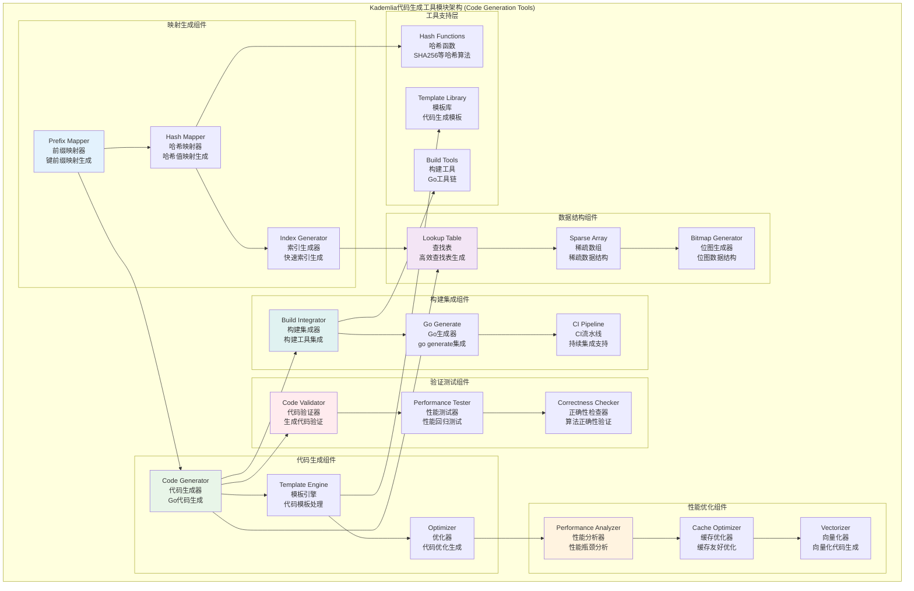

# Kademlia代码生成工具模块 (Kademlia Code Generation Tools Module)

## 【模块定位】

**Kademlia代码生成工具模块**是WES区块链系统Kademlia DHT的性能优化核心组件，负责提供编译时代码生成和运行时性能优化。作为Kademlia系统性能关键优化的代码生成器，该模块实现了键前缀映射的自动生成，通过预计算和编译时优化显著提升XOR距离计算和节点查找的性能，为整个Kademlia DHT系统提供高效的静态优化支持。

## 【设计原则】

### 编译时优化原则

- **预计算策略**: 在编译时预计算频繁使用的数据结构
- **静态生成**: 生成静态数据避免运行时计算开销
- **内存友好**: 生成内存布局优化的数据结构
- **缓存局部性**: 优化数据访问的缓存局部性

### 性能优化原则

- **查找加速**: 通过预生成映射表加速键值查找
- **计算减少**: 减少运行时的重复计算
- **分支预测**: 优化分支预测友好的代码结构
- **向量化**: 生成支持向量化操作的数据布局

### 代码生成原则

- **类型安全**: 生成类型安全的Go代码
- **可读性**: 生成的代码具有良好的可读性
- **维护性**: 生成的代码易于维护和调试
- **版本一致**: 确保生成代码与运行时版本一致

## 【核心职责】

### 键前缀映射生成

- 生成高效的键前缀到索引的映射表
- 预计算常用的哈希值到位置的映射
- 创建优化的查找表数据结构
- 生成支持快速前缀匹配的代码

### 性能优化代码生成

- 生成针对特定用例优化的算法实现
- 创建内联函数减少函数调用开销
- 生成循环展开的高性能代码
- 优化关键路径的代码生成

### 哈希映射优化

- 生成专用的哈希函数实现
- 创建冲突最小化的哈希映射
- 生成适合硬件的哈希计算代码
- 优化哈希表的内存布局

### 构建工具集成

- 与Go工具链的无缝集成
- 支持go generate命令的自动生成
- 提供Makefile和构建脚本支持
- 集成到CI/CD流水线

## 【架构组件】



## 【目录结构说明】

```text
generate/
├── main.go                    # 代码生成主程序 - 键前缀映射生成器
└── README.md                   # 本文档 - 代码生成工具模块详细说明
```

## 【依赖关系】

### 上层调用依赖

- **internal/core/infrastructure/kademlia**: Kademlia主模块 - 性能优化支持
- **构建系统**: Go工具链和CI/CD流水线

### 外部库依赖

- **crypto/sha256**: SHA256哈希算法
- **encoding/binary**: 二进制编码操作

### Go标准库依赖

- **os**: 操作系统接口和环境变量
- **fmt**: 格式化输出和字符串处理
- **strings**: 字符串操作

## 【系统特性】

### 高性能映射生成

- **预计算映射**: 编译时预计算键前缀到索引的映射
- **最优哈希**: 生成冲突最小的完美哈希函数
- **内存布局**: 优化数据结构的内存访问模式
- **缓存友好**: 生成缓存局部性友好的数据布局

### 自动化代码生成

- **模板驱动**: 基于模板的自动化代码生成
- **类型安全**: 生成类型安全的Go代码
- **性能优化**: 自动应用性能优化技术
- **可维护性**: 生成易于维护的清晰代码

### 工具链集成特性

- **go generate**: 完全集成到go generate工作流
- **构建自动化**: 与构建系统的无缝集成
- **CI/CD支持**: 持续集成和部署的自动化支持
- **版本控制**: 生成代码的版本控制和追踪

### 性能验证

- **基准测试**: 自动生成性能基准测试
- **回归检测**: 性能回归的自动检测
- **正确性验证**: 生成代码的算法正确性验证
- **覆盖率分析**: 代码覆盖率的分析和报告

## 【工作流程】

### 代码生成流程


### 映射表生成流程


### 性能验证流程


## 【配置管理】

### 代码生成配置

```yaml
kademlia:
  code_generation:
    # 生成配置
    enabled: true                   # 启用代码生成
    target_bits: 16                 # 目标位数
    target_size: 65536              # 目标大小 (2^16)
    id_length: 34                   # ID长度 (32+2)
    
    # 优化配置
    enable_optimization: true       # 启用优化
    optimization_level: 2           # 优化级别 (0-3)
    enable_vectorization: true      # 启用向量化
    
    # 输出配置
    package_name: "generated"       # 生成包名
    output_file: "mapping.go"       # 输出文件名
    include_comments: true          # 包含注释
```

### 性能优化配置

```yaml
kademlia:
  code_generation:
    performance:
      # 查找表优化
      lookup_table_size: 65536      # 查找表大小
      enable_perfect_hash: true     # 启用完美哈希
      hash_collision_threshold: 0.01 # 哈希冲突阈值
      
      # 内存优化
      enable_memory_alignment: true # 启用内存对齐
      cache_line_size: 64           # 缓存行大小
      prefetch_distance: 2          # 预取距离
      
      # 并行优化
      enable_simd: true             # 启用SIMD指令
      unroll_factor: 4              # 循环展开因子
      branch_prediction_hints: true # 分支预测提示
```

### 构建集成配置

```yaml
kademlia:
  code_generation:
    build:
      # go generate配置
      generate_command: "//go:generate go run main.go" # 生成命令
      working_directory: "./generate" # 工作目录
      
      # 环境变量
      environment_vars:
        GOPACKAGE: "kademlia"       # Go包名
        GOFILE: "generated.go"      # Go文件名
        
      # 验证配置
      enable_validation: true       # 启用验证
      run_benchmarks: true          # 运行基准测试
      performance_threshold: 0.9    # 性能阈值
```

## 【外部接口】

### 代码生成接口

- **CodeGenerator**: 代码生成器
  - `GenerateMapping(bits int, size int) error` - 生成映射代码
  - `GenerateOptimized(config *Config) error` - 生成优化代码
  - `ValidateGenerated(file string) error` - 验证生成代码

### 映射表接口

- **MappingGenerator**: 映射表生成器
  - `CreateHashMapping(target int) []uint16` - 创建哈希映射
  - `OptimizeMapping(mapping []uint16) []uint16` - 优化映射表
  - `VerifyMapping(mapping []uint16) error` - 验证映射表

### 性能测试接口

- **PerformanceTester**: 性能测试器
  - `RunBenchmarks(file string) (*BenchmarkResult, error)` - 运行基准测试
  - `ComparePerformance(old, new string) (*ComparisonResult, error)` - 比较性能
  - `ValidateCorrectness(file string) error` - 验证正确性

### 构建集成接口

- **BuildIntegrator**: 构建集成器
  - `IntegrateWithGo() error` - 集成到Go工具链
  - `SetupCIPipeline() error` - 设置CI流水线
  - `UpdateBuildScripts() error` - 更新构建脚本

## 【相关文档】

- **Kademlia主模块**: `internal/core/infrastructure/kademlia/README.md`
- **密钥空间**: `internal/core/infrastructure/kademlia/keyspace/README.md`
- **节点多样性**: `internal/core/infrastructure/kademlia/peerdiversity/README.md`
- **Go代码生成文档**: [Go官方生成文档](https://go.dev/blog/generate)

## 【使用策略】

### 开发工作流策略

- **自动生成**: 在开发过程中自动生成优化代码
- **版本控制**: 将生成的代码纳入版本控制
- **持续集成**: 在CI流水线中自动运行代码生成
- **性能监控**: 持续监控生成代码的性能表现

### 性能优化策略

- **热点识别**: 识别性能热点并针对性生成优化代码
- **基准测试**: 建立全面的性能基准测试套件
- **回归检测**: 实施性能回归的自动检测
- **优化迭代**: 基于性能数据持续优化生成策略

### 构建管理策略

- **依赖管理**: 管理代码生成的依赖关系
- **构建缓存**: 利用构建缓存避免重复生成
- **并行构建**: 支持并行的代码生成流程
- **错误处理**: 完善的构建错误处理和恢复

### 质量保证策略

- **代码审查**: 对生成的代码进行定期审查
- **测试覆盖**: 确保生成代码的测试覆盖率
- **文档同步**: 保持生成代码的文档同步
- **维护计划**: 制定生成工具的维护计划

## 【错误处理】

### 代码生成错误

- **ErrGenerationFailed**: 代码生成失败
- **ErrTemplateError**: 模板处理错误
- **ErrOutputError**: 输出文件错误
- **ErrEnvironmentError**: 环境变量错误

### 性能验证错误

- **ErrPerformanceRegression**: 性能回归
- **ErrBenchmarkFailed**: 基准测试失败
- **ErrValidationFailed**: 验证失败
- **ErrCorrectnessError**: 正确性错误

### 构建集成错误

- **ErrBuildIntegration**: 构建集成失败
- **ErrDependencyError**: 依赖错误
- **ErrToolchainError**: 工具链错误
- **ErrCIPipelineError**: CI流水线错误

### 错误恢复机制

- **回退机制**: 生成失败时回退到默认实现
- **重试策略**: 对临时性错误实施重试
- **错误报告**: 详细的错误信息和调试指导
- **监控告警**: 构建失败的实时监控和告警
