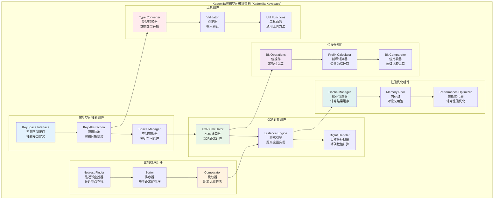
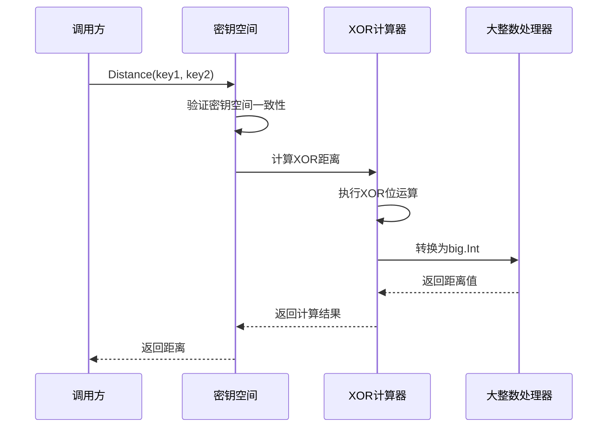
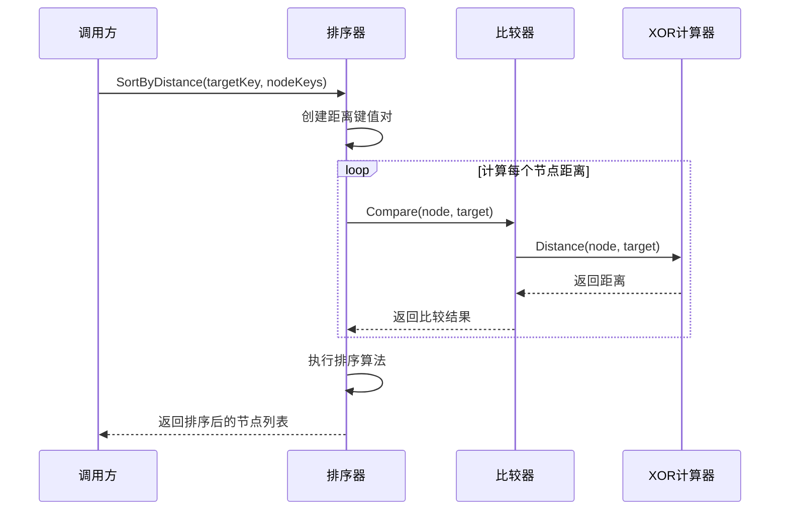
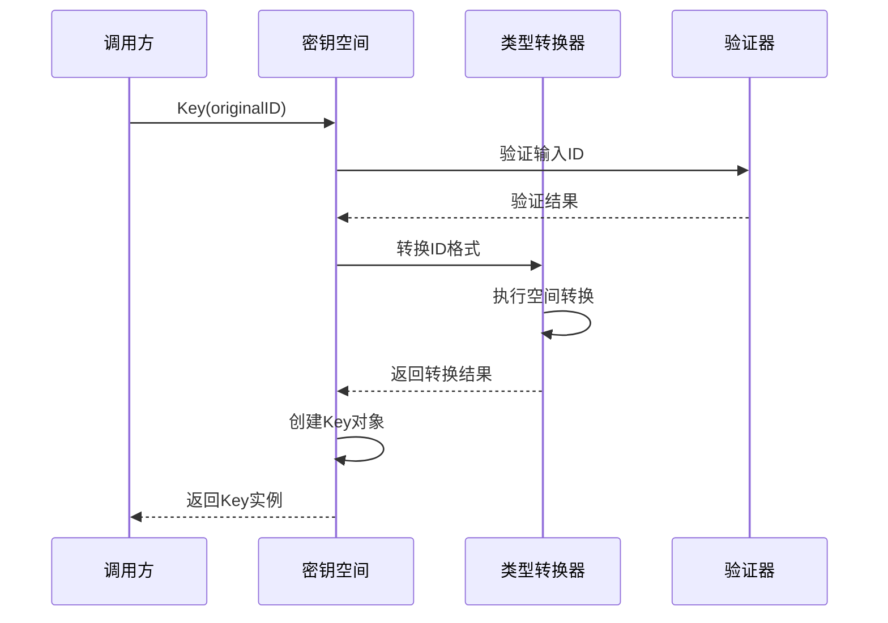

# Kademlia密钥空间模块 (Kademlia Keyspace Module)

## 【模块定位】

**Kademlia密钥空间模块**是WES区块链系统Kademlia DHT的核心数学计算组件，负责提供XOR距离度量和密钥空间操作。作为Kademlia分布式哈希表算法的数学基础，密钥空间模块实现了完整的XOR密钥空间抽象，包括距离计算、键值转换、排序比较等核心功能，为整个Kademlia DHT系统提供精确、高效的数学计算支持。

## 【设计原则】

### XOR距离度量原则

- **对称性**: d(A,B) = d(B,A)，距离计算的对称性
- **同一性**: d(A,A) = 0，相同节点距离为零
- **三角不等式**: d(A,C) ≤ d(A,B) + d(B,C)，满足距离的三角不等式
- **单调性**: XOR距离的单调性和一致性

### 数学计算原则

- **精确计算**: 使用big.Int确保大数计算的精确性
- **高效算法**: 优化的XOR运算和位操作
- **内存优化**: 高效的内存使用和对象复用
- **并发安全**: 线程安全的数学计算操作

### 接口抽象原则

- **KeySpace接口**: 抽象的密钥空间接口定义
- **实现分离**: 接口与具体实现的分离
- **扩展性**: 支持不同类型的密钥空间实现
- **类型安全**: 强类型的密钥空间操作

## 【核心职责】

### XOR距离计算服务

- 实现精确的XOR距离计算算法
- 提供big.Int精度的大数距离计算
- 支持任意长度的密钥距离计算
- 优化距离计算的性能和内存使用

### 密钥空间抽象服务

- 提供统一的密钥空间接口抽象
- 实现密钥的空间转换和映射
- 支持不同密钥格式的统一处理
- 提供密钥空间的配置和管理

### 比较和排序服务

- 实现基于XOR距离的键值比较
- 提供高效的距离排序算法
- 支持最近邻节点的快速查找
- 实现前缀匹配和范围查询

### 位操作优化服务

- 提供优化的位级运算操作
- 实现高效的前缀长度计算
- 支持位级的距离比较运算
- 优化大数据量的位操作性能

## 【架构组件】



## 【目录结构说明】

```text
keyspace/
├── keyspace.go                 # 密钥空间核心实现 - KeySpace接口和Key结构体
├── xor.go                      # XOR计算实现 - XOR距离计算和比较算法
├── xor_test.go                 # XOR计算测试 - XOR算法单元测试
└── README.md                   # 本文档 - 密钥空间模块详细说明
```

## 【依赖关系】

### 上层调用依赖

- **internal/core/infrastructure/kademlia**: Kademlia主模块 - 路由表和节点管理
- **internal/core/network**: 网络模块 - P2P节点发现和路由

### 外部库依赖

- **math/big**: Go标准库大整数运算
- **sort**: Go标准库排序算法

### Go标准库依赖

- **bytes**: 字节数组操作
- **fmt**: 格式化和错误处理

## 【系统特性】

### XOR距离度量特性

- **数学准确性**: 严格遵循XOR距离的数学定义
- **大数精度**: 使用big.Int确保计算精度
- **对称性保证**: 确保d(A,B) = d(B,A)的对称性
- **三角不等式**: 满足距离度量的三角不等式

### 高性能计算特性

- **位操作优化**: 使用位运算优化计算性能
- **内存复用**: 大整数对象的复用和池化
- **缓存机制**: 频繁计算结果的智能缓存
- **并发安全**: 线程安全的并发计算

### KeySpace抽象特性

- **接口统一**: 统一的密钥空间操作接口
- **类型安全**: 强类型的密钥空间操作
- **可扩展**: 支持不同类型的密钥空间实现
- **版本兼容**: 向后兼容的接口设计

### 算法优化特性

- **前缀计算**: 高效的公共前缀长度计算
- **排序优化**: 基于距离的高效排序算法
- **查找优化**: 最近邻节点的快速查找
- **内存优化**: 最小化内存分配和垃圾回收

## 【工作流程】

### XOR距离计算流程



### 节点排序流程



### 密钥空间转换流程



## 【配置管理】

### XOR计算配置

```yaml
kademlia:
  keyspace:
    # 计算精度配置
    precision_mode: "big_int"       # 计算精度模式: big_int, int64
    enable_cache: true              # 启用计算缓存
    cache_size: 1000                # 缓存大小
    
    # 性能优化
    enable_bit_optimization: true   # 启用位运算优化
    use_memory_pool: true           # 使用内存池
    pool_size: 100                  # 内存池大小
    
    # 验证配置
    strict_validation: true         # 严格输入验证
    key_length_validation: true     # 密钥长度验证
```

### 排序算法配置

```yaml
kademlia:
  keyspace:
    sorting:
      # 排序算法
      algorithm: "quicksort"        # 排序算法: quicksort, mergesort
      enable_parallel: true         # 启用并行排序
      parallel_threshold: 1000      # 并行排序阈值
      
      # 查找优化
      nearest_neighbors_limit: 20   # 最近邻节点限制
      enable_early_termination: true # 启用提前终止
      
      # 缓存策略
      cache_sorted_results: true    # 缓存排序结果
      result_cache_ttl: "5m"        # 结果缓存TTL
```

### 性能监控配置

```yaml
kademlia:
  keyspace:
    monitoring:
      # 性能指标
      enable_metrics: true          # 启用性能指标
      track_calculation_time: true  # 跟踪计算时间
      track_cache_hit_rate: true    # 跟踪缓存命中率
      
      # 统计配置
      metrics_interval: "30s"       # 指标收集间隔
      enable_detailed_stats: false  # 启用详细统计
      
      # 告警配置
      calculation_time_threshold: "1ms"  # 计算时间告警阈值
      cache_hit_rate_threshold: 0.8      # 缓存命中率告警阈值
```

## 【外部接口】

### KeySpace接口

- **KeySpaceOperations**: 密钥空间操作
  - `Key(id []byte) Key` - 创建密钥空间中的键
  - `Equal(k1, k2 Key) bool` - 判断两个键是否相等
  - `Distance(k1, k2 Key) *big.Int` - 计算两个键之间的距离
  - `Less(k1, k2 Key) bool` - 判断第一个键是否小于第二个键

### Key结构体接口

- **KeyOperations**: 密钥操作
  - `Equal(k2 Key) bool` - 判断与另一个键是否相等
  - `Less(k2 Key) bool` - 判断是否小于另一个键
  - `Distance(k2 Key) *big.Int` - 计算与另一个键的距离
  - `String() string` - 字符串表示

### XOR计算接口

- **XORCalculator**: XOR计算
  - `XORKeySpace() KeySpace` - 获取XOR密钥空间实例
  - `Distance(id1, id2 []byte) *big.Int` - 计算XOR距离
  - `CommonPrefixLength(id1, id2 []byte) int` - 计算公共前缀长度
  - `ZeroPrefixLength(id []byte) int` - 计算零前缀长度

### 排序工具接口

- **SortingUtilities**: 排序工具
  - `SortByDistance(target []byte, keys [][]byte) [][]byte` - 按距离排序
  - `FindNearestKeys(target []byte, keys [][]byte, count int) [][]byte` - 查找最近的键
  - `CompareDistance(target, id1, id2 []byte) int` - 比较距离大小

## 【相关文档】

- **Kademlia主模块**: `internal/core/infrastructure/kademlia/README.md`
- **节点多样性**: `internal/core/infrastructure/kademlia/peerdiversity/README.md`
- **代码生成**: `internal/core/infrastructure/kademlia/generate/README.md`
- **Kademlia接口**: `pkg/interfaces/infrastructure/kademlia/README.md`

## 【使用策略】

### 距离计算策略

- **精度选择**: 根据需要选择big.Int或int64精度
- **缓存利用**: 充分利用距离计算缓存
- **批量计算**: 大量计算时使用批量接口
- **内存管理**: 及时释放大整数对象

### 性能优化策略

- **位运算**: 优先使用位运算优化计算
- **内存池**: 使用内存池减少对象分配
- **并行计算**: 大数据量时启用并行计算
- **结果缓存**: 缓存频繁使用的计算结果

### 算法选择策略

- **排序算法**: 根据数据量选择合适的排序算法
- **查找策略**: 使用提前终止优化查找性能
- **缓存策略**: 合理设置缓存大小和TTL
- **验证策略**: 在性能和安全之间平衡验证强度

## 【错误处理】

### 密钥空间错误

- **ErrInvalidKeySpace**: 无效的密钥空间
- **ErrKeySpaceMismatch**: 密钥空间不匹配
- **ErrInvalidKey**: 无效的密钥
- **ErrKeyLengthMismatch**: 密钥长度不匹配

### 计算错误

- **ErrCalculationOverflow**: 计算溢出
- **ErrInvalidDistance**: 无效的距离值
- **ErrPrecisionLoss**: 精度丢失
- **ErrCalculationTimeout**: 计算超时

### 输入验证错误

- **ErrNilInput**: 空输入参数
- **ErrEmptyKey**: 空密钥
- **ErrInvalidLength**: 无效长度
- **ErrInvalidFormat**: 无效格式

### 错误恢复机制

- **输入验证**: 严格的输入参数验证
- **精度保证**: 使用big.Int确保计算精度
- **缓存清理**: 错误时清理可能损坏的缓存
- **默认值**: 提供合理的默认值和回退机制
