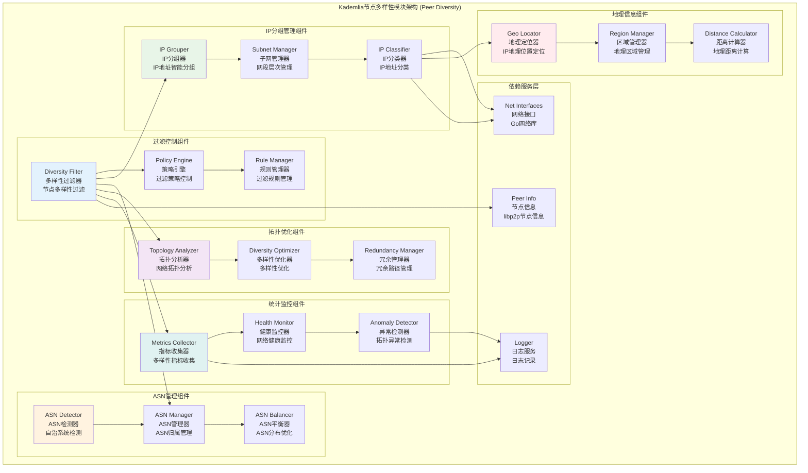

# Kademlia节点多样性模块 (Kademlia Peer Diversity Module)

## 【模块定位】

**Kademlia节点多样性模块**是WES区块链系统Kademlia DHT的网络拓扑优化核心组件，负责提供节点多样性过滤和网络健壮性保障。作为分布式网络抗攻击和容错的关键机制，节点多样性模块实现了完整的IP地址分组、ASN (自治系统) 管理、地理分布优化等功能，确保Kademlia路由表中节点的网络多样性，防止单点故障和网络分区，为整个P2P网络提供稳定、安全、高可用的拓扑结构。

## 【设计原则】

### 网络多样性原则

- **IP地址多样性**: 确保路由表中节点的IP地址分布多样性
- **ASN多样性**: 防止单一自治系统的节点过度集中
- **地理分布**: 优化节点的地理位置分布
- **网络拓扑**: 构建健壮的网络拓扑结构

### 安全防护原则

- **单点故障防护**: 防止单一网络区域的故障影响
- **攻击抵抗**: 抵抗基于网络拓扑的攻击
- **分区容错**: 防止网络分区和孤岛现象
- **恶意节点防护**: 检测和过滤恶意节点集群

### 高可用性原则

- **冗余保障**: 确保关键路径的节点冗余
- **负载分散**: 避免网络流量的过度集中
- **故障隔离**: 快速隔离故障网络区域
- **自愈能力**: 网络拓扑的自动修复能力

## 【核心职责】

### IP地址分组管理

- 实现IP地址的智能分组和聚类
- 管理IP网段的层次化分组策略
- 控制每个IP组中的节点数量上限
- 提供IP地址多样性的实时监控

### 节点过滤服务

- 基于多样性策略过滤候选节点
- 实现节点允许和禁止的策略控制
- 提供节点分组信息的查询服务
- 支持动态的过滤规则更新

### ASN (自治系统) 管理

- 识别和管理节点的ASN归属
- 控制单一ASN的节点数量限制
- 优化跨ASN的网络连接
- 监控ASN级别的网络健康状态

### 网络拓扑优化

- 分析和优化网络拓扑结构
- 确保关键路径的多样性覆盖
- 平衡网络连接的地理分布
- 提供拓扑优化的策略建议

### 统计监控服务

- 收集节点多样性的统计指标
- 监控网络拓扑的健康状态
- 提供多样性分析和报告
- 实现异常检测和告警机制

## 【架构组件】



## 【目录结构说明】

```text
peerdiversity/
├── filter.go                  # 多样性过滤器实现 - 核心节点多样性过滤逻辑
└── README.md                   # 本文档 - 节点多样性模块详细说明
```

## 【依赖关系】

### 上层调用依赖

- **internal/core/infrastructure/kademlia**: Kademlia主模块 - 路由表节点过滤
- **internal/core/network**: 网络模块 - P2P节点连接管理

### 外部库依赖

- **github.com/libp2p/go-libp2p/core/peer**: libp2p节点抽象
- **net**: Go标准库网络操作

### Go标准库依赖

- **sync**: 并发控制和读写锁
- **fmt**: 格式化和错误处理
- **net**: 网络地址处理

## 【系统特性】

### IP地址多样性特性

- **分层分组**: 基于网段的分层IP地址分组
- **容量控制**: 每个IP组的节点数量上限控制
- **动态调整**: 根据网络状况动态调整分组策略
- **冲突检测**: 自动检测和解决IP地址冲突

### ASN多样性特性

- **自动检测**: 自动检测节点的ASN归属
- **分布控制**: 控制单一ASN的节点分布密度
- **跨域优化**: 优化跨ASN的网络连接
- **负载均衡**: ASN级别的网络负载均衡

### 过滤策略特性

- **灵活策略**: 支持多种过滤策略的组合
- **实时更新**: 支持过滤规则的实时更新
- **白名单机制**: 支持关键节点的白名单机制
- **黑名单机制**: 支持恶意节点的黑名单机制

### 网络健壮性特性

- **故障隔离**: 快速隔离网络故障区域
- **冗余保障**: 确保关键路径的冗余连接
- **自愈能力**: 网络拓扑的自动修复
- **抗攻击**: 抵抗基于网络拓扑的攻击

## 【配置管理】

### IP多样性配置

```yaml
kademlia:
  peer_diversity:
    ip_diversity:
      # IP分组配置
      enabled: true                 # 启用IP多样性过滤
      group_size: 16                # IP组大小 (/16网络)
      max_peers_per_group: 2        # 每个IP组最大节点数
      
      # 分层配置
      enable_hierarchical: true     # 启用分层分组
      levels: [8, 16, 24]          # 分层级别 (网络前缀长度)
      
      # 动态调整
      auto_adjustment: true         # 自动调整分组
      adjustment_threshold: 0.8     # 调整阈值
      min_group_size: 1            # 最小组大小
```

### ASN多样性配置

```yaml
kademlia:
  peer_diversity:
    asn_diversity:
      # ASN控制
      enabled: true                 # 启用ASN多样性
      max_peers_per_asn: 5         # 每个ASN最大节点数
      
      # ASN检测
      enable_asn_detection: true    # 启用ASN自动检测
      asn_lookup_timeout: "5s"     # ASN查找超时
      cache_asn_results: true      # 缓存ASN查找结果
      
      # 负载均衡
      enable_asn_balancing: true   # 启用ASN负载均衡
      rebalance_interval: "1h"     # 重新平衡间隔
```

### 地理多样性配置

```yaml
kademlia:
  peer_diversity:
    geo_diversity:
      # 地理分布
      enabled: false               # 启用地理多样性 (可选功能)
      max_peers_per_region: 10     # 每个地区最大节点数
      
      # 地理定位
      enable_geo_lookup: false     # 启用地理位置查找
      geo_service_url: ""          # 地理服务URL
      geo_cache_ttl: "24h"         # 地理信息缓存TTL
      
      # 距离优化
      min_geographic_distance: 100 # 最小地理距离 (公里)
      prefer_nearby_peers: true    # 优先选择附近节点
```

### 监控告警配置

```yaml
kademlia:
  peer_diversity:
    monitoring:
      # 监控指标
      enable_metrics: true         # 启用多样性指标
      metrics_interval: "1m"       # 指标收集间隔
      
      # 健康检查
      health_check_interval: "5m"  # 健康检查间隔
      diversity_threshold: 0.7     # 多样性阈值
      
      # 告警配置
      enable_alerts: true         # 启用告警
      low_diversity_threshold: 0.5 # 低多样性告警阈值
      high_concentration_threshold: 0.3 # 高集中度告警阈值
```

## 【外部接口】

### 过滤控制接口

- **PeerIPGroupFilter**: 节点IP组过滤器接口
  - `Allow(p PeerGroupInfo) bool` - 判断节点组是否被允许
  - `Disallow(p PeerGroupInfo) bool` - 判断节点组是否被禁止

### 多样性过滤接口

- **DiversityFilter**: 多样性过滤器
  - `FilterPeer(peerID peer.ID, addrs []net.Addr) bool` - 过滤单个节点
  - `FilterPeers(peers []PeerInfo) []PeerInfo` - 批量过滤节点
  - `UpdatePeerInfo(peerID peer.ID, addrs []net.Addr)` - 更新节点信息
  - `RemovePeer(peerID peer.ID)` - 移除节点

### IP分组管理接口

- **IPGroupManager**: IP分组管理
  - `GetIPGroupKey(addr net.Addr) PeerIPGroupKey` - 获取IP组键
  - `GetGroupPeers(groupKey PeerIPGroupKey) []peer.ID` - 获取组内节点
  - `GetPeerGroup(peerID peer.ID) PeerIPGroupKey` - 获取节点分组
  - `UpdateGroupInfo(peerID peer.ID, addrs []net.Addr)` - 更新分组信息

### 统计监控接口

- **DiversityMetrics**: 多样性指标
  - `GetDiversityStats() *DiversityStats` - 获取多样性统计
  - `GetIPGroupStats() *IPGroupStats` - 获取IP分组统计
  - `GetASNStats() *ASNStats` - 获取ASN统计
  - `GetHealthScore() float64` - 获取健康评分

### 策略配置接口

- **PolicyManager**: 策略管理
  - `SetIPGroupPolicy(policy *IPGroupPolicy)` - 设置IP分组策略
  - `SetASNPolicy(policy *ASNPolicy)` - 设置ASN策略
  - `UpdateFilterRules(rules []FilterRule)` - 更新过滤规则
  - `GetCurrentPolicy() *DiversityPolicy` - 获取当前策略

## 【相关文档】

- **Kademlia主模块**: `internal/core/infrastructure/kademlia/README.md`
- **密钥空间**: `internal/core/infrastructure/kademlia/keyspace/README.md`
- **代码生成**: `internal/core/infrastructure/kademlia/generate/README.md`
- **网络模块**: `internal/core/network/README.md`

## 【使用策略】

### IP多样性策略

- **分组策略**: 根据网络规模选择合适的IP分组大小
- **容量控制**: 合理设置每组的节点数量上限
- **动态调整**: 根据网络状况动态调整分组策略
- **异常处理**: 及时处理IP地址冲突和异常

### ASN多样性策略

- **检测策略**: 启用ASN自动检测提高准确性
- **分布策略**: 控制单一ASN的节点分布密度
- **平衡策略**: 定期进行ASN级别的负载重平衡
- **监控策略**: 持续监控ASN分布的健康状态

### 过滤优化策略

- **规则优化**: 定期优化过滤规则提高效率
- **白名单**: 为关键节点设置白名单机制
- **黑名单**: 及时将恶意节点加入黑名单
- **性能平衡**: 在多样性和性能之间找到平衡

### 网络健壮性策略

- **冗余规划**: 确保关键路径的冗余连接
- **故障预防**: 主动识别和预防网络故障
- **快速恢复**: 建立快速的网络恢复机制
- **攻击防护**: 部署多层次的攻击防护策略

## 【错误处理】

### 网络多样性错误

- **ErrInsufficientDiversity**: 网络多样性不足
- **ErrIPGroupOverflow**: IP组节点数量溢出
- **ErrASNConcentration**: ASN过度集中
- **ErrGeographicImbalance**: 地理分布不平衡

### 过滤策略错误

- **ErrInvalidFilterRule**: 无效的过滤规则
- **ErrPolicyConflict**: 策略冲突
- **ErrFilterTimeout**: 过滤操作超时
- **ErrRuleUpdateFailed**: 规则更新失败

### 网络检测错误

- **ErrIPResolutionFailed**: IP解析失败
- **ErrASNLookupFailed**: ASN查找失败
- **ErrGeoLookupFailed**: 地理位置查找失败
- **ErrNetworkUnreachable**: 网络不可达

### 错误恢复机制

- **默认策略**: 错误时回退到默认多样性策略
- **缓存回退**: 查找失败时使用缓存数据
- **渐进恢复**: 网络故障后的渐进式恢复
- **监控告警**: 关键错误的实时监控和告警
