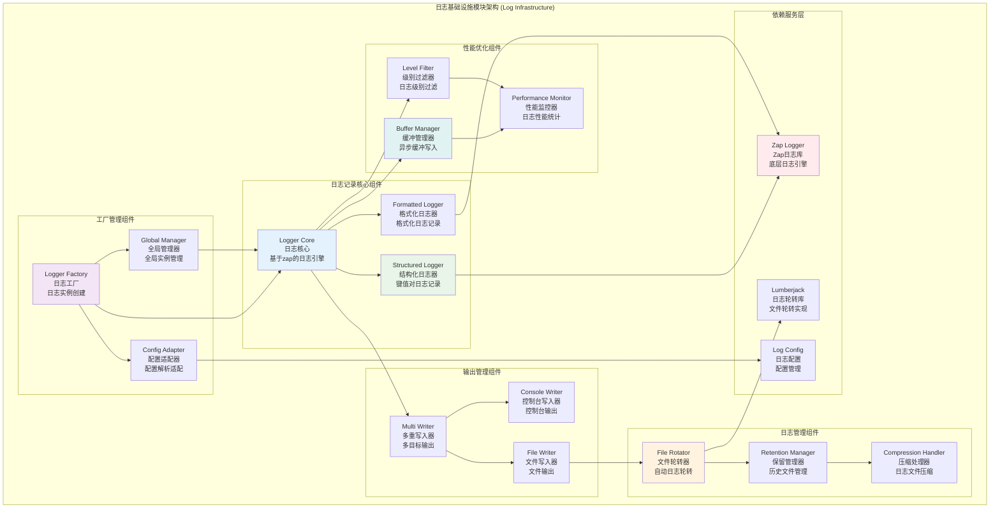

# 日志基础设施模块 (Log Infrastructure Module)

## 【模块定位】

**日志基础设施模块**是WES区块链系统的核心日志管理组件，负责提供完整的日志记录和管理功能。作为系统可观测性和问题诊断的关键基础设施，日志模块基于uber-go/zap高性能日志库实现，支持结构化日志、多级别记录、文件轮转、多种输出格式等企业级特性，为整个区块链系统提供高性能、可靠的日志记录和管理服务。

## 【设计原则】

### 高性能设计原则

- **零分配日志**: 基于zap实现零内存分配的高性能日志
- **异步写入**: 支持异步日志写入，减少对主业务的影响
- **缓冲优化**: 智能缓冲机制提高I/O效率
- **并发安全**: 支持高并发的线程安全日志记录

### 结构化日志原则

- **键值对格式**: 支持结构化的键值对日志记录
- **类型安全**: 强类型的日志字段，避免运行时错误
- **上下文传递**: 支持日志上下文的传递和累积
- **格式标准**: 支持JSON和控制台友好的输出格式

### 企业级特性原则

- **日志轮转**: 自动日志文件轮转和历史文件管理
- **多重输出**: 支持同时输出到文件、控制台等多个目标
- **级别控制**: 灵活的日志级别控制和过滤
- **配置驱动**: 完整的配置驱动的日志行为控制

## 【核心职责】

### 日志记录服务

- 提供多级别的日志记录功能
- 支持格式化和结构化日志记录
- 实现高性能的日志写入机制
- 提供调用者信息和堆栈跟踪

### 日志管理服务

- 实现日志文件的自动轮转
- 管理历史日志文件的保留和清理
- 支持日志文件的压缩存储
- 提供日志配置的动态管理

### 多重输出服务

- 支持同时输出到多个目标
- 实现文件和控制台的并行输出
- 提供不同输出格式的支持
- 实现输出目标的独立配置

### 工厂和接口服务

- 提供日志工厂的统一接口
- 实现日志实例的创建和管理
- 支持依赖注入框架集成
- 提供全局日志实例管理

## 【架构组件】



## 【目录结构说明】

```text
log/
├── log.go                      # 日志服务核心实现 - 基于zap的日志引擎实现
├── module.go                   # 模块定义 - FX依赖注入配置
├── example.go                  # 使用示例 - 日志使用演示代码
├── log_test.go                 # 日志服务测试 - 完整的单元测试套件
└── README.md                   # 本文档 - 日志服务详细说明
```

## 【依赖关系】

### 上层调用依赖

- **所有WES模块**: 作为基础设施被全系统模块使用
- **internal/core/blockchain**: 区块链核心模块日志
- **internal/core/consensus**: 共识机制模块日志
- **internal/core/mempool**: 内存池模块日志
- **internal/core/network**: 网络模块日志

### 平级基础设施依赖

- **internal/config/log**: 日志配置管理
- **pkg/interfaces/infrastructure/log**: 日志接口定义
- **pkg/interfaces/config**: 配置管理接口

### 外部库依赖

- **go.uber.org/zap**: 高性能日志库
- **go.uber.org/zap/zapcore**: Zap核心组件
- **gopkg.in/natefinch/lumberjack.v2**: 日志轮转库

### 框架依赖

- **go.uber.org/fx**: 依赖注入框架
- **Go标准库**: os、path/filepath、strings、sync等

## 【系统特性】

### 高性能日志特性

- **零分配**: 基于zap的零内存分配日志记录
- **异步写入**: 支持异步日志写入减少阻塞
- **缓冲优化**: 智能缓冲机制提高写入效率
- **并发安全**: 完全线程安全的并发日志记录

### 企业级功能

- **日志轮转**: 基于大小、时间的自动日志轮转
- **历史管理**: 可配置的历史日志保留策略
- **压缩存储**: 自动压缩历史日志文件节省空间
- **多重输出**: 同时支持文件和控制台输出

### 结构化日志

- **键值对**: 支持结构化的键值对日志记录
- **类型安全**: 强类型的字段避免运行时错误
- **上下文累积**: 支持日志上下文的累积传递
- **JSON格式**: 原生支持JSON格式便于分析

### 灵活配置

- **级别控制**: 支持Debug、Info、Warn、Error、Fatal级别
- **格式配置**: 支持JSON和控制台友好格式
- **输出配置**: 灵活的输出目标和路径配置
- **动态调整**: 支持运行时配置的动态调整

## 【配置管理】

### 基础日志配置

```yaml
log:
  # 基础配置
  level: "info"                     # 日志级别: debug, info, warn, error, fatal
  encoding: "json"                  # 编码格式: json, console
  file_path: "./data/logs/weisyn.log" # 日志文件路径
  to_console: true                  # 是否同时输出到控制台
  
  # 高级功能
  enable_caller: true               # 启用调用者信息
  enable_stacktrace: true           # 启用堆栈跟踪(错误级别及以上)
  file_encoding: "json"             # 文件日志编码格式
  
  # 性能优化
  buffer_size: 256                  # 缓冲区大小(KB)
  flush_interval: "5s"              # 刷新间隔
  async_write: true                 # 异步写入
```

### 日志轮转配置

```yaml
log_rotation:
  # 轮转策略
  max_size: 100                     # 单个日志文件最大大小(MB)
  max_backups: 10                   # 最大保留历史日志文件数量
  max_age: 30                       # 日志文件最大保留天数
  compress: true                    # 是否压缩历史日志文件
  
  # 文件管理
  backup_time_format: "2006-01-02" # 备份文件时间格式
  local_time: true                  # 使用本地时间
  cleanup_interval: "1h"            # 清理检查间隔
```

### 输出格式配置

```yaml
log_format:
  # 控制台格式
  console:
    color_enabled: true             # 启用颜色输出
    time_format: "2006-01-02 15:04:05" # 时间格式
    level_format: "uppercase"       # 级别格式: uppercase, lowercase
    
  # JSON格式
  json:
    time_key: "timestamp"           # 时间字段名
    level_key: "level"              # 级别字段名
    message_key: "message"          # 消息字段名
    caller_key: "caller"            # 调用者字段名
    stacktrace_key: "stacktrace"    # 堆栈跟踪字段名
```

### 性能调优配置

```yaml
log_performance:
  # 内存管理
  initial_fields_capacity: 16       # 初始字段容量
  sampling_enabled: false           # 启用采样(高流量场景)
  sampling_initial: 100             # 采样初始值
  sampling_thereafter: 100         # 采样后续值
  
  # I/O优化
  sync_on_error: true               # 错误时同步写入
  sync_on_fatal: true               # 致命错误时同步写入
  disable_caller: false             # 禁用调用者信息(性能优化)
  disable_stacktrace: false         # 禁用堆栈跟踪(性能优化)
```

## 【外部接口】

### 日志记录接口

- **BasicLogging**: 基础日志记录
  - `Debug(args ...interface{})`
  - `Info(args ...interface{})`
  - `Warn(args ...interface{})`
  - `Error(args ...interface{})`
  - `Fatal(args ...interface{})`

- **FormattedLogging**: 格式化日志记录
  - `Debugf(format string, args ...interface{})`
  - `Infof(format string, args ...interface{})`
  - `Warnf(format string, args ...interface{})`
  - `Errorf(format string, args ...interface{})`
  - `Fatalf(format string, args ...interface{})`

### 结构化日志接口

- **StructuredLogging**: 结构化日志记录
  - `With(args ...interface{}) Logger`
  - `WithField(key string, value interface{}) Logger`
  - `WithFields(fields map[string]interface{}) Logger`

### 日志管理接口

- **LoggerManagement**: 日志管理
  - `Sync() error`
  - `Close() error`
  - `GetZapLogger() *zap.Logger`
  - `SetLevel(level string) error`

### 工厂接口

- **LoggingFactory**: 日志工厂
  - `NewLogger(config LogConfig) (Logger, error)`
  - `GetDefaultLogger() Logger`
  - `CreateFileLogger(path string) (Logger, error)`
  - `CreateConsoleLogger() (Logger, error)`

## 【相关文档】

- **日志接口**: `pkg/interfaces/infrastructure/log/README.md`
- **日志配置**: `internal/config/log/README.md`
- **事件基础设施**: `internal/core/infrastructure/event/README.md`
- **加密基础设施**: `internal/core/infrastructure/crypto/README.md`
- **区块链核心**: `internal/core/blockchain/README.md`

## 【使用策略】

### 日志级别策略

- **Debug**: 详细的开发调试信息，仅开发环境使用
- **Info**: 应用正常运行的重要信息
- **Warn**: 潜在问题或异常情况，但不影响运行
- **Error**: 错误事件，可能影响功能但不导致崩溃
- **Fatal**: 严重错误，记录后程序退出

### 结构化日志策略

- **键值对优先**: 优先使用键值对方式记录结构化信息
- **上下文传递**: 充分利用`With`方法传递上下文
- **字段标准化**: 使用标准化的字段名称和格式
- **敏感信息**: 避免在日志中记录敏感信息

### 性能优化策略

- **异步写入**: 高并发场景使用异步写入
- **级别过滤**: 生产环境使用合适的日志级别
- **批量写入**: 利用缓冲机制提高写入效率
- **定期清理**: 及时清理过期日志文件

### 配置管理策略

- **环境区分**: 不同环境使用不同的日志配置
- **动态调整**: 支持运行时动态调整日志级别
- **配置验证**: 启动时验证日志配置的正确性
- **默认配置**: 提供合理的默认配置

### 控制台输出控制

**默认行为**：日志模块默认会**同时输出到文件和控制台**，这可能导致终端刷屏。

**方式一：使用环境变量（推荐）**

通过设置 `WES_CLI_MODE=true` 环境变量，可以一键关闭控制台输出：

```bash
export WES_CLI_MODE=true
go run ./cmd/node --chain public
```

设置后：
- ✅ 所有日志只写入文件（`node-system.log` 和 `node-business.log`）
- ✅ 终端不再刷屏，只显示少量启动提示
- ✅ 适合生产环境和后台运行场景

**方式二：配置文件设置**

在联盟链/私链的配置文件中，可以显式设置 `to_console: false`：

```json
{
  "log": {
    "level": "info",
    "to_console": false
  }
}
```

**日志文件位置**：

- 系统日志：`{instance_data_dir}/logs/node-system.log`（P2P、共识、存储、网络等基础设施模块）
- 业务日志：`{instance_data_dir}/logs/node-business.log`（API、交易处理、合约执行、内存池等业务模块）

其中 `{instance_data_dir}` 由 `data_root`（`--data-dir`）、`environment` 和链实例信息组合得到，例如：

```text
./data/prod/prod-public-mainnet
./data/test/test-consortium-demo
./data/dev/dev-private-local
```

**查看日志**：

```bash
# 实时查看系统日志（假设 data_root=./data，环境=prod，实例=prod-public-mainnet）
tail -f ./data/prod/prod-public-mainnet/logs/node-system.log

# 实时查看业务日志
tail -f ./data/prod/prod-public-mainnet/logs/node-business.log
```

## 【错误处理】

### 日志初始化错误

- **ErrConfigInvalid**: 无效的日志配置
- **ErrFilePathInvalid**: 无效的文件路径
- **ErrPermissionDenied**: 文件权限拒绝
- **ErrDiskSpaceInsufficient**: 磁盘空间不足

### 日志写入错误

- **ErrWriteFailed**: 日志写入失败
- **ErrFileRotationFailed**: 文件轮转失败
- **ErrSyncFailed**: 同步写入失败
- **ErrFormatError**: 格式化错误

### 日志管理错误

- **ErrLoggerClosed**: 日志器已关闭
- **ErrInvalidLevel**: 无效的日志级别
- **ErrFactoryNotInitialized**: 工厂未初始化
- **ErrResourceExhausted**: 资源耗尽

### 错误恢复机制

- **降级处理**: 文件写入失败时降级到控制台输出
- **自动重试**: 对临时性错误实施智能重试
- **备用路径**: 主路径失败时使用备用日志路径
- **错误日志**: 将日志系统错误记录到系统错误日志
