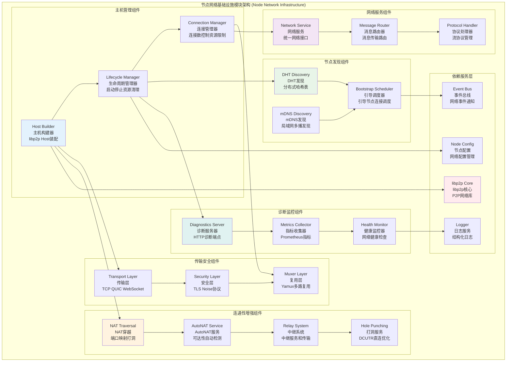

# 节点网络基础设施模块 (Node Network Infrastructure Module)

## 【模块定位】

**节点网络基础设施模块**是WES区块链系统的P2P网络核心组件，负责提供基于libp2p的节点网络基础设施。作为区块链网络层的关键基础设施，节点模块实现了完整的P2P网络功能，包括节点发现、连接管理、DHT路由、传输安全、NAT穿越等核心能力，采用"连接优先、零配置"的设计理念，为整个区块链系统提供稳定、高效、可扩展的分布式网络服务。

## 【设计原则】

### 连接优先原则

- **零配置可用**: 无任何外部配置时具备开箱可用的连通能力
- **配置最小化**: 仅保留"必要可变"项，传输/安全/复用/发现采用内建默认
- **自适应策略**: 发现机制自适应失败，不阻断其他能力
- **容错优先**: 优雅处理网络波动和节点故障

### 高内聚低耦合原则

- **分层架构**: Host装配、Discovery发现、Connectivity连通性清晰分离
- **接口抽象**: 通过统一接口为上层提供网络服务抽象
- **模块解耦**: 各子模块独立职责，避免循环依赖
- **选项工厂**: 通过选项模式实现可组合的功能配置

### 生产就绪原则

- **资源管理**: 完善的连接数控制、资源限制、带宽监控
- **安全策略**: 多层次安全协议、连接门控、地址过滤
- **可观测性**: 完整的诊断接口、指标监控、故障排查
- **运维友好**: 最小配置、自动化运维、问题定位支持

## 【核心职责】

### P2P主机管理服务

- 基于libp2p的Host实例装配和生命周期管理
- 传输层支持(TCP、QUIC、WebSocket)和安全协议(TLS、Noise)
- 连接管理、资源限制、带宽监控和质量控制
- 多路复用器配置和网络性能优化

### 节点发现服务

- DHT (分布式哈希表) 发现和路由表维护
- mDNS (多播DNS) 局域网节点自动发现
- Bootstrap引导节点连接和发现调度
- 指数退避策略和连接失败处理

### 网络连通性增强

- NAT端口映射和穿越技术
- AutoNAT可达性自动检测
- Relay中继服务和AutoRelay自动中继
- DCUTR打洞技术和直连优化

### 网络服务抽象

- 统一的网络服务接口抽象
- 点对点和广播消息传输
- 流协议注册和管理
- 连接状态查询和网络拓扑管理

### 诊断监控服务

- HTTP诊断端点和实时状态监控
- Prometheus指标导出和性能分析
- 连接质量监控和网络健康检查
- 故障排查工具和调试支持

## 【架构组件】



## 【目录结构说明】

```text
node/
├── README.md                   # 本文档 - 节点网络基础设施模块总览
├── TROUBLESHOOTING.md          # 故障排除文档 - 调试指南和最佳实践
├── module.go                   # 模块定义 - FX依赖注入配置
├── service.go                  # 网络服务 - 统一网络服务接口实现
└── impl/                       # 具体实现 - 各子模块实现
    ├── host/                   # 主机管理实现 - libp2p Host装配和生命周期
    │   ├── builder.go             # Host装配器 - libp2p选项组装
    │   ├── lifecycle.go           # 生命周期管理 - 启动停止资源清理
    │   ├── connmgr.go             # 连接管理 - 连接数控制资源限制
    │   ├── transports.go          # 传输层配置 - TCP QUIC WebSocket
    │   ├── security.go            # 安全层配置 - TLS Noise协议
    │   ├── muxers.go              # 多路复用配置 - Yamux复用器
    │   ├── gater.go               # 连接门控 - 地址过滤连接控制
    │   ├── addr_factory.go        # 地址工厂 - 地址公告过滤
    │   ├── diagnostics.go         # 诊断接口 - HTTP诊断端点
    │   └── README.md              # Host模块详细文档
    ├── discovery/              # 节点发现实现 - 多种发现机制集成
    │   ├── scheduler.go           # 发现调度器 - 引导节点连接调度
    │   ├── dht.go                 # DHT发现 - 分布式哈希表实现
    │   ├── mdns.go                # mDNS发现 - 局域网多播发现
    │   ├── controls.go            # 控制接口 - 业务控制和提示
    │   ├── backoff.go             # 退避策略 - 指数退避重试
    │   └── README.md              # Discovery模块详细文档
    └── connectivity/           # 连通性增强 - NAT穿越和中继技术
        ├── nat.go                 # NAT端口映射 - UPnP NAT-PMP
        ├── autonat.go             # AutoNAT服务 - 可达性自动检测
        ├── reachability.go        # 可达性策略 - 强制可达性设置
        ├── README.md              # Connectivity模块详细文档
        └── relay/              # 中继子模块 - 中继和打洞技术
            ├── transport.go       # 中继传输 - 中继客户端传输
            ├── service.go         # 中继服务 - 中继服务端资源限额
            ├── autorelay.go       # 自动中继 - 静态和动态中继
            ├── holepunch.go       # 打洞服务 - DCUTR打洞实现
            └── README.md          # Relay子模块详细文档
```

## 【依赖关系】

### 上层调用依赖

- **internal/core/network**: 网络模块 - P2P协议实现和消息路由
- **internal/core/consensus**: 共识机制模块 - 节点通信和状态同步
- **internal/core/mempool**: 内存池模块 - 交易广播和同步
- **pkg/api**: API服务层 - 网络状态查询和管理

### 平级基础设施依赖

- **internal/config/node**: 节点配置管理
- **pkg/interfaces/infrastructure/node**: 节点网络接口定义
- **pkg/interfaces/infrastructure/log**: 日志记录接口
- **pkg/interfaces/infrastructure/event**: 事件总线接口
- **pkg/interfaces/infrastructure/storage**: 存储接口 (DHT数据持久化)

### 外部库依赖

- **github.com/libp2p/go-libp2p**: libp2p主库
- **github.com/libp2p/go-libp2p/core**: libp2p核心接口
- **github.com/multiformats/go-multiaddr**: 多格式地址库
- **github.com/libp2p/go-libp2p-kad-dht**: Kademlia DHT实现

### Go标准库依赖

- **context**: 上下文管理和取消操作
- **net**: 网络操作和地址处理
- **time**: 时间处理和定时器
- **sync**: 并发控制和同步原语

## 【系统特性】

### 零配置连通性特性

- **默认监听回退**: 未提供监听地址时自动注入TCP/QUIC监听
- **发现默认启用**: 始终尝试启动mDNS和DHT，失败仅记录告警
- **中继与打洞**: 自动启用中继传输和DCUTR打洞
- **引导默认**: 支持内置默认引导节点或完全自定义

### 高可用网络特性

- **多传输支持**: TCP、QUIC、WebSocket传输协议
- **安全协议**: TLS、Noise端到端加密
- **NAT穿越**: 端口映射、中继、打洞多种NAT穿越技术
- **连接管理**: 智能连接数控制和资源限制

### 网络发现特性

- **DHT发现**: 基于Kademlia的分布式节点发现
- **mDNS发现**: 局域网零配置节点发现
- **引导调度**: 智能引导节点连接和保活
- **数据持久化**: DHT路由表持久化存储

### 监控诊断特性

- **诊断端点**: HTTP端点暴露节点状态和连接信息
- **Prometheus指标**: 完整的网络性能指标导出
- **故障排查**: 详细的调试工具和问题定位支持
- **健康检查**: 实时网络健康状态监控

## 【配置管理】

### 基础网络配置

```yaml
node:
  # 监听配置
  listen_addresses: 
    - "/ip4/0.0.0.0/tcp/4001"     # TCP监听地址
    - "/ip4/0.0.0.0/udp/4001/quic-v1" # QUIC监听地址
  
  # 连接管理
  min_peers: 8                    # 最小连接节点数
  max_peers: 100                  # 最大连接节点数
  
  # 引导节点
  bootstrap_peers:
    - "/ip4/bootstrap1.example.com/tcp/4001/p2p/12D3Koo..."
    - "/ip4/bootstrap2.example.com/tcp/4001/p2p/12D3Koo..."
```

### 发现机制配置

```yaml
node:
  discovery:
    # 发现间隔
    discovery_interval: "5m"      # 发现间隔
    advertise_interval: "15m"     # 广告间隔
    
    # mDNS配置
    mdns:
      service_name: "weisyn-node"   # mDNS服务名
      
  # DHT配置
  dht:
    data_store_path: "./data/dht" # DHT数据持久化路径
    mode: "auto"                  # DHT模式: auto/client/server
    protocol_prefix: "/weisyn"      # 协议前缀
    enable_lan_loopback: false    # 启用LAN回环 (调试用)
    enable_optimistic_provide: false # 启用乐观提供
```

### 连通性增强配置

```yaml
node:
  # NAT配置
  nat:
    enable_port_map: true         # 启用NAT端口映射
    
  # 连接门控
  gater:
    allowed_prefixes: []          # 白名单前缀 (空=禁用白名单)
    blocked_prefixes: []          # 黑名单前缀
    
  # 中继配置
  relay:
    enable_transport: true        # 启用中继传输
    enable_auto_relay: false      # 启用自动中继
    enable_service: false         # 启用中继服务
    static_relay_peers: []        # 静态中继节点
    
  # 打洞配置
  features:
    enable_dcutr: true            # 启用DCUTR打洞
    enable_autonat: true          # 启用AutoNAT
```

### 诊断监控配置

```yaml
node:
  # 诊断配置
  diagnostics_enabled: false     # 启用诊断接口
  diagnostics_port: 18080        # 诊断端口
  
  # 资源管理
  resources:
    memory_limit_mb: 1024         # 内存限制 (MB)
    max_connections: 1000         # 最大连接数
    max_streams_per_peer: 256     # 每个节点最大流数
    
  # 安全配置
  security:
    enable_tls: true              # 启用TLS
    enable_noise: true            # 启用Noise
    
  # 私有网络
  private_network:
    enabled: false                # 启用私有网络
    psk_path: ""                  # 预共享密钥路径
```

## 【外部接口】

### 网络服务接口

- **NodeService**: 节点网络服务
  - `EnsureConnected(ctx context.Context, to peer.ID, deadline time.Time) error`
  - `OpenStream(ctx context.Context, to peer.ID, protocols ...protocol.ID) (RawStream, error)`
  - `RegisterHandler(protocol protocol.ID, handler StreamHandler)`
  - `UnregisterHandler(protocol protocol.ID)`

### 主机管理接口

- **HostRuntime**: 主机运行时
  - `Start(ctx context.Context) error`
  - `Stop(ctx context.Context) error`
  - `Host() host.Host`
  - `IsRunning() bool`

### 发现服务接口

- **DiscoveryRuntime**: 发现运行时
  - `Start(ctx context.Context) error`
  - `Stop(ctx context.Context) error`
  - `TriggerDiscovery(reason string)`
  - `GetConnectedPeers() []peer.ID`

### 连接状态接口

- **ConnectionStatus**: 连接状态
  - `GetConnectedPeers() []peer.AddrInfo`
  - `GetPeerCount() int`
  - `IsConnected(peer.ID) bool`
  - `GetConnectionInfo(peer.ID) *ConnectionInfo`

### 诊断监控接口

- **DiagnosticsService**: 诊断服务
  - `GetHostInfo() *HostInfo`
  - `GetConnectionStats() *ConnectionStats`
  - `GetDHTStats() *DHTStats`
  - `GetNetworkHealth() *NetworkHealth`

## 【相关文档】

- **主机管理**: `internal/core/infrastructure/node/impl/host/README.md`
- **节点发现**: `internal/core/infrastructure/node/impl/discovery/README.md`
- **连通性增强**: `internal/core/infrastructure/node/impl/connectivity/README.md`
- **中继系统**: `internal/core/infrastructure/node/impl/connectivity/relay/README.md`
- **故障排除**: `internal/core/infrastructure/node/TROUBLESHOOTING.md`
- **网络模块**: `internal/core/network/README.md`

## 【使用策略】

### 零配置部署策略

- **开发环境**: 无需配置，直接启动即可连通
- **测试环境**: 启用mDNS进行局域网发现
- **生产环境**: 配置引导节点和DHT持久化
- **私有网络**: 配置PSK和受限传输协议

### 网络连通优化策略

- **NAT环境**: 启用端口映射、中继、打洞
- **防火墙**: 配置连接门控和地址过滤
- **跨域部署**: 使用DHT和引导节点列表
- **高可用**: 多引导节点和连接保活

### 性能调优策略

- **连接数管理**: 根据硬件资源调整连接限制
- **资源控制**: 配置内存和文件描述符限制
- **带宽管理**: 启用带宽监控和限流
- **缓存优化**: 配置DHT数据持久化

### 监控运维策略

- **指标监控**: 启用Prometheus指标导出
- **健康检查**: 定期检查网络连通性
- **日志分析**: 结构化日志和错误分析
- **故障处理**: 参考故障排除文档

## 【错误处理】

### 网络连接错误

- **ErrConnectionFailed**: 连接失败
- **ErrPeerUnreachable**: 节点不可达
- **ErrNetworkTimeout**: 网络超时
- **ErrResourceExhausted**: 资源耗尽

### 发现机制错误

- **ErrDiscoveryFailed**: 发现失败
- **ErrBootstrapFailed**: 引导失败
- **ErrDHTInitFailed**: DHT初始化失败
- **ErrMDNSStartFailed**: mDNS启动失败

### 配置错误

- **ErrInvalidConfig**: 无效配置
- **ErrMissingBootstrapPeers**: 缺少引导节点
- **ErrInvalidListenAddress**: 无效监听地址
- **ErrSecurityConfigConflict**: 安全配置冲突

### 错误恢复机制

- **自动重试**: 对临时性错误实施指数退避重试
- **降级服务**: 部分功能失败时不影响基础连通性
- **状态恢复**: 网络中断后自动重新连接和发现
- **监控告警**: 关键错误的实时监控和告警
