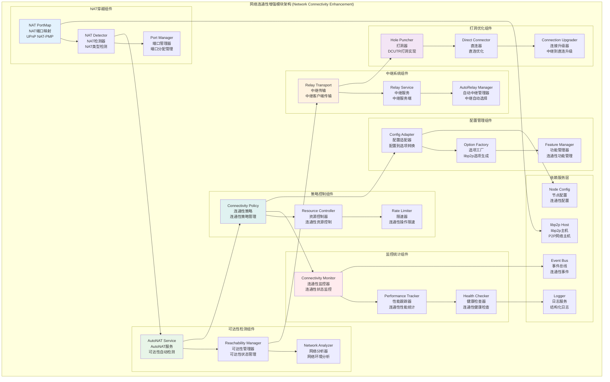

# 网络连通性增强模块 (Network Connectivity Enhancement Module)

## 【模块定位】

**网络连通性增强模块**是WES区块链系统P2P网络的连通性保障核心组件，负责提供复杂网络环境下的连通性增强能力。作为P2P网络穿越NAT、防火墙等网络障碍的关键技术，连通性模块聚焦NAT穿越、AutoNAT检测、可达性管理、中继服务等功能，在复杂网络(NAT、企业防火墙、跨域)下提升节点可达性与首连成功率，为整个区块链网络提供稳定、高效的网络连通性保障。

## 【设计原则】

### 可组合性原则

- **选项工厂**: 提供按需可组合的libp2p.Option工厂
- **模块解耦**: 与Host装配解耦，提供独立的功能模块
- **灵活配置**: 支持各种连通性功能的独立启用和配置
- **接口统一**: 通过统一接口提供连通性增强能力

### 网络适应原则

- **环境感知**: 自动检测网络环境和NAT类型
- **策略自适应**: 根据网络条件自动选择最优连通策略
- **降级处理**: 高级功能失败时优雅降级到基础连通
- **兼容性优先**: 确保与各种网络环境的兼容性

### 生产就绪原则

- **资源可控**: 严格控制连通性功能的资源使用
- **安全策略**: 防止连通性功能被恶意利用
- **监控可观测**: 提供完整的连通性状态监控
- **故障恢复**: 快速检测和恢复连通性故障

## 【核心职责】

### NAT端口映射服务

- 通过NAT-PMP和UPnP协议进行端口映射
- 自动检测和配置NAT设备
- 端口映射状态监控和维护
- 端口映射失败的降级处理

### AutoNAT可达性检测

- 自动检测节点的网络可达性状态
- 支持AutoNAT v1和v2协议
- 提供全局和每节点的限速控制
- 可达性状态变化的事件通知

### 可达性策略管理

- 强制设置节点可达性状态(public/private/auto)
- 根据网络环境自动调整可达性策略
- 可达性状态与传输协议的协调
- 私有网络模式下的可达性优化

### 中继服务集成

- 中继传输的启用和配置管理
- AutoRelay静态和动态中继选择
- 中继服务端的资源配额控制
- DCUTR打洞技术的集成和优化

### 连通性监控服务

- 连通性状态的实时监控和统计
- NAT类型检测和分析
- 连通性性能指标的收集
- 连通性故障的检测和告警

## 【架构组件】



## 【目录结构说明】

```text
connectivity/
├── nat.go                      # NAT端口映射 - UPnP NAT-PMP端口映射
├── autonat.go                  # AutoNAT服务 - 可达性自动检测
├── reachability.go             # 可达性策略 - 强制可达性设置
├── README.md                   # 本文档 - Connectivity模块详细说明
└── relay/                      # 中继子模块 - 中继和打洞技术
    ├── transport.go               # 中继传输 - 中继客户端传输开关
    ├── service.go                 # 中继服务 - 中继服务端资源限额
    ├── autorelay.go               # 自动中继 - 静态和动态中继选择
    ├── autorelay_dynamic.go       # 动态中继 - 动态PeerSource中继
    ├── holepunch.go               # 打洞服务 - DCUTR打洞实现
    └── README.md                  # Relay子模块详细文档
```

## 【依赖关系】

### 上层调用依赖

- **internal/core/infrastructure/node/impl/host**: libp2p主机管理模块
- **internal/core/infrastructure/node**: 节点网络主模块

### 外部库依赖

- **github.com/libp2p/go-libp2p**: libp2p主库
- **github.com/libp2p/go-libp2p/p2p/protocol/autonatv2**: AutoNAT v2协议
- **github.com/libp2p/go-libp2p/p2p/protocol/circuitv2**: Circuit Relay v2协议
- **github.com/libp2p/go-libp2p/p2p/protocol/holepunch**: Hole Punching协议

### 内部依赖

- **internal/config/node**: 节点配置管理
- **pkg/interfaces/infrastructure/log**: 日志记录接口
- **pkg/interfaces/infrastructure/event**: 事件总线接口

### Go标准库依赖

- **context**: 上下文管理和取消操作
- **net**: 网络操作和地址处理
- **time**: 时间处理和超时控制
- **sync**: 并发控制和同步原语

## 【系统特性】

### NAT穿越特性

- **多协议支持**: UPnP和NAT-PMP端口映射协议
- **自动检测**: 自动检测NAT设备和支持的协议
- **端口管理**: 智能端口分配和冲突避免
- **状态监控**: 端口映射状态的实时监控

### AutoNAT检测特性

- **协议支持**: 支持AutoNAT v1和v2协议
- **限速控制**: 全局和每节点的请求限速
- **状态通知**: 可达性状态变化的事件通知
- **失败处理**: 检测失败的重试和降级处理

### 中继服务特性

- **传输支持**: 中继客户端传输的启用和管理
- **服务提供**: 中继服务端的资源配额控制
- **自动选择**: AutoRelay的静态和动态中继选择
- **资源限制**: 严格的资源使用限制和监控

### 打洞优化特性

- **DCUTR协议**: 基于Circuit Relay的直连协商
- **连接升级**: 从中继连接升级到直连
- **性能优化**: 打洞成功率和延迟优化
- **回退机制**: 打洞失败时的中继回退

## 【配置管理】

### NAT端口映射配置

```yaml
node:
  nat:
    # 端口映射配置
    enable_port_map: true         # 启用NAT端口映射
    upnp_enabled: true            # 启用UPnP协议
    natpmp_enabled: true          # 启用NAT-PMP协议
    
    # 端口配置
    external_port: 0              # 外部端口(0=自动分配)
    lease_duration: "1h"          # 端口映射租期
    renewal_threshold: "15m"      # 续期阈值
    
    # 检测配置
    discovery_timeout: "10s"      # 设备发现超时
    mapping_timeout: "30s"        # 端口映射超时
```

### AutoNAT配置

```yaml
node:
  autonat:
    # 基础配置
    enabled: true                 # 启用AutoNAT检测
    protocol_version: "v2"        # 协议版本: v1/v2
    
    # 限速配置
    throttle_peer_limit: 10       # 每个节点限速
    throttle_global_limit: 30     # 全局限速
    throttle_interval: "1m"       # 限速时间窗口
    
    # 检测配置
    confidence_threshold: 3       # 置信度阈值
    refresh_interval: "15m"       # 刷新间隔
    probe_timeout: "30s"          # 探测超时
```

### 可达性策略配置

```yaml
node:
  reachability:
    # 可达性策略
    force_reachability: ""        # 强制可达性: ""(auto)/"public"/"private"
    auto_detection: true          # 启用自动检测
    
    # 策略配置
    public_addr_threshold: 1      # 公网地址阈值
    private_network_mode: false   # 私有网络模式
    
    # 更新配置
    status_update_interval: "5m"  # 状态更新间隔
    change_notification: true     # 状态变化通知
```

### 中继系统配置

```yaml
node:
  relay:
    # 中继传输
    enable_transport: true        # 启用中继传输
    hop_timeout: "30s"            # 跳转超时
    
    # 自动中继
    enable_auto_relay: false      # 启用自动中继
    static_relay_peers: []        # 静态中继节点
    max_relay_peers: 3            # 最大中继节点数
    
    # 中继服务
    enable_service: false         # 启用中继服务
    max_circuits: 1000            # 最大电路数
    max_circuit_duration: "2m"    # 最大电路持续时间
    max_circuit_bytes: 1048576    # 最大电路字节数
    
    # 打洞配置
    enable_holepunch: true        # 启用打洞
    direct_dial_attempts: 3       # 直连尝试次数
    hole_punch_timeout: "5s"      # 打洞超时
```

### 监控告警配置

```yaml
node:
  connectivity:
    # 监控配置
    enable_monitoring: true       # 启用连通性监控
    metrics_interval: "1m"        # 指标收集间隔
    
    # 健康检查
    health_check_enabled: true    # 启用健康检查
    health_check_interval: "5m"   # 健康检查间隔
    
    # 告警配置
    nat_mapping_failure_threshold: 3  # NAT映射失败阈值
    autonat_failure_threshold: 5      # AutoNAT失败阈值
    relay_failure_threshold: 3        # 中继失败阈值
    
    # 性能阈值
    hole_punch_success_rate_threshold: 0.8  # 打洞成功率阈值
    direct_connection_ratio_threshold: 0.6  # 直连比例阈值
```

## 【外部接口】

### NAT端口映射接口

- **NATManager**: NAT管理器
  - `EnablePortMapping(ctx context.Context) error` - 启用端口映射
  - `DisablePortMapping(ctx context.Context) error` - 禁用端口映射
  - `GetMappedPorts() []PortMapping` - 获取已映射端口
  - `RefreshMappings(ctx context.Context) error` - 刷新端口映射

### AutoNAT服务接口

- **AutoNATService**: AutoNAT服务
  - `Start(ctx context.Context) error` - 启动AutoNAT服务
  - `Stop(ctx context.Context) error` - 停止AutoNAT服务
  - `GetReachability() network.Reachability` - 获取可达性状态
  - `TriggerProbe() error` - 触发探测

### 可达性管理接口

- **ReachabilityManager**: 可达性管理器
  - `SetReachability(reachability network.Reachability)` - 设置可达性
  - `GetReachability() network.Reachability` - 获取可达性
  - `IsPublic() bool` - 检查是否公网可达
  - `IsPrivate() bool` - 检查是否私有网络

### 中继服务接口

- **RelayManager**: 中继管理器
  - `EnableRelay(ctx context.Context) error` - 启用中继功能
  - `DisableRelay(ctx context.Context) error` - 禁用中继功能
  - `GetRelayPeers() []peer.ID` - 获取中继节点
  - `AddRelayPeer(peerID peer.ID) error` - 添加中继节点

### 连通性监控接口

- **ConnectivityMonitor**: 连通性监控器
  - `GetConnectivityStats() *ConnectivityStats` - 获取连通性统计
  - `GetNATStats() *NATStats` - 获取NAT统计
  - `GetRelayStats() *RelayStats` - 获取中继统计
  - `GetHolePunchStats() *HolePunchStats` - 获取打洞统计

## 【相关文档】

- **节点网络主模块**: `internal/core/infrastructure/node/README.md`
- **libp2p主机管理**: `internal/core/infrastructure/node/impl/host/README.md`
- **中继系统**: `internal/core/infrastructure/node/impl/connectivity/relay/README.md`
- **节点发现**: `internal/core/infrastructure/node/impl/discovery/README.md`
- **libp2p连通性文档**: [libp2p NAT文档](https://docs.libp2p.io/concepts/nat/)

## 【使用策略】

### NAT穿越策略

- **自动检测**: 启动时自动检测NAT设备和支持的协议
- **多协议尝试**: 同时尝试UPnP和NAT-PMP协议
- **端口管理**: 合理分配端口避免冲突
- **状态监控**: 定期检查端口映射状态

### 可达性优化策略

- **环境适配**: 根据网络环境自动调整可达性策略
- **状态同步**: 及时同步可达性状态变化
- **性能平衡**: 在可达性和性能之间找到平衡
- **降级处理**: 高级功能失败时优雅降级

### 中继使用策略

- **按需启用**: 根据网络条件按需启用中继功能
- **资源控制**: 严格控制中继服务的资源使用
- **性能优化**: 优化中继选择和连接管理
- **安全考虑**: 防止中继功能被恶意利用

### 监控运维策略

- **实时监控**: 实时监控连通性状态和性能
- **告警机制**: 设置合理的告警阈值和通知
- **性能分析**: 定期分析连通性性能数据
- **故障处理**: 建立完善的故障处理流程

## 【错误处理】

### NAT穿越错误

- **ErrNATDeviceNotFound**: NAT设备未找到
- **ErrPortMappingFailed**: 端口映射失败
- **ErrUPnPNotSupported**: UPnP不支持
- **ErrNATPMPNotSupported**: NAT-PMP不支持

### AutoNAT检测错误

- **ErrAutoNATFailed**: AutoNAT检测失败
- **ErrProbeTimeout**: 探测超时
- **ErrInsufficientPeers**: 探测节点不足
- **ErrRateLimitExceeded**: 限速超出

### 中继服务错误

- **ErrRelayNotAvailable**: 中继不可用
- **ErrCircuitLimitExceeded**: 电路数量超限
- **ErrRelayResourceExhausted**: 中继资源耗尽
- **ErrHolePunchFailed**: 打洞失败

### 错误恢复机制

- **自动重试**: 对临时性错误实施智能重试
- **降级服务**: 高级功能失败时降级到基础功能
- **状态恢复**: 错误后自动恢复连通性状态
- **监控告警**: 关键错误的实时监控和告警
