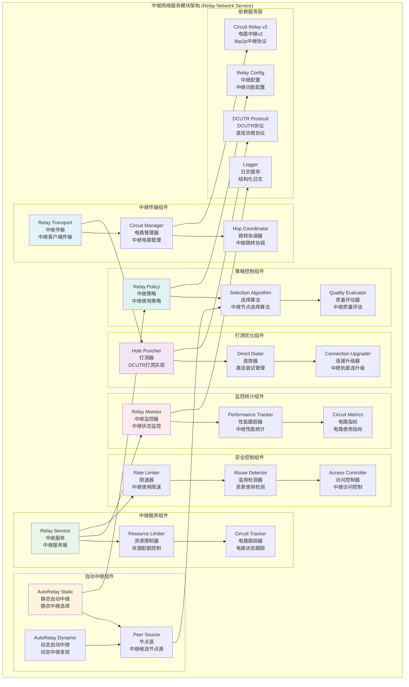

# 中继网络服务模块 (Relay Network Service Module)

## 【模块定位】

**中继网络服务模块**是WES区块链系统P2P网络连通性增强的核心中继组件，负责提供借助中继提升连通性的一组能力。作为NAT穿越和网络连通性的关键技术，中继模块聚焦中继传输、中继服务、自动中继、打洞优化等功能，实现作为客户端经由中继转发通信、作为服务端为他人转发、在具备中继通道时进行DCUTR打洞，从而在多样化NAT/防火墙场景下提升首连成功率与链路质量，为整个区块链网络提供强大的连通性保障。

## 【设计原则】

### 多角色支持原则

- **客户端能力**: 作为中继客户端经由中继节点建立间接连接
- **服务端能力**: 提供中继服务为其他节点转发流量
- **混合模式**: 同时支持客户端和服务端角色
- **资源控制**: 严格控制中继服务的资源使用

### 智能选择原则

- **静态配置**: 支持预配置的静态中继节点列表
- **动态发现**: 通过PeerSource动态发现和选择中继节点
- **质量评估**: 基于延迟、稳定性等指标选择最优中继
- **负载均衡**: 在多个中继节点间智能分布负载

### 优化升级原则

- **打洞优先**: 优先尝试DCUTR打洞建立直连
- **连接升级**: 从中继连接升级到直连优化性能
- **回退机制**: 直连失败时优雅回退到中继传输
- **性能监控**: 持续监控连接质量和优化效果

## 【核心职责】

### 中继传输服务

- 启用和管理中继客户端传输功能
- 通过中继节点建立间接P2P连接
- 中继连接的建立、维护和管理
- 中继传输的性能监控和优化

### 中继服务提供

- 作为中继服务端为其他节点提供转发服务
- 严格的资源配额控制和使用监控
- 中继电路的生命周期管理
- 恶意使用的检测和防护

### AutoRelay自动中继

- 静态中继节点的配置和管理
- 动态中继节点的发现和选择
- 中继节点质量的评估和排序
- 中继节点的故障检测和替换

### DCUTR打洞优化

- 基于中继连接的直连协商
- 打洞成功后的连接升级
- 打洞失败时的中继回退
- 打洞性能的优化和调优

### 资源控制管理

- 中继服务的资源限制和配额
- 连接数、带宽、时长等资源控制
- IP和ASN级别的使用限制
- 资源使用的监控和告警

## 【架构组件】



## 【目录结构说明】

```text
relay/
├── transport.go                # 中继传输 - 中继客户端传输开关和管理
├── service.go                  # 中继服务 - 中继服务端和资源限额控制
├── autorelay.go                # 自动中继 - 静态中继节点配置和管理
├── autorelay_dynamic.go        # 动态中继 - 动态PeerSource中继发现
├── holepunch.go                # 打洞服务 - DCUTR打洞和连接升级
└── README.md                   # 本文档 - Relay模块详细说明
```

## 【依赖关系】

### 上层调用依赖

- **internal/core/infrastructure/node/impl/connectivity**: 连通性增强主模块
- **internal/core/infrastructure/node/impl/host**: libp2p主机管理模块

### 外部库依赖

- **github.com/libp2p/go-libp2p/p2p/protocol/circuitv2/relay**: Circuit Relay v2实现
- **github.com/libp2p/go-libp2p/p2p/protocol/holepunch**: Hole Punching协议
- **github.com/libp2p/go-libp2p/core/network**: libp2p网络接口
- **github.com/libp2p/go-libp2p/core/peer**: 节点ID和地址管理

### 内部依赖

- **internal/config/node**: 节点配置管理
- **pkg/interfaces/infrastructure/log**: 日志记录接口

### Go标准库依赖

- **context**: 上下文管理和取消操作
- **time**: 时间处理和超时控制
- **sync**: 并发控制和同步原语
- **net**: 网络地址处理

## 【系统特性】

### 中继传输特性

- **透明中继**: 应用层透明的中继传输
- **多跳支持**: 支持多级中继跳转
- **连接复用**: 在单个中继连接上复用多个流
- **超时控制**: 完善的超时控制和错误处理

### 中继服务特性

- **资源配额**: 严格的资源使用配额和限制
- **服务质量**: 基于资源使用的服务质量控制
- **访问控制**: 基于IP、ASN等的访问控制
- **监控统计**: 完整的服务使用监控和统计

### AutoRelay特性

- **静态配置**: 预配置的可信中继节点列表
- **动态发现**: 基于网络发现的动态中继选择
- **质量感知**: 基于延迟、稳定性的中继质量评估
- **故障切换**: 中继节点故障的自动检测和切换

### 打洞优化特性

- **智能打洞**: 基于网络条件的智能打洞策略
- **连接升级**: 中继连接到直连的无缝升级
- **性能优化**: 打洞成功率和延迟的持续优化
- **回退保障**: 打洞失败时的可靠中继回退

## 【配置管理】

### 中继传输配置

```yaml
node:
  relay:
    transport:
      # 基础配置
      enabled: true               # 启用中继传输
      hop_timeout: "30s"          # 跳转超时
      max_hops: 3                 # 最大跳数
      
      # 连接配置
      dial_timeout: "60s"         # 拨号超时
      max_circuits_per_peer: 16   # 每个节点最大电路数
      
      # 性能配置
      stream_timeout: "1m"        # 流超时
      max_message_size: 65536     # 最大消息大小
```

### 中继服务配置

```yaml
node:
  relay:
    service:
      # 服务配置
      enabled: false              # 启用中继服务
      max_circuits: 1000          # 最大电路数
      max_circuit_duration: "2m"  # 最大电路持续时间
      max_circuit_bytes: 1048576  # 最大电路字节数
      
      # 资源限制
      max_reservations: 256       # 最大预约数
      max_reservations_per_peer: 4 # 每个节点最大预约数
      max_reservations_per_ip: 8  # 每个IP最大预约数
      max_reservations_per_asn: 32 # 每个ASN最大预约数
      
      # 缓冲配置
      buffer_size: 2048           # 缓冲区大小
      max_buffer_time: "10s"      # 最大缓冲时间
```

### AutoRelay配置

```yaml
node:
  relay:
    auto_relay:
      # 基础配置
      enabled: false              # 启用自动中继
      static_relay_peers: []      # 静态中继节点列表
      
      # 动态配置
      enable_dynamic: true        # 启用动态中继
      max_relay_peers: 3          # 最大中继节点数
      min_relay_peers: 1          # 最小中继节点数
      
      # 选择策略
      selection_policy: "quality" # 选择策略: quality/random/round_robin
      quality_threshold: 0.8      # 质量阈值
      refresh_interval: "30m"     # 刷新间隔
      
      # 发现配置
      peer_source_timeout: "30s"  # 节点源超时
      discovery_timeout: "1m"     # 发现超时
```

### 打洞配置

```yaml
node:
  relay:
    hole_punch:
      # 基础配置
      enabled: true               # 启用打洞
      max_attempts: 3             # 最大尝试次数
      attempt_timeout: "5s"       # 尝试超时
      
      # 策略配置
      direct_dial_attempts: 3     # 直连尝试次数
      sync_timeout: "15s"         # 同步超时
      
      # 优化配置
      enable_tcp_hole_punch: true # 启用TCP打洞
      enable_dcutr: true          # 启用DCUTR协议
      concurrent_limit: 10        # 并发限制
```

### 监控配置

```yaml
node:
  relay:
    monitoring:
      # 指标配置
      enable_metrics: true        # 启用指标收集
      metrics_interval: "1m"      # 指标收集间隔
      
      # 统计配置
      track_circuit_stats: true   # 跟踪电路统计
      track_bandwidth_stats: true # 跟踪带宽统计
      track_latency_stats: true   # 跟踪延迟统计
      
      # 告警配置
      circuit_limit_threshold: 0.9    # 电路限制阈值
      bandwidth_limit_threshold: 0.8  # 带宽限制阈值
      error_rate_threshold: 0.1       # 错误率阈值
```

## 【外部接口】

### 中继传输接口

- **RelayTransport**: 中继传输
  - `EnableRelay() error` - 启用中继传输
  - `DisableRelay() error` - 禁用中继传输
  - `IsRelayEnabled() bool` - 检查中继是否启用
  - `GetRelayConnections() []network.Conn` - 获取中继连接

### 中继服务接口

- **RelayService**: 中继服务
  - `StartService(ctx context.Context) error` - 启动中继服务
  - `StopService(ctx context.Context) error` - 停止中继服务
  - `GetActiveCircuits() []*CircuitInfo` - 获取活跃电路
  - `GetResourceUsage() *ResourceUsage` - 获取资源使用情况

### AutoRelay接口

- **AutoRelayManager**: 自动中继管理器
  - `Start(ctx context.Context) error` - 启动自动中继
  - `Stop(ctx context.Context) error` - 停止自动中继
  - `AddStaticRelay(peerID peer.ID, addrs []multiaddr.Multiaddr)` - 添加静态中继
  - `GetRelayPeers() []peer.ID` - 获取中继节点

### 打洞服务接口

- **HolePunchService**: 打洞服务
  - `EnableHolePunch() error` - 启用打洞
  - `DisableHolePunch() error` - 禁用打洞
  - `AttemptHolePunch(ctx context.Context, peerID peer.ID) error` - 尝试打洞
  - `GetHolePunchStats() *HolePunchStats` - 获取打洞统计

### 监控统计接口

- **RelayMonitor**: 中继监控器
  - `GetRelayStats() *RelayStats` - 获取中继统计
  - `GetCircuitStats() *CircuitStats` - 获取电路统计
  - `GetBandwidthStats() *BandwidthStats` - 获取带宽统计
  - `ResetStats()` - 重置统计信息

## 【相关文档】

- **连通性增强模块**: `internal/core/infrastructure/node/impl/connectivity/README.md`
- **节点网络主模块**: `internal/core/infrastructure/node/README.md`
- **libp2p主机管理**: `internal/core/infrastructure/node/impl/host/README.md`
- **Circuit Relay规范**: [Circuit Relay v2规范](https://github.com/libp2p/specs/blob/master/relay/circuit-v2.md)
- **DCUTR规范**: [DCUTR协议规范](https://github.com/libp2p/specs/blob/master/relay/DCUtR.md)

## 【使用策略】

### 中继功能启用策略

- **网络评估**: 根据网络环境决定启用哪些中继功能
- **资源考虑**: 根据节点资源决定是否提供中继服务
- **安全策略**: 在安全和连通性之间找到平衡
- **性能优化**: 优化中继配置以获得最佳性能

### 中继节点选择策略

- **质量优先**: 优先选择延迟低、稳定性高的中继节点
- **地理分布**: 选择地理分布合理的中继节点
- **负载均衡**: 在多个中继节点间均衡分布负载
- **故障容错**: 准备备用中继节点应对故障

### 打洞优化策略

- **时机选择**: 在合适的时机尝试打洞升级
- **重试策略**: 合理的打洞重试策略和超时设置
- **成功率优化**: 持续优化打洞成功率
- **回退保障**: 确保打洞失败时的可靠回退

### 资源管理策略

- **配额设置**: 根据节点能力设置合理的资源配额
- **监控告警**: 实时监控资源使用情况
- **动态调整**: 根据负载动态调整资源限制
- **滥用防护**: 检测和防止中继功能的恶意使用

## 【错误处理】

### 中继传输错误

- **ErrRelayNotEnabled**: 中继未启用
- **ErrNoRelayFound**: 未找到可用中继
- **ErrCircuitFailed**: 电路建立失败
- **ErrHopTimeout**: 跳转超时

### 中继服务错误

- **ErrServiceNotRunning**: 中继服务未运行
- **ErrResourceLimitExceeded**: 资源限制超出
- **ErrCircuitLimitReached**: 电路数量达到上限
- **ErrInvalidReservation**: 无效的预约请求

### AutoRelay错误

- **ErrNoStaticRelays**: 没有静态中继节点
- **ErrPeerSourceTimeout**: 节点源超时
- **ErrRelaySelectionFailed**: 中继选择失败
- **ErrAllRelaysFailed**: 所有中继都失败

### 打洞错误

- **ErrHolePunchNotEnabled**: 打洞未启用
- **ErrHolePunchTimeout**: 打洞超时
- **ErrDirectDialFailed**: 直连拨号失败
- **ErrNATTypeIncompatible**: NAT类型不兼容

### 错误恢复机制

- **自动重试**: 对临时性错误实施智能重试
- **降级处理**: 高级功能失败时降级到基础功能
- **状态恢复**: 错误后自动恢复中继状态
- **监控告警**: 关键错误的实时监控和告警
