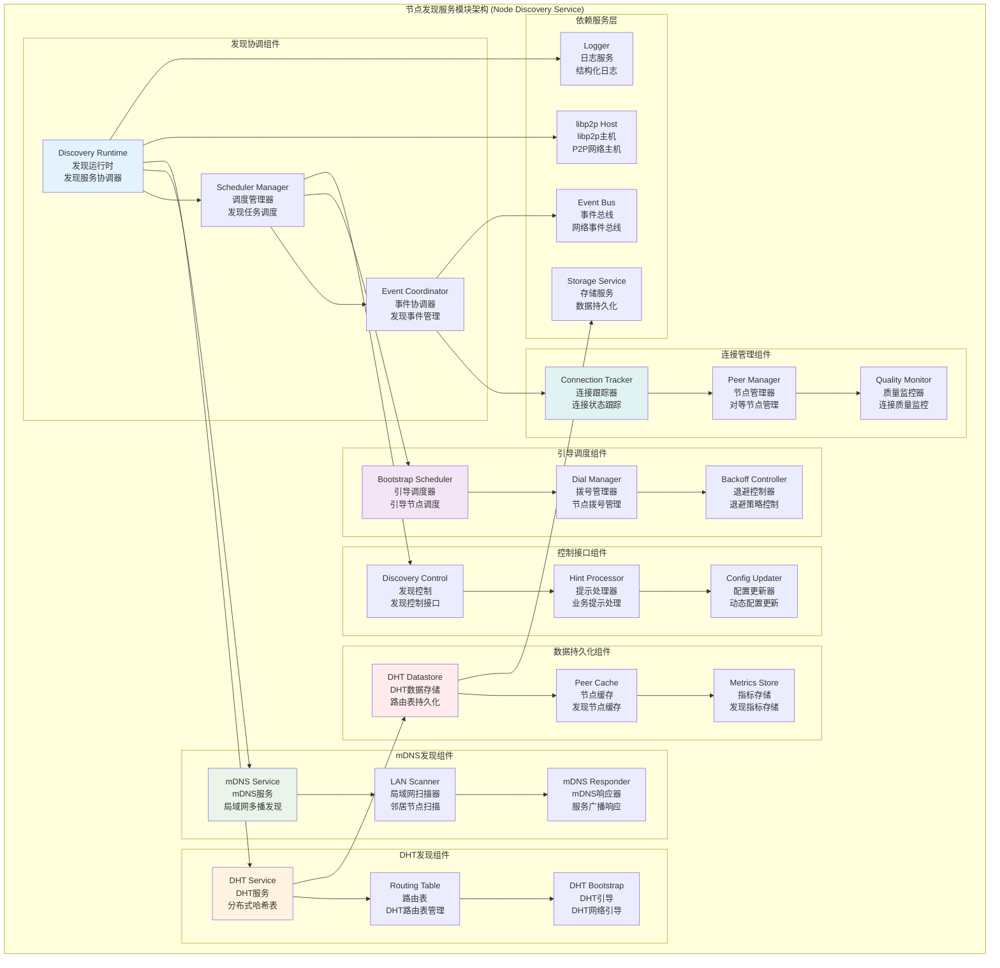

# 节点发现服务模块 (Node Discovery Service Module)

## 【模块定位】

**节点发现服务模块**是WES区块链系统P2P网络的节点发现核心组件，负责提供对等节点发现的运行时组件。作为P2P网络拓扑构建的关键服务，节点发现模块聚合了mDNS(局域网发现)、DHT(全网发现)与引导节点拨号调度，目标是在生产环境下自动建立足够的对等连接、保持网络拓扑稳定，并尽可能减少人工干预，为整个区块链网络提供稳定、高效的节点发现服务。

## 【设计原则】

### 自动化发现原则

- **多机制聚合**: 集成mDNS、DHT、Bootstrap多种发现机制
- **自适应调度**: 根据网络状况自动调整发现频率和策略
- **容错设计**: 单一发现机制失败不影响其他机制运行
- **零配置可用**: 默认配置下即可正常发现和连接节点

### 分层发现原则

- **局域网优先**: mDNS优先发现同网段节点，减少跨网流量
- **全网覆盖**: DHT提供跨网络的广域节点发现
- **引导保障**: Bootstrap确保基础连通性和网络加入
- **智能调度**: 根据连接状态智能调度发现任务

### 高可用性原则

- **连接保活**: 主动维护与关键节点的连接
- **动态调整**: 根据网络质量动态调整连接策略
- **退避重试**: 智能退避策略避免网络拥塞
- **事件驱动**: 支持业务提示触发的快速发现

## 【核心职责】

### mDNS局域网发现

- 同一二层网络(LAN)内的节点自动发现
- 监听局域网服务，发现邻居节点后快速直连
- 可配置服务名、连接超时、重试次数
- 失败重试和连接状态跟踪

### DHT全网发现

- 跨网络的广域发现与路由表维护
- 按前缀与模式(Auto/Client/Server)初始化DHT
- 支持数据持久化存储和路由表恢复
- Bootstrap执行和路由表规模监控

### 引导节点调度

- 基于引导节点列表的主动拨号与保活
- 启动期快速退避拨号建立初始连通
- 稳定期动态周期拨号，根据连接数自适应调整
- 轻微抖动避免同步风暴，支持业务提示触发

### 发现事件管理

- 发现结果的事件通知和状态管理
- 连接成功和失败的统计跟踪
- 网络拓扑变化的事件广播
- 发现性能指标的收集和分析

### 配置管理服务

- 发现机制的配置加载和热更新
- 发现参数的动态调整和优化
- 网络环境的自动适配和策略切换
- 故障恢复和降级策略管理

## 【架构组件】



## 【目录结构说明】

```text
discovery/
├── scheduler.go                # 发现调度器 - 引导节点连接调度和保活
├── dht.go                      # DHT发现 - 分布式哈希表发现实现
├── mdns.go                     # mDNS发现 - 局域网多播发现实现
├── controls.go                 # 控制接口 - 业务控制和发现提示
├── backoff.go                  # 退避策略 - 指数退避重试实现
├── events.go                   # 事件管理 - 发现事件处理
├── offline.go                  # 离线模式 - 离线路由器实现
├── rendezvous.go               # 集合点发现 - rendezvous发现机制
├── dht copy.go---new           # DHT副本文件 (临时)
├── dht copy.go————             # DHT副本文件 (临时)
└── README.md                   # 本文档 - Discovery模块详细说明
```

## 【依赖关系】

### 上层调用依赖

- **internal/core/infrastructure/node**: 节点网络主模块
- **internal/core/network**: 网络协议模块 - P2P消息路由

### 外部库依赖

- **github.com/libp2p/go-libp2p-kad-dht**: Kademlia DHT实现
- **github.com/libp2p/go-libp2p/p2p/discovery/mdns**: mDNS发现实现
- **github.com/libp2p/go-libp2p/core/host**: libp2p主机接口
- **github.com/libp2p/go-libp2p/core/peer**: 节点ID和地址信息

### 内部依赖

- **internal/core/infrastructure/node/impl/host**: 主机管理模块
- **pkg/interfaces/infrastructure/event**: 事件总线接口
- **pkg/interfaces/infrastructure/storage**: 存储接口 (DHT持久化)
- **pkg/interfaces/infrastructure/log**: 日志记录接口

### Go标准库依赖

- **context**: 上下文管理和取消操作
- **time**: 时间处理和定时器
- **sync**: 并发控制和同步原语
- **math/rand**: 随机数生成 (抖动和退避)

## 【系统特性】

### mDNS局域网发现特性

- **零配置发现**: 无需配置即可发现局域网节点
- **快速连接**: 局域网内节点的快速直连
- **服务广播**: 自动广播和响应mDNS服务查询
- **重试机制**: 连接失败的智能重试和退避

### DHT全网发现特性

- **路由表维护**: Kademlia DHT路由表的自动维护
- **数据持久化**: 路由表数据的持久化存储和恢复
- **Bootstrap引导**: 自动执行DHT网络引导和加入
- **模式适配**: 支持Auto/Client/Server多种DHT模式

### 引导调度特性

- **快速启动**: 启动期的快速退避拨号策略
- **动态调整**: 根据连接数动态调整拨号间隔
- **抖动避免**: 引入抖动避免节点同步拨号
- **业务提示**: 支持业务侧触发的快速发现

### 连接保活特性

- **连接监控**: 实时监控对等节点连接状态
- **质量评估**: 连接质量的评估和优化
- **自动重连**: 连接断开的自动重连机制
- **负载均衡**: 连接的智能负载均衡和分布

## 【配置管理】

### mDNS发现配置

```yaml
node:
  discovery:
    # mDNS配置
    mdns:
      enabled: true               # 启用mDNS发现
      service_name: "weisyn-node"   # mDNS服务名
      query_interval: "30s"       # 查询间隔
      
      # 连接配置
      connection_timeout: "10s"   # 连接超时
      max_retries: 3              # 最大重试次数
      retry_interval: "5s"        # 重试间隔
```

### DHT发现配置

```yaml
node:
  dht:
    # 基础配置
    enabled: true                 # 启用DHT发现
    mode: "auto"                  # DHT模式: auto/client/server
    protocol_prefix: "/weisyn"      # 协议前缀
    
    # 数据存储
    data_store_path: "./data/dht" # DHT数据持久化路径
    enable_persistence: true      # 启用数据持久化
    
    # 高级配置
    enable_lan_loopback: false    # 启用LAN回环(调试用)
    enable_optimistic_provide: false # 启用乐观提供
    optimistic_provide_jobs_pool_size: 64 # 乐观提供作业池大小
    
    # Bootstrap配置
    bootstrap_timeout: "30s"      # Bootstrap超时
    bootstrap_interval: "5m"      # Bootstrap间隔
```

### 引导调度配置

```yaml
node:
  # 引导节点
  bootstrap_peers:
    - "/ip4/bootstrap1.example.com/tcp/4001/p2p/12D3Koo..."
    - "/ip4/bootstrap2.example.com/tcp/4001/p2p/12D3Koo..."
    
  discovery:
    # 调度配置
    discovery_interval: "5m"      # 发现间隔
    advertise_interval: "15m"     # 广告间隔
    
    # 连接目标
    min_connected_peers: 8        # 最小连接节点数
    target_connected_peers: 20    # 目标连接节点数
    
    # 退避配置
    initial_delay: "1s"           # 初始延迟
    max_delay: "5m"               # 最大延迟
    backoff_factor: 2.0           # 退避因子
    jitter_factor: 0.1            # 抖动因子
```

### 性能优化配置

```yaml
node:
  discovery:
    # 并发控制
    max_concurrent_dials: 10      # 最大并发拨号数
    dial_timeout: "30s"           # 拨号超时
    
    # 缓存配置
    peer_cache_size: 1000         # 节点缓存大小
    peer_cache_ttl: "1h"          # 节点缓存TTL
    
    # 事件配置
    event_buffer_size: 100        # 事件缓冲区大小
    enable_event_history: true    # 启用事件历史
    
    # 监控配置
    enable_metrics: true          # 启用指标收集
    metrics_interval: "1m"        # 指标收集间隔
```

## 【外部接口】

### 发现运行时接口

- **DiscoveryRuntime**: 发现运行时
  - `Start(ctx context.Context) error` - 启动发现服务
  - `Stop(ctx context.Context) error` - 停止发现服务
  - `IsRunning() bool` - 检查运行状态
  - `GetConnectedPeers() []peer.ID` - 获取已连接节点

### 发现控制接口

- **DiscoveryControl**: 发现控制
  - `TriggerDiscovery(reason string)` - 触发发现
  - `SetDiscoveryMode(mode DiscoveryMode)` - 设置发现模式
  - `UpdateConfig(config *DiscoveryConfig)` - 更新配置
  - `GetDiscoveryStats() *DiscoveryStats` - 获取发现统计

### DHT服务接口

- **DHTService**: DHT服务
  - `Bootstrap(ctx context.Context) error` - 执行DHT引导
  - `GetRoutingTableSize() int` - 获取路由表大小
  - `FindPeers(ctx context.Context, ns string) (<-chan peer.AddrInfo, error)` - 查找节点
  - `Provide(ctx context.Context, key cid.Cid) error` - 提供内容

### mDNS服务接口

- **MDNSService**: mDNS服务
  - `Start(ctx context.Context) error` - 启动mDNS服务
  - `Stop() error` - 停止mDNS服务
  - `GetDiscoveredPeers() []peer.AddrInfo` - 获取发现的节点
  - `SetQueryInterval(interval time.Duration)` - 设置查询间隔

### 引导调度接口

- **BootstrapScheduler**: 引导调度器
  - `Start(ctx context.Context) error` - 启动调度器
  - `Stop(ctx context.Context) error` - 停止调度器
  - `AddBootstrapPeer(addr multiaddr.Multiaddr)` - 添加引导节点
  - `RemoveBootstrapPeer(peerID peer.ID)` - 移除引导节点

## 【相关文档】

- **节点网络主模块**: `internal/core/infrastructure/node/README.md`
- **libp2p主机管理**: `internal/core/infrastructure/node/impl/host/README.md`
- **连通性增强**: `internal/core/infrastructure/node/impl/connectivity/README.md`
- **Kademlia DHT**: `internal/core/infrastructure/kademlia/README.md`
- **libp2p文档**: [libp2p发现路由文档](https://docs.libp2p.io/concepts/discovery-routing/)

## 【使用策略】

### 发现机制选择策略

- **局域网环境**: 优先使用mDNS发现，快速建立局域网连接
- **公网环境**: 依赖DHT和Bootstrap发现，建立广域网连接
- **混合环境**: 同时启用多种发现机制，最大化连接覆盖
- **私有网络**: 配置专用引导节点和DHT前缀

### 连接保活策略

- **连接监控**: 定期检查连接质量和节点活跃度
- **智能重连**: 根据节点重要性和连接质量决定重连策略
- **负载均衡**: 在多个可用节点间均衡分布连接
- **优雅降级**: 连接不足时降级服务而非完全断开

### 性能优化策略

- **并发控制**: 限制并发拨号数避免资源耗尽
- **缓存利用**: 充分利用节点缓存减少重复发现
- **批量处理**: 批量处理发现结果提高效率
- **事件聚合**: 聚合相似事件减少处理开销

### 故障恢复策略

- **多机制备份**: 多种发现机制相互备份
- **自动重试**: 智能重试失败的发现操作
- **降级模式**: 部分发现失败时切换到降级模式
- **状态恢复**: 重启后从持久化数据恢复发现状态

## 【错误处理】

### 发现服务错误

- **ErrDiscoveryNotRunning**: 发现服务未运行
- **ErrInvalidBootstrapPeer**: 无效的引导节点
- **ErrDHTBootstrapFailed**: DHT引导失败
- **ErrMDNSServiceFailed**: mDNS服务失败

### 连接错误

- **ErrDialFailed**: 拨号失败
- **ErrConnectionTimeout**: 连接超时
- **ErrPeerUnreachable**: 节点不可达
- **ErrMaxRetriesExceeded**: 超过最大重试次数

### 配置错误

- **ErrInvalidDiscoveryConfig**: 无效的发现配置
- **ErrMissingDHTDatastore**: 缺少DHT数据存储
- **ErrInvalidMDNSService**: 无效的mDNS服务配置
- **ErrBootstrapPeersEmpty**: 引导节点列表为空

### 错误恢复机制

- **自动重试**: 对临时性错误实施指数退避重试
- **备用机制**: 主发现机制失败时启用备用机制
- **状态重置**: 错误累积时重置发现状态
- **监控告警**: 关键错误的实时监控和告警
