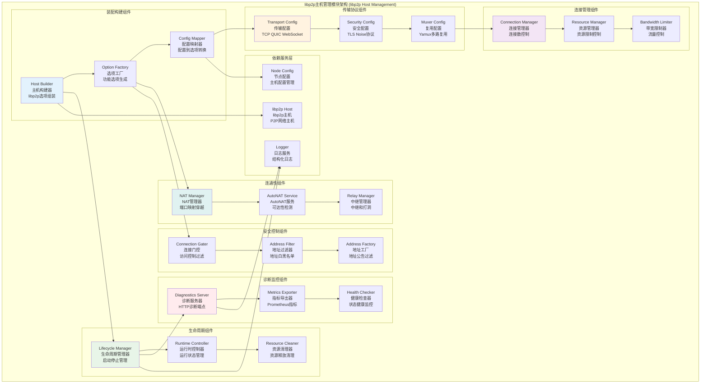

# libp2p主机管理模块 (libp2p Host Management Module)

## 【模块定位】

**libp2p主机管理模块**是WES区块链系统节点网络基础设施的核心装配组件，负责提供生产可用的P2P Host装配与生命周期管理。作为节点网络层的关键基础，主机管理模块实现了完整的libp2p Host构建流程，包括传输层、安全层、多路复用、连接管理、资源控制、诊断监控等功能，做到高内聚、低耦合、可配置、可观测，为整个P2P网络提供稳定、高性能的网络主机服务。

## 【设计原则】

### 装配组合原则

- **选项模式**: 通过libp2p.Option组合构建Host实例
- **分层装配**: 按传输→安全→复用→连接→资源的顺序装配
- **可组合性**: 各功能模块独立可组合，支持按需启用
- **默认优先**: 采用libp2p稳定默认组合，减少配置复杂度

### 生产就绪原则

- **资源可控**: 连接数、内存、文件描述符等资源严格限制
- **性能优化**: 带宽监控、连接复用、智能连接管理
- **安全策略**: 多层安全协议、连接门控、地址过滤
- **监控友好**: 完整的诊断接口和性能指标导出

### 配置驱动原则

- **外部配置**: 通过配置接口注入，不在模块内部读写配置
- **合理默认**: 提供生产安全的默认配置值
- **自适应**: 资源管理器自适应缩放和动态调整
- **环境感知**: 根据网络环境自动调整策略

## 【核心职责】

### Host装配服务

- 基于配置组装libp2p Host实例
- 传输层协议配置(TCP、QUIC、WebSocket)
- 安全层协议配置(TLS、Noise)
- 多路复用器配置(Yamux)

### 生命周期管理

- Host实例的启动、停止、资源清理
- AutoNAT服务的启动和管理
- 优雅关闭和资源释放
- 可重复启动和停止支持

### 连接资源管理

- 连接数水位控制和自动修剪
- 资源管理器(ResourceManager)集成
- 带宽监控和流量控制
- 文件描述符和内存限制

### 网络连通性增强

- NAT端口映射和穿越技术
- 中继服务和AutoRelay配置
- DCUTR打洞和直连优化
- 可达性策略和强制设置

### 安全访问控制

- 连接门控(ConnectionGater)和地址过滤
- 白名单和黑名单策略
- 私有网络PSK支持
- 地址公告过滤和优化

### 诊断监控服务

- HTTP诊断端点暴露节点状态
- Prometheus指标导出
- 连接状态和性能监控
- 调试工具和问题定位支持

## 【架构组件】



## 【目录结构说明】

```text
host/
├── builder.go                 # Host装配器 - libp2p选项组装和Host创建
├── lifecycle.go               # 生命周期管理 - 启动停止和资源管理
├── connmgr.go                 # 连接管理 - 连接数控制和资源限制
├── transports.go              # 传输层配置 - TCP QUIC WebSocket传输
├── security.go                # 安全层配置 - TLS Noise安全协议
├── muxers.go                  # 多路复用配置 - Yamux复用器配置
├── gater.go                   # 连接门控 - 地址过滤和访问控制
├── addr_factory.go            # 地址工厂 - 地址公告过滤和优化
├── diagnostics.go             # 诊断接口 - HTTP诊断端点和指标
├── nat_relay.go               # NAT中继 - NAT穿越和中继配置
├── pnet.go                    # 私有网络 - PSK私有网络支持
├── autonat_opts.go            # AutoNAT选项 - AutoNAT配置选项
├── advanced_connectivity.go   # 高级连通性 - 连通性增强配置
├── limited_reader.go          # 限制读取器 - 资源限制工具
└── README.md                  # 本文档 - Host模块详细说明
```

## 【依赖关系】

### 上层调用依赖

- **internal/core/infrastructure/node**: 节点网络主模块
- **internal/core/infrastructure/node/impl/discovery**: 节点发现模块

### 外部库依赖

- **github.com/libp2p/go-libp2p**: libp2p主库
- **github.com/libp2p/go-libp2p/core/host**: libp2p主机接口
- **github.com/libp2p/go-libp2p/p2p/muxer/yamux**: Yamux多路复用器
- **github.com/libp2p/go-libp2p/p2p/security/noise**: Noise安全协议
- **github.com/libp2p/go-libp2p/p2p/security/tls**: TLS安全协议

### 内部依赖

- **internal/config/node**: 节点配置管理
- **internal/core/infrastructure/node/impl/connectivity**: 连通性增强模块
- **pkg/interfaces/infrastructure/log**: 日志记录接口

### Go标准库依赖

- **context**: 上下文管理和取消操作
- **net**: 网络操作和地址处理
- **time**: 时间处理和超时控制
- **sync**: 并发控制和同步原语

## 【系统特性】

### 装配构建特性

- **选项组合**: 通过libp2p.Option灵活组合功能
- **分层装配**: 传输→安全→复用→连接→资源的有序装配
- **默认策略**: 使用libp2p稳定默认组合
- **配置驱动**: 完全由外部配置驱动的装配过程

### 传输安全特性

- **多传输支持**: TCP、QUIC、WebSocket传输协议
- **安全协议**: TLS 1.3和Noise安全握手
- **多路复用**: Yamux高性能流复用
- **私有网络**: PSK预共享密钥私有网络支持

### 连接管理特性

- **水位控制**: 连接数低水位和高水位自动管理
- **资源限制**: 内存、文件描述符、流数量限制
- **带宽监控**: 实时带宽使用监控和限制
- **优雅关闭**: 连接的优雅关闭和资源清理

### 连通性增强特性

- **NAT穿越**: UPnP和NAT-PMP端口映射
- **AutoNAT**: 自动可达性检测和状态通知
- **中继支持**: 中继传输和AutoRelay自动中继
- **打洞优化**: DCUTR打洞和直连优化

### 安全控制特性

- **连接门控**: 基于地址的连接访问控制
- **白黑名单**: 灵活的地址白名单和黑名单策略
- **地址过滤**: 自动过滤无效和私有地址
- **访问策略**: 细粒度的网络访问策略控制

### 诊断监控特性

- **HTTP端点**: `/debug/host`、`/debug/peers`等调试端点
- **Prometheus指标**: 完整的网络性能指标导出
- **健康检查**: 实时主机健康状态监控
- **性能分析**: 连接性能和资源使用分析

## 【配置管理】

### 基础主机配置

```yaml
node:
  # 监听配置
  listen_addresses:
    - "/ip4/0.0.0.0/tcp/4001"     # TCP监听地址
    - "/ip4/0.0.0.0/udp/4001/quic-v1" # QUIC监听地址
  
  # 身份配置
  identity:
    private_key: ""               # 私钥路径(空=自动生成)
    
  # 连接管理
  low_water: 50                   # 连接低水位
  high_water: 200                 # 连接高水位
  grace_period: "1m"              # 连接宽限期
```

### 传输安全配置

```yaml
node:
  # 传输配置
  transports:
    tcp_enabled: true             # 启用TCP传输
    quic_enabled: true            # 启用QUIC传输
    websocket_enabled: false      # 启用WebSocket传输
  
  # 安全配置
  security:
    tls_enabled: true             # 启用TLS
    noise_enabled: true           # 启用Noise
    
  # 多路复用配置
  muxer:
    yamux_window_size: 256        # Yamux窗口大小(KB)
```

### 资源管理配置

```yaml
node:
  # 资源限制
  resources:
    memory_limit_mb: 1024         # 内存限制(MB)
    fd_limit: 8192                # 文件描述符限制
    max_connections: 1000         # 最大连接数
    max_streams_per_peer: 256     # 每个节点最大流数
    
  # 带宽限制
  bandwidth:
    enabled: true                 # 启用带宽监控
    upload_limit_mbps: 0          # 上传限制(0=无限制)
    download_limit_mbps: 0        # 下载限制(0=无限制)
```

### 连通性配置

```yaml
node:
  # NAT配置
  nat:
    enable_port_map: true         # 启用端口映射
    
  # AutoNAT配置
  autonat:
    enabled: true                 # 启用AutoNAT
    throttle_peer_limit: 10       # 每个节点限速
    throttle_global_limit: 30     # 全局限速
    
  # 中继配置
  relay:
    enable_transport: true        # 启用中继传输
    enable_auto_relay: false      # 启用自动中继
    static_relay_peers: []        # 静态中继节点
    
  # 打洞配置
  dcutr:
    enabled: true                 # 启用DCUTR打洞
```

### 安全控制配置

```yaml
node:
  # 连接门控
  gater:
    allowed_prefixes: []          # 白名单前缀(空=禁用)
    blocked_prefixes: []          # 黑名单前缀
    
  # 地址过滤
  address_filter:
    advertise_private_addrs: false # 广告私有地址
    filter_loopback: true         # 过滤回环地址
    filter_private: true          # 过滤私有地址
    
  # 私有网络
  private_network:
    enabled: false                # 启用私有网络
    psk_path: ""                  # PSK文件路径
```

### 诊断监控配置

```yaml
node:
  # 诊断配置
  diagnostics:
    enabled: false                # 启用诊断接口
    port: 18080                   # 诊断端口
    prometheus_enabled: true      # 启用Prometheus指标
    
  # 健康检查
  health_check:
    enabled: true                 # 启用健康检查
    interval: "30s"               # 检查间隔
    timeout: "10s"                # 检查超时
```

## 【外部接口】

### 主机运行时接口

- **HostRuntime**: 主机运行时
  - `Start(ctx context.Context) error` - 启动Host
  - `Stop(ctx context.Context) error` - 停止Host
  - `Host() host.Host` - 获取Host实例
  - `IsRunning() bool` - 检查运行状态

### Host构建接口

- **HostBuilder**: Host构建器
  - `BuildHost(ctx context.Context, cfg *NodeOptions) (host.Host, error)` - 构建Host
  - `WithCustomOptions(opts ...libp2p.Option) HostBuilder` - 添加自定义选项
  - `WithTransports(transports ...Transport) HostBuilder` - 配置传输层
  - `WithSecurity(security ...Security) HostBuilder` - 配置安全层

### 连接管理接口

- **ConnectionManager**: 连接管理器
  - `TagPeer(peer.ID, string, int)` - 标记节点
  - `UntagPeer(peer.ID, string)` - 取消标记
  - `GetConnections() []network.Conn` - 获取连接列表
  - `IsConnected(peer.ID) bool` - 检查连接状态

### 诊断监控接口

- **DiagnosticsHandler**: 诊断处理器
  - `GetHostInfo() *HostInfo` - 获取主机信息
  - `GetConnections() []*ConnectionInfo` - 获取连接信息
  - `GetPeers() []*PeerInfo` - 获取节点信息
  - `GetAddresses() []multiaddr.Multiaddr` - 获取地址信息

## 【相关文档】

- **节点网络主模块**: `internal/core/infrastructure/node/README.md`
- **节点发现**: `internal/core/infrastructure/node/impl/discovery/README.md`
- **连通性增强**: `internal/core/infrastructure/node/impl/connectivity/README.md`
- **中继系统**: `internal/core/infrastructure/node/impl/connectivity/relay/README.md`
- **libp2p文档**: [libp2p官方文档](https://docs.libp2p.io/)

## 【使用策略】

### Host装配策略

- **配置优先**: 严格按配置装配，避免硬编码默认值
- **选项组合**: 通过选项模式灵活组合功能
- **错误处理**: 装配失败时提供详细错误信息
- **资源预分配**: 启动时预分配关键资源

### 连接管理策略

- **水位控制**: 合理设置连接水位避免资源耗尽
- **优先级管理**: 对重要连接进行优先级标记
- **资源监控**: 实时监控资源使用情况
- **优雅降级**: 资源不足时优雅关闭低优先级连接

### 安全控制策略

- **最小权限**: 默认拒绝，按需开放
- **地址验证**: 严格验证连接地址的合法性
- **访问审计**: 记录关键的访问和拒绝事件
- **动态调整**: 根据网络状况动态调整安全策略

### 性能优化策略

- **连接复用**: 充分利用连接和流的复用
- **缓存优化**: 合理使用缓存减少重复计算
- **异步处理**: 使用异步模式提高并发性能
- **资源预留**: 为关键操作预留资源

## 【错误处理】

### Host装配错误

- **ErrHostBuildFailed**: Host构建失败
- **ErrInvalidTransport**: 无效传输配置
- **ErrSecurityConfigConflict**: 安全配置冲突
- **ErrResourceLimitExceeded**: 资源限制超出

### 生命周期错误

- **ErrHostAlreadyRunning**: Host已经运行
- **ErrHostNotRunning**: Host未运行
- **ErrStartupTimeout**: 启动超时
- **ErrShutdownTimeout**: 关闭超时

### 连接管理错误

- **ErrConnectionLimitReached**: 连接数量达到上限
- **ErrResourceManagerFailed**: 资源管理器失败
- **ErrBandwidthLimitExceeded**: 带宽限制超出
- **ErrConnectionRejected**: 连接被拒绝

### 错误恢复机制

- **重试机制**: 对临时性错误实施智能重试
- **降级服务**: 部分功能失败时不影响基础功能
- **资源回收**: 错误时及时清理和回收资源
- **状态恢复**: 错误后自动恢复到稳定状态
