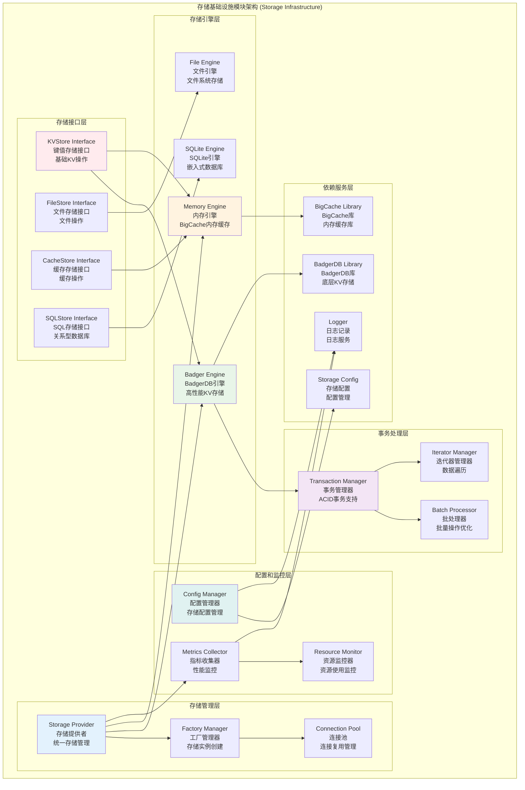

# 存储基础设施模块 (Storage Infrastructure Module)

## 【模块定位】

**存储基础设施模块**是WES区块链系统的核心数据持久化组件，负责提供完整的存储抽象和多引擎实现。作为区块链数据存储的关键基础设施，存储模块采用分层架构设计，提供统一的存储接口和多种存储引擎实现(BadgerDB、内存缓存等)，支持键值存储、文件存储、缓存存储等多种存储模式，为整个区块链系统提供高性能、可靠的数据持久化和检索服务。

## 【设计原则】

### 接口抽象原则

- **统一接口**: 通过接口定义存储能力，解耦存储实现细节
- **引擎可插拔**: 支持多种存储引擎的无缝切换
- **类型隔离**: 明确区分不同类型的存储接口
- **依赖倒置**: 高层模块依赖抽象接口，低层模块实现接口

### 分层架构原则

- **分层设计**: 明确区分基础存储层、领域仓储层和业务服务层
- **职责分离**: 每层专注特定的职责和关注点
- **接口隔离**: 接口应该小而精，避免臃肿接口
- **领域驱动**: 基于业务领域模型设计仓储接口

### 高性能优化原则

- **事务支持**: 提供原子性操作保证数据一致性
- **批量操作**: 支持批量读写操作提高性能
- **迭代器模式**: 提供高效的数据遍历机制
- **资源管理**: 合理控制内存和磁盘资源使用

## 【核心职责】

### 存储接口管理

- 定义统一的存储接口规范
- 提供键值存储、文件存储、缓存存储等多种接口
- 实现接口的版本管理和向后兼容
- 支持存储接口的扩展和定制

### 存储引擎管理

- 管理多种存储引擎的实现
- 提供存储引擎的注册和发现机制
- 支持存储引擎的动态加载和切换
- 实现存储引擎的生命周期管理

### 存储提供者服务

- 提供统一的存储实例创建和管理
- 支持多存储实例的并发管理
- 实现存储实例的连接池和资源复用
- 提供存储实例的监控和统计

### 事务和批处理服务

- 提供ACID事务支持
- 实现批量操作的优化处理
- 支持分布式事务协调
- 提供事务的监控和审计

## 【架构组件】



## 【目录结构说明】

```text
storage/
├── provider.go                 # 存储提供者实现 - 统一存储管理和实例创建
├── module.go                   # 模块定义 - FX依赖注入配置
├── badger/                     # BadgerDB存储实现 - 高性能键值存储引擎
│   ├── store.go                   # BadgerDB存储核心实现
│   ├── transaction.go             # 事务处理实现
│   ├── backup.go                  # 备份功能实现
│   ├── recovery.go                # 恢复功能实现
│   ├── maintenance.go             # 维护功能实现
│   ├── maintenance_unix.go        # Unix平台维护实现
│   ├── maintenance_wasm.go        # WASM平台维护实现
│   ├── *_test.go                  # 测试文件
│   └── README.md                  # BadgerDB模块文档
├── memory/                     # 内存存储实现 - BigCache内存缓存引擎
│   ├── store.go                   # 内存存储核心实现
│   ├── example.go                 # 使用示例
│   ├── store_test.go              # 测试文件
│   └── README.md                  # 内存存储模块文档
└── README.md                   # 本文档 - 存储模块总览
```

## 【依赖关系】

### 上层调用依赖

- **internal/core/blockchain**: 区块链核心模块 - 区块和交易数据存储
- **internal/core/consensus**: 共识机制模块 - 共识状态存储
- **internal/core/mempool**: 内存池模块 - 交易池数据存储
- **pkg/api**: API服务层 - 查询和检索服务

### 平级基础设施依赖

- **internal/config/storage**: 存储配置管理
- **pkg/interfaces/infrastructure/storage**: 存储接口定义
- **pkg/interfaces/infrastructure/log**: 日志记录接口
- **pkg/interfaces/infrastructure/event**: 事件总线接口
- **pkg/interfaces/config**: 配置管理接口

### 外部库依赖

- **github.com/dgraph-io/badger/v3**: BadgerDB高性能键值存储库
- **github.com/allegro/bigcache/v3**: BigCache高性能内存缓存库
- **database/sql**: Go标准SQL数据库接口
- **io**: Go标准I/O操作接口

### 框架依赖

- **go.uber.org/fx**: 依赖注入框架
- **Go标准库**: context、sync、os、path/filepath等

## 【系统特性】

### 多引擎支持

- **BadgerDB**: 高性能嵌入式键值存储，适用于区块链数据
- **BigCache**: 高性能内存缓存，适用于热点数据缓存
- **文件存储**: 基于文件系统的存储，适用于大文件存储
- **SQLite**: 嵌入式关系型数据库，适用于结构化查询

### 统一接口抽象

- **KVStore**: 键值存储统一接口，支持基本操作、批处理、事务
- **FileStore**: 文件存储接口，支持文件读写和流式操作
- **CacheStore**: 缓存存储接口，支持TTL和缓存管理
- **SQLStore**: SQL存储接口，支持关系型数据库操作

### 事务和批处理

- **ACID事务**: 完整的事务支持，保证数据一致性
- **批量操作**: 高效的批量读写操作
- **迭代器**: 内存友好的数据遍历机制
- **原子操作**: 原子性的复合操作支持

### 企业级特性

- **备份恢复**: 完整的数据备份和恢复机制
- **维护功能**: 自动化的存储维护和优化
- **监控统计**: 完整的性能监控和资源使用统计
- **配置管理**: 灵活的配置管理和热更新

## 【配置管理】

### 存储引擎配置

```yaml
storage:
  # 启用的存储引擎
  enabled_stores:
    badger: true                  # 启用BadgerDB存储
    memory: true                  # 启用内存存储
    file: false                   # 禁用文件存储
    sqlite: false                 # 禁用SQLite存储
    temp: false                   # 禁用临时存储
    
  # 默认存储引擎
  default_engines:
    kv_store: "badger"            # 默认键值存储引擎
    cache_store: "memory"         # 默认缓存存储引擎
    file_store: "file"            # 默认文件存储引擎
```

### BadgerDB配置

```yaml
storage:
  badger:
    # 基础配置
    path: "./data/badger"         # 数据存储路径
    value_log_file_size: 1073741824 # 值日志文件大小(1GB)
    value_threshold: 32           # 值阈值(字节)
    sync_writes: true             # 同步写入
    
    # 性能配置
    mem_table_size: 67108864      # 内存表大小(64MB)
    base_table_size: 2097152      # 基础表大小(2MB)
    base_level_size: 10485760     # 基础级别大小(10MB)
    level_size_multiplier: 10     # 级别大小乘数
    
    # 压缩配置
    compression_type: "snappy"    # 压缩类型
    auto_compaction: true         # 自动压缩
    compaction_interval: "1h"     # 压缩间隔
    
    # 备份配置
    backup_enabled: true          # 启用备份
    backup_interval: "24h"        # 备份间隔
    backup_retention: 7           # 备份保留天数
```

### 内存缓存配置

```yaml
storage:
  memory:
    # 缓存配置
    life_window: "10m"            # 生命周期窗口
    clean_window: "5m"            # 清理窗口
    max_entries_in_window: 1000000 # 窗口内最大条目数
    max_entry_size: 500           # 最大条目大小(字节)
    shards: 1024                  # 分片数量
    
    # 性能配置
    hard_max_cache_size: 0        # 硬最大缓存大小(0=无限制)
    verbose: false                # 详细日志
    hash_function: "fnv"          # 哈希函数
    
    # 监控配置
    enable_metrics: true          # 启用指标收集
    metrics_interval: "30s"       # 指标收集间隔
```

### 性能调优配置

```yaml
storage:
  performance:
    # 连接池配置
    max_open_connections: 100     # 最大打开连接数
    max_idle_connections: 10      # 最大空闲连接数
    connection_max_lifetime: "1h" # 连接最大生命周期
    
    # 批处理配置
    batch_size: 1000              # 批处理大小
    batch_timeout: "100ms"        # 批处理超时
    enable_batch_optimization: true # 启用批处理优化
    
    # 缓存配置
    enable_query_cache: true      # 启用查询缓存
    query_cache_size: "100MB"     # 查询缓存大小
    query_cache_ttl: "5m"         # 查询缓存TTL
```

## 【外部接口】

### 存储提供者接口

- **StorageProvider**: 存储提供者
  - `GetBadgerStore(name string) (BadgerStore, error)`
  - `GetMemoryStore(name string) (MemoryStore, error)`
  - `GetFileStore(name string) (FileStore, error)`
  - `CreateBadgerStore(name string, config *Config) (BadgerStore, error)`
  - `CreateMemoryStore(name string, config *Config) (MemoryStore, error)`

### 键值存储接口

- **KVStore**: 键值存储基础接口
  - `Put(ctx context.Context, key []byte, value []byte) error`
  - `Get(ctx context.Context, key []byte) ([]byte, error)`
  - `Has(ctx context.Context, key []byte) (bool, error)`
  - `Delete(ctx context.Context, key []byte) error`
  - `BatchBegin() KVBatch`
  - `Transaction(ctx context.Context, readOnly bool) (Transaction, error)`

### 缓存存储接口

- **CacheStore**: 缓存存储接口
  - `Set(ctx context.Context, key string, value []byte, ttl time.Duration) error`
  - `Get(ctx context.Context, key string) ([]byte, bool, error)`
  - `Delete(ctx context.Context, key string) error`
  - `SetMany(ctx context.Context, items map[string][]byte, ttl time.Duration) error`
  - `GetMany(ctx context.Context, keys []string) (map[string][]byte, error)`

### 事务接口

- **Transaction**: 事务操作接口
  - `Put(key []byte, value []byte) error`
  - `Get(key []byte) ([]byte, error)`
  - `Delete(key []byte) error`
  - `Iterator(prefix []byte) Iterator`
  - `Commit() error`
  - `Rollback()`

### 批处理接口

- **KVBatch**: 批处理操作接口
  - `Put(key, value []byte) error`
  - `Delete(key []byte) error`
  - `Write() error`
  - `Reset()`

## 【相关文档】

- **BadgerDB存储**: `internal/core/infrastructure/storage/badger/README.md`
- **内存存储**: `internal/core/infrastructure/storage/memory/README.md`
- **存储接口**: `pkg/interfaces/infrastructure/storage/README.md`
- **存储配置**: `internal/config/storage/README.md`
- **区块链核心**: `internal/core/blockchain/README.md`
- **日志基础设施**: `internal/core/infrastructure/log/README.md`

## 【使用策略】

### 存储引擎选择策略

- **BadgerDB**: 用于区块、交易等持久化数据存储
- **内存缓存**: 用于热点数据和临时缓存
- **文件存储**: 用于大文件和二进制数据存储
- **SQLite**: 用于复杂查询和关系型数据

### 事务使用策略

- **读事务**: 用于数据一致性读取
- **写事务**: 用于原子性写入操作
- **批处理**: 用于大量数据的高效写入
- **迭代器**: 用于大数据集的内存友好遍历

### 性能优化策略

- **连接复用**: 使用连接池减少连接开销
- **批量操作**: 合并多个操作提高吞吐量
- **缓存策略**: 合理使用缓存减少磁盘I/O
- **资源监控**: 定期监控资源使用情况

### 配置管理策略

- **环境隔离**: 不同环境使用不同的存储配置
- **性能调优**: 根据硬件特性调优存储参数
- **备份策略**: 制定合理的备份和恢复策略
- **监控告警**: 设置存储性能和容量告警

## 【错误处理】

### 存储操作错误

- **ErrKeyNotFound**: 键不存在
- **ErrStoreClosed**: 存储已关闭
- **ErrTransactionFailed**: 事务操作失败
- **ErrBatchWriteFailed**: 批写入失败

### 配置错误

- **ErrInvalidConfig**: 无效的配置
- **ErrStorageEngineNotFound**: 存储引擎未找到
- **ErrProviderNotInitialized**: 提供者未初始化
- **ErrInvalidStorageType**: 无效的存储类型

### 资源错误

- **ErrInsufficientDiskSpace**: 磁盘空间不足
- **ErrMemoryExhausted**: 内存耗尽
- **ErrConnectionPoolExhausted**: 连接池耗尽
- **ErrResourceLockTimeout**: 资源锁超时

### 错误恢复机制

- **自动重试**: 对临时性错误实施智能重试
- **降级处理**: 主存储失败时使用备用存储
- **数据恢复**: 从备份恢复损坏的数据
- **监控告警**: 关键错误的实时监控和告警
