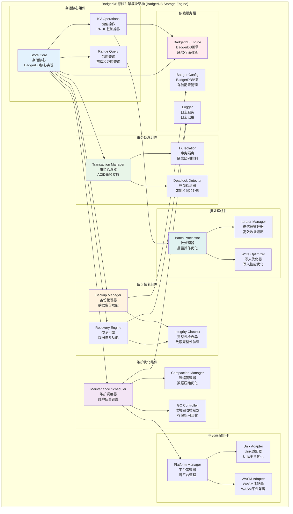

# BadgerDB存储引擎模块 (BadgerDB Storage Engine Module)

## 【模块定位】

**BadgerDB存储引擎模块**是WES区块链系统的高性能持久化存储核心组件，负责提供基于BadgerDB的键值存储服务。作为区块链数据持久化的主要引擎，BadgerDB模块实现了完整的键值存储功能，包括基础CRUD操作、事务处理、批量操作、数据备份恢复、存储维护等企业级特性，为整个区块链系统提供高性能、可靠的数据持久化基础设施。

## 【设计原则】

### 高性能存储原则

- **LSM树架构**: 基于BadgerDB的LSM树结构优化写入性能
- **值分离存储**: 大值存储优化，提高读写效率
- **内存映射**: 高效的内存映射文件访问
- **压缩优化**: 智能数据压缩减少存储空间

### 数据安全原则

- **ACID事务**: 完整的事务支持保证数据一致性
- **数据备份**: 完整的数据备份和恢复机制
- **故障恢复**: 自动故障检测和数据恢复
- **校验机制**: 数据完整性校验和验证

### 跨平台兼容原则

- **多平台支持**: 支持Unix和WASM平台
- **条件编译**: 针对不同平台的优化实现
- **统一接口**: 保证跨平台的接口一致性
- **性能调优**: 平台特定的性能优化

## 【核心职责】

### 键值存储服务

- 提供高性能的键值存储基础操作
- 支持范围查询和前缀匹配
- 实现高效的迭代器遍历机制
- 提供键值对的批量操作优化

### 事务处理服务

- 实现ACID特性的事务支持
- 提供读写事务的隔离级别控制
- 支持事务的提交和回滚操作
- 实现事务的超时和死锁检测

### 数据备份服务

- 提供完整的数据库备份功能
- 支持增量备份和全量备份
- 实现备份数据的压缩和加密
- 提供备份状态的监控和管理

### 数据恢复服务

- 实现从备份文件的数据恢复
- 支持数据库损坏的自动修复
- 提供数据一致性验证功能
- 实现恢复过程的进度监控

### 存储维护服务

- 提供数据库的压缩和垃圾回收
- 实现存储空间的优化管理
- 支持数据库的健康检查
- 提供维护任务的自动调度

## 【架构组件】



## 【目录结构说明】

```text
badger/
├── store.go                    # 存储核心实现 - BadgerDB主要功能实现
├── transaction.go              # 事务处理实现 - ACID事务支持
├── backup.go                   # 备份功能实现 - 数据备份管理
├── recovery.go                 # 恢复功能实现 - 数据恢复管理
├── maintenance.go              # 维护功能实现 - 存储维护和优化
├── maintenance_unix.go         # Unix平台维护实现 - Unix特定优化
├── maintenance_wasm.go         # WASM平台维护实现 - WASM兼容性
├── backup_test.go              # 备份功能测试 - 备份功能单元测试
├── recovery_test.go            # 恢复功能测试 - 恢复功能单元测试
├── store_test.go               # 存储功能测试 - 核心功能单元测试
├── transaction_test.go         # 事务功能测试 - 事务功能单元测试
└── README.md                   # 本文档 - BadgerDB模块详细说明
```

## 【依赖关系】

### 上层调用依赖

- **internal/core/infrastructure/storage**: 存储基础设施主模块
- **internal/core/blockchain**: 区块链核心模块 - 区块数据存储
- **internal/core/consensus**: 共识机制模块 - 共识状态存储
- **internal/core/mempool**: 内存池模块 - 交易数据存储

### 平级服务依赖

- **storage/memory**: 内存存储模块 - 缓存协同
- **storage/provider**: 存储提供者 - 统一管理

### 外部库依赖

- **github.com/dgraph-io/badger/v3**: BadgerDB高性能键值存储库
- **crypto/sha256**: SHA256哈希算法
- **encoding/json**: JSON序列化支持
- **compress/gzip**: 数据压缩支持

### Go标准库依赖

- **context**: 上下文管理和超时控制
- **sync**: 并发控制和锁机制
- **os**: 文件系统操作
- **path/filepath**: 路径处理
- **time**: 时间处理和定时器

## 【系统特性】

### BadgerDB核心特性

- **LSM树架构**: 基于LSM树的高性能写入优化
- **值分离存储**: 大值和小值分离存储提高性能
- **MVCC支持**: 多版本并发控制支持快照读取
- **压缩算法**: 支持多种压缩算法减少存储空间

### 事务处理特性

- **ACID支持**: 完整的原子性、一致性、隔离性、持久性
- **读写事务**: 支持只读和读写事务
- **隔离级别**: 支持快照隔离级别
- **死锁检测**: 自动死锁检测和处理

### 备份恢复特性

- **在线备份**: 支持在线热备份，不影响正常服务
- **增量备份**: 支持增量备份减少备份时间和空间
- **压缩备份**: 备份文件自动压缩节省存储空间
- **完整性验证**: 备份和恢复过程的数据完整性验证

### 维护优化特性

- **自动压缩**: 自动LSM树压缩优化性能
- **垃圾回收**: 自动垃圾回收释放存储空间
- **健康检查**: 定期数据库健康检查
- **性能监控**: 完整的性能指标收集和监控

### 跨平台特性

- **Unix优化**: 针对Unix系统的性能优化
- **WASM兼容**: 完整的WebAssembly平台支持
- **条件编译**: 平台特定的编译优化
- **统一接口**: 跨平台的一致接口体验

## 【配置管理】

### BadgerDB基础配置

```yaml
storage:
  badger:
    # 基础路径配置
    path: "./data/badger"           # 数据存储路径
    value_dir: ""                   # 值目录(空表示与path相同)
    
    # 性能配置
    value_log_file_size: 1073741824 # 值日志文件大小(1GB)
    value_threshold: 32             # 值阈值(字节)
    mem_table_size: 67108864        # 内存表大小(64MB)
    base_table_size: 2097152        # 基础表大小(2MB)
    base_level_size: 10485760       # 基础级别大小(10MB)
    level_size_multiplier: 10       # 级别大小乘数
    
    # 同步和一致性
    sync_writes: true               # 同步写入
    read_only: false                # 只读模式
    in_memory: false                # 内存模式
    
    # 压缩配置
    compression_type: "snappy"      # 压缩类型: none, snappy, zstd
    compress_tables: true           # 压缩表
    z_std_compression_level: 1      # Zstd压缩级别
```

### 事务配置

```yaml
storage:
  badger:
    transaction:
      # 事务超时配置
      max_batch_count: 100          # 最大批处理数量
      max_batch_size: 104857600     # 最大批处理大小(100MB)
      
      # 检测配置
      detect_conflicts: true        # 检测写冲突
      manage_txns: true             # 管理事务
      
      # 超时配置
      read_timeout: "10s"           # 读取超时
      write_timeout: "30s"          # 写入超时
      transaction_timeout: "1m"     # 事务超时
```

### 备份配置

```yaml
storage:
  badger:
    backup:
      # 备份策略
      enabled: true                 # 启用备份
      auto_backup: true             # 自动备份
      backup_interval: "24h"        # 备份间隔
      
      # 备份存储
      backup_dir: "./backups"       # 备份目录
      compress_backup: true         # 压缩备份
      encryption_enabled: false     # 备份加密
      
      # 保留策略
      retention_days: 30            # 保留天数
      max_backup_files: 10          # 最大备份文件数
      cleanup_interval: "6h"        # 清理间隔
```

### 维护配置

```yaml
storage:
  badger:
    maintenance:
      # 压缩配置
      auto_compaction: true         # 自动压缩
      compaction_interval: "1h"     # 压缩间隔
      num_compaction_workers: 2     # 压缩工作协程数
      
      # 垃圾回收
      gc_enabled: true              # 启用垃圾回收
      gc_interval: "30m"            # 垃圾回收间隔
      gc_threshold: 0.7             # 垃圾回收阈值
      
      # 健康检查
      health_check_enabled: true    # 启用健康检查
      health_check_interval: "10m"  # 健康检查间隔
      
      # 性能监控
      metrics_enabled: true         # 启用性能指标
      metrics_interval: "1m"        # 指标收集间隔
```

## 【外部接口】

### 基础存储接口

- **BasicOperations**: 基础操作
  - `Put(ctx context.Context, key []byte, value []byte) error`
  - `Get(ctx context.Context, key []byte) ([]byte, error)`
  - `Has(ctx context.Context, key []byte) (bool, error)`
  - `Delete(ctx context.Context, key []byte) error`

### 批处理接口

- **BatchOperations**: 批处理操作
  - `BatchBegin() KVBatch`
  - `BatchPut(batch KVBatch, key, value []byte) error`
  - `BatchDelete(batch KVBatch, key []byte) error`
  - `BatchWrite(batch KVBatch) error`

### 事务接口

- **TransactionOperations**: 事务操作
  - `Transaction(ctx context.Context, readOnly bool) (Transaction, error)`
  - `TxPut(tx Transaction, key []byte, value []byte) error`
  - `TxGet(tx Transaction, key []byte) ([]byte, error)`
  - `TxDelete(tx Transaction, key []byte) error`
  - `TxCommit(tx Transaction) error`
  - `TxRollback(tx Transaction)`

### 查询接口

- **QueryOperations**: 查询操作
  - `Iterate(ctx context.Context, prefix []byte) Iterator`
  - `Range(ctx context.Context, start, end []byte, reverse bool) Iterator`
  - `Count(ctx context.Context, prefix []byte) (int64, error)`
  - `Size(ctx context.Context) (int64, error)`

### 备份恢复接口

- **BackupRecovery**: 备份恢复
  - `Backup(ctx context.Context, backupPath string) error`
  - `Restore(ctx context.Context, backupPath string) error`
  - `GetBackupStatus(backupID string) (*BackupStatus, error)`
  - `ListBackups() ([]*BackupInfo, error)`

### 维护管理接口

- **MaintenanceOperations**: 维护操作
  - `Compact(ctx context.Context) error`
  - `GarbageCollect(ctx context.Context) error`
  - `HealthCheck(ctx context.Context) (*HealthStatus, error)`
  - `GetMetrics() (*StorageMetrics, error)`

## 【相关文档】

- **存储基础设施**: `internal/core/infrastructure/storage/README.md`
- **内存存储**: `internal/core/infrastructure/storage/memory/README.md`
- **存储接口**: `pkg/interfaces/infrastructure/storage/README.md`
- **BadgerDB配置**: `internal/config/storage/badger/README.md`
- **日志基础设施**: `internal/core/infrastructure/log/README.md`

## 【使用策略】

### 存储策略

- **键设计**: 使用有意义的前缀和分层键结构
- **值大小**: 根据值大小选择合适的存储策略
- **批量操作**: 大量写入时使用批处理提高性能
- **事务使用**: 需要原子性时使用事务操作

### 性能优化策略

- **预分配**: 合理设置内存表和文件大小
- **压缩策略**: 根据数据特性选择压缩算法
- **并发控制**: 合理使用读写锁和事务隔离
- **监控调优**: 根据性能指标调优配置参数

### 备份策略

- **定期备份**: 制定合理的备份计划
- **增量备份**: 使用增量备份减少备份时间
- **备份验证**: 定期验证备份文件完整性
- **灾难恢复**: 制定完整的灾难恢复计划

### 维护策略

- **定期维护**: 制定定期维护计划
- **性能监控**: 持续监控存储性能指标
- **容量管理**: 定期检查和清理存储空间
- **版本升级**: 定期升级BadgerDB版本

## 【错误处理】

### 存储操作错误

- **ErrKeyNotFound**: 键不存在
- **ErrRetry**: 操作需要重试
- **ErrConflict**: 写入冲突
- **ErrReadOnlyTxn**: 只读事务写入错误

### 事务错误

- **ErrTxnTooBig**: 事务过大
- **ErrTxnConflict**: 事务冲突
- **ErrTxnTimeout**: 事务超时
- **ErrTxnDiscarded**: 事务已废弃

### 备份恢复错误

- **ErrBackupFailed**: 备份失败
- **ErrRestoreFailed**: 恢复失败
- **ErrBackupCorrupted**: 备份文件损坏
- **ErrInsufficientSpace**: 空间不足

### 错误恢复机制

- **自动重试**: 对临时性错误实施指数退避重试
- **事务回滚**: 事务失败时自动回滚
- **数据修复**: 检测到数据损坏时自动修复
- **监控告警**: 关键错误的实时监控和告警
