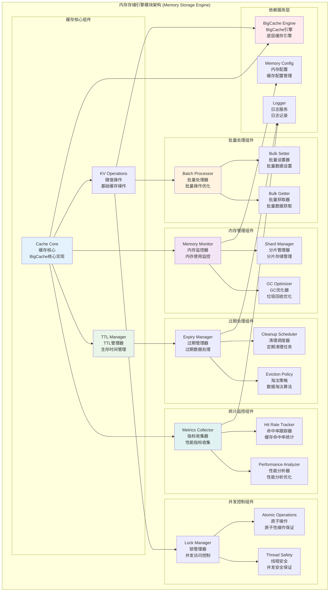

# 内存存储引擎模块 (Memory Storage Engine Module)

## 【模块定位】

**内存存储引擎模块**是WES区块链系统的高性能内存缓存核心组件，负责提供基于BigCache的内存存储服务。作为区块链系统热点数据缓存和临时存储的关键引擎，内存存储模块实现了完整的缓存功能，包括TTL管理、键值操作、批量处理、内存优化等高性能特性，为整个区块链系统提供快速、高效的内存级数据访问服务。

## 【设计原则】

### 高性能缓存原则

- **零拷贝设计**: 基于BigCache的零拷贝内存访问
- **分片存储**: 多分片并行访问减少锁竞争
- **LRU淘汰**: 基于访问时间的智能数据淘汰
- **内存友好**: 高效的内存使用和垃圾回收优化

### TTL生命周期原则

- **灵活TTL**: 支持键级别的生存时间管理
- **自动过期**: 自动清理过期数据释放内存
- **TTL更新**: 支持动态更新键的生存时间
- **过期回调**: 提供数据过期的事件通知

### 并发安全原则

- **读写安全**: 完全线程安全的并发读写操作
- **锁优化**: 细粒度锁减少并发冲突
- **原子操作**: 关键操作的原子性保证
- **无阻塞读**: 读操作无锁化设计

## 【核心职责】

### 缓存存储服务

- 提供高性能的键值缓存存储
- 支持字符串键和二进制值存储
- 实现快速的数据读写访问
- 提供缓存命中率统计和监控

### TTL生命周期管理

- 实现键级别的生存时间控制
- 支持TTL的设置、更新和查询
- 自动清理过期数据释放内存
- 提供过期事件的通知机制

### 批量操作服务

- 支持批量键值对的设置操作
- 实现批量键的查询和删除
- 提供批量操作的原子性保证
- 优化批量操作的性能表现

### 内存管理服务

- 实现智能的内存使用监控
- 提供内存使用量的实时统计
- 支持内存限制和自动清理
- 实现内存碎片的优化管理

### 缓存统计服务

- 收集缓存命中率统计信息
- 提供缓存性能指标监控
- 实现缓存使用模式分析
- 支持缓存性能调优建议

## 【架构组件】



## 【目录结构说明】

```text
memory/
├── store.go                    # 内存存储核心实现 - BigCache主要功能实现
├── example.go                  # 使用示例 - 内存存储使用演示
├── store_test.go               # 存储功能测试 - 完整的单元测试套件
└── README.md                   # 本文档 - 内存存储模块详细说明
```

## 【依赖关系】

### 上层调用依赖

- **internal/core/infrastructure/storage**: 存储基础设施主模块
- **internal/core/blockchain**: 区块链核心模块 - 热点数据缓存
- **internal/core/consensus**: 共识机制模块 - 状态缓存
- **internal/core/mempool**: 内存池模块 - 交易缓存

### 平级服务依赖

- **storage/badger**: BadgerDB存储模块 - 持久化协同
- **storage/provider**: 存储提供者 - 统一管理

### 外部库依赖

- **github.com/allegro/bigcache/v3**: BigCache高性能内存缓存库
- **encoding/binary**: 二进制编码支持
- **strings**: 字符串处理

### Go标准库依赖

- **context**: 上下文管理和超时控制
- **sync**: 并发控制和读写锁
- **time**: 时间处理和TTL管理
- **fmt**: 格式化和错误处理

## 【系统特性】

### BigCache核心特性

- **零拷贝**: 基于零拷贝的高性能内存访问
- **分片存储**: 多分片并行访问减少锁竞争
- **无指针**: 避免GC压力的无指针设计
- **高并发**: 支持高并发读写操作

### TTL生命周期特性

- **键级TTL**: 每个键独立的生存时间管理
- **动态更新**: 支持运行时更新TTL值
- **自动过期**: 自动清理过期数据
- **TTL查询**: 查询剩余生存时间

### 内存管理特性

- **内存监控**: 实时监控内存使用情况
- **智能清理**: 基于LRU的智能数据清理
- **分片管理**: 多分片存储优化内存访问
- **碎片控制**: 有效控制内存碎片

### 性能优化特性

- **批量操作**: 高效的批量读写操作
- **并发优化**: 细粒度锁优化并发性能
- **缓存预热**: 支持缓存数据预热
- **命中率优化**: 智能的缓存命中率优化

## 【配置管理】

### BigCache基础配置

```yaml
storage:
  memory:
    # 生命周期配置
    life_window: "10m"              # 生命周期窗口
    clean_window: "5m"              # 清理窗口
    
    # 容量配置
    max_entries_in_window: 1000000  # 窗口内最大条目数
    max_entry_size: 500             # 最大条目大小(字节)
    hard_max_cache_size: 0          # 硬最大缓存大小(0=无限制)
    
    # 分片配置
    shards: 1024                    # 分片数量
    hash_function: "fnv"            # 哈希函数: fnv, crc32
    
    # 性能配置
    verbose: false                  # 详细日志
    logger_enabled: true            # 启用日志记录
```

### TTL管理配置

```yaml
storage:
  memory:
    ttl:
      # TTL策略
      default_ttl: "1h"             # 默认TTL
      max_ttl: "24h"                # 最大TTL
      min_ttl: "1m"                 # 最小TTL
      
      # 清理策略
      cleanup_interval: "5m"        # TTL清理间隔
      batch_cleanup_size: 1000      # 批量清理大小
      
      # TTL存储
      ttl_precision: "second"       # TTL精度: second, minute
      store_creation_time: true     # 存储创建时间
```

### 性能优化配置

```yaml
storage:
  memory:
    performance:
      # 并发配置
      max_concurrent_readers: 100   # 最大并发读取数
      max_concurrent_writers: 10    # 最大并发写入数
      lock_timeout: "1s"            # 锁超时时间
      
      # 批处理配置
      batch_size: 100               # 批处理大小
      batch_timeout: "10ms"         # 批处理超时
      enable_batch_optimization: true # 启用批处理优化
      
      # 内存优化
      gc_percent: 100               # GC触发百分比
      memory_limit: "1GB"           # 内存限制
      enable_memory_stats: true     # 启用内存统计
```

### 监控统计配置

```yaml
storage:
  memory:
    monitoring:
      # 指标收集
      enable_metrics: true          # 启用指标收集
      metrics_interval: "30s"       # 指标收集间隔
      export_metrics: true          # 导出指标
      
      # 统计配置
      track_hit_rate: true          # 跟踪命中率
      track_memory_usage: true      # 跟踪内存使用
      track_operation_latency: true # 跟踪操作延迟
      
      # 告警配置
      hit_rate_threshold: 0.8       # 命中率告警阈值
      memory_usage_threshold: 0.9   # 内存使用告警阈值
      latency_threshold: "1ms"      # 延迟告警阈值
```

## 【外部接口】

### 基础缓存接口

- **BasicCacheOperations**: 基础缓存操作
  - `Set(ctx context.Context, key string, value []byte, ttl time.Duration) error`
  - `Get(ctx context.Context, key string) ([]byte, bool, error)`
  - `Delete(ctx context.Context, key string) error`
  - `Has(ctx context.Context, key string) (bool, error)`

### TTL管理接口

- **TTLOperations**: TTL操作
  - `GetTTL(ctx context.Context, key string) (time.Duration, error)`
  - `UpdateTTL(ctx context.Context, key string, ttl time.Duration) error`
  - `SetWithTTL(ctx context.Context, key string, value []byte, ttl time.Duration) error`
  - `GetExpiration(ctx context.Context, key string) (time.Time, error)`

### 批量操作接口

- **BatchOperations**: 批量操作
  - `SetMany(ctx context.Context, items map[string][]byte, ttl time.Duration) error`
  - `GetMany(ctx context.Context, keys []string) (map[string][]byte, error)`
  - `DeleteMany(ctx context.Context, keys []string) error`
  - `HasMany(ctx context.Context, keys []string) (map[string]bool, error)`

### 缓存管理接口

- **CacheManagement**: 缓存管理
  - `Clear(ctx context.Context) error`
  - `Size() int`
  - `Capacity() int`
  - `Close() error`

### 统计监控接口

- **StatisticsMonitoring**: 统计监控
  - `GetStats() *CacheStats`
  - `GetHitRate() float64`
  - `GetMemoryUsage() *MemoryStats`
  - `ResetStats()`

### 模式匹配接口

- **PatternMatching**: 模式匹配
  - `Keys(ctx context.Context, pattern string) ([]string, error)`
  - `DeleteByPattern(ctx context.Context, pattern string) (int, error)`
  - `CountByPattern(ctx context.Context, pattern string) (int, error)`

## 【相关文档】

- **存储基础设施**: `internal/core/infrastructure/storage/README.md`
- **BadgerDB存储**: `internal/core/infrastructure/storage/badger/README.md`
- **存储接口**: `pkg/interfaces/infrastructure/storage/README.md`
- **内存配置**: `internal/config/storage/memory/README.md`
- **日志基础设施**: `internal/core/infrastructure/log/README.md`

## 【使用策略】

### 缓存策略

- **热点数据**: 优先缓存访问频繁的热点数据
- **TTL设置**: 根据数据特性设置合理的TTL
- **批量操作**: 大量数据操作时使用批量接口
- **内存控制**: 合理控制缓存大小避免内存溢出

### 性能优化策略

- **分片配置**: 根据并发量调整分片数量
- **TTL管理**: 合理设置TTL避免内存泄露
- **批量操作**: 使用批量操作提高吞吐量
- **监控调优**: 根据性能指标调优配置

### 并发使用策略

- **读写分离**: 读多写少场景的优化使用
- **锁优化**: 避免长时间持有锁
- **原子操作**: 需要原子性时使用事务操作
- **并发控制**: 合理控制并发访问数量

### 内存管理策略

- **容量规划**: 根据业务需求规划缓存容量
- **清理策略**: 制定合理的数据清理策略
- **监控告警**: 设置内存使用监控告警
- **优雅降级**: 内存不足时的优雅降级策略

## 【错误处理】

### 缓存操作错误

- **ErrKeyNotFound**: 键不存在
- **ErrCacheFull**: 缓存已满
- **ErrEntryTooLarge**: 条目过大
- **ErrCacheClosed**: 缓存已关闭

### TTL管理错误

- **ErrInvalidTTL**: 无效的TTL值
- **ErrTTLExpired**: TTL已过期
- **ErrTTLNotSet**: TTL未设置
- **ErrTTLUpdateFailed**: TTL更新失败

### 内存管理错误

- **ErrMemoryExhausted**: 内存耗尽
- **ErrMemoryFragmentation**: 内存碎片过多
- **ErrShardOverflow**: 分片溢出
- **ErrGCPressure**: GC压力过大

### 错误恢复机制

- **自动清理**: 内存不足时自动清理过期数据
- **降级处理**: 缓存失败时降级到数据库查询
- **重试机制**: 对临时性错误实施智能重试
- **监控告警**: 关键错误的实时监控和告警
