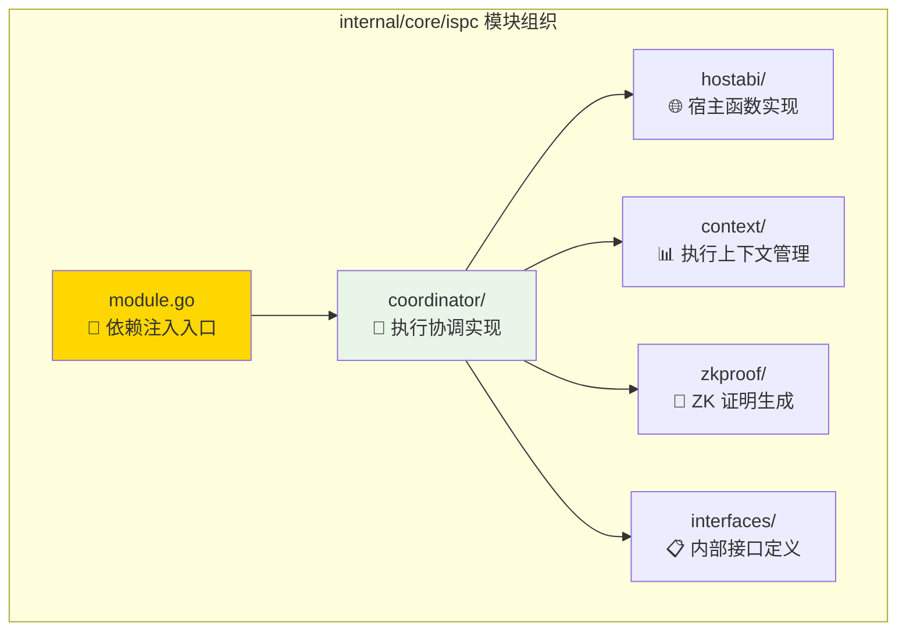
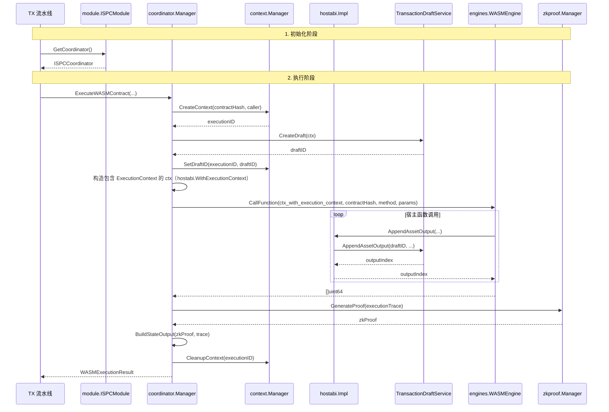
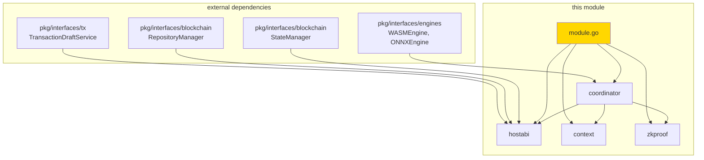

# ISPC 协调器实现（internal/core/ispc）

> **📌 模块类型**：`[X] 实现模块`

---

## 📍 模块定位

本模块是 **ISPC 协调器**的**核心实现层**，实现 `pkg/interfaces/ispc.ISPCCoordinator` 接口。

**解决什么问题**：
- 实现 WASM/ONNX 执行协调
- 实现零知识证明生成
- 实现执行上下文管理
- 提供宿主函数实现（通过 hostabi 子模块）

**不解决什么问题**（边界）：
- ❌ 不实现执行引擎（委托给 engines 层）
- ❌ 不实现交易构建（委托给 TX 层）
- ❌ 不实现区块链存储（委托给 blockchain 层）
- ❌ 不实现密码学算法（委托给 crypto 层）

---

## 🎯 设计原则与核心约束

### 设计原则

| 原则 | 说明 | 价值 |
|------|------|------|
| **薄层实现** | 管理器只做协调，不做具体业务 | 代码简洁，易于维护 |
| **委托优先** | 能委托就不自己实现 | 复用现有能力，避免重复 |
| **接口驱动** | 依赖接口而非实现 | 易于测试和替换 |
| **上下文隔离** | 每个执行独立的上下文 | 避免状态污染 |

### 核心约束

**严格遵守**：
- ✅ 必须实现 `pkg/interfaces/ispc.ISPCCoordinator` 接口
- ✅ StateOutput.ZKProof 必须非 nil
- ✅ 执行完成后必须清理 ExecutionContext
- ✅ 宿主函数必须委托 TransactionDraftService

**严格禁止**：
- ❌ 不得直接构建 Transaction
- ❌ 不得直接实现执行引擎
- ❌ 不得暴露 internal 接口给 pkg
- ❌ 不得在 hostabi 中直接操作 TransactionDraft

---

## 🏗️ 架构设计

### 内部结构



### 层次说明

| 组件 | 核心职责 | 关键机制 | 约束 |
|------|---------|---------|------|
| module.go | 依赖注入和模块初始化 | 组装所有组件 | 只做组装，不做逻辑 |
| coordinator | 实现 ISPCCoordinator 接口 | 委托引擎执行 + ZK 证明 | 不直接构建交易 |
| hostabi | 实现宿主函数业务逻辑 | 委托 TransactionDraftService | 不暴露给 pkg |
| context | 管理执行上下文 | 线程安全的上下文存储 | 执行完成后清理 |
| zkproof | 生成和验证 ZK 证明 | ExecutionTrace → ZKProof | 证明失败则拒绝执行 |
| interfaces | 内部接口定义 | 继承 pkg 接口并扩展 | 仅供 internal 使用 |

### 完整执行流程



---

## 🔗 依赖与协作

### 依赖关系图



### 依赖说明

| 依赖模块 | 依赖接口 | 用途 | 约束条件 |
|---------|---------|------|---------|
| pkg/interfaces/engines | WASMEngine, ONNXEngine | 执行 WASM/ONNX | 必须先注册宿主函数 |
| pkg/interfaces/tx | TransactionDraftService | 构建交易草稿 | 由 hostabi 使用 |
| pkg/interfaces/blockchain | RepositoryManager, StateManager | 查询链上状态 | 只读查询 |
| internal/core/ispc/interfaces | 内部接口 | 内部组件通信 | 仅供 internal 使用 |

### 依赖注入

当前实现通过 Fx 模块在 `module.go` 中完成依赖注入与组件组装：

```go
// 简化示例，完整实现见 internal/core/ispc/module.go
app := fx.New(
    execution.Module(), // ISPC 执行模块
    // 其他模块：crypto、storage、tx、persistence、ures 等
)
```

在 Fx 组装中：
- `hostabi.HostFunctionProvider` 由 ISPC 模块内部创建，并通过 `interfaces.HostFunctionProvider` 接口视图注入给 WASM/ONNX 引擎与 `coordinator.Manager`。
- `coordinator.Manager` 依赖 `InternalEngineManager` 与 `HostFunctionProvider` 接口，具体实现仅在 `module.go` 中可见，保持实现与协作方解耦。

---

## 📊 核心机制

### 机制1：执行协调

**为什么需要**：统一 WASM/ONNX 的执行流程

**核心思路**：
1. 创建 ExecutionContext
2. 创建 TransactionDraft
3. 注入宿主函数
4. 调用引擎执行
5. 生成 ZK 证明
6. 构建 StateOutput
7. 清理执行上下文

**关键约束**：
- 每个执行必须有独立的 ExecutionContext
- ExecutionContext 必须绑定 DraftID
- 执行完成后必须清理上下文（成功或失败）

**设计权衡**：

| 方案 | 优势 | 劣势 | 为什么选择 |
|------|------|------|-----------|
| 当前方案（独立上下文） | 隔离性好，无状态污染 | 内存开销稍大 | 安全性更重要 |
| 备选方案（共享上下文） | 内存开销小 | 容易状态污染 | 不安全 |

### 机制2：宿主函数注入

**为什么需要**：让合约能够访问区块链能力

**核心思路**：
1. 创建 HostABI 实例
2. 绑定 ExecutionContext
3. 获取宿主函数映射
4. 通过引擎注册接口注入
5. 合约调用时回调 HostABI

**实现细节**：

```go
// coordinator/execute_contract.go
func (m *Manager) ExecuteWASMContract(
    ctx context.Context,
    contractHash []byte,
    methodName string,
    params []uint64,
    initParams []byte,
    callerAddress string,
) (*WASMExecutionResult, error) {
    // 1. 创建执行上下文
    execCtx, err := m.contextMgr.CreateContext(contractHash, callerAddress)
    if err != nil {
        return nil, err
    }
    defer m.contextMgr.CleanupContext(execCtx.ID)
    
    // 2. 创建交易草稿
    draftID, err := m.draftService.CreateDraft(ctx)
    if err != nil {
        return nil, err
    }
    execCtx.SetDraftID(draftID)
    
    // 3. 注入宿主函数
    m.hostabiImpl.SetExecutionContext(execCtx)
    hostFunctions, err := m.hostabiImpl.GetWASMHostFunctions(ctx, execCtx.ID)
    if err != nil {
        return nil, err
    }
    
    if err := m.wasmEngine.RegisterHostFunctions(hostFunctions); err != nil {
        return nil, err
    }
    
    // 4. 执行 WASM
    results, err := m.wasmEngine.CallFunction(ctx, 
        string(contractHash), methodName, params)
    if err != nil {
        return nil, err
    }
    
    // 5. 生成 ZK 证明
    zkProof, err := m.zkproofMgr.GenerateProof(execCtx.GetExecutionTrace())
    if err != nil {
        return nil, err
    }
    
    // 6. 构建 StateOutput
    stateOutput := m.buildStateOutput(zkProof, execCtx)
    
    // 7. 返回执行产物
    return &WASMExecutionResult{
        ReturnValues:     results,
        StateOutput:      stateOutput,
        ExecutionContext: execCtx.GetMetadata(),
    }, nil
}
```

### 机制3：ExecutionContext 管理

**为什么需要**：隔离不同执行的状态

**核心思路**：
- 每个执行创建独立 Context
- Context 包含 DraftID、调用者信息、ExecutionTrace
- 执行完成后清理 Context

**数据结构**：

```go
// context/context.go
type ExecutionContext struct {
    ID              string
    ContractHash    []byte
    CallerAddress   string
    DraftID         tx.DraftID
    ExecutionTrace  []TraceEntry
    StartTime       time.Time
    Metadata        map[string]interface{}
    mu              sync.RWMutex
}

type Manager struct {
    contexts map[string]*ExecutionContext
    mu       sync.RWMutex
}

func (m *Manager) CreateContext(contractHash []byte, caller string) (*ExecutionContext, error) {
    m.mu.Lock()
    defer m.mu.Unlock()
    
    id := generateContextID()
    ctx := &ExecutionContext{
        ID:            id,
        ContractHash:  contractHash,
        CallerAddress: caller,
        ExecutionTrace: make([]TraceEntry, 0),
        StartTime:     time.Now(),
        Metadata:      make(map[string]interface{}),
    }
    
    m.contexts[id] = ctx
    return ctx, nil
}

func (m *Manager) CleanupContext(id string) {
    m.mu.Lock()
    defer m.mu.Unlock()
    delete(m.contexts, id)
}
```

---

## 📁 目录结构

```
internal/core/ispc/
├── module.go              # 模块入口 | 依赖注入
├── coordinator/           # 执行协调实现 | 实现 ISPCCoordinator
│   ├── manager.go        # 协调器管理器
│   ├── execute_contract.go # WASM 执行实现
│   ├── execute_model.go  # ONNX 执行实现
│   ├── keys.go           # 常量和键定义
│   ├── errors.go         # 错误定义
│   └── README.md         # 协调器文档
├── hostabi/               # 宿主函数实现 | 实现 HostABI
│   ├── host_abi_impl.go  # HostABI 实现
│   ├── ports_*.go        # 各类端口实现
│   ├── adapter/          # 适配器层
│   ├── errors.go         # 错误定义
│   └── README.md         # HostABI 文档
├── context/               # 执行上下文管理
│   ├── manager.go        # 上下文管理器
│   ├── internal_ops.go   # 内部操作
│   ├── errors.go         # 错误定义
│   └── README.md         # 上下文文档
├── zkproof/               # ZK 证明生成
│   ├── manager.go        # 证明管理器
│   ├── prover.go         # 证明器实现
│   ├── validator.go      # 验证器实现
│   ├── circuits.go       # 电路定义
│   ├── errors.go         # 错误定义
│   └── README.md         # ZK 证明文档
├── interfaces/            # 内部接口定义
│   ├── coordinator.go    # 协调器内部接口
│   ├── context.go        # 上下文内部接口
│   ├── hostabi.go        # HostABI 内部接口
│   ├── zkproof.go        # ZK 证明内部接口
│   └── README.md         # 接口文档
└── README.md              # 本文档
```

### 组织原则

| 文件/目录 | 职责 | 为什么这样组织 |
|----------|------|---------------|
| module.go | 依赖注入入口 | 集中管理所有组件初始化 |
| coordinator | 执行协调 | 实现 ISPCCoordinator 接口 |
| hostabi | 宿主函数 | 为合约提供区块链能力 |
| context | 上下文管理 | 隔离不同执行的状态 |
| zkproof | ZK 证明 | 生成和验证零知识证明 |
| interfaces | 内部接口 | 定义组件间通信契约 |

---

## ⚠️ 已知限制

| 限制 | 影响 | 规避方法 | 未来计划 |
|------|------|---------|---------|
| ExecutionContext 内存占用 | 大量并发执行时内存压力 | 限制并发数，及时清理 | 优化上下文存储 |
| ZK 证明生成慢 | 复杂合约证明时间长 | 使用更高效的证明系统 | 支持异步证明生成 |
| 宿主函数性能开销 | 频繁调用影响性能 | 减少宿主函数调用 | 优化调用机制 |

---

## 🔍 设计权衡记录

### 权衡1：为什么需要 ExecutionContext？

**背景**：需要在执行过程中传递上下文信息

**备选方案**：
1. 方案A：使用 ExecutionContext - 优势：状态隔离，线程安全 - 劣势：内存开销
2. 方案B：使用 context.Context - 优势：标准库，轻量 - 劣势：不支持复杂状态

**选择**：选择了方案A

**理由**：
- ✅ 需要存储 DraftID、ExecutionTrace 等复杂状态
- ✅ 需要线程安全的状态管理
- ✅ 需要执行完成后清理资源

**代价**：内存开销稍大

### 权衡2：为什么 hostabi 不直接构建 TransactionDraft？

**背景**：宿主函数需要操作交易草稿

**备选方案**：
1. 方案A：委托 DraftService - 优势：职责清晰，复用性高 - 劣势：多一层调用
2. 方案B：直接构建 - 优势：性能稍好 - 劣势：违反职责单一，难以测试

**选择**：选择了方案A

**理由**：
- ✅ 职责清晰：hostabi 只负责宿主函数逻辑
- ✅ 复用性高：DraftService 可被其他模块使用
- ✅ 易于测试：DraftService 可独立测试

**代价**：多一层调用开销（约 0.1ms）

---

## 🌐 平台支持

### 引擎支持矩阵

**核心原则**：区块链核心功能（WASM、交易、共识等）在所有平台都可用，ONNX AI 推理功能仅在支持的平台上可用。

| 操作系统 | 架构 | GOOS/GOARCH | WASM 引擎 | ONNX 引擎 | 说明 |
|---------|------|-------------|-----------|-----------|------|
| **macOS** | Intel/Apple Silicon | `darwin/amd64`, `darwin/arm64` | ✅ | ✅ | 完全支持 |
| **Linux** | x86_32/x86_64/ARM/PPC/RISC-V/S390X | `linux/*` | ✅ | ✅* | 所有架构支持 |
| **Windows** | x86_32/x86_64/ARM/ARM64 | `windows/*` | ✅ | ✅* | 所有架构支持 |
| **Android** | ARM32v7/ARM64 | `android/arm`, `android/arm64` | ✅ | ✅* | 支持 |
| **iOS** | ARM64 | `ios/arm64` | ✅ | ✅* | 支持 |
| **BSD** | * | `freebsd/*`, `netbsd/*`, `openbsd/*` | ✅ | ❌ | 仅 WASM |
| **其他** | * | * | ✅ | ❌ | 仅 WASM |

*注：ONNX 引擎支持取决于 ONNX Runtime 官方支持。部分平台需要下载库文件。

### 平台检测与优雅降级

系统在启动时会自动检测当前平台是否支持 ONNX Runtime：

1. **平台检测**：通过 `pkg/build/deps/onnx.IsPlatformSupported()` 检测
2. **优雅降级**：不支持时，ONNX 引擎为 `nil`，但不影响系统启动
3. **日志提示**：会记录警告日志，说明 ONNX AI 功能不可用

**实现位置**：
- 平台检测：`pkg/build/deps/onnx/platform.go`
- 依赖注入：`internal/core/ispc/module.go`（根据平台支持情况创建引擎）
- 引擎管理：`internal/core/ispc/engines/manager.go`（允许 ONNX 引擎为 nil）

**详细文档**：
- [平台支持设计文档](../../../docs/analysis/ONNX_PLATFORM_SUPPORT_DESIGN.md)

---

## 📚 相关文档

- **ISPC 接口定义**：[pkg/interfaces/ispc/README.md](../../pkg/interfaces/ispc/README.md) - 公共接口规范
- **执行引擎接口**：[pkg/interfaces/engines/README.md](../../pkg/interfaces/engines/README.md) - 底层执行能力
- **HostABI 实现**：[internal/core/ispc/hostabi/README.md](hostabi/README.md) - 宿主函数详细说明
- **TX 架构设计**：[_docs/architecture/TX_STATE_MACHINE_ARCHITECTURE.md](../../../_docs/architecture/TX_STATE_MACHINE_ARCHITECTURE.md) - TX 本质和 EUTXO 模型

---

## 📋 文档变更记录

| 日期 | 变更内容 | 原因 |
|------|---------|------|
| 2025-10-22 | 完整重构，明确实现模块定位 | 根据架构串联讨论成果重构 |
| 2025-10-22 | 补充内部组件关系和依赖注入 | 说明实现细节 |
| 2025-10-22 | 补充核心机制说明 | 便于理解实现原理 |

---

> 📝 **文档说明**：本文档遵循 `_docs/templates/README_TEMPLATE.md` v3.0 规范
> 
> 🎯 **核心理念**：少即是多，图胜千言，真实至上
