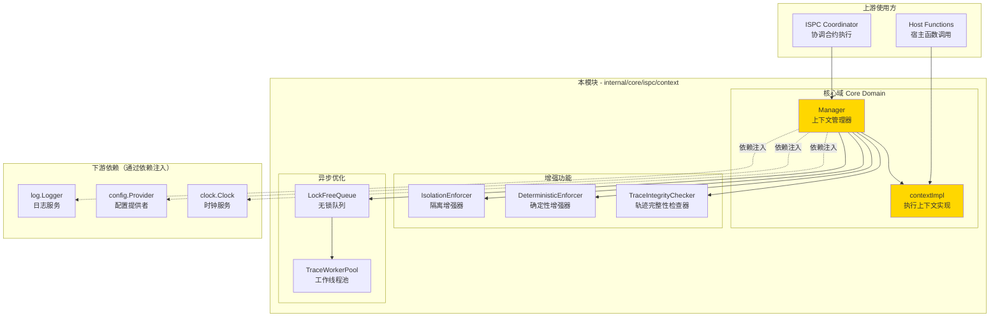
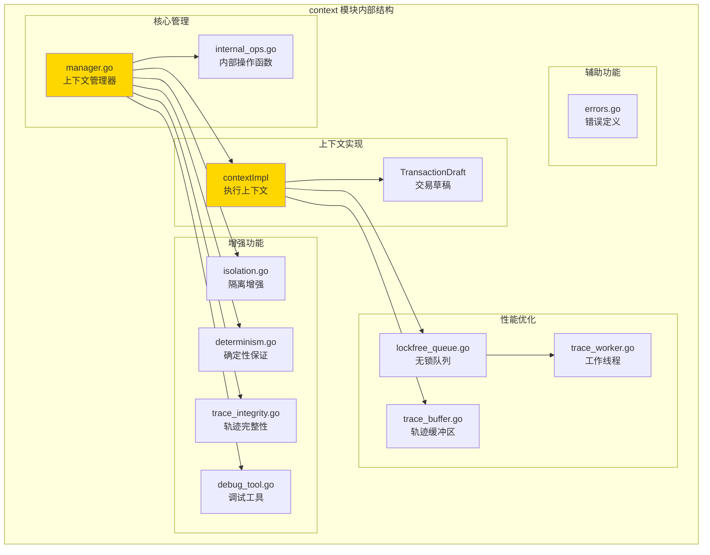
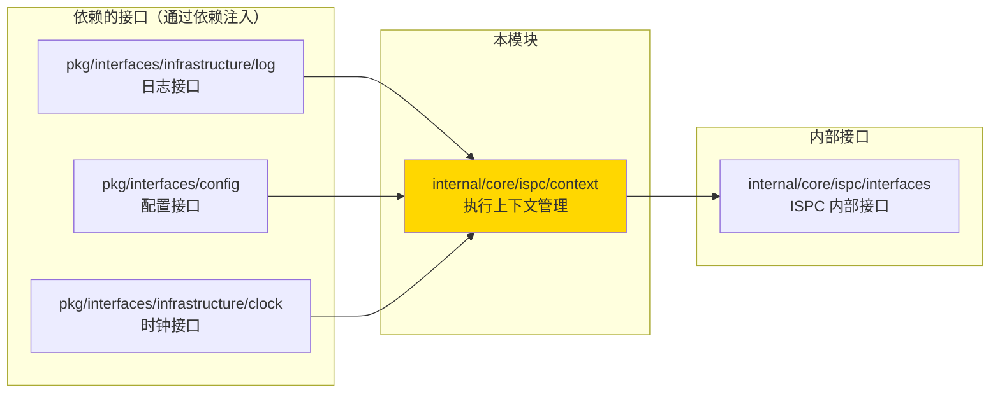
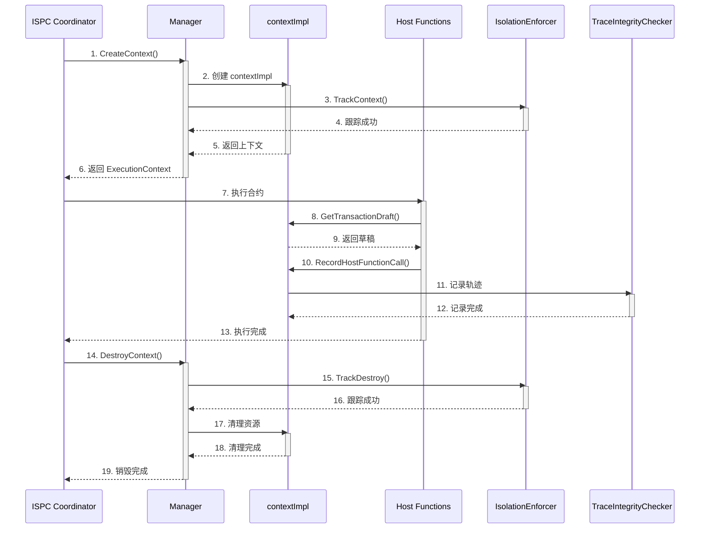

# ExecutionContext 管理 - 实现

---

## 📌 版本信息

- **版本**：2.0
- **状态**：stable
- **最后更新**：2025-11-27
- **最后审核**：2025-11-27
- **所有者**：ISPC 核心团队
- **适用范围**：ISPC 执行上下文生命周期管理和并发隔离机制

---

## 🎯 实现定位

**路径**：`internal/core/ispc/context/`

**目的**：提供 ISPC 执行上下文的完整生命周期管理，确保智能合约执行的安全性和可靠性。

**核心原则**：
- ✅ 实现 `ispcInterfaces.ExecutionContextManager` 和 `ispcInterfaces.ExecutionContext` 接口
- ✅ 通过依赖注入管理基础设施服务（日志、事件总线、存储、配置、时钟）
- ✅ 保持实现与接口分离，遵循 SOLID 原则
- ✅ 确保并发安全和资源隔离

**解决什么问题**：
- 为每次 ISPC 执行创建独立的执行环境
- 管理执行上下文的完整生命周期（创建、使用、清理）
- 确保并发执行之间的完全隔离
- 提供确定性执行保证（固定时间戳、确定性随机数）
- 记录执行轨迹用于 ZK 证明生成

**不解决什么问题**（边界）：
- ❌ 不直接实现业务逻辑（由宿主函数和合约代码实现）
- ❌ 不管理交易草稿的具体内容（由 TransactionDraftService 管理）
- ❌ 不提供链上数据查询（由 HostABI 接口提供）

---

## 🏗️ 架构设计

### 整体架构

> **说明**：展示 ExecutionContext 管理模块的整体架构和与上下游组件的关系



**架构说明**：

| 层级 | 组件 | 职责 | 关键机制 |
|-----|------|------|---------|
| **核心域** | Manager | 上下文生命周期管理、并发安全 | 读写锁保护、定时清理 |
| **核心域** | contextImpl | 执行上下文实现、状态管理 | 单执行单实例、无跨执行共享 |
| **增强功能** | IsolationEnforcer | 上下文隔离验证、泄漏检测 | 跟踪活跃上下文 |
| **增强功能** | DeterministicEnforcer | 确定性执行保证 | 固定时间戳、确定性随机数 |
| **增强功能** | TraceIntegrityChecker | 轨迹完整性验证 | 序列检查、时间戳验证 |
| **异步优化** | LockFreeQueue | 高性能轨迹记录队列 | CAS 操作、无锁设计 |
| **依赖** | 基础设施服务 | 日志、配置、时钟 | 通过依赖注入提供 |

---

### 内部结构

> **说明**：展示 context 模块内部的子模块组织和协作关系



**子域说明**：

| 子域 | 核心组件 | 职责 | 协作关系 |
|-----|---------|------|---------|
| **核心管理** | manager.go, internal_ops.go | 上下文生命周期管理 | Manager 委托给 internal_ops 处理复杂逻辑 |
| **上下文实现** | contextImpl, TransactionDraft | 执行上下文状态管理 | contextImpl 持有 TransactionDraft 引用 |
| **增强功能** | isolation.go, determinism.go, trace_integrity.go, debug_tool.go | 隔离、确定性、完整性、调试 | Manager 组合使用这些增强器 |
| **性能优化** | lockfree_queue.go, trace_worker.go, trace_buffer.go | 异步轨迹记录优化 | 可选启用，默认禁用保持向后兼容 |
| **辅助功能** | errors.go | 错误定义 | 统一错误类型 |

---

### 依赖关系

> **说明**：展示本模块依赖的外部组件接口



**依赖说明**：

| 依赖模块 | 依赖接口 | 用途 | 约束条件 |
|---------|---------|------|---------|
| **基础设施** | `log.Logger` | 日志记录 | 必须提供 |
| **基础设施** | `config.Provider` | 配置读取 | 必须提供 |
| **基础设施** | `clock.Clock` | 确定性时间源 | 必须提供 |
| **内部接口** | `ispcInterfaces.ExecutionContextManager` | 管理器接口 | 实现此接口 |
| **内部接口** | `ispcInterfaces.ExecutionContext` | 上下文接口 | 实现此接口 |

---

### 核心流程

> **说明**：展示执行上下文生命周期管理的时序图



---

## 📋 核心设计原则

### 1. 一次执行一个上下文
- **单一执行原则**：每次合约执行创建独立的 `ExecutionContext` 实例
- **无状态共享**：不同执行之间完全隔离，无状态泄漏
- **确定性保证**：相同输入产生相同输出，无竞态条件

### 2. 生命周期严格管理
- **创建**：执行开始时由 ISPC Coordinator 创建
- **使用**：执行期间通过 context.Context 传递
- **清理**：执行结束后立即清理，释放资源

### 3. 并发安全隔离
- **独立实例**：每个并发执行拥有独立上下文
- **无锁设计**：单个上下文内部无需锁保护（单执行单上下文）
- **资源隔离**：内存、CPU、存储资源完全隔离

---

## 🔄 生命周期阶段

### 阶段1：创建 (Creation)

**时机**：`coordinator.Manager.ExecuteWASMContract` 方法开始时

**操作**：
```go
// 1. 创建基础上下文
executionContext, err := m.contextManager.CreateContext(
    wasmCtx,
    executionID,
    callerAddress,
)

// 2. 注入 HostABI（引擎无关宿主能力接口）
err = executionContext.SetHostABI(hostABI)

// 3. 注入到 context.Context 供 WASM 引擎读取
wasmCtx = context.WithValue(wasmCtx, "execution_context", executionContext)
```

**保证**：
- ✅ 上下文完整初始化
- ✅ HostABI 正确注入
- ✅ 草稿对象已创建并关联

---

### 阶段2：执行 (Execution)

**时机**：WASM 引擎执行合约代码期间

**读取上下文并注入到 ctx**：
```go
// 在 WASM 引擎调用前，将 ExecutionContext 注入到 ctx
if executionCtx := ctx.Value("execution_context"); executionCtx != nil {
    // 通过 hostabi.WithExecutionContext 将执行上下文附加到 ctx
    ctx = hostabi.WithExecutionContext(ctx, executionCtx)
}
// 之后将 ctx 传入 WASM 引擎，宿主函数内部通过 GetExecutionContext(ctx) 读取执行上下文
```

**宿主函数使用**：
```go
// 在 host.StandardInterface 的宿主函数中
func (s *StandardInterface) GetBlockHeight() (uint64, error) {
    ctx := s.GetExecutionContext()
    hostABI := ctx.HostABI()
    height, err := hostABI.GetBlockHeight(context.Background())
    return height, err
}
```

**草稿操作**：
```go
// 写入草稿
hostABI.AppendAssetOutput(ctx, recipient, amount, nil, nil)

// 读取草稿（由 Coordinator 在执行后收集）
draft := executionContext.GetTransactionDraft()
```

**保证**：
- ✅ 上下文状态一致
- ✅ 草稿修改原子性
- ✅ 服务调用线程安全

---

### 阶段3：结束 (Completion)

**时机**：`ExecuteWASMContract` 方法返回前

**操作**：
```go
// 1. 收集执行结果
returnData := executionContext.GetReturnData()
events := executionContext.GetEvents()
draft := executionContext.GetTransactionDraft()

// 2. 构建返回值
result := &execution.ISPCResult{
    Success:         true,
    ReturnData:      returnData,
    Events:          publicEvents,
    TransactionDraft: draft,
}

// 3. 清理（Go GC 自动处理）
// executionContext 离开作用域后被 GC 回收
```

**保证**：
- ✅ 结果完整收集
- ✅ 草稿正确传递
- ✅ 资源自动释放

---

### 阶段4：清理 (Cleanup)

**自动清理机制**：
- **Go GC 管理**：`ExecutionContext` 实例由 Go 垃圾回收器自动回收
- **无需显式释放**：当前实现不需要手动 `Close()` 或 `Dispose()`
- **资源释放顺序**：
  1. `ExecutionContext` 离开 `ExecuteWASMContract` 作用域
  2. `HostABI` 实例不再被引用
  3. Go GC 在下一次垃圾回收周期中释放内存

**显式清理点（未来扩展）**：
```go
// 如果未来需要显式资源管理，可添加：
type ExecutionContext interface {
    // ... existing methods ...
    
    // Close 释放执行上下文持有的资源（可选）
    // 注意：当前实现不需要此方法
    Close() error
}
```

**保证**：
- ✅ 内存不泄漏
- ✅ 无悬挂引用
- ✅ 资源及时回收

---

## 🔒 并发隔离策略

### 并发执行场景

**支持场景**：
- 多个客户端同时调用不同合约
- 同一合约被多个交易并发调用
- 不同高度的区块同时执行交易

**隔离机制**：
```
┌─────────────────────┐    ┌─────────────────────┐    ┌─────────────────────┐
│  执行1: 合约A        │    │  执行2: 合约B        │    │  执行3: 合约A        │
│  ┌───────────────┐  │    │  ┌───────────────┐  │    │  ┌───────────────┐  │
│  │ExecutionCtx1  │  │    │  │ExecutionCtx2  │  │    │  │ExecutionCtx3  │  │
│  │- HostABI1     │  │    │  │- HostABI2     │  │    │  │- HostABI3     │  │
│  │- Draft1       │  │    │  │- Draft2       │  │    │  │- Draft3       │  │
│  └───────────────┘  │    │  └───────────────┘  │    │  └───────────────┘  │
└─────────────────────┘    └─────────────────────┘    └─────────────────────┘
         ↓                          ↓                          ↓
    完全隔离                    完全隔离                    完全隔离
```

---

### 线程安全保证

#### 1. 上下文级别（ExecutionContext）
**设计**：单执行单上下文，无需锁
```go
type contextImpl struct {
    // 无 mutex 锁（单执行单上下文）
    // 因为每个执行拥有独立实例
    txDraft *ispcInterfaces.TransactionDraft
    returnData []byte
    events []*ispcInterfaces.Event
    hostABI ispcInterfaces.HostABI
}
```

**保证**：
- ✅ 单个执行内部无竞态
- ✅ 修改操作无需加锁
- ✅ 读取操作直接访问

#### 2. 管理器级别（Manager）
**设计**：使用读写锁保护 contexts 映射
```go
type Manager struct {
    contexts map[string]ispcInterfaces.ExecutionContext
    mutex    sync.RWMutex  // 读写锁保护
}
```

**保证**：
- ✅ 并发创建/销毁上下文安全
- ✅ 并发读取上下文安全
- ✅ 使用读写锁优化读性能

#### 3. 草稿层级（TransactionDraft）
**设计**：每个上下文拥有独立草稿
```go
// 每个 ExecutionContext 持有独立的 TransactionDraft
// 不同执行的草稿完全隔离
draft1 := ctx1.GetTransactionDraft()  // 独立实例
draft2 := ctx2.GetTransactionDraft()  // 另一个独立实例
```

**保证**：
- ✅ 草稿无跨执行共享
- ✅ 写入操作完全隔离
- ✅ 最终收敛时无冲突

---

## ⚠️ 使用约束

### 1. 禁止跨执行共享上下文
```go
// ❌ 错误：共享上下文
var globalContext ExecutionContext  // 不要这样做！

// ✅ 正确：每次执行创建新上下文
func ExecuteContract(...) {
    ctx := CreateContext(...)  // 独立实例
    defer cleanup(ctx)         // 执行后清理
}
```

### 2. 禁止缓存上下文实例
```go
// ❌ 错误：缓存上下文
var contextPool = sync.Pool{
    New: func() interface{} {
        return &contextImpl{}
    },
}

// ✅ 正确：每次创建新实例
func CreateContext(...) ExecutionContext {
    return &contextImpl{...}  // 总是创建新实例
}
```

### 3. 禁止在上下文外部修改草稿
```go
// ❌ 错误：绕过上下文直接修改
draft := ctx.GetTransactionDraft()
draft.Outputs = append(draft.Outputs, ...)  // 不要直接修改！

// ✅ 正确：通过 HostABI 接口修改
ctx.HostABI().AppendAssetOutput(ctx, recipient, amount, nil, nil)
```

---

## 📊 性能考虑

### 上下文创建开销
- **创建时间**：< 1μs（微秒）
- **内存占用**：~2KB（基础上下文+空草稿）
- **GC 压力**：极低（小对象，快速回收）

### 服务调用开销
- **链读取**：< 1ms（缓存命中）
- **UTXO 查询**：1-5ms（索引查询）
- **草稿写入**：< 100ns（内存操作）

### 并发扩展性
- **支持并发数**：1000+ 并发执行
- **隔离开销**：近乎零（独立实例）
- **资源限制**：仅受内存和 CPU 限制

---

## 🧪 测试策略

### 单元测试
```go
func TestContextLifecycle(t *testing.T) {
    // 1. 创建
    ctx := CreateContext(...)
    assert.NotNil(t, ctx)
    
    // 2. 使用
    ctx.HostABI().GetBlockHeight(...)
    
    // 3. 验证
    draft := ctx.GetTransactionDraft()
    assert.NotNil(t, draft)
}
```

### 并发测试
```go
func TestConcurrentExecution(t *testing.T) {
    var wg sync.WaitGroup
    for i := 0; i < 100; i++ {
        wg.Add(1)
        go func() {
            defer wg.Done()
            ctx := CreateContext(...)
            ExecuteContract(ctx, ...)
        }()
    }
    wg.Wait()
}
```

### 内存泄漏检测
```go
func TestNoMemoryLeak(t *testing.T) {
    runtime.GC()
    before := getMemStats()
    
    for i := 0; i < 10000; i++ {
        ctx := CreateContext(...)
        ExecuteContract(ctx, ...)
    }
    
    runtime.GC()
    after := getMemStats()
    
    // 验证内存增长在合理范围内
    assert.Less(t, after-before, threshold)
}
```

---

## 🔧 监控指标

### 关键指标
- `execution_context_create_total`：上下文创建总数
- `execution_context_create_duration_ms`：创建耗时
- `execution_context_active_count`：当前活跃上下文数
- `execution_draft_size_bytes`：草稿平均大小
- `execution_service_call_total`：服务调用总数
- `execution_service_call_duration_ms`：服务调用耗时

### 告警规则
- 活跃上下文数 > 5000：可能有执行阻塞
- 创建耗时 > 10ms：系统资源不足
- 草稿大小 > 1MB：异常大交易

---

## 📚 参考文档

- [ExecutionContext 接口定义](../interfaces/context.go)
- [HostABI 接口定义](../interfaces/hostabi.go)
- [ISPC Coordinator 执行流程](../coordinator/README.md)
- [循环依赖解决方案](../_docs/architecture/CIRCULAR_DEPENDENCY_RESOLUTION.md)

---

## 🔄 变更历史

### v2.0 (2025-11-27)
- ✅ 修复 `GetTransactionID()` 实现，使用真实交易哈希计算
- ✅ 完善 `debug_tool.go` 中的 `listContexts()` 和 `showStats()` 实现
- ✅ 添加 `Manager.ListContexts()` 和 `Manager.GetStats()` 方法
- ✅ 重构 README.md 符合模板规范，添加版本信息和架构图

### v1.0 (2024-XX-XX)
- ✅ 初始实现 ExecutionContext 生命周期管理
- ✅ 实现并发隔离机制
- ✅ 实现确定性执行保证
- ✅ 实现轨迹完整性检查
