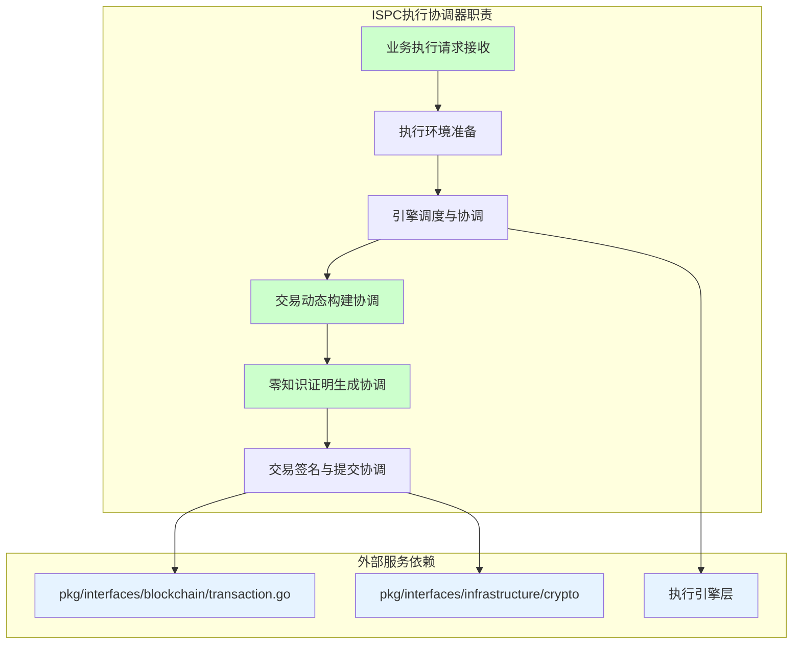
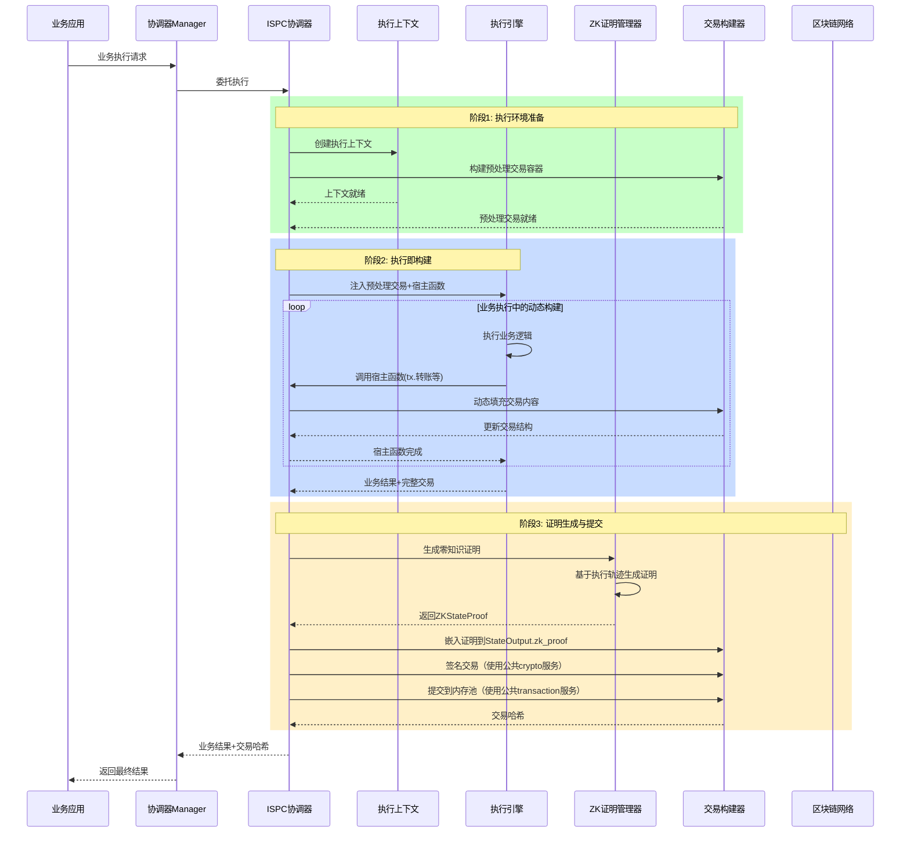
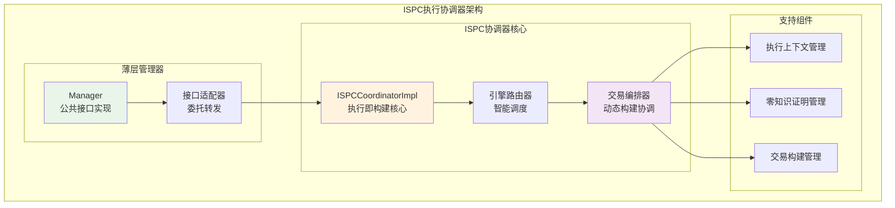
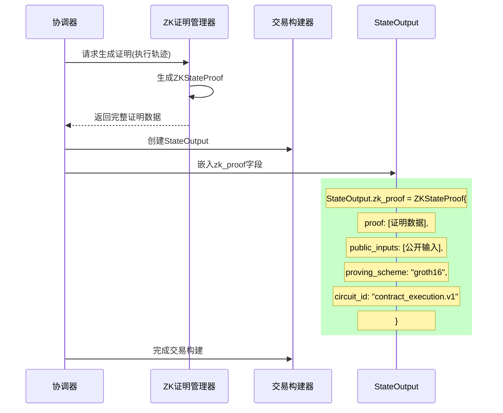
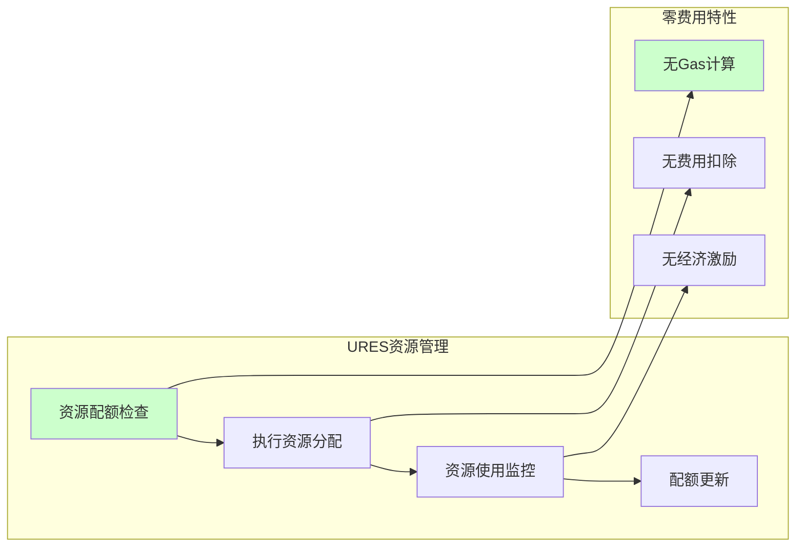
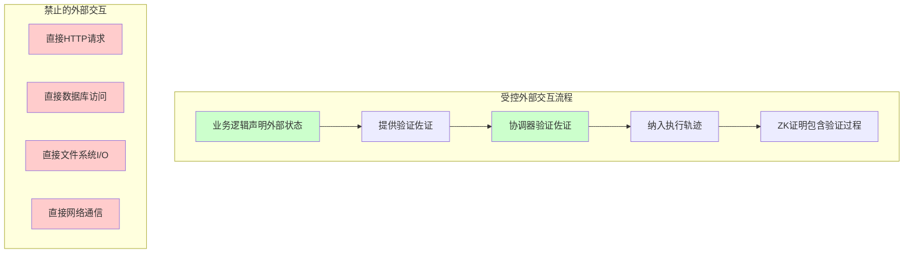

# WES ISPC执行协调器（internal/core/ispc/coordinator）

> **执行即构建核心实现**：ISPC执行协调器是执行即构建机制的核心实现，负责统筹整个ISPC执行流程

**设计理念**: 通过薄层管理器模式实现公共接口适配，通过ISPC协调器实现执行即构建的核心逻辑，确保业务执行与交易构建的一体化。

---

## 📌 版本信息

- **版本**：2.0
- **状态**：stable
- **最后更新**：2025-11-XX
- **最后审核**：2025-11-XX
- **所有者**：ISPC核心团队
- **适用范围**：WES ISPC执行协调器实现

---

## 🎯 实现定位

**路径**：`internal/core/ispc/coordinator/`

**目的**：提供ISPC执行协调器的具体实现，实现内部接口，并通过依赖注入框架组织所有必要的公共服务和内部组件，为ISPC本征自证执行功能提供统一的协调入口。

**核心原则**：
- ✅ 实现内部接口（而不是直接实现公共接口）
- ✅ 通过依赖注入统一管理组件依赖
- ✅ 保持实现与接口分离
- ✅ 遵循ISPC规范：遵循 `_docs/specs/ispc/` 中定义的本征自证计算范式
- ✅ 依赖公共接口：复用成熟的区块链公共服务
- ✅ 协调内部组件：统筹 context、zkproof 等子模块
- ✅ 执行即证明：WASM/ONNX 执行与 ZK 证明一体化

**解决什么问题**：
- ISPC执行协调：统筹WASM、ONNX等执行引擎的调度和管理
- 交易动态构建：执行过程中动态构建和填充区块链交易结构
- 零知识证明集成：协调ZK证明生成并嵌入StateOutput.zk_proof
- 执行上下文管理：管理统一执行上下文的生命周期
- 多引擎路由调度：根据资源类型智能路由到相应执行引擎

**不解决什么问题**（边界）：
- ❌ 不直接实现执行引擎（委托给engines.Manager）
- ❌ 不直接生成ZK证明（委托给zkproof.Manager）
- ❌ 不直接管理交易签名和提交（使用pkg/interfaces/blockchain/transaction.go）
- ❌ 不直接管理执行上下文存储（委托给context.Manager）

---

## 📋 **核心职责**

### 🎯 **协调器职责边界**



### **核心职责说明**

1. **ISPC执行协调**: 统筹WASM、ONNX等执行引擎的调度和管理
2. **交易动态构建**: 执行过程中动态构建和填充区块链交易结构  
3. **零知识证明集成**: 协调ZK证明生成并嵌入StateOutput.zk_proof
4. **执行上下文管理**: 管理统一执行上下文的生命周期
5. **多引擎路由调度**: 根据资源类型智能路由到相应执行引擎

---

## 📁 **目录结构**

```
internal/core/ispc/coordinator/
├── README.md                    # 本文档
├── manager.go                   # 薄层管理器（公共接口实现）
├── execute_contract.go          # 合约执行协调器（WASM/ONNX执行+ZK证明生成）
├── async_zk_proof.go            # 异步ZK证明生成管理
├── execution_helpers.go          # 执行辅助函数（轨迹序列化、确定性JSON等）
├── resource_limits.go           # 资源限制管理
├── keys.go                      # 上下文键常量定义
├── errors.go                    # 错误定义和包装函数
└── benchmark_test.go            # 性能基准测试
```

### **文件职责分工**

| 文件 | 核心职责 | 对外接口 | 复杂度 |
|------|----------|----------|--------|
| `manager.go` | 薄层管理器实现 | ExecutionCoordinator接口 | 极低 |
| `execute_contract.go` | 合约执行协调（WASM/ONNX） | ExecuteWASMContract/ExecuteONNXContract | 高 |
| `async_zk_proof.go` | 异步ZK证明生成管理 | EnableAsyncZKProofGeneration等 | 中 |
| `execution_helpers.go` | 执行辅助函数（轨迹序列化等） | 内部函数（非接口） | 中 |
| `resource_limits.go` | 资源限制管理 | getISPCResourceLimits等 | 低 |
| `keys.go` | 上下文键常量定义 | 包内常量 | 极低 |
| `errors.go` | 错误定义和包装函数 | 错误变量和包装函数 | 极低 |

---

## 🔗 **分层上下文使用策略（清理与无残留保证）**

### **上下文继承与扩展机制**

协调器实现了Go context.Context的继承与扩展机制，确保外部控制与内部原子性的平衡；并通过defer确保上下文与宿主上下文在任意返回路径都能被清理：

```mermaid
graph TB
    subgraph "分层上下文使用策略"
        subgraph "外部上下文层"
            ExtCtx[外部context.Context<br/>来自调用者]
            Timeout[超时控制<br/>ctx.Deadline()]
            Cancel[取消信号<br/>ctx.Done()]
            Trace[链路追踪<br/>trace_id, user_id]
        end
        
        subgraph "ISPC扩展层"
            ISPCCtx[ISPC扩展上下文<br/>Manager.CallFunction]
            ExecInfo[执行信息<br/>ispc_execution_start]
            ContractInfo[合约信息<br/>ispc_contract, ispc_function]
            StageInfo[阶段标识<br/>ispc_stage]
        end
        
        subgraph "分层使用策略"
            NetworkOps[网络I/O操作<br/>使用外部ctx]
            ComputeOps[核心计算操作<br/>使用隔离ctx]
        end
        
        ExtCtx --> ISPCCtx
        Timeout --> ISPCCtx
        Cancel --> ISPCCtx
        Trace --> ISPCCtx
        
        ISPCCtx --> NetworkOps
        ISPCCtx --> ComputeOps
        
        style ExtCtx fill:#e6f3ff
        style ISPCCtx fill:#ccffcc
        style NetworkOps fill:#fff3e0
        style ComputeOps fill:#f0e6ff
    end
```

### **Manager层：上下文扩展包装（键常量化）**

```go
// manager.go 中的实现
func (m *Manager) CallFunction(ctx context.Context, contractAddress string, functionName string, params []uint64, callerPrivateKey ...string) ([]uint64, []byte, error) {
    // 扩展上下文，添加 ISPC 专用信息（使用 keys.go 常量）
    ispcCtx := context.WithValue(ctx, keyISPCEndpointStart, time.Now())
    ispcCtx = context.WithValue(ispcCtx, keyISPCContract, contractAddress)
    ispcCtx = context.WithValue(ispcCtx, keyISPCFunction, functionName)
    ispcCtx = context.WithValue(ispcCtx, keyISPCParamsCount, len(params))
    
    // 委托给子文件实现
    result, executionID, err := callFunctionPre(m, ispcCtx, ...)
    txHash, err := callFunctionPost(m, ispcCtx, ...)
    
    return result, txHash, nil
}
```

### **子文件层：分层上下文策略（含清理）**

#### **网络I/O操作：使用外部context**
```go
// callfunction.go 中的网络操作
func callFunctionPre(m *Manager, ctx context.Context, ...) {
    // 网络I/O：受外部超时和取消控制
    executionContext, err := m.contextManager.CreateContext(ctx, execRequest)
    txDraft, err := m.transactionManager.BuildEmptyTransaction(ctx, execRequest)
    
    // 宿主上下文清理，防止跨调用污染
    defer m.hostManager.ClearExecutionContext()
}
```

#### **核心计算操作：使用隔离context**
```go
// callfunction.go 中的计算操作
func callFunctionPre(m *Manager, ctx context.Context, ...) {
    // WASM执行：使用隔离上下文，不受外部取消影响
    wasmCtx := context.Background()
    wasmCtx = context.WithTimeout(wasmCtx, 30*time.Second)
    
    // 继承必要的追踪信息
    if traceID := ctx.Value("trace_id"); traceID != nil {
        wasmCtx = context.WithValue(wasmCtx, "trace_id", traceID)
    }
    
    businessResult, err := m.wasmEngine.CallFunction(wasmCtx, ...)
}

func callFunctionPost(m *Manager, ctx context.Context, ...) {
    // ZK证明生成：使用隔离上下文
    zkCtx := context.Background()
    zkCtx = context.WithTimeout(zkCtx, 60*time.Second)
    
    // 网络提交：使用外部上下文
    // txHash, err := m.blockchainTxManager.SignAndSubmitTransaction(ctx, ...)

    // 资源清理：销毁执行上下文（defer 确保任意路径清理）
    defer func() { _ = m.contextManager.DestroyContext(ctx, executionID) }()
}
```

### **分层策略的设计原则**

#### **1. 外部可控，内部自治**
- **外部context**：控制整体超时、取消、链路追踪
- **内部隔离context**：保证关键计算的原子性和不可中断性

#### **2. 信息向下传递，控制分层管理**
- **信息传递**：追踪信息（trace_id、user_id）向下传递
- **控制分层**：网络操作受外部控制，计算操作使用内部控制

#### **3. 操作分类与策略映射**

| 操作类型 | 使用的context | 控制特性 | 典型场景 |
|---------|--------------|---------|----------|
| **网络I/O** | 外部context | 受外部控制 | 上下文创建、交易构建、网络提交 |
| **核心计算** | 隔离context | 内部自治 | WASM执行、ZK证明生成 |
| **资源清理** | 外部context | 受外部控制 | 上下文清理、资源释放 |

---

## 🔄 **ISPC执行即构建流程**

### **完整执行流程**



### **关键阶段说明**

#### **阶段1: 执行环境准备**
- **预处理交易容器**: 预先创建待填充的交易结构，准备动态填充
- **执行上下文**: 创建包含URES资源配额的执行环境
- **引擎准备**: 初始化对应的执行引擎（WASM/ONNX）

#### **阶段2: 执行即构建** 
- **宿主函数注入**: 为执行引擎提供tx.转账()、tx.查余额()等区块链能力
- **动态构建**: 执行过程中实时填充Transaction.inputs和Transaction.outputs
- **轨迹记录**: 记录完整执行轨迹用于后续证明生成

#### **阶段3: 证明生成与提交**
- **ZK证明生成**: 基于执行轨迹生成零知识证明
- **StateOutput.zk_proof嵌入**: 将ZKStateProof嵌入到交易的StateOutput中
- **服务依赖**: 使用pkg/interfaces/blockchain/transaction.go进行签名和提交

---

## 🏗️ **架构设计**

### **薄层+协调双核心架构**



### **组件职责说明**

#### **Manager（薄层管理器）**
```go
type Manager struct {
    ispcCoordinator interfaces.ISPCCoordinator
    logger         interface{}
    metrics        interface{}
}
```
- **接口适配**: 实现ExecutionCoordinator公共接口
- **委托转发**: 将核心逻辑委托给ISPCCoordinatorImpl
- **通用处理**: 日志记录、指标收集、错误处理

#### **ISPCCoordinatorImpl（协调器核心）**
```go
type ISPCCoordinatorImpl struct {
    wasmEngine     interfaces.WASMEngineManager
    onnxEngine     interfaces.ONNXEngineManager
    zkProofManager interfaces.ZKProofManager
    txBuilder      interfaces.TransactionBuilder
    contextManager interfaces.ExecutionContextManager
}
```
- **执行编排**: 完整的ISPC执行流程控制
- **多引擎协调**: WASM、ONNX等引擎的统一调度
- **交易构建协调**: 与交易构建器的紧密协作

---

## 🔧 **StateOutput.zk_proof集成**

### **零知识证明嵌入机制**

根据transaction.proto，零知识证明直接嵌入到StateOutput结构中：

```protobuf
message StateOutput {
  bytes state_id = 1;
  uint64 state_version = 2;
  
  // 零知识证明作为StateOutput的核心组成部分
  ZKStateProof zk_proof = 3;  // ← 协调器负责填充此字段
  
  bytes execution_result_hash = 10;
  optional bytes parent_state_hash = 20;
}

message ZKStateProof {
  bytes proof = 1;                    // 零知识证明数据
  repeated bytes public_inputs = 2;   // 公开输入
  string proving_scheme = 3;          // groth16/plonk
  string curve = 4;                   // bn254/bls12-381
  bytes verification_key_hash = 5;    // 验证密钥哈希
  string circuit_id = 10;             // 电路标识
  uint32 circuit_version = 11;        // 电路版本
}
```

### **证明生成与嵌入流程**



---

## 🔗 **服务依赖关系**

### **公共接口依赖**

协调器严格依赖现有公共接口，避免重复实现：

```go
// 交易服务依赖
pkg/interfaces/blockchain/transaction.go    // 交易签名、哈希计算、内存池提交

// 密码学服务依赖  
pkg/interfaces/infrastructure/crypto       // 数字签名、哈希计算

// 执行引擎依赖
pkg/interfaces/engines/wasm.go             // WASM引擎接口
pkg/interfaces/engines/onnx.go             // ONNX引擎接口
```

### **内部组件依赖**

```go
// 内部接口依赖
internal/core/ispc/interfaces/coordinator.go      // 协调器内部接口
internal/core/ispc/interfaces/context.go          // 执行上下文接口
internal/core/ispc/interfaces/zkproof.go          // ZK证明接口
internal/core/ispc/interfaces/transaction_builder.go // 交易构建接口
```

---

## 🚫 **零费用执行模式**

### **费用处理说明**

根据ISPC规范，协调器完全采用零费用模式：

- ✅ **本地计算成本**: 业务节点承担所有执行开销
- ✅ **网络验证成本**: 验证节点仅验证ZK证明，成本极低
- ✅ **URES资源管理**: 通过配额控制资源使用，无需费用计算
- ❌ **传统Gas机制**: 不使用任何Gas或费用相关逻辑

### **资源控制机制**



---

## 📊 **性能特征**

### **执行性能指标**

| 执行阶段 | 目标延迟 | 优化重点 |
|---------|---------|----------|
| **执行协调** | < 5ms | 协调器内部处理优化 |
| **上下文创建** | < 10ms | 上下文池化和复用 |
| **引擎调度** | < 2ms | 智能路由算法优化 |
| **交易构建协调** | < 15ms | 动态构建流程优化 |
| **ZK证明集成** | < 500ms | 异步证明生成 |

### **单次执行验证优势**

| 对比维度 | 传统区块链 | ISPC协调器 | 提升效果 |
|---------|-----------|------------|----------|
| **执行次数** | N个节点执行N次 | 1个节点执行1次 | **减少N倍执行开销** |
| **外部副作用** | 重复N次 | 仅发生1次 | **根除重复调用问题** |
| **验证方式** | 重复完整执行 | 验证ZK证明 | **验证效率提升1000倍** |

---

## 🔄 **受控外部交互**

### **外部交互控制机制**

协调器严格遵循ISPC"受控声明+佐证+验证"机制：



### **宿主函数控制**

协调器通过宿主函数提供受控的外部交互能力：

- **受控声明**: `host_declare_external_state()`
- **佐证提供**: `host_provide_evidence()`  
- **状态查询**: `host_query_controlled_state()`
- **轨迹记录**: 所有外部交互自动记录到执行轨迹

---

## 🏗️ **依赖注入配置**

### **fx框架集成**

```go
package coordinator

import (
    "go.uber.org/fx"
    "github.com/weisyn/v1/internal/core/ispc/interfaces"
    "github.com/weisyn/v1/pkg/interfaces/ispc"
)

// Module 执行协调器模块
var Module = fx.Module("execution_coordinator",
    fx.Provide(
        // 薄层管理器
        NewManager,
        
        // ISPC协调器核心
        NewISPCCoordinatorImpl,
    ),
    
    // 导出公共接口
    fx.Provide(
        fx.Annotate(
            func(manager *Manager) execution.ExecutionCoordinator {
                return manager
            },
            fx.As(new(execution.ExecutionCoordinator)),
        ),
    ),
)
```

---

## 📚 **相关文档**

- [ISPC核心规范](/_docs/specs/ispc/INTRINSIC_SELF_PROVING_COMPUTING_SPECIFICATION.md)
- [ISPC架构语义](/_docs/specs/ispc/ISPC_ARCHITECTURE_AND_SEMANTICS.md)
- [交易协议定义](/pb/blockchain/block/transaction/transaction.proto)
- [执行引擎接口](/pkg/interfaces/engines/)

---

*WES ISPC执行协调器 - 执行即构建机制的核心实现*