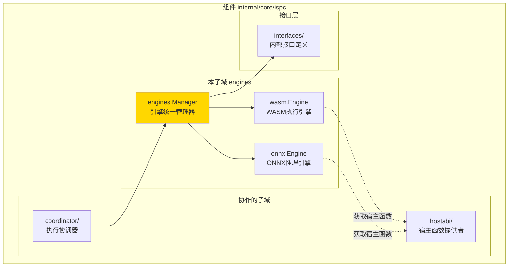
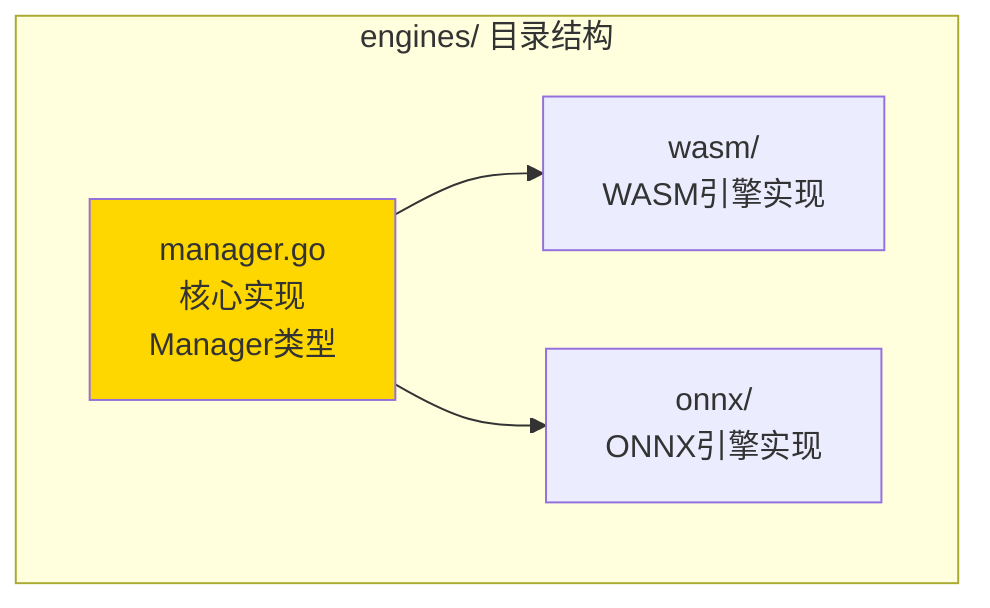

# engines - 执行引擎统一管理器

---

## 📌 版本信息

- **版本**：1.0
- **状态**：stable
- **最后更新**：2025-11-24
- **最后审核**：2025-11-24
- **所有者**：WES ISPC 开发组
- **适用范围**：ISPC模块内部执行引擎统一管理

---

## 🎯 子域定位

**路径**：`internal/core/ispc/engines/`

**所属组件**：`ispc`

**核心职责**：统一管理WASM和ONNX执行引擎，为coordinator提供统一的引擎访问接口

**在组件中的角色**：
- 作为coordinator和具体引擎实现之间的桥梁
- 提供统一的引擎调度和管理能力
- 隐藏引擎实现的细节，提供抽象接口

---

## 🏗️ 架构设计

### 在组件中的位置

> **说明**：展示此子域在组件内部的位置和协作关系



**位置说明**：

| 关系类型 | 目标 | 关系说明 |
|---------|------|---------|
| **被调用** | coordinator | coordinator通过Manager统一访问WASM/ONNX引擎 |
| **管理** | wasm.Engine | 管理WASM引擎实例，提供ExecuteWASM方法 |
| **管理** | onnx.Engine | 管理ONNX引擎实例，提供ExecuteONNX方法 |
| **依赖** | interfaces/ | 实现InternalEngineManager接口 |

---

### 内部组织

> **说明**：展示此子域内部的文件组织和类型关系



---

## 🌐 平台支持与引擎可用性

### 引擎支持矩阵

**核心原则**：WASM 引擎在所有平台都可用，ONNX 引擎仅在 ONNX Runtime 官方支持的平台上可用。

| 操作系统 | 架构 | GOOS/GOARCH | WASM 引擎 | ONNX 引擎 | 状态 |
|---------|------|-------------|-----------|-----------|------|
| **macOS** | Intel (x86_64) | `darwin/amd64` | ✅ | ✅ | ✅ 完全支持 |
| **macOS** | Apple Silicon | `darwin/arm64` | ✅ | ✅ | ✅ 完全支持 |
| **Linux** | x86_32 | `linux/386` | ✅ | ✅ | ✅ 支持 |
| **Linux** | x86_64 | `linux/amd64` | ✅ | ✅ | ✅ 完全支持 |
| **Linux** | ARM32v7 | `linux/arm` | ✅ | ✅ | ✅ 支持 |
| **Linux** | ARM64 | `linux/arm64` | ✅ | ✅ | ✅ 完全支持 |
| **Linux** | PPC64LE | `linux/ppc64le` | ✅ | ✅ | ✅ 支持 |
| **Linux** | RISCV64 | `linux/riscv64` | ✅ | ✅ | ✅ 支持 |
| **Linux** | S390X | `linux/s390x` | ✅ | ✅ | ✅ 支持 |
| **Windows** | x86_32 | `windows/386` | ✅ | ✅ | ✅ 支持 |
| **Windows** | x86_64 | `windows/amd64` | ✅ | ✅ | ✅ 完全支持 |
| **Windows** | ARM32v7 | `windows/arm` | ✅ | ✅ | ✅ 支持 |
| **Windows** | ARM64 | `windows/arm64` | ✅ | ✅ | ✅ 支持 |
| **Android** | ARM32v7 | `android/arm` | ✅ | ✅ | ✅ 支持 |
| **Android** | ARM64 | `android/arm64` | ✅ | ✅ | ✅ 支持 |
| **iOS** | ARM64 | `ios/arm64` | ✅ | ✅ | ✅ 支持 |
| **BSD** | * | `freebsd/*`, `netbsd/*`, `openbsd/*` | ✅ | ❌ | ⚠️ 仅 WASM |
| **其他** | * | * | ✅ | ❌ | ⚠️ 仅 WASM |

**说明**：
- ✅ **完全支持**：库文件已嵌入，可直接使用
- ✅ **支持**：平台受 ONNX Runtime 官方支持，但库文件需要下载并嵌入
- ⚠️ **仅 WASM**：ONNX Runtime 官方不支持，ONNX 引擎不可用

### 优雅降级机制

**设计原则**：ONNX 引擎是可选功能，不能阻止区块链核心功能运行。

**实现机制**：
1. **平台检测**：启动时检测平台是否支持 ONNX Runtime
2. **条件创建**：仅在支持的平台上创建 ONNX 引擎
3. **nil 处理**：允许 ONNX 引擎为 `nil`，`Manager` 会正确处理
4. **错误提示**：调用 ONNX 功能时返回明确的错误信息

**代码位置**：
- 平台检测：`pkg/build/deps/onnx/platform.go`
- 引擎创建：`internal/core/ispc/module.go`（依赖注入时检测）
- 引擎管理：`internal/core/ispc/engines/manager.go`（允许 nil）

**使用示例**：
```go
// 检查 ONNX 引擎是否可用
if manager.onnxEngine == nil {
    // ONNX 引擎不可用，但 WASM 引擎正常
    return nil, fmt.Errorf("ONNX引擎不可用：当前平台不支持 ONNX Runtime")
}
```

---

## 📁 目录结构

```
internal/core/ispc/engines/
├── README.md                    # 本文档
├── manager.go                   # 核心实现：引擎统一管理器
├── wasm/                        # WASM执行引擎实现
│   ├── engine.go
│   ├── runtime/
│   ├── host/
│   └── ...
└── onnx/                        # ONNX推理引擎实现
    ├── engine.go
    ├── model_cache.go
    └── ...
```

---

## 🔧 核心实现

### 实现文件：`manager.go`

**核心类型**：`Manager`

**职责**：统一管理WASM和ONNX执行引擎，实现InternalEngineManager接口，为coordinator提供统一的引擎访问入口

**关键字段**：

```go
type Manager struct {
    logger     log.Logger
    wasmEngine ispcInterfaces.InternalWASMEngine
    onnxEngine ispcInterfaces.InternalONNXEngine
}
```

**关键方法**：

| 方法名 | 职责 | 可见性 | 备注 |
|-------|------|-------|-----|
| `NewManager()` | 构造函数 | Public | 接收WASM和ONNX引擎实例 |
| `ExecuteWASM()` | 执行WASM合约 | Public | 委托给wasmEngine.CallFunction |
| `ExecuteONNX()` | 执行ONNX模型推理 | Public | 委托给onnxEngine.CallModel |

---

## 🔗 协作关系

### 依赖的接口

| 接口 | 来源 | 用途 |
|-----|------|-----|
| `InternalWASMEngine` | `internal/core/ispc/interfaces/` | WASM合约执行 |
| `InternalONNXEngine` | `internal/core/ispc/interfaces/` | ONNX模型推理 |
| `InternalEngineManager` | `internal/core/ispc/interfaces/` | 统一引擎管理接口 |

---

### 被依赖关系

**被以下子域使用**：
- `coordinator/` - 通过Manager统一访问WASM/ONNX引擎

**示例**：

```go
// 在coordinator中使用
import "github.com/weisyn/v1/internal/core/ispc/engines"

func (c *Coordinator) ExecuteWASMContract(...) {
    results, err := c.engineManager.ExecuteWASM(ctx, hash, method, params)
    // ...
}
```

---

## 🧪 测试

### 测试覆盖

| 测试类型 | 文件 | 覆盖率目标 | 当前状态 |
|---------|------|-----------|---------|
| 单元测试 | `manager_test.go` | ≥ 80% | 待实现 |

---

### 测试示例

```go
func TestManager_ExecuteWASM(t *testing.T) {
    // Arrange
    mockWASMEngine := newMockWASMEngine()
    mockONNXEngine := newMockONNXEngine()
    mgr := engines.NewManager(logger, mockWASMEngine, mockONNXEngine)
    
    // Act
    results, err := mgr.ExecuteWASM(ctx, hash, method, params)
    
    // Assert
    assert.NoError(t, err)
    assert.Equal(t, expected, results)
}
```

---

## 📊 关键设计决策

### 决策 1：统一管理器模式

**问题**：coordinator需要同时访问WASM和ONNX引擎，如何统一管理？

**方案**：创建engines.Manager统一管理器，实现InternalEngineManager接口

**理由**：
- 单一职责：Manager只负责引擎的统一调度
- 接口统一：coordinator只需依赖一个接口
- 易于扩展：未来添加新引擎类型只需扩展Manager

**权衡**：
- ✅ 优点：职责清晰，接口统一，易于测试
- ⚠️ 缺点：多一层调用开销（可忽略）

---

### 决策 2：引擎内部化

**问题**：执行引擎应该作为独立模块还是ISPC内部子模块？

**方案**：将WASM和ONNX引擎作为ISPC内部子模块，不对外暴露独立接口

**理由**：
- 符合ISPC架构：执行引擎是ISPC的核心能力之一
- 统一管理：通过engines.Manager统一管理
- 避免循环依赖：引擎不依赖外部接口

**权衡**：
- ✅ 优点：架构清晰，避免循环依赖
- ⚠️ 缺点：引擎实现与ISPC耦合（符合设计）

---

## 📚 相关文档

- [组件总览](../README.md)
- [内部接口](../interfaces/README.md)
- [WASM引擎实现](./wasm/README.md)
- [ONNX引擎实现](./onnx/README.md)
- [接口与实现的组织架构](../../../../docs/system/standards/principles/code-organization.md)

---

## 📝 变更历史

| 版本 | 日期 | 变更内容 | 作者 |
|-----|------|---------|------|
| 1.0 | 2025-11-24 | 初始版本，创建引擎统一管理器 | WES ISPC 开发组 |

---

## 🚧 待办事项

- [ ] 添加单元测试
- [ ] 添加性能监控指标
- [ ] 支持引擎动态注册（未来扩展）

---

**使用说明**：
1. Manager通过构造函数接收WASM和ONNX引擎实例
2. coordinator通过Manager统一访问引擎，不直接访问具体引擎实现
3. 所有引擎接口定义在`internal/core/ispc/interfaces/`中

